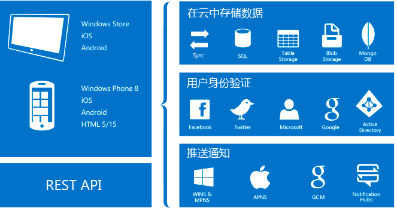

<properties
	pageTitle="什么是移动应用"
	description="了解应用服务为企业移动应用带来的优势。"
	services="app-service\mobile"
	documentationCenter=""
	authors="adrianhall"
	manager="yochayk"
	editor=""/>

<tags
	ms.service="app-service-mobile"
	ms.workload="na"
	ms.tgt_pltfrm="mobile-multiple"
	ms.devlang="na"
	ms.topic="hero-article"
	ms.date="10/01/2016"
	wacn.date="11/21/2016"
	ms.author="adrianha"/>

# 什么是移动应用？

Azure 应用服务是面向专业开发人员的完全托管型平台即服务 (PaaS)，可为 Web、移动和集成方案提供丰富的功能。*Azure 应用服务* 中的 *移动应用* 提供面向企业开发人员和系统集成商的高度可缩放、全局可用的移动应用程序平台，为移动开发人员提供丰富的功能。

##为何使用移动应用？
*Azure 应用服务* 中的 *移动应用* 提供面向企业开发人员和系统集成商的高度可缩放、全局可用的移动应用程序平台，为移动开发人员提供丰富的功能。使用移动应用可以：

- **构建本机和跨平台应用** - 无论是要构建本机 iOS、Android、Windows 应用程序还是跨平台 Xamarin 或 Cordova (Phonegap) 应用程序，都可以通过本机 SDK 利用应用服务。
- **连接到企业系统** - 使用移动应用可以在短时间内添加企业标志，连接到企业本地资源或云资源。
- **构建具有数据同步功能的可脱机应用** - 构建可脱机运行的应用，在与任何企业数据源或 SaaS API 建立连接时，使用移动应用在后台同步数据，提高移动工作者的生产力。
- **在几秒内向数百万用户推送通知** - 在任何设备上使用实时推送通知来与客户联系，根据客户需求个性化推送通知并适时发送。

## 移动应用的功能
以下功能对于支持云的移动开发十分重要：

- **身份验证和授权** - 从不断增多的标识提供者（包括适用于企业身份验证的 Azure Active Directory，以及 Microsoft 帐户等社交提供者）列表中选择。Azure 移动应用可为每个提供者提供 OAuth 2.0 服务。还可以为标识提供者集成 SDK，获取特定于提供者的功能。

  深入了解[身份验证功能]。

- **数据访问** - Azure 移动应用提供已链接到 SQL Azure 或本地 SQL Server 且适合移动用途的 OData v3 数据源。此服务基于 Entity Framework，可轻松与其他 NoSQL 和 SQL 数据提供程序集成，包括 [Azure 表存储]、MongoDB、[DocumentDB] 和 SaaS API 提供程序（如 Office 365 和 Salesforce.com）。
- **脱机同步** - 使用客户端 SDK 可以轻松构建稳健且响应灵敏的移动应用程序，用于处理可与后端数据自动同步的脱机数据集，包括冲突解决支持。

  深入了解[数据功能]。

- **推送通知** - 客户端 SDK 与 Azure 通知中心的注册功能紧密集成，可将推送通知同时发送给数百万用户。

- **客户端 SDK** - 我们提供整套客户端 SDK 来全面满足本机开发（[iOS]、[Android] 和 [Windows]）、跨平台开发（[用于 iOS 和 Android 的 Xamarin]、[Xamarin Forms]）和混合应用程序开发 ([Apache Cordova]) 要求。每个客户端 SDK 附带 MIT 许可证，并且是开源的。

## Azure 应用服务功能。
一般而言，以下平台功能可用于移动生产站点。

- **自动缩放** - 使用应用服务可以快速缩放，以处理任何传入的客户负载。手动选择 VM 的数量和大小，或者设置自动缩放，根据负载或计划来缩放移动应用后端。

  深入了解[自动缩放]。

- **过渡环境** - 应用服务可以运行多个版本的站点，使用户能够执行 A / B 测试，在大型 DevOps 计划中进行生产测试，以及对新后端执行现场过渡。

  深入了解[过渡环境]。

- **连续部署** - 应用服务可与常用 SCM 系统集成，使用户能够将新版后端发送到 SCM 系统的分支以便自动部署。

  深入了解[部署选项]。

- **虚拟网络** - 应用服务可以使用虚拟网络、ExpressRoute 或混合连接来与本地资源建立连接。

- **隔离/专用的环境** - 应用服务可以在一个完全隔离的专用环境中运行，安全运行大规模的 Azure 应用服务应用。这很适合用于需要大规模、隔离或安全网络访问的应用程序工作负荷。

## 入门 ##
若要开始使用移动应用，请遵循[入门]教程。其中介绍了生成所选移动后端和客户端、集成身份验证、脱机同步和推送通知的基础知识。可以多次参考[入门]教程 - 操作每种客户端应用程序时都可以参考。

关 Azure 应用服务平台的详细信息，请参阅 [Azure App Service]（Azure 应用服务）。

>[AZURE.NOTE] 如果您想要在注册 Azure 帐户之前开始使用 Azure App Service，请转到[试用 App Service](https://tryappservice.azure.com/?appServiceName=mobile)，您可以在 App Service 中立即创建一个生存期较短的入门 Web 应用。你不需要使用信用卡，也不需要做出承诺。

<!-- URLs. -->
[Migrate your Mobile Service to App Service]: /documentation/articles/app-service-mobile-migrating-from-mobile-services/
[Azure App Service]: /documentation/articles/app-service-value-prop-what-is/
[入门]: /documentation/articles/app-service-mobile-ios-get-started/
[Azure 表存储]: /documentation/articles/storage-getting-started-guide/
[DocumentDB]: /documentation/articles/documentdb-get-started/
[身份验证功能]: /documentation/articles/app-service-mobile-auth/
[数据功能]: /documentation/articles/app-service-mobile-offline-data-sync/

[iOS]: /documentation/articles/app-service-mobile-ios-how-to-use-client-library/
[Android]: /documentation/articles/app-service-mobile-android-how-to-use-client-library/
[Windows]: /documentation/articles/app-service-mobile-dotnet-how-to-use-client-library/
[用于 iOS 和 Android 的 Xamarin]: /documentation/articles/app-service-mobile-dotnet-how-to-use-client-library/
[Xamarin Forms]: /documentation/articles/app-service-mobile-xamarin-forms-get-started/
[Apache Cordova]: /documentation/articles/app-service-mobile-cordova-how-to-use-client-library/
[自动缩放]: /documentation/articles/web-sites-scale/
[过渡环境]: /documentation/articles/web-sites-staged-publishing/
[部署选项]: /documentation/articles/web-sites-deploy/
[混合连接]: /documentation/articles/web-sites-hybrid-connection-get-started/
[虚拟网络]: /documentation/articles/web-sites-integrate-with-vnet/
[ExpressRoute]: /documentation/articles/app-service-app-service-environment-network-configuration-expressroute/
[应用服务环境]: /documentation/articles/app-service-app-service-environment-intro/

<!---HONumber=Mooncake_0919_2016-->