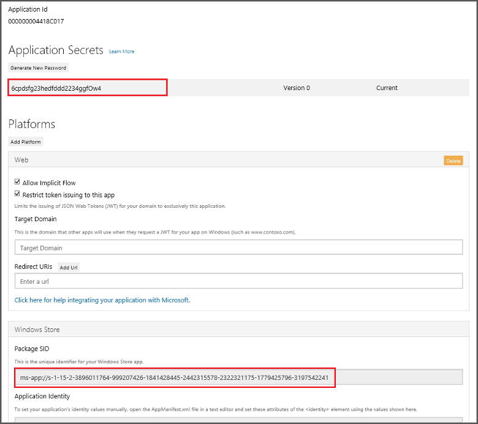

<properties
	pageTitle="向通用 Windows 平台 (UWP) 应用添加推送通知 | Azure 移动应用"
	description="了解如何使用 Azure 应用服务移动应用和 Azure 通知中心将推送通知发送到通用 Windows 平台 (UWP) 应用。"
	services="app-service\mobile,notification-hubs"
	documentationCenter="windows"
	authors="adrianhall"
	manager="dwrede"
	editor=""/>

<tags
	ms.service="app-service-mobile"
	ms.workload="mobile"
	ms.tgt_pltfrm="mobile-windows"
	ms.devlang="dotnet"
	ms.topic="article"
	ms.date="10/01/2016"
	wacn.date="11/21/2016"
	ms.author="adrianha"/>

# 向 Windows 应用添加推送通知

[AZURE.INCLUDE [app-service-mobile-selector-get-started-push](../../includes/app-service-mobile-selector-get-started-push.md)]

##概述

本主题演示如何使用 Azure 应用服务中的移动应用，通过 Azure 通知中心向通用 Windows 平台 (UWP) 应用发送推送通知。在此方案中，添加新项时，移动应用后端会向 Windows 通知服务 (WNS) 中注册的所有 Windows 应用发送推送通知。

本教程基于移动应用快速入门。在开始本教程之前，必须先完成快速入门教程[创建 Windows 应用](/documentation/articles/app-service-mobile-windows-store-dotnet-get-started/)。如果不使用下载的快速入门服务器项目，必须将推送通知扩展包添加到项目。有关服务器扩展包的详细信息，请参阅 [Work with the .NET backend server SDK for Azure Mobile Apps](/documentation/articles/app-service-mobile-dotnet-backend-how-to-use-server-sdk/)（使用适用于 Azure 移动应用的 .NET 后端服务器 SDK）。

##创建通知中心

[AZURE.INCLUDE [app-service-mobile-create-notification-hub](../../includes/app-service-mobile-create-notification-hub.md)]

##为推送通知注册应用程序

必须先将应用提交到 Windows 应用商店，然后才能从 Azure 将推送通知发送到 Windows 应用。然后可以将服务器项目配置为与 WNS 集成。

1. 在 Visual Studio 解决方案资源管理器中，右键单击 UWP 应用项目，单击“应用商店”>“将应用与应用商店关联...”。

    
    
2. 在向导中，单击“下一步”，使用 Microsoft 帐户登录，在“保留新应用名称”中键入应用的名称，然后单击“保留”。

3. 成功创建应用注册后，选择新应用名称，单击“下一步”，然后单击“关联”。这会将所需的 Windows 应用商店注册信息添加到应用程序清单中。

7. 导航到 [Windows 开发人员中心](https://dev.windows.com/overview)，使用 Microsoft 帐户登录，单击“我的应用”中的新应用注册，然后展开“服务”>“推送通知”。

8. 在“推送通知”页中，单击“Azure 移动服务”下的“Live 服务站点”。

9. 在注册页中，记下“应用程序机密”和“程序包 SID”下的值，后面将使用这些值配置移动应用后端。

	

    > [AZURE.IMPORTANT] 客户端密钥和程序包 SID 是重要的安全凭据。请勿将这些值告知任何人或随你的应用程序分发它们。将“应用程序 ID”与机密配合使用来配置 Microsoft 帐户身份验证。

##配置后端以发送推送通知

[AZURE.INCLUDE [app-service-mobile-configure-wns](../../includes/app-service-mobile-configure-wns.md)]

##更新服务器以发送推送通知

现在已在应用中启用推送通知，必须更新应用后端以发送推送通知。选择下面与后端项目类型（[.NET 后端](#dotnet)或 [Node.js 后端](#nodejs)）匹配的过程。

### .NET 后端项目

1. 在 Visual Studio 中，右键单击服务器项目并单击“管理 NuGet 包”，搜索 Microsoft.Azure.NotificationHubs，然后单击“安装”。这将安装通知中心客户端库。

2. 展开“控制器”，打开 TodoItemController.cs，然后添加以下 using 语句：

		using System.Collections.Generic;
		using Microsoft.Azure.NotificationHubs;
		using Microsoft.Azure.Mobile.Server.Config;

3. 在 **PostTodoItem** 方法中，在调用 **InsertAsync** 后添加如下代码：

	    // Get the settings for the server project.
	    HttpConfiguration config = this.Configuration;
	    MobileAppSettingsDictionary settings =
	        this.Configuration.GetMobileAppSettingsProvider().GetMobileAppSettings();

	    // Get the Notification Hubs credentials for the Mobile App.
	    string notificationHubName = settings.NotificationHubName;
	    string notificationHubConnection = settings
	        .Connections[MobileAppSettingsKeys.NotificationHubConnectionString].ConnectionString;

	    // Create the notification hub client.
	    NotificationHubClient hub = NotificationHubClient
	        .CreateClientFromConnectionString(notificationHubConnection, notificationHubName);

	    // Define a WNS payload
	    var windowsToastPayload = @"<toast><visual><binding template=""ToastText01""><text id=""1"">"
	                            + item.Text + @"</text></binding></visual></toast>";
	    try
	    {
	        // Send the push notification.
	        var result = await hub.SendWindowsNativeNotificationAsync(windowsToastPayload);

	        // Write the success result to the logs.
	        config.Services.GetTraceWriter().Info(result.State.ToString());
	    }
	    catch (System.Exception ex)
	    {
	        // Write the failure result to the logs.
	        config.Services.GetTraceWriter()
	            .Error(ex.Message, null, "Push.SendAsync Error");
	    }

	此代码指示通知中心在插入新项后，发送一条推送通知。

4. 重新发布服务器项目。

### Node.js 后端项目

1. 如果尚未执行此操作，请[下载快速入门项目](/documentation/articles/app-service-mobile-node-backend-how-to-use-server-sdk/#download-quickstart)或使用 [Azure 门户中的在线编辑器](/documentation/articles/app-service-mobile-node-backend-how-to-use-server-sdk/#online-editor)。

2. 将 todoitem.js 文件中的现有代码替换为以下内容：

		var azureMobileApps = require('azure-mobile-apps'),
	    promises = require('azure-mobile-apps/src/utilities/promises'),
	    logger = require('azure-mobile-apps/src/logger');

		var table = azureMobileApps.table();

		table.insert(function (context) {
	    // For more information about the Notification Hubs JavaScript SDK,
	    // see http://aka.ms/nodejshubs
	    logger.info('Running TodoItem.insert');

	    // Define the WNS payload that contains the new item Text.
	    var payload = "<toast><visual><binding template=\ToastText01><text id="1">"
		                            + context.item.text + "</text></binding></visual></toast>";

	    // Execute the insert.  The insert returns the results as a Promise,
	    // Do the push as a post-execute action within the promise flow.
	    return context.execute()
	        .then(function (results) {
	            // Only do the push if configured
	            if (context.push) {
					// Send a WNS native toast notification.
	                context.push.wns.sendToast(null, payload, function (error) {
	                    if (error) {
	                        logger.error('Error while sending push notification: ', error);
	                    } else {
	                        logger.info('Push notification sent successfully!');
	                    }
	                });
	            }
	            // Don't forget to return the results from the context.execute()
	            return results;
	        })
	        .catch(function (error) {
	            logger.error('Error while running context.execute: ', error);
	        });
		});

		module.exports = table;

	插入新的待办事项时，会发送一条包含 item.text 的 WNS toast 通知。

2. 编辑本地计算机上的文件时，重新发布服务器项目。

##向应用程序添加推送通知

下一步，应用必须在启动时注册推送通知。已启用身份验证时，请确保用户先登录，然后再尝试注册推送通知。有关详细信息，请参阅快速入门完整示例中的[先进行身份验证](https://github.com/Azure-Samples/app-service-mobile-windows-quickstart/blob/master/README.md#authenticate-first)。

1. 打开 **App.xaml.cs** 项目文件并添加以下 `using` 语句：

		using System.Threading.Tasks;
        using Windows.Networking.PushNotifications;

2. 在同一文件中，将以下 **InitNotificationsAsync** 方法定义添加到 **App** 类中：

        private async Task InitNotificationsAsync()
        {
            // Get a channel URI from WNS.
            var channel = await PushNotificationChannelManager
                .CreatePushNotificationChannelForApplicationAsync();

            // Register the channel URI with Notification Hubs.
            await App.MobileService.GetPush().RegisterAsync(channel.Uri);
        }

    此代码从 WNS 检索应用的 ChannelURI，然后将该 ChannelURI 注册到应用服务移动应用。

3. 在 **App.xaml.cs** 中 **OnLaunched** 事件处理程序的顶部，为方法定义添加 **async** 修饰符，并添加对新 **InitNotificationsAsync** 方法的以下调用，如以下示例所示：

        protected async override void OnLaunched(LaunchActivatedEventArgs e)
        {
            await InitNotificationsAsync();

			// ...
		}

    这保证每次启动应用程序时都注册短期的 ChannelURI。

4. 重新生成 UWP 应用项目。你的应用现在已能够接收 toast 通知。

##在应用程序中测试推送通知

[AZURE.INCLUDE [app-service-mobile-windows-universal-test-push](../../includes/app-service-mobile-windows-universal-test-push.md)]

##后续步骤

了解有关推送通知的详细信息：

* 使用[如何使用 Azure 移动应用的托管客户端](/documentation/articles/app-service-mobile-dotnet-how-to-use-client-library/#how-to-register-push-templates-to-send-cross-platform-notifications)
模板可以灵活地发送跨平台推送和本地化推送。了解如何注册模板。

* [使用适用于 Azure 移动应用的 .NET 后端服务器 SDK](/documentation/articles/app-service-mobile-dotnet-backend-how-to-use-server-sdk/#how-to-add-tags-to-a-device-installation-to-enable-push-to-tags)
标记可用于通过推送定位分段客户。了解如何将标记添加到设备安装。

* [诊断推送通知问题](/documentation/articles/notification-hubs-push-notification-fixer/)
有多种原因可能导致通知被丢弃或最终未到达设备。本主题演示如何分析和确定推送通知失败的根本原因。

请考虑继续学习以下教程之一：

+ [向应用添加身份验证](/documentation/articles/app-service-mobile-windows-store-dotnet-get-started-users/)
 了解如何使用标识提供者对应用的用户进行身份验证。

+ [为应用启用脱机同步](/documentation/articles/app-service-mobile-windows-store-dotnet-get-started-offline-data/)
 了解如何使用移动应用后端向应用添加脱机支持。脱机同步允许最终用户与移动应用交互（查看、添加或修改数据），即使在没有网络连接时也是如此。

<!-- Anchors. -->

<!-- URLs. -->
[Azure Portal]: https://portal.azure.cn/

<!-- Images. -->

<!---HONumber=Mooncake_0919_2016-->