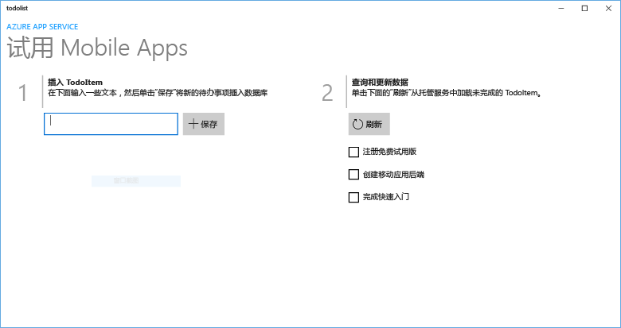
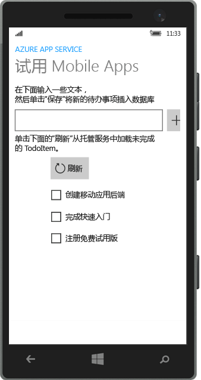
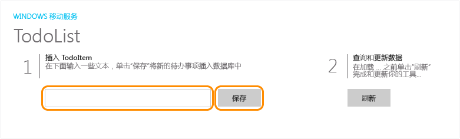

<properties
	pageTitle="创建在移动应用中使用的通用 Windows 平台 (UWP) | Azure"
	description="按照本教程进行操作，开始使用 C#、Visual Basic 或 JavaScript 通过 Azure 移动应用后端进行通用 Windows 平台 (UWP) 应用开发。"
	services="app-service\mobile"
	documentationCenter="windows"
	authors="ggailey777"
	manager="erikre"
	editor=""/>

<tags
	ms.service="app-service-mobile"
	ms.date="08/11/2016"
	wacn.date="09/26/2016"/>

#创建 Windows 应用

[AZURE.INCLUDE [app-service-mobile-selector-get-started](../../includes/app-service-mobile-selector-get-started.md)]

##概述

本教程说明如何向通用 Windows 平台 (UWP) 应用添加基于云的后端服务。有关详细信息，请参阅[什么是移动应用](/documentation/articles/app-service-mobile-value-prop/)。以下是完整应用的截屏：

 在桌面上运行。

 在手机上运行

只有在完成本教程后，才可以学习有关 UWP 应用的所有其他移动应用教程。

##先决条件

若要完成本教程，您需要以下各项：

* 有效的 Azure 帐户。如果没有帐户，可以注册 Azure 试用版并获取多达 10 个免费的移动应用，即使在试用期结束之后仍可继续使用这些应用。有关详细信息，请参阅 [Azure 试用](/pricing/1rmb-trial/)。

* [Visual Studio Community 2015] 或更高版本。

>[AZURE.NOTE] 如果要在注册 Azure 帐户之前就开始使用 Azure 应用服务，请转到 [Try App Service](https://tryappservice.azure.com/?appServiceName=mobile)（试用应用服务）。在那里，可以立即在应用服务中创建短期的入门级移动应用 - 无需信用卡，也无需做出承诺。

##创建新的 Azure 移动应用后端

按照下列步骤创建新的移动应用后端。

[AZURE.INCLUDE [app-service-mobile-dotnet-backend-create-new-service](../../includes/app-service-mobile-dotnet-backend-create-new-service.md)]

现已预配可供移动客户端应用程序使用的 Azure 移动应用后端。接下来，将为简单的“待办事项列表”后端下载服务器项目并将其发布到 Azure。

## 配置服务器项目

[AZURE.INCLUDE [app-service-mobile-configure-new-backend.md](../../includes/app-service-mobile-configure-new-backend.md)]

##下载并运行客户端项目

配置移动应用后端后，可以创建新的客户端应用或修改现有应用以连接到 Azure。在此部分中，将下载已自定义以连接到移动应用后端的 UWP 应用模板项目。

1. 回到移动应用后端的“快速入门”边栏选项卡，单击“创建新应用”>“下载”，然后将压缩的项目文件提取到本地计算机上。

	

3. （可选）将 UWP 应用项目添加到服务器项目所在的解决方案。这样更易于调试和测试同一 Visual Studio 解决方案中的应用和后端（如果选择这样做）。若要向解决方案添加 UWP 应用项目，必须使用 Visual Studio 2015 或更高版本。

4. 将 UWP 应用设为启动项目后，按 F5 键部署和运行该应用。

5. 在应用的“插入 TodoItem”文本框中键入有意义的文本（例如 *Complete the tutorial* ），然后单击“保存”。

	

	这样可向在 Azure 中托管的新移动应用后端发送 POST 请求。

6. （可选）停止该应用，然后在其他设备或移动模拟器上重新启动它。

	

	请注意，UWP 应用启动后，将从 Azure 加载上一步中保存的数据。

##后续步骤

* [向应用添加身份验证](/documentation/articles/app-service-mobile-windows-store-dotnet-get-started-users/) 
  了解如何使用标识提供者对应用的用户进行身份验证。

* [向应用添加推送通知](/documentation/articles/app-service-mobile-windows-store-dotnet-get-started-push/) 
  了解如何为应用添加推送通知支持，以及如何将移动应用后端配置为使用 Azure 通知中心发送推送通知。

* [为应用启用脱机同步](/documentation/articles/app-service-mobile-windows-store-dotnet-get-started-offline-data/) 
  了解如何使用移动应用后端向应用添加脱机支持。脱机同步允许最终用户与移动应用交互（查看、添加或修改数据），即使在没有网络连接时也是如此。

<!-- Anchors. -->
<!-- Images. -->
<!-- URLs. -->
[Mobile App SDK]: http://go.microsoft.com/fwlink/?LinkId=257545
[Azure portal]: https://portal.azure.cn/
[Visual Studio Community 2015]: https://go.microsoft.com/fwLink/p/?LinkID=534203

<!---HONumber=Mooncake_0919_2016-->