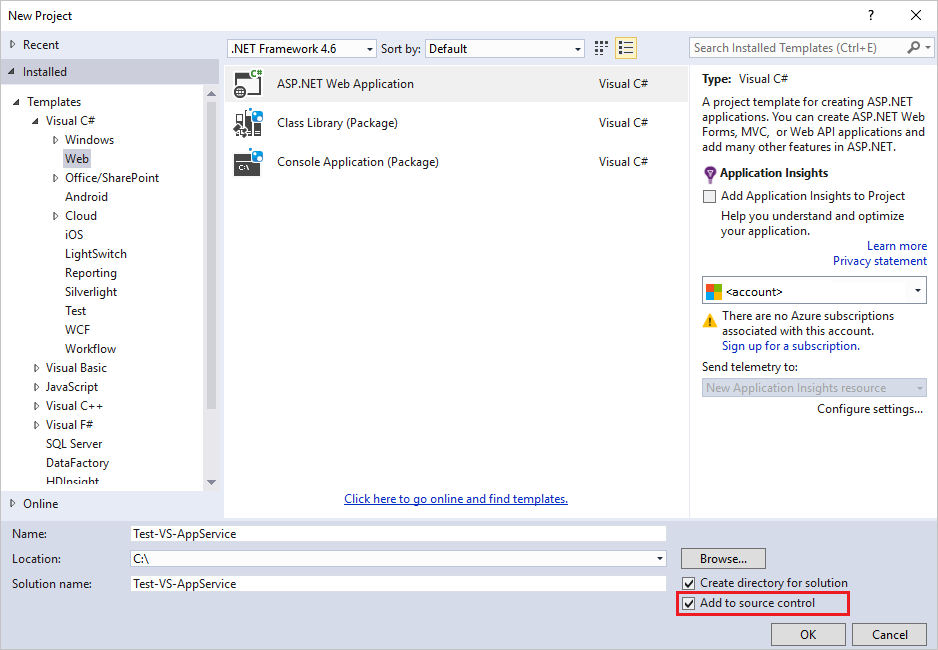

<properties
	pageTitle="连续部署到 Azure App Service | Azure"
	description="了解如何实现连续部署到 Azure App Service。"
	services="app-service"
	documentationCenter=""
	authors="dariagrigoriu"
	manager="wpickett"
	editor="mollybos"/>

<tags
	ms.service="app-service"
	ms.workload="na"
	ms.tgt_pltfrm="na"
	ms.devlang="na"
	ms.topic="article"
	ms.date="07/23/2016"
	wacn.date="11/14/2016"
	ms.author="dariagrigoriu"/>
    
# 连续部署到 Azure App Service

本教程说明如何为 [Azure App Service] 应用配置连续部署工作流。将应用服务与 BitBucket、GitHub 和 Visual Studio Team Services (VSTS) 集成可以实现一种连续部署工作流，在其中，Azure 可以从发布到其中一种服务的项目中拉取最近的更新。连续部署选项非常适合用于频繁集成多个分发内容的项目。

## 启用连续部署

若要启用连续部署，请执行以下操作：

将应用内容发布到用于连续部署的存储库。有关将项目发布到这些服务的详细信息，请参阅[创建存储库 (GitHub)]。以下步骤仅适用于 GitHub 存储库。有关 GitHub 以外的存储库，请参阅[手动触发部署](https://github.com/projectkudu/kudu/wiki/Manually-triggering-a-deployment)以设置 Webhook。

1. 登录到 [Azure 经典管理门户](https://manage.windowsazure.cn)。在“Web 应用”页上，选择要为其安装连续部署的 Web 应用，然后选择“仪表板”选项卡。

3. 在“速览”部分中，选择“从源控件设置部署”。在“设置部署”对话框中，选择“外部存储库”。

4. 输入 GitHub 存储库的 URL 并输入要跟踪的分支。将“存储库类型”保留为“Git”，并单击“完成”

    > [AZURE.NOTE] Azure 中国目前只支持公共存储库，因为我们无法输入 Web 应用的 Git 凭据。

    Azure 将创建与所选存储库的关联，从指定的分支提取文件，并保留 Azure Web 应用存储库的副本。

5. 在“速览”部分中，单击“下载发布配置文件”以下载 Web 应用的发布配置文件。

6. 使用文本编辑器打开发布配置文件，并获取以下值。

        userName="$<YOUR_WEB_APP>" userPWD="<SOME_BIG_RANDOM_TOKEN>"

7. 在你的 GitHub 存储库页面上，单击“设置”，选择“Webhook 与服务”，然后单击“添加 Webhook”

8. 在“负载 URL”中，输入 `https://$<YOUR_WEB_APP>:<SOME_BIG_RANDOM_TOKEN>@<YOUR_WEB_APP>.scm.chinacloudsites.cn/deploy`，按原样保留所有项目，并单击“添加 Webhook”以保存新的 Webhook。

5. 若要验证是否已成功部署应用，请在 Azure 经典管理门户中单击应用的 **URL**。

6. 若要验证是否能够在从所选存储库进行连续部署，请将更改推送到该存储库。推送到存储库完成后，你的应用应该很快更新以反映更改。可以在应用的“部署”页面中验证是否已提取更新。

## 连续部署 Visual Studio 解决方案 

将 Visual Studio 解决方案推送到 Azure App Service 就像推送简单的 index.html 文件一样容易。应用服务部署过程简化了所有细节，包括还原 NuGet 依赖项和生成应用程序二进制文件。可以按照仅在 Git 存储库中维护代码的源控件最佳实践操作，并让应用服务部署处理其余工作。

将 Visual Studio 解决方案推送到应用服务的步骤与[上一部分](#overview)中的步骤相同，前提是按以下方式配置解决方案和存储库：

-	使用 Visual Studio 源代码管理选项生成如下图所示的 `.gitignore` 文件，或者在内容存储库根目录中手动添加一个 `.gitignore` 文件，其内容类似于此 [.gitignore 示例](https://github.com/github/gitignore/blob/master/VisualStudio.gitignore)。

      

 
-	将整个解决方案的目录树添加到你的存储库中，其中 .sln 文件位于存储库根中。

你按照说明设置存储库并将 Azure 中的应用配置为从某个联机 Git 存储库连续发布后，你就可以在 Visual Studio 中从本地开发 ASP.NET 应用程序，并且只需通过将所做的更改推送到联机的 Git 存储库即可连续部署代码。

## 禁用连续部署

若要禁用连续部署，请执行以下操作：

1. 登录到 [Azure 经典管理门户](https://manage.windowsazure.cn)。在你的 Web 应用页面中，选择“仪表板”选项卡。

2. 在“速览”部分中，选择“从外部存储库断开连接”。

## 其他资源

* [How to investigate common issues with continuous deployment](https://github.com/projectkudu/kudu/wiki/Investigating-continuous-deployment)（如何调查连续部署的常见问题）
* [如何使用适用于 Azure 的 PowerShell]
* [如何使用针对 Mac 和 Linux 的 Azure 命令行工具]
* [Git 文档]
* [项目 Kudu](https://github.com/projectkudu/kudu/wiki)

[Azure App Service]: /documentation/articles/app-service-changes-existing-services/
[Azure 门户预览]: https://portal.azure.cn
[VSTS Portal]: https://www.visualstudio.com/products/visual-studio-team-services-vs.aspx
[Installing Git]: http://git-scm.com/book/zh/v2/%E8%B5%B7%E6%AD%A5-%E5%AE%89%E8%A3%85-Git
[如何使用适用于 Azure 的 PowerShell]: /documentation/articles/powershell-install-configure/
[如何使用针对 Mac 和 Linux 的 Azure 命令行工具]: /documentation/articles/xplat-cli-install/
[Git 文档]: http://git-scm.com/documentation

[创建存储库 (GitHub)]: https://help.github.com/articles/create-a-repo
[创建存储库 (BitBucket)]: https://confluence.atlassian.com/display/BITBUCKET/Create+an+Account+and+a+Git+Repo
[VSTS 入门]: https://www.visualstudio.com/get-started/overview-of-get-started-tasks-vs
[Continuous delivery to Azure using Visual Studio Team Services]: /documentation/articles/cloud-services-continuous-delivery-use-vso/

<!---HONumber=Mooncake_0919_2016-->