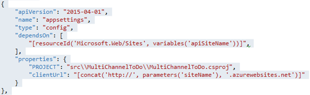
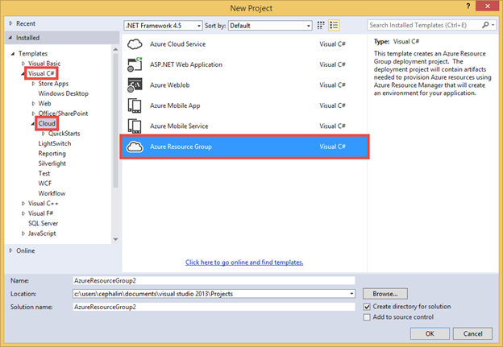
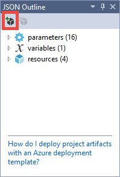
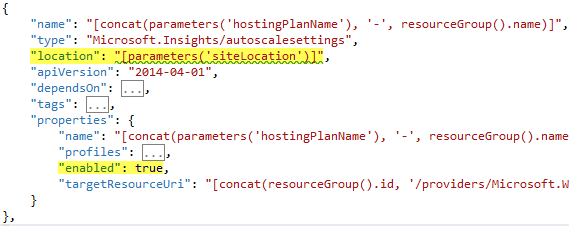

<properties
	pageTitle="按可预见的方式在 Azure 中设置和部署微服务"
	description="了解如何使用 JSON 资源组模板和 PowerShell 脚本以一种可预见的方式，在 Azure App Service 中将由微服务构成的应用程序设置并部署为单个单元。"
	services="app-service"
	documentationCenter=""
	authors="cephalin"
	manager="wpickett"
	editor="jimbe"/>

<tags
	ms.service="app-service"
	ms.workload="na"
	ms.tgt_pltfrm="na"
	ms.devlang="na"
	ms.topic="article"
	ms.date="01/06/2016"
	wacn.date="02/21/2017"
	ms.author="cephalin"/>

# 按可预见的方式在 Azure 中设置和部署微服务 #

[AZURE.INCLUDE [azure-sdk-developer-differences](../../includes/azure-sdk-developer-differences.md)]

本教程演示如何通过使用 JSON 资源组模板和 PowerShell 脚本以一种可预见的方式，在 [Azure App Service](/home/features/app-service/) 中将由[微服务](https://zh.wikipedia.org/wiki/微服务)构成的应用程序设置并部署为单个单元。

在设置和部署由高度分离的微服务构成的高扩展性应用程序时，可重复性和可预见性对成功至关重要。使用 [Azure 应用服务](/home/features/app-service/)，可以创建包括 Web 应用、移动应用和 API 应用的微服务。使用 [Azure 资源管理器](/documentation/articles/resource-group-overview/)，可以将所有微服务作为一个单元与资源依赖项（如数据库和源代码管理设置）一起进行管理。现在，你还可以使用 JSON 模板和简单的 PowerShell 脚本部署此类应用程序。

[AZURE.INCLUDE [app-service-web-to-api-and-mobile](../../includes/app-service-web-to-api-and-mobile.md)]

## 执行的操作 ##

在教程中，你将部署的应用程序包括：

-	两个 Web 应用（即两个微服务）
-	后端 SQL 数据库
-	应用设置、连接字符串和源代码管理
-	警报、自动缩放设置

## 将使用的工具 ##

在本教程中，你将使用以下工具。由于对工具的讨论并不全面，我将坚持使用端到端方案，并只为你提供每个方案的简要介绍及在哪里可找到它的详细信息。

### Azure 资源管理器模板 (JSON) ###
 
例如，每当在 Azure 应用服务中创建 Web 应用时，Azure 资源管理器都将使用 JSON 模板来创建具有组件资源的整个资源组。有关如何下载和使用这些模板的信息，请参阅[将 Azure PowerShell 与 Azure 资源管理器配合使用](/documentation/articles/powershell-azure-resource-manager/)。

有关 Azure 资源管理器模板的详细信息，请参阅[创作 Azure 资源管理器模板](/documentation/articles/resource-group-authoring-templates/)。

### Azure SDK 2.6 for Visual Studio ###

[AZURE.INCLUDE [azure-sdk-developer-differences](../../includes/azure-visual-studio-login-guide.md)]

最新的 SDK 包含对 JSON 编辑器中资源管理器模板支持的改进。可以使用它快速从头开始创建资源组模板，或打开现有 JSON 模板（例如下载的库模板）以进行修改、填充参数文件，甚至直接从 Azure 资源组解决方案部署资源组。

有关详细信息，请参阅 [Azure SDK 2.6 for Visual Studio](https://azure.microsoft.com/blog/2015/04/29/announcing-the-azure-sdk-2-6-for-net/)。

### Azure PowerShell 0.8.0 或更高版本 ###

从版本 0.8.0 开始，Azure PowerShell 安装除了包括 Azure 模块外还包括 Azure 资源管理器模块。此新模块使你能够编写资源组部署的脚本。

有关详细信息，请参阅[将 Azure PowerShell 与 Azure 资源管理器配合使用](/documentation/articles/powershell-azure-resource-manager/)

### “部署到 Azure”按钮 ###

如果你将 GitHub 用于源代码管理，则可将一个[“部署到 Azure”按钮](https://azure.microsoft.com/blog/2014/11/13/deploy-to-azure-button-for-azure-websites-2/)放入 README.MD，这将对 Azure 启用统包部署 UI。可为任何简单的 Web 应用执行此操作，同时可扩展这一操作，通过将 azuredeploy.json 文件放入存储库根来实现对整个资源组的部署。“部署到 Azure”按钮将使用此包含资源组模板的 JSON 文件来创建资源组。有关示例，请参阅将在本教程中使用的 [ToDoApp](https://github.com/azure-appservice-samples/ToDoApp) 示例。

## 获取示例资源组模板 ##

现在让我们开始吧。

1. 	请阅读[使用 Azure 应用服务进行敏捷软件开发](/documentation/articles/app-service-agile-software-development/)以了解如何部署 [ToDoApp](https://github.com/azure-appservice-samples/ToDoApp) 应用服务示例。

6.	登录到 Azure 门户预览。注意，Web 应用已连接到“外部项目”下的 GitHub 存储库。

	  

 
7.	在资源组边栏选项卡中，请注意资源组中已存在两个 Web 应用。

	  

 
你刚才在几分钟内看到的全部内容就是一个经过完全部署的由两个微服务构成的应用程序，以及所有组件、依赖项、设置、数据库和连续发布，均由 Azure 资源管理器中的自动化协调所设置。所有这一切均是通过两项内容完成：

-	“部署到 Azure”按钮
-	存储库根中的 azuredeploy.json

可数十、数百或数千次地部署此同一的应用程序，并且每次都具有完全相同的配置。这种方法的可重复性和可预见性使你能够轻松、自信地部署高扩展性应用程序。

## 检查（或编辑）AZUREDEPLOY.JSON ##

现在让我们看看如何设置 GitHub 存储库。你将使用 Azure.NET SDK 中的 JSON 编辑器，所以如果尚未安装 [Azure .NET SDK 2.6](/downloads/)，请立刻安装。

1.	使用你最喜欢的 git 工具克隆 [ToDoApp](https://github.com/azure-appservice-samples/ToDoApp) 存储库。在下面的屏幕截图中，我将在 Visual Studio 2013 的团队资源管理器中执行此操作。

	  

2.	在 Visual Studio 中从存储库根打开 azuredeploy.json。如果没有看到“JSON 概要”窗格，则需要安装 Azure.NET SDK。

	  

我不打算介绍 JSON 格式的每个细节，但[更多资源](#resources)部分包含可用于学习资源组模板语言的链接。在这里，我只打算向你展示有趣的功能，可帮助你开始制作自己的自定义模板来部署应用。

### Parameters ###

看一看参数部分，你将看到这些参数大都是“部署到 Azure”按钮提示你输入的内容。“部署到 Azure”按钮背后的站点将使用 azuredeploy.json 中定义的参数填充输入 UI。这些参数用于整个资源定义，例如资源名称、属性值等。

### 资源 ###

在资源节点中，可以看到定义了 4 个顶级资源，包括一个 SQL Server 实例、一个 App Service 计划和两个 Web 应用。

#### App Service 计划 ####

让我们以 JSON 中简单的根级别资源开始。在“JSON 概要”中，单击名为 **[hostingPlanName]** 的 App Service 计划以突出显示相应的 JSON 代码。

  

请注意，`type` 元素指定应用服务计划（很久很久以前它被称为服务器场）的字符串，而其他元素和属性使用 JSON 文件中定义的参数填写，并且此资源不具有任何嵌套的资源。

>[AZURE.NOTE] 另请注意，`apiVersion` 的值会告知 Azure 哪个版本的 REST API 将与 JSON 资源定义一起使用，并且会影响资源在 `{}` 内应采用的格式化方式。

#### SQL Server ####

接下来，在“JSON 概要”中单击名为“SQLServer”的 SQL Server 资源。

  

 
请注意以下有关突出显示的 JSON 代码的内容：

-	使用参数可确保已创建资源的命名和配置方式使其与其他资源保持一致。
-	SQLServer 资源具有两个嵌套的资源，而每个具有不同的 `type` 值。
-	`"resources": […]` 内（其中定义了数据库和防火墙规则）的嵌套资源具有 `dependsOn` 元素，后者指定根级别 SQLServer 资源的资源 ID。这将告知 Azure Resource Manager：“创建此资源之前，另一个资源必须已经存在；如果在模板中定义另一个资源，则先创建一个。”

	>[AZURE.NOTE] 有关如何使用 `resourceId()` 函数的详细信息，请参阅 [Azure 资源管理器模板函数](/documentation/articles/resource-group-template-functions/)。

-	`dependsOn` 元素的影响在于让 Azure 资源管理器能够知道哪些资源可以并行创建，哪些资源必须按顺序创建。

#### Web 应用 ####

现在，让我们继续，看看实际的 Web 应用本身，这更加复杂。在“JSON 概要”中单击“[variables('apiSiteName')]”Web 应用以突出显示其 JSON 代码。你会注意到内容正在变得更加有趣。为此，我将一个一个地讨论功能：

##### 根资源 #####

Web 应用取决于两个不同的资源。这意味着只有在创建 App Service 计划和 SQL Server 实例后，Azure 资源管理器才将创建 Web 应用。

  

##### 应用设置 #####

应用设置也被定义为嵌套资源。

  

在 `config/appsettings` 的 `properties` 元素中，具有两个 `"<name>" : "<value>"` 格式的应用设置。

-	`PROJECT` 是 [KUDU 设置](https://github.com/projectkudu/kudu/wiki/Customizing-deployments)，它告诉 Azure 部署在多项目的 Visual Studio 解决方案中使用哪个项目。稍后我将向你演示如何配置源代码管理，但由于 ToDoApp 代码位于多项目 Visual Studio 解决方案中，我们需要此设置。
-	`clientUrl` 只是应用程序代码使用的应用设置。

##### 连接字符串 #####

连接字符串也被定义为嵌套资源。

  

在 `config/connectionstrings` 的 `properties` 元素中，每个连接字符串也定义为具有特定的 `"<name>" : {"value": "…", "type": "…"}` 格式的 name:value 对。对于 `type` 元素，可能的值为 `MySql`、`SQLServer`、`SQLAzure` 和 `Custom`。

>[AZURE.TIP] 若要获取连接字符串类型的最终列表，请在 Azure PowerShell 中运行以下命令：[Enum]::GetNames("Microsoft.WindowsAzure.Commands.Utilities.Websites.Services.WebEntities.DatabaseType")
    
##### 源代码管理 #####

源代码管理设置也被定义为嵌套资源。Azure 资源管理器使用此资源来配置连续发布（稍后请参阅 `IsManualIntegration` 上的注意事项），并且还可在 JSON 文件的处理过程中自动启动应用程序代码的部署。

  

`RepoUrl` 和 `branch` 应该是非常直观的，且应指向 Git 存储库和分支（从其发布）的名称。同样，这些由输入参数定义。

请注意，在 `dependsOn` 元素中，除 Web 应用资源本身外，`sourcecontrols/web` 也取决于 `config/appsettings` 和 `config/connectionstrings`。这是因为一旦配置 `sourcecontrols/web` 后，Azure 部署进程将自动尝试部署、构建和启动应用程序代码。因此，插入此依赖项可帮助你确保在运行应用程序代码之前，应用程序有权访问所需的应用设置和连接字符串。

>[AZURE.NOTE] 另请注意，`IsManualIntegration` 设置为 `true`。此属性在本教程中是必需的，因为你实际上并不拥有 GitHub 存储库，因此不能实际授权 Azure 配置从 [ToDoApp](https://github.com/azure-appservice-samples/ToDoApp) 的连续发布（即将自动存储库更新推送到 Azure）。即使你拥有 GitHub 存储库，在 Azure 中国区也尚不支持设置 GitHub 凭据。

## 自己部署资源组模板 ##

“部署到 Azure”按钮太好用了，但是只有当你已将 azuredeploy.json 推送到 GitHub 时，它才允许你部署 azuredeploy.json 中的资源组模板。Azure.NET SDK 还提供了工具，使你能够直接从本地计算机部署任何 JSON 模板文件。为此，请执行以下步骤：

1.	在 Visual Studio 中，单击“文件”>“新建”>“项目”。

2.	单击“Visual C#”>“云”>“Azure 资源组”，然后单击“确定”。

	  

3.	在“选择 Azure 模板”中，选择“空白模板”，然后单击“确定”。

4.	将 azuredeploy.json 拖动到新项目的“模板”文件夹。

	  

5.	从解决方案资源管理器中打开复制的 azuredeploy.json。

6.	为了进行演示，让我们通过单击“添加资源”，将一些标准 Application Insight 资源添加到我们的 JSON 文件。如果你只对部署 JSON 文件感兴趣，请跳至部署步骤。

	  

7.	选择“适用于 Web 应用的 Application Insights”，确保选择了现有 App Service 计划和 Web 应用，然后单击“添加”。

	  

	现在你将能够看到几个新资源在 App Service 计划或 Web 应用上具有依赖项，具体取决于该资源及它的作用。这些资源不由其现有定义启用，而你将要对此进行更改。

	  

 
8.	在“JSON 概要”中，单击“appInsights AutoScale”以突出显示其 JSON 代码。这是针对你 App Service 计划的缩放设置。

9.	在突出显示的 JSON 代码中，找到 `location` 和 `enabled` 属性并对其进行如下设置。

	  

10.	在“JSON 概要”中，单击“CPUHigh appInsights”以突出显示其 JSON 代码。这是一个警报。

11.	找到 `location` 和 `isEnabled` 属性并对其进行如下设置。对其他三个警报（紫色警报）执行相同的操作。

	  

12.	你现在可以开始部署了。右键单击该项目，并选择“部署”>“新建部署”。

	  

13.	如果你尚未执行该操作，则登录到 Azure 帐户。

14.	选择订阅中的现有资源组或创建一个新资源组，选择“azuredeploy.json”，然后单击“编辑参数”。

	  

	现在你将能够在一张不错的表中编辑在模板文件中定义的所有参数。定义默认值的参数将已具有其默认值，并且定义允许值的列表的参数将显示为下拉列表。

	  

15.	填写所有空参数，并使用 **repoUrl** 中的 [ToDoApp 的 GitHub 存储库地址](https://github.com/azure-appservice-samples/ToDoApp.git)。然后单击“保存”。
 
	  

	>[AZURE.NOTE] 自动缩放是**标准**层或更高层中提供的一项功能，而计划级别警报是**基本**层或更高层中提供的功能，你需要将 **sku** 参数设置为**标准**或**高级**，使所有新 App Insights 资源亮起。
	
16.	单击“部署”。如果选择了“保存密码”，密码将**以纯文本格式**保存在参数文件中。否则，你将需要在部署过程中输入数据库密码。

就这么简单！ 现在只需转到 [Azure 门户预览](https://portal.azure.cn/)，便可看到添加到 JSON 部署的应用程序中的新警报和自动缩放设置。

这部分中的步骤主要完成了以下内容：

1.	准备模板文件
2.	创建参数文件以搭配模板文件
3.	使用参数文件部署模板文件

最后一步通过 PowerShell cmdlet 轻松完成。若要查看当 Visual Studio 部署应用程序时所执行的操作，请打开 Scripts\\Deploy-AzureResourceGroup.ps1。存在大量的代码，但我只突出显示使用参数文件部署模板文件所需的所有相关代码。

  

最后一个 cmdlet，`New-AzureResourceGroup`，实际执行了该操作。所有这一切向你展示了，借助工具可相对简单地以可预见的方式部署云应用程序。每当你使用相同的参数文件在相同的模板上运行该 cmdlet 时，都将获得相同的结果。

## 摘要 ##

在 DevOps 中，可重复性和可预见性对成功部署由微服务构成的高扩展性应用程序至关重要。在本教程中，你已经通过使用 Azure 资源管理器模板将一个由两个微服务构成的应用程序作为单个资源组部署到 Azure。但愿这已为你提供所需的知识，使你能够在 Azure 中开始将应用程序转换为模板，并且能够以可预见的方式设置和部署它。

## 后续步骤 ##

了解如何[轻松应用敏捷方法和连续发布微服务应用程序](/documentation/articles/app-service-agile-software-development/)等高级部署技巧。

##  更多资源 ##

-	[Azure 资源管理器模板语言](/documentation/articles/resource-group-authoring-templates/)
-	[创作 Azure 资源管理器模板](/documentation/articles/resource-group-authoring-templates/)
-	[Azure 资源管理器模板函数](/documentation/articles/resource-group-template-functions/)
-	[使用 Azure 资源管理器模板部署应用程序](/documentation/articles/resource-group-template-deploy/)
-	[将 Azure PowerShell 与 Azure 资源管理器配合使用](/documentation/articles/powershell-azure-resource-manager/)
-	[Azure 中的资源组部署疑难解答](/documentation/articles/resource-manager-deployment-operations/)

 

<!---HONumber=Mooncake_1107_2016-->