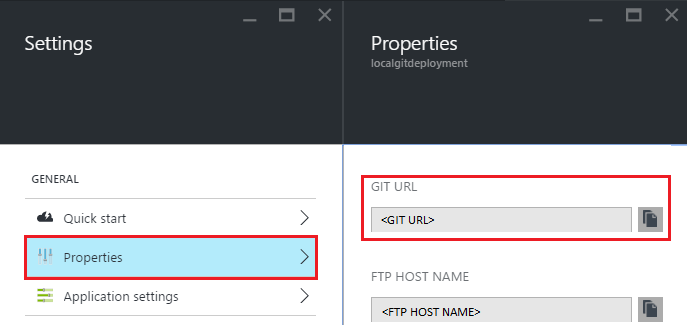
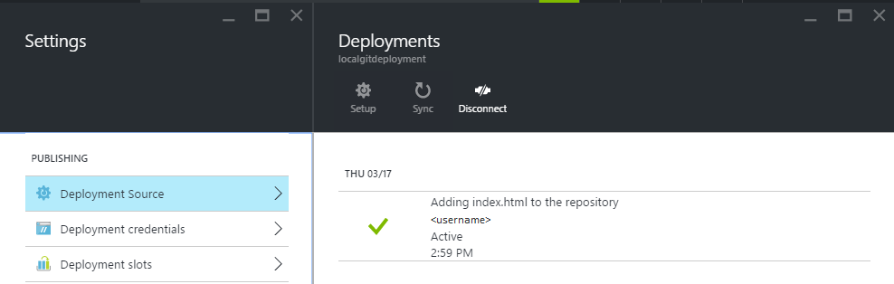

<properties
    pageTitle="从本地 Git 部署到 Azure App Service"
    description="了解如何实现从本地 Git 部署到 Azure App Service。"
    services="app-service"
    documentationcenter=""
    author="dariagrigoriu"
    manager="erikre"
    editor="mollybos"
    translationtype="Human Translation" />
<tags
    ms.assetid="ac50a623-c4b8-4dfd-96b2-a09420770063"
    ms.service="app-service"
    ms.workload="na"
    ms.tgt_pltfrm="na"
    ms.devlang="na"
    ms.topic="article"
    ms.date="06/13/2016"
    wacn.date="05/02/2017"
    ms.author="dariagrigoriu"
    ms.sourcegitcommit="78da854d58905bc82228bcbff1de0fcfbc12d5ac"
    ms.openlocfilehash="57d74d7680f5426fa3f6318b93c878f051aa74db"
    ms.lasthandoff="04/22/2017" />

# 从本地 Git 部署到 Azure App Service
本教程说明如何将应用从本地计算机上的 Git 存储库部署到 [Azure App Service] 。 应用服务支持结合 [Azure 门户预览]中的“本地 Git”部署选项使用此方法。  
在根据[此处](/documentation/articles/app-service-web-get-started/)所述使用 [Azure 命令行接口]创建应用服务应用时，将自动执行本文中所述的许多 Git 命令。

## 先决条件
若要完成本教程，你需要：

* Git。 可在 [此处](http://www.git-scm.com/downloads)下载二进制安装文件。  
* 对 Git 有一个基本的了解。
* 一个 Azure 帐户。 如果你没有帐户，可以[注册试用版](/pricing/1rmb-trial)。 

## 步骤 1：创建本地存储库
执行下列任务可创建新的 Git 存储库。

1. 启动一个命令行工具，例如 **GitBash** (Windows) 或 **Bash** (Unix Shell)。 在 OS X 系统上，可以通过 **Terminal** 应用程序访问命令行。
2. 导航到要部署的内容所在的目录。
3. 使用以下命令可初始化新的 Git 存储库：

        git init

## 步骤 2：提交内容
应用服务支持用各种编程语言创建的应用程序。 

1. 如果存储库已包含内容，请跳过这一项，并转到下面的第 2 项。 如果存储库尚不包含内容，请只填充静态 .html 文件，如下所示： 

    * 使用文本编辑器，在 Git 存储库的根中创建一个名为 **index.html** 的新文件。
    * 添加以下文本作为 index.html 文件的内容并保存该文件： *Hello Git!*
2. 在命令行中，验证当前位置是否在 Git 存储库的根目录下。 然后使用以下命令将文件添加到存储库中：

        git add -A 
3. 接下来，使用以下命令将更改提交到存储库：

        git commit -m "Hello Azure App Service"

## 步骤 3：启用应用服务应用存储库
执行以下步骤为应用服务应用启用 Git 存储库。

1. 登录到 [Azure 门户预览]。
2. 在应用服务应用的边栏选项卡中，单击“设置”>“部署源”。 依次单击“选择源”、“本地 Git 存储库”、“确定”。  

    
3. 如果这是你第一次在 Azure 中设置存储库，则需要为其创建登录凭据。 可以登录到[经典管理门户](https://manage.windowsazure.cn/)，找到应用，然后在“仪表板”页中单击“重置部署凭据”，对 git 凭据进行设置。

## 步骤 4：部署项目
使用以下步骤通过本地 Git 将应用发布到应用服务。

1. 在 Azure 门户预览的应用边栏选项卡中，单击“Git URL”的“设置”>“属性”。

    

    **Git URL** 是从本地存储库到部署的远程引用。 在后续步骤中，你将要用到此 URL。
2. 使用命令行验证当前位置是否在本地 Git 存储库的根目录下。
3. 使用 `git remote` 添加步骤 1 的 **Git URL** 中所列的远程引用。 使用的命令应类似于：

        git remote add azure https://<username>@localgitdeployment.scm.chinacloudsites.cn:443/localgitdeployment.git         
    > [AZURE.NOTE]
    > **remote** 命令可将命名引用添加到远程存储库。 在本示例中，它为 Web 应用的存储库创建名为“azure”的引用。
    > 
    > 
4. 使用刚刚创建的新 **azure** 远程命令将内容推送到应用服务。

        git push azure master

    在 Azure 经典管理门户中重置部署凭据时，系统会提示你输入以前创建的密码。 输入该密码（请注意，在键入密码时，Gitbash 不会将星号回显到控制台）。 
5. 返回到 Azure 门户预览中的应用。 最近推送的日志条目应显示在“部署”边栏选项卡中。 

    
6. 单击应用边栏选项卡顶部的“浏览”按钮来验证是否已部署内容。 

## 故障排除
以下是使用 Git 发布到 Azure 中的应用服务应用时遇到的常见错误或问题：

- - -
**症状**：无法访问“[siteURL]”：无法连接到 [scmAddress]

**原因**：如果应用无法正常工作，则会发生该错误。

**解决方法**：在 Azure 门户预览中启动应用。 在应用运行之前，Git 部署无法进行。 

- - -
**症状**：无法解析主机“主机名”

**原因**：如果创建“azure”远程网站时输入的地址信息不正确，则会发生该错误。

**解决方法**：使用 `git remote -v` 命令列出所有远程网站以及关联的 URL。 确认“azure”远程网站的 URL 正确。 如果需要，请删除此远程网站并使用正确的 URL 重新创建它。

- - -
**症状**：无通用引用且未指定任何引用；不采取任何措施。 或许你应指定一个分支，例如“master”。

**原因**：如果你在执行 Git 推送操作时未指定分支且未设置 Git 使用的 push.default 值，则会发生该错误。

**解决方法**：请再次执行推送操作，并指定 master 分支。 例如：

    git push azure master

- - -
**症状**：src refspec [分支名] 不匹配任何内容。

**原因**：如果尝试推送到“azure”远程网站上 master 分支之外的分支，则会发生该错误。

**解决方法**：请再次执行推送操作，并指定 master 分支。 例如：

    git push azure master

- - -
**症状**：RPC 失败；结果 = 22，HTTP 代码 = 502。

**原因**：如果尝试通过 HTTPS 推送大型 Git 存储库，则可能出现此错误。

**解决方法**：在本地计算机上更改 Git 配置，以增大 postBuffer

    git config --global http.postBuffer 524288000

- - -
**症状**：错误 - 已将更改提交到远程存储库，但未更新 Web 应用。

**原因**：如果部署的是 Node.js 应用，其中包含用于指定其他必需模块的 package.json 文件，则会发生该错误。

**解决方法**：应在发生此错误之前记录包含“npm ERR!” 的其他消息，这些消息可提供有关失败的其他上下文。 以下是该错误的已知原因和相应的“npm ERR!” 消息:

* **package.json 文件格式不正确**：npm ERR! 无法读取依赖项。
* **不具有 Windows 的二进制分发的本机模块**：

    * npm ERR! \`cmd "/c" "node-gyp rebuild"\` 失败，1

        或
    * npm ERR! [modulename@version] 预安装：\`make || gmake\`

## 其他资源
* [Git 文档](http://git-scm.com/documentation)
* [项目 Kudu 文档](https://github.com/projectkudu/kudu/wiki)
* [连续部署到 Azure 应用服务](/documentation/articles/app-service-continuous-deployment/)
* [如何使用适用于 Azure 的 PowerShell](https://docs.microsoft.com/zh-cn/powershell/azureps-cmdlets-docs)
* [如何使用 Azure 命令行接口](/documentation/articles/cli-install-nodejs/)

[Azure App Service]: /documentation/articles/app-service-changes-existing-services/
[Azure Developer Center]: /develop/overview/
[Azure 门户预览]: https://portal.azure.cn
[Git website]: http://git-scm.com
[Installing Git]: http://git-scm.com/book/zh/v2/%E8%B5%B7%E6%AD%A5-%E5%AE%89%E8%A3%85-Git
[Azure 命令行接口]: /documentation/articles/xplat-cli-azure-resource-manager/

[Using Git with CodePlex]: http://codeplex.codeplex.com/wikipage?title=Using%20Git%20with%20CodePlex&referringTitle=Source%20control%20clients&ProjectName=codeplex
[Quick Start - Mercurial]: http://mercurial.selenic.com/wiki/QuickStart

<!--Update_Description: wording update-->