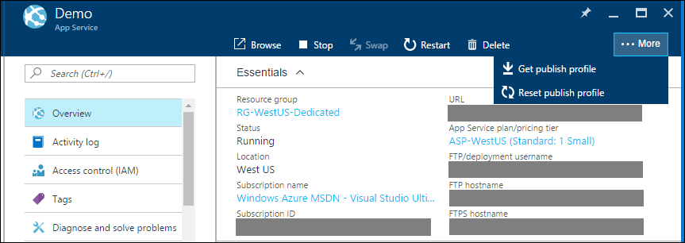

<properties
    pageTitle="Azure App Service 部署凭据 | Azure"
    description="了解如何使用 Azure App Service 部署凭据。"
    services="app-service"
    documentationcenter=""
    author="dariagrigoriu"
    manager="wpickett"
    editor="mollybos" />  

<tags
    ms.service="app-service"
    ms.workload="na"
    ms.tgt_pltfrm="na"
    ms.devlang="multiple"
    ms.topic="article"
    ms.date="11/21/2016"
    wacn.date="01/03/2017"
    ms.author="dariagrigoriu" />  

# Azure App Service 部署凭据
[Azure App Service](/documentation/articles/app-service-changes-existing-services/) 平台支持两种类型的内容部署凭据。
* 部署凭据：用户范围凭据
* 发布配置文件：应用范围凭据

## 用户范围凭据
用户范围凭据由 Azure 用户创建，并直接映射到 Microsoft 帐户，而不映射到任何特定的应用服务应用。可从 [Azure 经典管理门户](https://manage.windowsazure.cn)设置或重置用户范围部署凭据，每个应用服务应用在其“仪表板”>“速览”>“速览”下均拥有一个可编辑的入口点。无论入口点如何，对这些用户范围凭据所做的编辑都会应用于整个 Microsoft 帐户。FTP 和 Git 部署频繁使用这些凭据。

如果通过基于角色的访问控制 (RBAC) 或共同管理员权限委托 Azure 资源的访问权限，则在撤销访问权限前，每个收到访问权限的 Azure 用户均可使用自己的用户范围的凭据。不应与其他 Azure 用户共享这些部署凭据。

## 应用范围凭据
应用范围凭据由应用服务平台自动创建。每个应用服务应用的应用范围凭据存储在 XML 发布配置文件中。可在应用的“概述”边栏选项卡中执行“获取发布配置文件”操作，在 [Azure 门户预览](https://portal.azure.cn)中获取发布配置文件。基于 WebDeploy 的部署频繁使用这些凭据。它们还可用于 FTP 或 Git 部署。Visual Studio（基于 WebDeploy 的部署的入口点）能够分析身份验证的发布配置文件。

  

如果通过基于角色的访问控制 (RBAC) 或共同管理员权限委托 Azure 资源的访问权限，则每个收到访问权限的 Azure 用户均可下载相同的应用特定发布配置文件。可随时从 Azure 门户预览应用的“概述”边栏选项卡重置发布配置文件。撤消委托的访问权限后，重置应用范围凭据是个好主意。

<!---HONumber=Mooncake_1226_2016-->