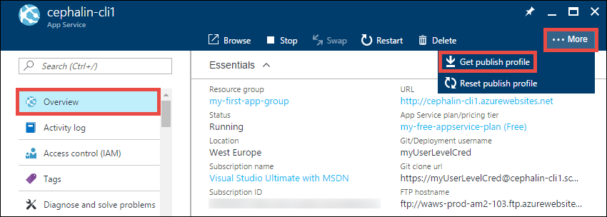
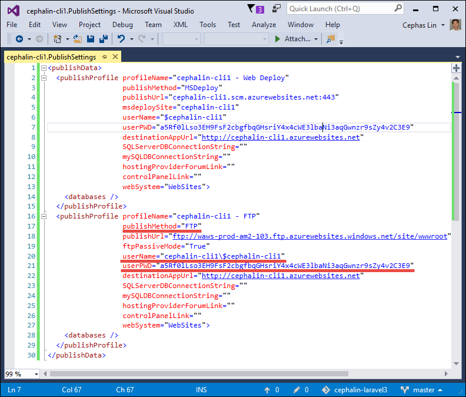

<properties
    pageTitle="Azure App Service 部署凭据 | Azure"
    description="了解如何使用 Azure App Service 部署凭据。"
    services="app-service"
    documentationcenter=""
    author="dariagrigoriu"
    manager="wpickett"
    editor="mollybos" />
<tags
    ms.service="app-service"
    ms.workload="na"
    ms.tgt_pltfrm="na"
    ms.devlang="multiple"
    ms.topic="article"
    ms.date="01/05/2016"
    wacn.date="02/10/2017"
    ms.author="dariagrigoriu" />  

# 配置 Azure 应用服务的部署凭据
[Azure 应用服务](/documentation/articles/app-service-changes-existing-services/)对于[本地 Git 部署](/documentation/articles/app-service-deploy-local-git/)和 [FTP/S 部署](/documentation/articles/app-service-deploy-ftp/)支持两种类型的凭据。

* **用户级凭据**：用于整个 Azure 帐户的一组凭据。在任何订阅中，它均可用于为 Azure 帐户有权访问的任何应用部署应用服务。可从 [Azure 经典管理门户](https://manage.windowsazure.cn)设置或重置用户范围部署凭据，每个应用服务应用在其“仪表板”>“速览”下均有一个可编辑的入口点。这些是可在“应用程序服务”>“&lt;app\_name>”>“部署凭据”下配置的默认凭据集。这也是在门户 GUI（如应用的[资源边栏选项卡](/documentation/articles/resource-group-portal/#manage-resources)的“概述”和“属性”）中显示的默认凭据集。

    > [AZURE.NOTE]
    如果通过基于角色的访问控制 (RBAC) 或共同管理员权限委派 Azure 资源的访问权限，则在撤销访问权限前，每个收到应用访问权限的 Azure 用户均可使用自己的个人用户级凭据。不应与其他 Azure 用户共享这些部署凭据。
    >
    >

* **应用级凭据**：用于每个应用的一组凭据。只能使用它部署到该应用。每个应用的凭据在创建应用时自动生成，并且可在应用的发布配置文件中找到。无法手动配置凭据，但可以随时为应用重置凭据。

## 设置和重置用户级凭据

用户级凭据由 Azure 用户创建。可从 [Azure 经典管理门户](https://manage.windowsazure.cn)设置或重置用户级部署凭据，每个应用服务应用在其“仪表板”>“速览”下均拥有一个可编辑的入口点。无论入口点如何，对这些用户级凭据所做的编辑都会应用于整个 Azure 帐户。FTP 和 Git 部署频繁使用这些凭据。

## 设置和重置应用级凭据
对于应用服务中的每个应用，其应用级凭据存储在 XML 发布配置文件中。

若要获取应用级凭据，请执行以下操作：

1. 在 [Azure 门户预览](https://portal.azure.cn)中，单击“应用服务”>“&lt;any\_app>”>“概述”。

2. 单击“...更多”>“获取发布配置文件”，将开始下载 .PublishSettings 文件。

      

3. 打开 .PublishSettings 文件并找到具有属性 `publishMethod="FTP"` 的 `<publishProfile>` 标记。然后，获取其 `userName` 和 `password` 属性。这些是应用级凭据。

      

    与用户级凭据类似，FTP 部署用户名的格式为 `<app_name><username>`，Git 部署用户名只是 `<username>` 没有前面的 `<app_name>`。

若要重置应用级凭据，请执行以下操作：

1. 在 [Azure 门户预览](https://portal.azure.cn)中，单击“应用服务”>“&lt;any\_app>”>“概述”。

2. 单击“...更多”>“重置发布配置文件”。单击“是”确认重置。

    重置操作将使以前下载的所有 .PublishSettings 文件无效。

## 后续步骤

了解如何使用这些凭据从[本地 Git](/documentation/articles/app-service-deploy-local-git/) 或使用 [FTP/S](/documentation/articles/app-service-deploy-ftp/) 部署应用。

<!---HONumber=Mooncake_0206_2017-->
<!--Update_Description: add details about the 2 type of credentials, and add steps for how to set them-->