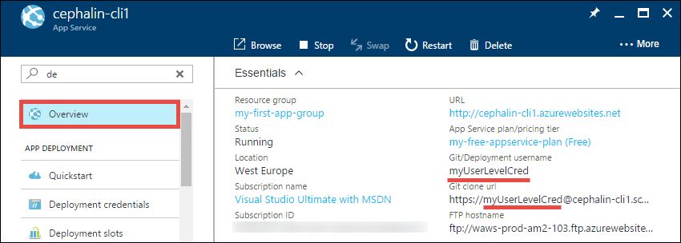
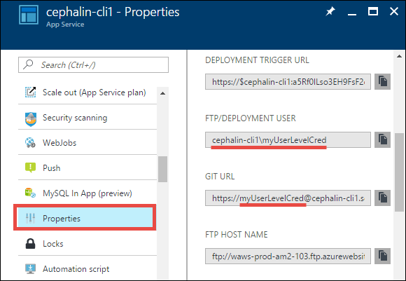

<properties
    pageTitle="Azure App Service 部署凭据 | Azure"
    description="了解如何使用 Azure App Service 部署凭据。"
    services="app-service"
    documentationcenter=""
    author="dariagrigoriu"
    manager="erikre"
    editor="mollybos"
    translationtype="Human Translation" />
<tags
    ms.service="app-service"
    ms.workload="na"
    ms.tgt_pltfrm="na"
    ms.devlang="multiple"
    ms.topic="article"
    ms.date="01/05/2016"
    wacn.date="04/24/2017"
    ms.author="dariagrigoriu"
    ms.sourcegitcommit="a114d832e9c5320e9a109c9020fcaa2f2fdd43a9"
    ms.openlocfilehash="63f7ce316d861f1bb6c7a7a2fdf6577a3fb1e7c3"
    ms.lasthandoff="04/14/2017" />

# 为 Azure 应用服务配置部署凭据
[Azure 应用服务](/documentation/articles/app-service-changes-existing-services/)支持两种类型的凭据，这些凭据适用于[本地 GIT 部署](/documentation/articles/app-service-deploy-local-git/)和 [FTP/S 部署](/documentation/articles/app-service-deploy-ftp/)。

* **用户级凭据**：一组适用于整个 Azure 帐户的凭据。 在任何订阅中，它均可用于为 Azure 帐户有权访问的任何应用部署应用服务。 这些是默认的凭据集，可从 [Azure 经典管理门户](https://manage.windowsazure.cn)设置或重置，每个应用服务应用在该门户的“仪表板”>“速览”下都有一个编辑入口点。

    > [AZURE.NOTE]
    > 如果通过基于角色的访问控制 (RBAC) 或共同管理员权限委派 Azure 资源的访问权限，则在撤销访问权限前，每个收到应用访问权限的 Azure 用户均可使用自己的个人用户级凭据。 不应与其他 Azure 用户共享这些部署凭据。
    >
    >

* **应用级凭据**：用于每个应用的一组凭据。 只能使用它部署到该应用。 每个应用的凭据在创建应用时自动生成，并且可在应用的发布配置文件中找到。 无法手动配置凭据，但可以随时为应用重置凭据。

## 设置和重置用户级凭据

用户级凭据是 Azure 用户创建的。 用户级部署凭据可从 [Azure 经典管理门户](https://manage.windowsazure.cn)设置或重置，每个应用服务应用在该门户的“仪表板”>“速览”下都有一个编辑入口点。 无论入口点如何，对这些用户级凭据所作的编辑都会应用于整个 Azure 帐户。 FTP 和 Git 部署频繁使用这些凭据。

设置部署凭据后，可以在 [Azure 门户预览](https://portal.azure.cn)的应用的“概览”中找到 *Git*部署用户名，

在应用的 *属性* 中找到 **FTP**部署用户名。

> [AZURE.NOTE]
> Azure 不会显示用户级部署密码。 如果忘记了密码，将无法检索它。 但是，可以在 [Azure 经典管理门户](https://manage.windowsazure.cn)中重置凭据。
>
>  

## 设置和重置应用级凭据
对于应用服务中的每个应用，其应用级凭据存储在 XML 发布配置文件中。

若要获取应用级凭据，请执行以下操作：

1. 在 [Azure 门户预览](https://portal.azure.cn)中，单击“应用服务”> **&lt;any_app>** > “概览”。

2. 单击“...更多” > “获取发布配置文件”，然后就会开始下载 .PublishSettings 文件。

    

3. 打开 .PublishSettings 文件，找到属性为 `publishMethod="FTP"` 的 `<publishProfile>` 标记。 然后，获取其 `userName` 和 `password` 属性。
这些是应用级凭据。

    

    与用户级凭据类似，FTP 部署用户名采用 `<app_name>\<username>` 格式，Git 部署用户名则为 `<username>`，没有前面的 `<app_name>\`。

若要重置应用级凭据，请执行以下操作：

1. 在 [Azure 门户预览](https://portal.azure.cn)中，单击“应用服务”> **&lt;any_app>** > “概览”。

2. 单击“...更多” > “重置发布配置文件”。 单击“是”确认重置。

    重置操作将使以前下载的所有 .PublishSettings 文件无效。

## 后续步骤

了解如何使用这些凭据通过[本地 Git](/documentation/articles/app-service-deploy-local-git/) 或 [FTP/S](/documentation/articles/app-service-deploy-ftp/) 部署应用。
<!--Update_Description: add details to view the credentials-->