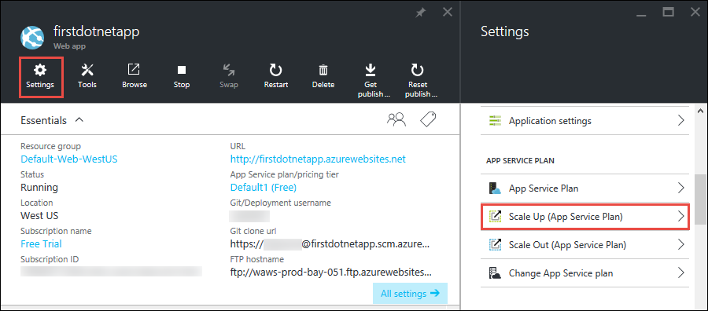
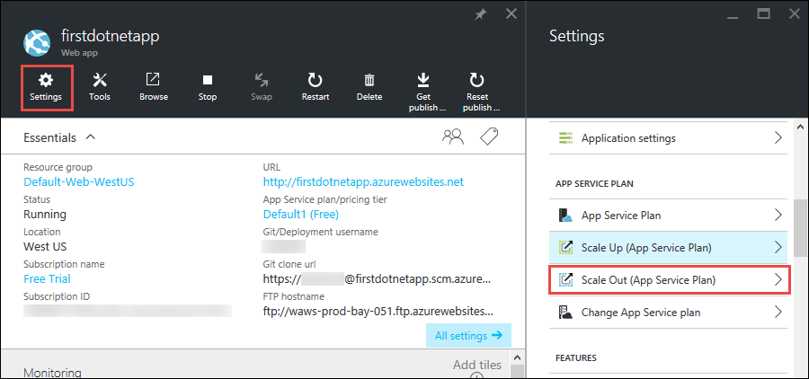
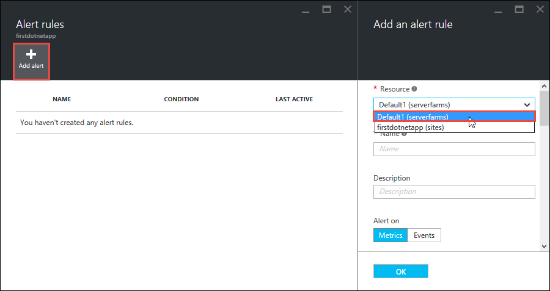

<properties 
	pageTitle="在第一个 Web 应用中添加功能" 
	description="在短时间内将一些新奇功能添加到你的第一个 Web 应用。" 
	services="app-service\web"
	documentationCenter=""
	authors="cephalin" 
	manager="wpickett" 
	editor="" 
/>

<tags
	ms.service="app-service-web"
	ms.date="05/12/2016"
	wacn.date="09/26/2016"/>

# 在第一个 Web 应用中添加功能

在[在 5 分钟内将 Web 应用部署到 Azure](/documentation/articles/app-service-web-get-started/) 教程中，你已将一个示例 Web 应用部署到 [Azure App Service](/documentation/articles/app-service-value-prop-what-is/)。在本文中，你将会快速地在所部署的 Web 应用中添加一些强大功能。只需几分钟，你就能够：

- 强制实施用户身份验证
- 自动缩放应用
- 接收有关应用性能的警报

无论在前一篇文章中部署哪一个示例应用，都可以遵循以下的操作。

本教程中的三个活动只是你在将 Web 应用放入 Azure App Service 时可以使用的众多有用功能中的几个例子。许多功能已在**免费**层（运行你的第一个 Web 应用的层）中提供，你可以使用试用信用额度来试用只能在更高定价层中使用的功能。除非你显式将**免费**层更改为其他定价层，否则你的 Web 应用将保留在免费层，因此，你可以高枕无忧。

>[AZURE.NOTE] 使用 Azure CLI 创建的 Web 应用在**免费**层中运行，该层只允许一个存在资源配额的共享 VM 实例。有关**免费**层提供的功能的详细信息，请参阅 [App Service limits（App Service 限制）](/documentation/articles/azure-subscription-service-limits/#app-service-limits)。

## 对用户进行身份验证

现在，让我们看看将身份验证添加到应用有多么容易（有关更多信息，请阅读 [App Service Authentication/Authorization（App Service 身份验证/授权）](https://azure.microsoft.com/blog/announcing-app-service-authentication-authorization/)）。

1. 在应用的边栏选项卡（刚打开）中，单击“设置”>“身份验证/授权”。  
    
    
2. 单击“打开”以打开身份验证。  
    
4. 在“身份验证提供程序”中，单击“Azure Active Directory”。  
    

5. 在“Azure Active Directory 设置”边栏选项卡中，单击“快速”，然后单击“确定”。默认设置在默认目录中创建新的 Azure AD 应用程序。  
    

6. 单击“保存”。  
    

    成功更改之后，你将看到通知铃铛变成绿色，以及一条友好的消息。

7. 返回应用的主边栏选项卡，单击“URL”链接（或菜单列中的“浏览”）。此链接是 HTTP 地址。  
      
    但是在新的选项卡中打开应用后，URL 框将重定向数次并通过 HTTPS 地址到达应用。你将看到，你已登录到你的 Azure 订阅，并已在应用中自动完成身份验证。  
      
    因此，如果你在另一个浏览器中打开一个未经身份验证的会话，将在导航到同一 URL 时看到登录屏幕。  
    <!--   -->
    如果你从未使用过 Azure Active Directory，默认目录可能没有任何 Azure AD 用户。在此情况下，那里唯一的帐户可能是你以 Azure 订阅登录的 Microsoft 帐户。这就是为什么前面能在相同的浏览器中自动登录此应用。你也可以使用相同的 Microsoft 帐户在此登录页面上登录。

祝贺你，现在你可以对传入 Web 应用的所有流量进行身份验证。

你可能已注意到在“身份验证/授权”边栏选项卡中能做的不止于此，例如：

- 启用社交登录
- 启用多个登录选项
- 更改当用户首次导航到应用时的默认行为

App Service 针对某些常见的身份验证要求提供周全的解决方案，所以不需要自行提供身份验证逻辑。有关详细信息，请参阅 [App Service Authentication/Authorization（App Service 身份验证/授权）](https://azure.microsoft.com/blog/announcing-app-service-authentication-authorization/)。

## 根据需要自动缩放应用

接下来，让我们自动缩放应用，以便它能够自动调整其容量来响应用户需求（有关更多信息，请阅读 [Scale up your app in Azure（在 Azure 中缩放你应用的定价层）](/documentation/articles/web-sites-scale/)和 [Scale instance count manually or automatically（手动或自动缩放实例计数）](/documentation/articles/insights-how-to-scale/)）。

简单而言，可以通过两种方式缩放 Web 应用：

- [向上缩放](https://en.wikipedia.org/wiki/Scalability#Horizontal_and_vertical_scaling)：获取更多 CPU、内存、磁盘空间、专用 VM 等附加功能、自定义域和证书、过渡槽、自动缩放，等等。可以通过更改应用所属的 App Service 计划的定价层来向外缩放。
- [向外缩放](https://en.wikipedia.org/wiki/Scalability#Horizontal_and_vertical_scaling)：增加运行应用的 VM 实例数。可以根据定价层，最多向外缩放到 50 个实例。

毋需赘述，让我们马上设置自动缩放。

1. 首先，向上缩放以启用自动缩放。在应用的边栏选项卡中，单击“设置”>“向上缩放(App Service 计划)”。  
    

2. 卷动并选择“S1 标准”层（这是支持自动缩放的最低层（下面所圈选）），然后单击“选择”。  
    

    现已完成向上缩放。
    
    >[AZURE.IMPORTANT] 这一层将消耗你的试用额度。如果你使用即用即付帐户，将从你的帐户中扣费。
    
3. 接下来，配置自动缩放。在应用的边栏选项卡中，单击“设置”>“向外缩放(App Service 计划)”。  
    

4. 将“缩放依据”更改为“CPU 百分比”。下拉列表下面的滑块会相应地更新。然后，定义介于 **1** 与 **2** 之间的“实例”范围，以及介于 **40** 与 **80** 之间的“目标范围”。为此，可以在框中键入值或移动滑块。  
    
    
    根据此配置，当 CPU 使用率高于 80% 时，应用将自动向外缩放；当 CPU 使用率低于 40% 时则缩小。
    
5. 单击菜单栏中的“保存”。

祝贺你，你的应用已在自动缩放。

你可能已注意到在“缩放设置”边栏选项卡中能做的不止于此，例如：

- 手动缩放到特定的实例数
- 根据其他性能度量值（例如内存百分比或磁盘队列）进行缩放
- 自定义触发性能规则时的缩放行为
- 按计划自动缩放
- 设置未来事件的自动缩放行为

有关向上缩放应用的详细信息，请参阅 [Scale up your app in Azure（在 Azure 中缩放你应用的定价层）](/documentation/articles/web-sites-scale/)。有关向外缩放的详细信息，请参阅 [Scale instance count manually or automatically（手动或自动缩放实例计数）](/documentation/articles/insights-how-to-scale/)。

## 接收应用的警报

既然你的应用正在自动缩放，当它达到最大实例计数 (2) 且 CPU 使用率超过所需的百分比 (80%) 时，会发生什么情况？ 例如，你可以设置警报（有关更多信息，请阅读 [Receive alert notifications（接收警报通知）](/documentation/articles/insights-receive-alert-notifications/)）来通知这种情况，以便进一步向上/向外缩放应用。让我们快速为此方案设置警报。

1. 在应用的边栏选项卡中，单击“工具”>“警报”。  
    

2. 单击“添加警报”。然后，在“资源”框中，选择以 (serverfarms) 结尾的资源。这是你的 App Service 计划。  
    

3. 将“名称”指定为 `CPU Maxed`、将“度量值”指定为“CPU 百分比”，将“阈值”指定为 `90`，选择“电子邮件所有者、参与者和阅读者”，然后单击“确定”。  
    
    
    当 Azure 完成警报创建时，你会在“警报”边栏选项卡中看到该警报。  
    

祝贺你，你现在可以接收警报。

此警报设置将每隔 5 分钟检查一次 CPU 使用率。如果该数字高于 90%，以及获得授权的人员都收到电子邮件警报。若要查看有权接收警报的人员，请回到应用的边栏选项卡，然后单击“访问”按钮。  

你应会看到“订阅管理员”已是应用的“所有者”。如果你是 Azure 订阅（如试用订阅）的帐户管理员，此组就会将你包括在内。有关 Azure 基于角色的访问控制的详细信息，请参阅 [Azure Role-Based Access Control（Azure 基于角色的访问控制）](/documentation/articles/role-based-access-control-configure/)。

> [AZURE.NOTE] 警报规则是一项 Azure 功能。有关详细信息，请参阅 [Receive alert notifications（接收警报通知）](/documentation/articles/insights-receive-alert-notifications/)。

## 后续步骤

当你配置警报时，可能已注意到“工具”边栏选项卡中有一组丰富的工具。这些工具可让你排查问题、监视性能、测试漏洞、管理资源、与 VM 控制台交互，以及添加有用的扩展。我们希望你单击每个工具，以探索这些简单却功能强大的工具。

此外，请了解如何使用部署的应用执行更多操作。以下只是一份不完整的列表：

- [设置过渡环境](/documentation/articles/web-sites-staged-publishing/) - 将应用投放到生产环境之前，先将它部署到过渡 URL。有把握地更新你的实时 Web 应用。使用多个部署槽设置一个精巧的 DevOps 解决方案。 
- [设置连续部署](/documentation/articles/app-service-continuous-deployment/) - 将应用部署集成到源代码管理系统。通过每次提交部署到 Azure。
- [备份应用](/documentation/articles/web-sites-backup/) - 为 Web 应用设置备份和还原。针对意外的故障做好准备，并能够从中恢复。
- [启用诊断日志](/documentation/articles/web-sites-enable-diagnostic-log/) - 从 Azure 或应用程序跟踪中读取 IIS 日志。以串流的形式读取日志、下载日志。
- [扫描应用中的漏洞](https://azure.microsoft.com/blog/web-vulnerability-scanning-for-azure-app-service-powered-by-tinfoil-security/) - 使用 [Tinfoil Security](https://www.tinfoilsecurity.com/) 提供的服务扫描 Web 应用，以查出新型威胁。
- [了解 App Service 的工作原理](/documentation/articles/app-service-how-works-readme/)

<!---HONumber=Mooncake_0523_2016-->