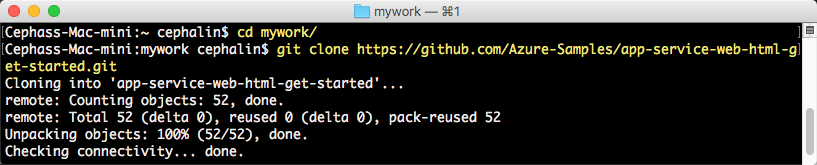
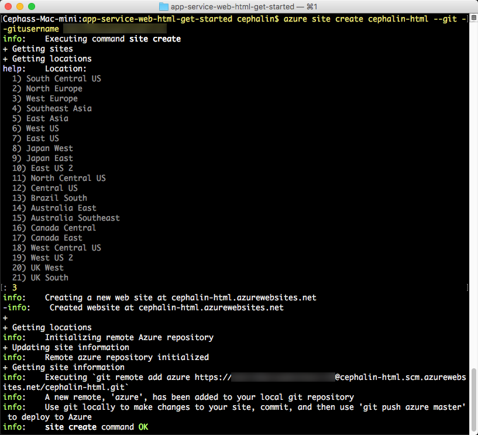
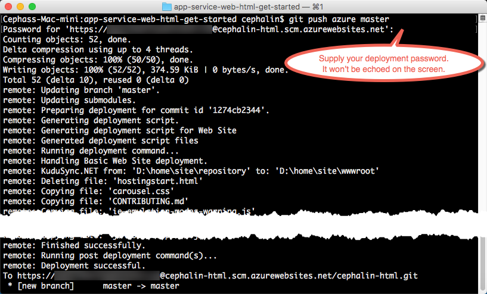

<properties
    pageTitle="在 5 分钟内将第一个 Web 应用部署到 Azure | Azure"
    description="了解如何部署示例应用，轻松地在应用服务中运行 Web 应用。快速进行实际的开发，立即查看结果。"
    services="app-service\web"
    documentationcenter=""
    author="cephalin"
    manager="wpickett"
    editor="" />  

<tags
    ms.assetid="65c9bdd9-8763-4c56-8e15-f790992e951e"
    ms.service="app-service-web"
    ms.workload="web"
    ms.tgt_pltfrm="na"
    ms.devlang="na"
    ms.topic="hero-article"
    ms.date="01/04/2017"
    wacn.date="03/01/2017"
    ms.author="cephalin" />  

# 在 5 分钟内将第一个 Web 应用部署到 Azure
本教程帮助用户将第一个 Web 应用部署到 [Azure App Service](/documentation/articles/app-service-value-prop-what-is/)。应用服务可用于创建 Web 应用、[移动应用后端](/documentation/services/app-service/mobile/)和 [API 应用](/documentation/articles/app-service-api-apps-why-best-platform/)。

用户将能够：

* 在 Azure App Service 中创建 Web 应用。
* 部署示例代码（选择 ASP.NET、PHP、Node.js、Java 或 Python）。
* 查看代码在生产环境中的实时运行。
* 以[推送 Git 提交](https://git-scm.com/docs/git-push)的相同方式来更新 Web 应用。

## 用于完成任务的 CLI 版本

可使用以下 CLI 版本之一完成任务：

- [Azure CLI 1.0](/documentation/articles/app-service-web-get-started-cli-nodejs/)：用于经典部署模型和资源管理部署模型的 CLI
- [Azure CLI 2.0（预览版）](/documentation/articles/app-service-web-get-started/)：用于资源管理部署模型的下一代 CLI

## 先决条件
* [Git](http://www.git-scm.com/downloads)。
* [Azure CLI](/documentation/articles/xplat-cli-install/)。
* 一个 Azure 帐户。如果你没有帐户，可以[注册试用版](/pricing/1rmb-trial/?WT.mc_id=A261C142F)。

## 部署 Web 应用
让我们将 Web 应用部署到 Azure App Service。

1. 打开新的 Windows 命令提示符、PowerShell 窗口、Linux shell 或 OS X 终端。运行 `git --version` 和 `azure --version`，验证计算机上是否已安装 Git 和 Azure CLI。
   
    
   
    如果尚未安装这些工具，请参阅[先决条件](#Prerequisites)中的下载链接。
2. 如下所示登录 Azure ：
   
        azure login -e AzureChinaCloud
   
    按照帮助消息的提示继续此登录过程。
   
      

3. 将 Azure CLI 更改为 ASM 模式，然后设置应用服务的部署用户。稍后使用凭据部署代码。
   
        azure config mode asm
        azure site deployment user set --username <username> --pass <password>

4. 切换到工作目录 (`CD`) 并克隆示例应用，如下所示：
   
        git clone <github_sample_url>
   
      

   
    对于 *&lt;github\_sample\_url>* ，请使用以下 URL 中的一个，具体视所需的框架而定：
   
    * HTML+CSS+JS：[https://github.com/Azure-Samples/app-service-web-html-get-started.git](https://github.com/Azure-Samples/app-service-web-html-get-started.git)
    * ASP.NET：[https://github.com/Azure-Samples/app-service-web-dotnet-get-started.git](https://github.com/Azure-Samples/app-service-web-dotnet-get-started.git)
    * PHP (CodeIgniter)：[https://github.com/Azure-Samples/app-service-web-php-get-started.git](https://github.com/Azure-Samples/app-service-web-php-get-started.git)
    * Node.js (Express)：[https://github.com/Azure-Samples/app-service-web-nodejs-get-started.git](https://github.com/Azure-Samples/app-service-web-nodejs-get-started.git)
    * Java：[https://github.com/Azure-Samples/app-service-web-java-get-started.git](https://github.com/Azure-Samples/app-service-web-java-get-started.git)
    * Python (Django)：[https://github.com/Azure-Samples/app-service-web-python-get-started.git](https://github.com/Azure-Samples/app-service-web-python-get-started.git)

5. 更改为示例应用的存储库。例如：
   
        cd app-service-web-html-get-started

6. 在 Azure 中创建具有唯一应用名称及之前配置的部署用户的应用服务应用资源。出现提示时，指定所需的区域数目。
   
        azure site create <app_name> --git --gitusername <username>
   
      

   
    现在已在 Azure 中创建应用。而且当前的目录也已进行 Git 初始化并作为 Git 远程连接到新的 App Service 应用。可以浏览到应用的 URL (http://&lt;app_name>.chinacloudsites.cn) 查看优雅的默认 HTML 页面，不过现在要做的是真正获取自己的代码。

7. 像使用 Git 推送任何代码一样，将示例代码部署到 Azure 应用。出现提示时，使用之前配置的密码。
   
        git push azure master
   
      

   
    如果使用了某种语言框架，看到的输出会不同。`git push` 不仅将代码放在 Azure 中，也在部署引擎中触发部署任务。如果项目（存储库）根目录中存在 package.json (Node.js) 或 requirements.txt (Python) 文件，或者 ASP.NET 项目中存在 packages.config 文件，部署脚本会还原所需的包。另外，还可以[启用编辑器扩展](/documentation/articles/web-sites-php-mysql-deploy-use-git/#composer)，以在 PHP 应用中自动处理 composer.json 文件。

恭喜！应用已部署到 Azure App Service。

## 查看应用实时运行
若要查看 Azure 中实时运行的应用，请从存储库中的任何目录运行以下命令：

    azure site browse

## 更新应用
现在可以使用 Git 随时从项目（存储库）根目录进行推送，以更新实时站点。操作方式与首次部署代码时相同。例如，每次想要推送已在本地测试的新更改时，只需从项目（存储库）根目录运行以下命令：

    git add .
    git commit -m "<your_message>"
    git push azure master

## 后续步骤
查找语言框架的首选开发和部署步骤：
> [AZURE.SELECTOR]
- [.NET](/documentation/articles/web-sites-dotnet-get-started/)
- [PHP](/documentation/articles/app-service-web-php-get-started/)
- [Node.js](/documentation/articles/app-service-web-nodejs-get-started/)
- [Python](/documentation/articles/web-sites-python-ptvs-django-mysql/)
- [Java](/documentation/articles/web-sites-java-get-started/)

或者，对第一个 Web 应用执行更多操作。例如：

* 尝试[将代码部署到 Azure 的其他方法](/documentation/articles/web-sites-deploy/)。
* 使 Azure 应用上升到更高的层次。对用户进行身份验证。按需缩放。设置一些性能警报。所有这些操作只需按几下鼠标即可完成。请参阅[在第一个 Web 应用中添加功能](/documentation/articles/app-service-web-get-started-2/)。

<!---HONumber=Mooncake_1226_2016-->