<properties
    pageTitle="在 Azure 中不到 5 分钟创建你的第一个 ASP.NET Web 应用 | Azure"
    description="了解如何通过部署一个简单的 ASP.NET 应用程序，轻松在应用服务中运行 Web 应用。"
    services="app-service\web"
    documentationcenter=""
    author="cephalin"
    manager="wpickett"
    editor=""
    translationtype="Human Translation" />
<tags
    ms.assetid="b1e6bd58-48d1-4007-9d6c-53fd6db061e3"
    ms.service="app-service-web"
    ms.workload="web"
    ms.tgt_pltfrm="na"
    ms.devlang="na"
    ms.topic="hero-article"
    ms.date="03/27/2017"
    wacn.date="05/02/2017"
    ms.author="cephalin"
    ms.sourcegitcommit="78da854d58905bc82228bcbff1de0fcfbc12d5ac"
    ms.openlocfilehash="19ca3a66248c4e79a953293582e5e345da215b7f"
    ms.lasthandoff="04/22/2017" />

# 在 Azure 中不到 5 分钟创建你的第一个 ASP.NET Web 应用

[AZURE.INCLUDE [app-service-web-selector-get-started](../../includes/app-service-web-selector-get-started.md)] 

本快速入门帮助你在数分钟内将你的第一个 ASP.NET Web 应用部署到 [Azure 应用服务](/documentation/articles/app-service-value-prop-what-is/)。 完成本教程后，你将能够在云中启动并运行一个简单的 Web 应用。

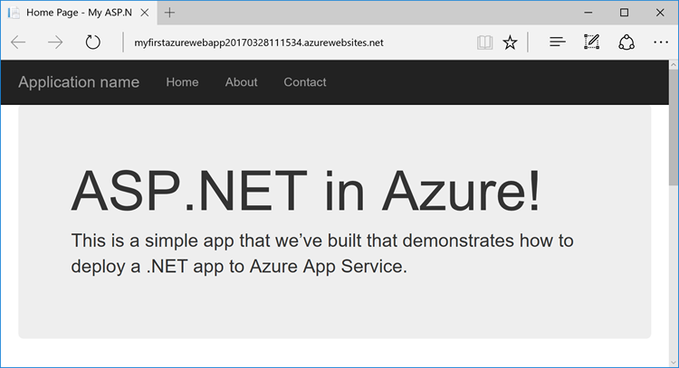

## 开始之前

本教程演示如何使用 Visual Studio 2017 构建 ASP.NET Web 应用并将其部署到 Azure。 如果尚未安装 Visual Studio 2017，可以下载并使用**免费的** [Visual Studio 2017 Community Edition](https://www.visualstudio.com/zh-cn/downloads/)。 在安装 Visual Studio 的过程中，请确保启用“Azure 开发”。

[AZURE.INCLUDE [quickstarts-free-trial-note](../../includes/quickstarts-free-trial-note.md)]

## 创建 ASP.NET Web 应用

在 Visual Studio 中，使用 `Ctrl`+`Shift`+`N` 创建新项目。

在“新建项目”对话框中，单击“Visual C#”>“Web”>“ASP.NET Web 应用程序(.NET Framework)”。

将应用程序命名为 **myFirstAzureWebApp**，然后单击“确定”。

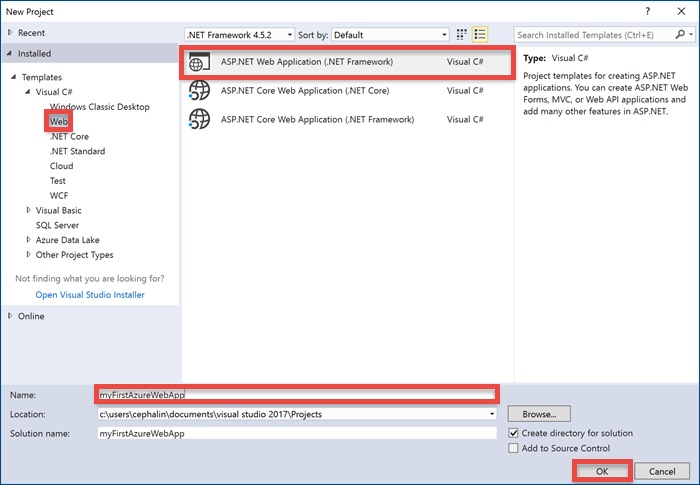

可将任何类型的 ASP.NET Web 应用部署到 Azure。 在本教程中，请选择“MVC”模板，并确保将身份验证设置为“无身份验证”。

单击 **“确定”**。

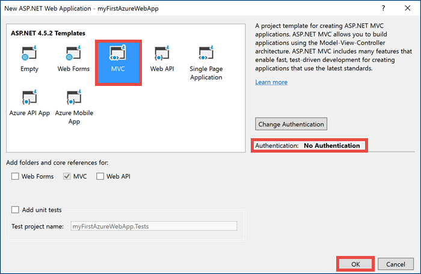

## 发布到 Azure

在“解决方案资源管理器”中右键单击“myFirstAzureWebApp”项目，然后选择“发布”。

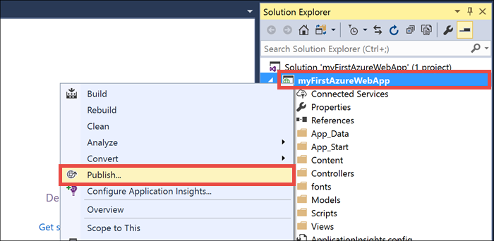

确保已选择“Azure 应用服务”，然后单击“发布”。

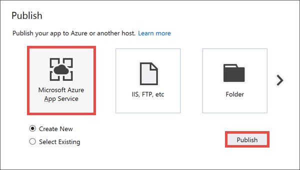

此时将打开“创建应用服务”对话框，帮助你创建所需的所有 Azure 资源，以便在 Azure 中运行 ASP.NET Web 应用。

## 登录 Azure

[AZURE.INCLUDE [azure-visual-studio-login-guide](../../includes/azure-visual-studio-login-guide.md)]

在“创建应用服务”对话框中单击“添加帐户”，然后登录到你的 Azure 订阅。 如果已登录到 Azure 帐户，请确保该帐户包含你的 Azure 订阅。

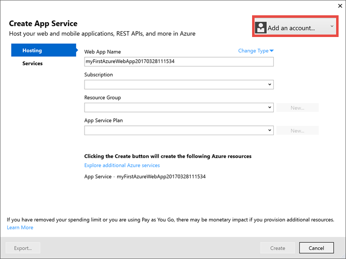

登录后，可在此对话框中创建 Azure Web 应用所需的所有资源。

## 创建资源组

首先需要一个_资源组_。 

> [AZURE.NOTE] 
> 资源组是在其中部署和管理 Azure 资源（例如 Web 应用、数据库和存储帐户）的逻辑容器。
>
>

在“资源组”旁边单击“新建”。

将资源组命名为 **myResourceGroup**，然后单击“确定”。

## 创建应用服务计划

Azure Web 应用还需要一个 _应用服务计划_ 。 

> [AZURE.NOTE]
> 应用服务计划表示用于托管应用的物理资源集合。 分配到应用服务计划的所有应用将共享该计划定义的资源，在托管多个应用时可以节省成本。 
>  
> 应用服务计划定义：
>
 - 区域（中国北部、中国东部）
>
 - 实例大小（小、中、大）
>
 - 规模计数（一个、两个、三个实例，等等） 
>
 - SKU（免费、共享、基本、标准、高级）
>
>

在“应用服务计划”旁边单击“新建”。 

在“配置应用服务计划”对话框中，使用以下设置配置新的应用服务计划：

- **应用服务计划**：键入 **myAppServicePlan**。 
- **位置**：选择“中国北部”或想要使用的其他任何区域。
- **大小**：选择“免费”或想要使用的其他任何[定价层](/pricing/details/app-service/)。

单击 **“确定”**。

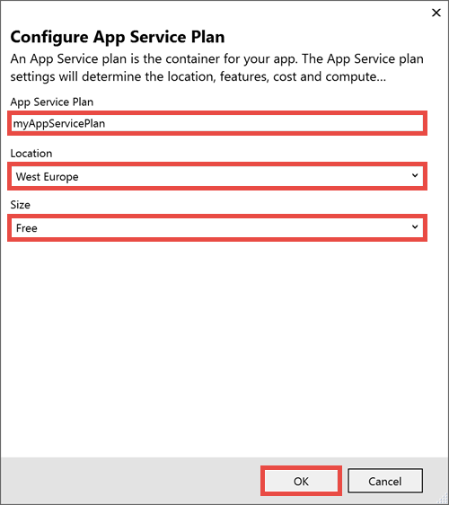

## 创建并发布 Web 应用

现在唯一要做的就是为 Web 应用命名。 在“Web 应用名称”中键入唯一的应用名称。 此名称将用作应用 (`<app_name>.chinacloudsites.cn`) 的默认 DNS 名称的一部分，因此，需要在 Azure 中的所有应用之间保持唯一。 稍后，可以先将自定义域名映射到应用，然后向用户公开该域名。

也可以接受自动生成的名称，这已是一个唯一的名称。

单击“创建”开始创建 Azure 资源。

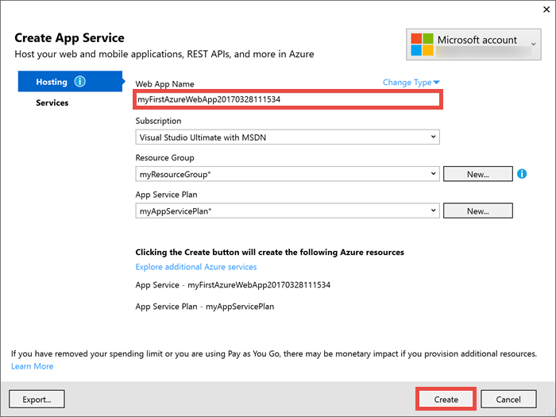

向导完成创建 Azure 资源后，会自动将 ASP.NET Web 应用发布到 Azure（首次发布），然后在默认浏览器中启动发布的 Azure Web 应用。

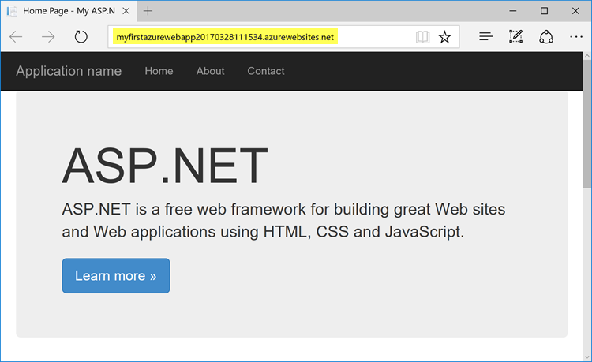

URL 使用前面指定的 Web 应用名称，其格式为 `http://<app_name>.chinacloudsites.cn`。 

恭喜，你的第一个 ASP.NET Web 应用已在 Azure 应用服务中实时运行！

## 更新应用并重新部署

将更新重新部署到 Azure 的过程非常简单。 让我们对主页进行更新。

在“解决方案资源管理器”中打开“Views\Home\Index.cshtml”。

在顶部附近找到 `
` HTML 标记，将整个标记替换为以下代码：

    

        <h1>ASP.NET in Azure!</h1>
        
This is a simple app that we've built that demonstrates how to deploy a .NET app to Azure App Service.

    

若要重新部署到 Azure，请在“解决方案资源管理器”中右键单击“myFirstAzureWebApp”项目，然后选择“发布”。

在发布页中单击“发布”。

完成 Visual Studio 中的操作后，将在浏览器中启动更新的 Azure Web 应用。

## 管理新 Azure Web 应用

转到 Azure 门户，查看刚刚创建的 Web 应用。 

为此，请登录到 [https://portal.azure.cn](https://portal.azure.cn)。

从左侧菜单中单击“应用服务”，然后单击 Azure Web 应用的名称。

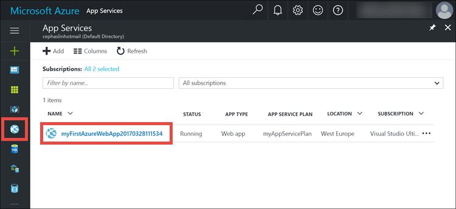

现已进入 Web 应用的_边栏选项卡_（水平打开的门户页）。 

默认情况下，Web 应用的边栏选项卡显示“概述”页。 在此页中可以查看应用的运行状况。 在此处还可以执行基本的管理任务，例如浏览、停止、启动、重新启动和删除。 边栏选项卡左侧的选项卡显示可以打开的不同配置页。 

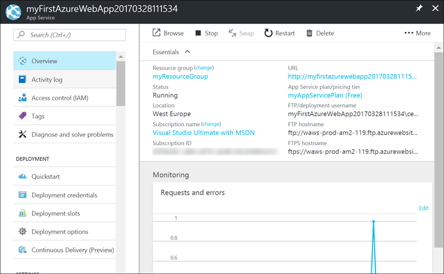

边栏选项卡中的这些选项卡显示了可添加到 Web 应用的许多强大功能。 以下列表只是列出了一部分可用的功能：

- 映射自定义 DNS 名称
- 绑定自定义 SSL 证书
- 配置持续部署
- 扩展和缩减
- 添加用户身份验证

## 清理资源

若要删除第一个 Azure Web 应用，可以单击“概述”页中的“删除”。 但是，还可以通过一种更好的方法来删除在本快速入门教程中创建的任何内容。 在 Web 应用的“概述”页中，单击资源组打开其边栏选项卡。 

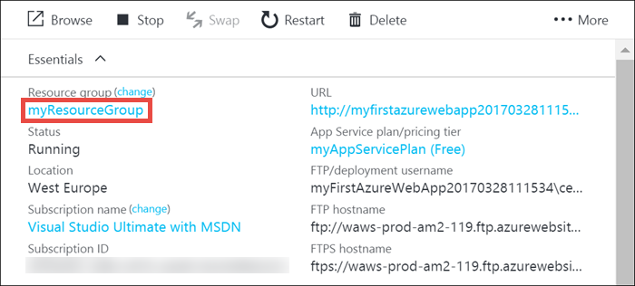

在资源组边栏选项卡中，可以看到 Visual Studio 为你创建的应用服务计划和应用服务应用。 

在边栏选项卡的顶部单击“删除”。 

<!--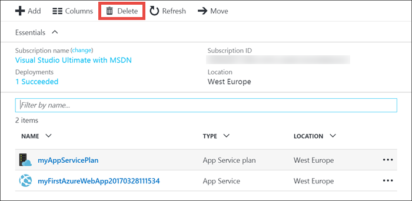-->

在确认边栏选项卡上的文本框中键入资源组名称 **myResourceGroup** 确认删除，然后单击“删除”。

## 后续步骤

浏览预先创建的 [Web 应用 PowerShell 脚本](/documentation/articles/app-service-powershell-samples/)。

<!--Update_Description: instead of using CLI, use portal and Visual Studio-->