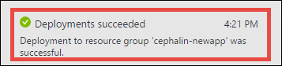

<properties
    pageTitle="在 5 分钟内将第一个 Java Web 应用部署到 Azure（CLI 2.0 预览版）| Azure"
    description="了解如何部署示例应用，轻松地在应用服务中运行 Web 应用。快速进行实际的开发，立即查看结果。"
    services="app-service\web"
    documentationcenter=""
    author="cephalin"
    manager="wpickett"
    editor="" />
<tags
    ms.assetid="8bacfe3e-7f0b-4394-959a-a88618cb31e1"
    ms.service="app-service-web"
    ms.workload="web"
    ms.tgt_pltfrm="na"
    ms.devlang="na"
    ms.topic="hero-article"
    ms.date="01/04/2017"
    wacn.date="02/10/2017"
    ms.author="cephalin" />  

# 在 5 分钟内将第一个 Java Web 应用部署到 Azure（CLI 2.0 预览版）
> [AZURE.SELECTOR]
- [第一个 HTML 站点](/documentation/articles/app-service-web-get-started-html-cli-nodejs/)
- [第一个 .NET 应用](/documentation/articles/app-service-web-get-started-dotnet-cli-nodejs/)
- [第一个 PHP 应用](/documentation/articles/app-service-web-get-started-php-cli-nodejs/)
- [第一个 Node.js 应用](/documentation/articles/app-service-web-get-started-nodejs-cli-nodejs/)
- [第一个 Python 应用](/documentation/articles/app-service-web-get-started-python-cli-nodejs/)
- [第一个 Java 应用](/documentation/articles/app-service-web-get-started-java/)

本教程旨在帮助用户将一个简单的 Java Web 应用部署到 [Azure App Service](/documentation/articles/app-service-value-prop-what-is/)。应用服务可用于创建 Web 应用、[移动应用后端](/documentation/services/app-service/mobile/)和 [API 应用](/documentation/articles/app-service-api-apps-why-best-platform/)。

用户将能够：

* 在 Azure App Service 中创建 Web 应用。
* 部署示例 Java 应用。
* 查看代码在生产环境中的实时运行。

## 先决条件
* 获取 FTP/FTPS 客户端，如 [FileZilla](https://filezilla-project.org/)。
* 获取 Azure 帐户。如果你没有帐户，可以[注册试用版](/pricing/1rmb-trial/?WT.mc_id=A261C142F)。

##  创建 Web 应用
1. 使用 Azure 帐户登录到 [Azure 门户预览](https://portal.azure.cn)。
2. 在左侧菜单中，单击“新建”>“Web + 移动”>“Web 应用”。
   
      

3. 在应用创建边栏选项卡中，对新应用使用以下设置：
   
    * **应用名称**：键入唯一名称。
    * **资源组**：选择“新建”，为资源组指定名称。
    * **应用服务计划/位置**：单击进行配置，然后单击“新建”，设置应用服务计划的名称、位置和定价层。可随意使用“免费”定价层。
     
     完成后，应用创建边栏选项卡如下所示：
     
       

4. 单击底部的“创建”。可以单击顶部的“通知”图标，查看进度。
   
      

5. 完成部署后，会看到此通知消息。单击该消息可打开部署的边栏选项卡。
   
      

6. 在“成功的部署”边栏选项卡中，单击“资源”链接，打开新 Web 应用的边栏选项卡。
   
      

## 将 Java 应用部署到 Web 应用
接下来，使用 FTPS 将 Java 应用部署到 Azure。

1. 在 Web 应用边栏选项卡中，向下滚动到“应用程序设置”或进行搜索，然后单击。
   
      

2. 在“Java 版本”中，选择“Java 8”，单击“保存”。
   
      

    收到“已成功更新 Web 应用设置”通知时，导航到 http://*&lt;appname>*.chinacloudsites.cn，查看默认 JSP servlet 的效果。
1. 登录到 [Azure 经典管理门户](https://manage.windowsazure.cn/)，找到你的应用，然后单击“速览”下的“仪表板”>“重置部署凭据”，为应用设置部署凭据。
5. 返回到 [Azure 门户预览](https://portal.azure.cn)，单击“概述”。单击“FTP/部署用户名”和“FTPS 主机名”旁的“复制”按钮，复制这些值。
   
      

    现在可以使用 FTPS 部署 Java 应用了。
6. 在 FTP/FTPS 客户端中，使用上一步中复制的值，登录到 Azure Web 应用的 FTP 服务器。使用之前创建的部署密码。
   
    以下屏幕截图显示的是使用 FileZilla 进行登录。
   
      

    可能会看到 Azure 无法识别 SSL 证书的安全警告。继续。
7. 单击[此链接](https://github.com/Azure-Samples/app-service-web-java-get-started/raw/master/webapps/ROOT.war)，将 WAR 文件下载到本地计算机。
8. 在 FTP/FTPS 客户端中，导航到远程站点的 **/site/wwwroot/webapps**，将下载到本机计算机中的 WAR 文件拖到该远程目录。
   
      

    单击“确定”，覆盖 Azure 中的文件。
   
    > [AZURE.NOTE]
    根据 Tomcat 的默认行为，/site/wwwroot/webapps 中的文件名 **ROOT.war** 提供根 Web 应用 (http://*&lt;appname>*.chinacloudsites.cn)，文件名 ***&lt;anyname>*.war** 提供命名 Web 应用 (http://*&lt;appname>*.chinacloudsites.cn/*&lt;anyname>*)。
    > 
    > 

就这么简单！ 代码现在已在 Azure 中实时运行。在浏览器中，导航到 http://*&lt;appname>*.chinacloudsites.cn，查看效果。

## 更新应用
需要更新时，只需将新的 WAR 文件上传到 FTP/FTPS 客户端中的同一个远程目录。

## 后续步骤
* 尝试[将代码部署到 Azure 的其他方法](/documentation/articles/web-sites-deploy/)。
* 使 Azure 应用上升到更高的层次。对用户进行身份验证。按需缩放。设置一些性能警报。所有这些操作只需按几下鼠标即可完成。请参阅[在第一个 Web 应用中添加功能](/documentation/articles/app-service-web-get-started-2/)。

<!---HONumber=Mooncake_0206_2017-->
<!--Update_Description: change for azure cli to azure cli 2.0-->