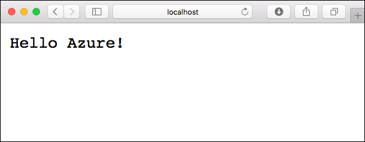
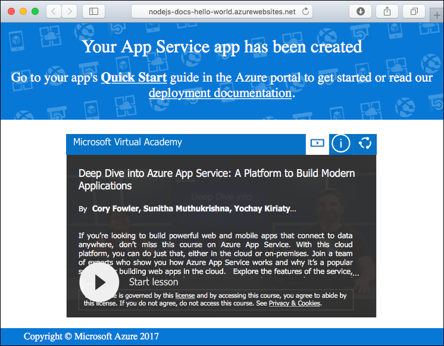
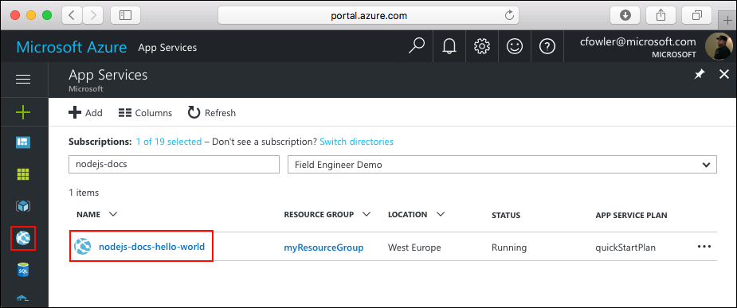
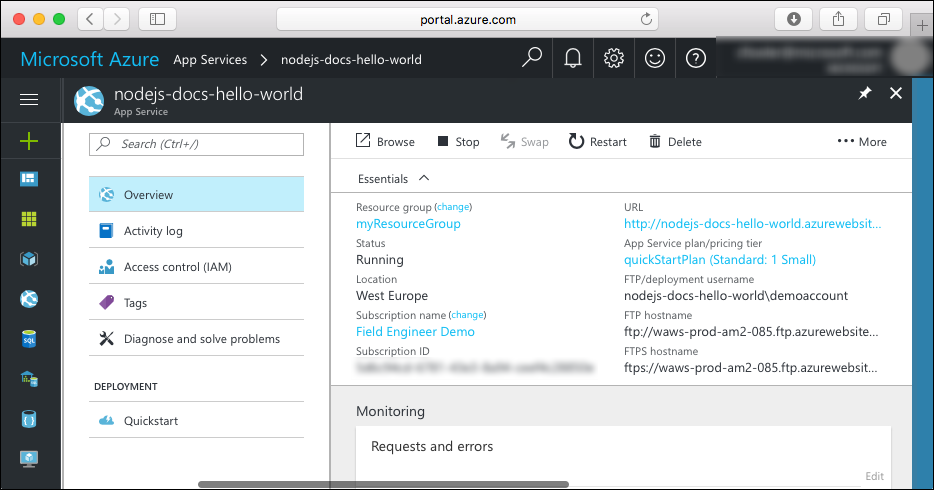

<properties
    pageTitle="在 Web 应用中创建 Node.js 应用程序 | Azure"
    description="在应用服务 Web 应用中快速部署第一个 Node.js Hello World 应用。"
    services="app-service\web"
    documentationcenter=""
    author="syntaxc4"
    manager="erikre"
    editor=""
    translationtype="Human Translation" />
<tags
    ms.assetid="582bb3c2-164b-42f5-b081-95bfcb7a502a"
    ms.service="app-service-web"
    ms.workload="web"
    ms.tgt_pltfrm="na"
    ms.devlang="na"
    ms.topic="hero-article"
    ms.date="03/28/2017"
    wacn.date="05/02/2017"
    ms.author="cfowler"
    ms.sourcegitcommit="78da854d58905bc82228bcbff1de0fcfbc12d5ac"
    ms.openlocfilehash="0369acfa64206d556f5d83942a47a84233c9c0b8"
    ms.lasthandoff="04/22/2017" />

# 在 Web 应用中创建 Node.js 应用程序

本快速入门教程逐步讲解如何开发 Node.js 应用并将其部署到 Azure。 我们将使用基于 Linux 的 Azure 应用服务运行该应用，再使用 Azure CLI 在其中创建并配置一个新的 Web 应用。 然后，我们使用 git 将该 Node.js 应用部署到 Azure。

可以在 Mac、Windows 或 Linux 计算机上遵循以下步骤。 大约 5 分钟内应可完成下面的所有步骤。

## 开始之前

运行本示例之前，请在本地安装以下必备组件：

1. [下载并安装 git](https://git-scm.com/)
1. [下载并安装 Node.js 和 NPM](https://nodejs.org/)
1. 下载并安装 [Azure CLI 2.0](https://docs.microsoft.com/zh-cn/cli/azure/install-azure-cli)

[AZURE.INCLUDE [quickstarts-free-trial-note](../../includes/quickstarts-free-trial-note.md)]

## 下载示例

将 Hello World 示例应用存储库克隆到本地计算机。

    git clone https://github.com/Azure-Samples/nodejs-docs-hello-world

> [AZURE.TIP]
> 此外，也可以[下载示例](https://github.com/Azure-Samples/nodejs-docs-hello-world/archive/master.zip) zip 文件并将其解压缩。

切换到包含示例代码的目录。

    cd nodejs-docs-hello-world

## 在本地运行应用

打开一个终端窗口并使用针对该示例的 `npm start` 脚本启动内置的 Node.js http 服务器，在本地运行该应用程序。

    npm start

打开 Web 浏览器并导航到该示例。

    http://localhost:1337

页面中会显示该示例应用发出的 **Hello World** 消息。

在终端窗口中，按 **Ctrl+C** 退出 Web 服务器。

## 登录 Azure

现在，我们将在终端窗口中使用 Azure CLI 2.0 创建所需的资源用于在 Azure 中托管该 Node.js 应用。 使用 [az login](https://docs.microsoft.com/zh-cn/cli/azure/#login) 命令登录到 Azure 订阅，并按照屏幕上的说明进行操作。

    az login

[AZURE.INCLUDE [azure-cli-2-azurechinacloud-environment-parameter](../../includes/azure-cli-2-azurechinacloud-environment-parameter.md)]

## 配置部署用户

对于 FTP 和本地 Git 部署，需在服务器上配置一个部署用户，用于对部署进行身份验证。 创建部署用户是一次性的配置。请记下用户名和密码，因为要在下面的步骤中用到。

> [AZURE.NOTE]
> 在 Web 应用中进行 FTP 和本地 Git 部署时需要一个部署用户。
> `username` 和 `password` 是帐户级别的凭据，因此不同于 Azure 订阅凭据。 只需创建这些凭据一次。
>

使用 [az appservice web deployment user set](https://docs.microsoft.com/zh-cn/cli/azure/appservice/web/deployment/user#set) 命令创建帐户级别的凭据。

    az appservice web deployment user set --user-name <username> --password <password>

## 创建资源组

使用 [az group create](https://docs.microsoft.com/zh-cn/cli/azure/group#create) 创建资源组。 Azure 资源组是在其中部署和管理 Azure 资源（例如 Web 应用、数据库和存储帐户）的逻辑容器。

    az group create --name myResourceGroup --location chinanorth

## 创建 Azure 应用服务

使用 [az appservice plan create](https://docs.microsoft.com/zh-cn/cli/azure/appservice/plan#create) 命令创建基于 Linux 的应用服务计划。

> [AZURE.NOTE]
> 应用服务计划表示用于托管应用的物理资源集合。 分配到应用服务计划的所有应用程序将共享该计划定义的资源，在托管多个应用时可以节省成本。
>  
> 应用服务计划定义：
>
 * 区域（中国北部、中国东部）
>
 * 实例大小（小、中、大）
>
 * 规模计数（一个、两个、三个实例，等等）
>
 * SKU（免费、共享、基本、标准、高级）
>

以下示例使用**标准**定价层在 Linux Workers 中创建名为 `quickStartPlan` 的应用服务计划。

    az appservice plan create --name quickStartPlan --resource-group myResourceGroup --sku S1 --is-linux

创建应用服务计划后，Azure CLI 将显示类似于以下示例的信息。

    {
        "id": "/subscriptions/00000000-0000-0000-0000-000000000000/resourceGroups/myResourceGroup/providers/Microsoft.Web/serverfarms/quickStartPlan",
        "kind": "linux",
        "location": "China North",
        "sku": {
        "capacity": 1,
        "family": "S",
        "name": "S1",
        "tier": "Standard"
        },
        "status": "Ready",
        "type": "Microsoft.Web/serverfarms"
    }

## 创建 Web 应用

创建应用服务计划后，请在 `quickStartPlan` 应用服务计划中创建 Web 应用。 该 Web 应用提供托管空间用于部署代码，并提供一个 URL 用于查看已部署的应用程序。 使用 [az appservice web create](https://docs.microsoft.com/zh-cn/cli/azure/appservice/web#create) 命令创建该 Web 应用。

在以下命令中，请将出现的 <app_name> 占位符替换为你自己的唯一应用名称。 <app_name> 将用作 Web 应用的默认 DNS 站点，因此，该名称需要在 Azure 中的所有应用之间保持唯一。 稍后，可以先将任何自定义 DNS 条目映射到 Web 应用，然后向用户公开该条目。

    az appservice web create --name <app_name> --resource-group myResourceGroup --plan quickStartPlan

创建 Web 应用后，Azure CLI 将显示类似于以下示例的信息。

    {
        "clientAffinityEnabled": true,
        "defaultHostName": "<app_name>.chinacloudsites.cn",
        "id": "/subscriptions/00000000-0000-0000-0000-000000000000/resourceGroups/myResourceGroup/providers/Microsoft.Web/sites/<app_name>",
        "isDefaultContainer": null,
        "kind": "app",
        "location": "China North",
        "name": "<app_name>",
        "repositorySiteName": "<app_name>",
        "reserved": true,
        "resourceGroup": "myResourceGroup",
        "serverFarmId": "/subscriptions/00000000-0000-0000-0000-000000000000/resourceGroups/myResourceGroup/providers/Microsoft.Web/serverfarms/quickStartPlan",
        "state": "Running",
        "type": "Microsoft.Web/sites",
    }

浏览到该站点查看新建的 Web 应用。

    http://<app_name>.chinacloudsites.cn

现在，我们已在 Azure 中创建一个空的新 Web 应用。 接下来，将 Web 应用配置为使用 Node.js 并将其部署到 Node.js 中。

## 配置为使用 Node.js

使用 [az appservice web config update](https://docs.microsoft.com/zh-cn/cli/azure/appservice/web/config#update) 命令将 Web 应用配置为使用 Node.js 版本 `6.9.3`。

> [AZURE.TIP]
> 以这种方式设置 Node.js 版本会使用平台提供的默认容器。如果你想要使用自己的容器，请参阅 [az appservice web config container update](https://docs.microsoft.com/zh-cn/cli/azure/appservice/web/config/container#update) 命令的 CLI 参考文章。

    az appservice web config update --linux-fx-version "NODE|6.9.3" --startup-file process.json --name <app_name> --resource-group myResourceGroup

## 配置本地 Git 部署

可以通过不同的方法部署到 Web 应用，包括 FTP、本地 Git，以及 GitHub、Visual Studio Team Services 和 Bitbucket。

使用 [az appservice web source-control config-local-git](https://docs.microsoft.com/zh-cn/cli/azure/appservice/web/source-control#config-local-git) 命令配置对 Web 应用的本地 git 访问。

    az appservice web source-control config-local-git --name <app_name> --resource-group myResourceGroup --query url --output tsv

复制终端的输出，因为下一步骤将要用到。

    https://<username>@<app_name>.scm.chinacloudsites.cn:443/<app_name>.git

## 从 Git 推送到 Azure

将 Azure 远程功能添加到本地 Git 存储库。

    git remote add azure <paste-previous-command-output-here>

推送到 Azure 远程功能以部署应用程序。 系统将提示你输入前面在创建部署用户期间提供的密码。

    git push azure master

在部署期间，Azure 应用服务会向 Git 告知其进度。

    Counting objects: 23, done.
    Delta compression using up to 4 threads.
    Compressing objects: 100% (21/21), done.
    Writing objects: 100% (23/23), 3.71 KiB | 0 bytes/s, done.
    Total 23 (delta 8), reused 7 (delta 1)
    remote: Updating branch 'master'.
    remote: Updating submodules.
    remote: Preparing deployment for commit id 'bf114df591'.
    remote: Generating deployment script.
    remote: Generating deployment script for node.js Web Site
    remote: Generated deployment script files
    remote: Running deployment command...
    remote: Handling node.js deployment.
    remote: Kudu sync from: '/home/site/repository' to: '/home/site/wwwroot'
    remote: Copying file: '.gitignore'
    remote: Copying file: 'LICENSE'
    remote: Copying file: 'README.md'
    remote: Copying file: 'index.js'
    remote: Copying file: 'package.json'
    remote: Copying file: 'process.json'
    remote: Deleting file: 'hostingstart.html'
    remote: Ignoring: .git
    remote: Using start-up script index.js from package.json.
    remote: Node.js versions available on the platform are: 4.4.7, 4.5.0, 6.2.2, 6.6.0, 6.9.1.
    remote: Selected node.js version 6.9.1. Use package.json file to choose a different version.
    remote: Selected npm version 3.10.8
    remote: Finished successfully.
    remote: Running post deployment command(s)...
    remote: Deployment successful.
    To https://<app_name>.scm.chinacloudsites.cn:443/<app_name>.git
     * [new branch]      master -> master

## 浏览到应用

使用 Web 浏览器浏览到已部署的应用程序。

    http://<app_name>.chinacloudsites.cn

此时，显示 Hello World 消息的页面正在使用作为 Azure 应用服务 Web 应用运行的 Node.js 代码运行。

## 更新和部署代码

使用本地文本编辑器打开 Node.js 应用中的 `index.js` 文件，然后对 `response.end` 调用中的文本稍微进行更改：

    response.end("Hello Azure!");

提交在 git 中所做的更改，然后将代码更改推送到 Azure。

    git commit -am "updated output"
    git push azure master

完成部署后，切换回在“浏览到应用步骤”中打开的浏览器窗口，然后点击“刷新”。

## 管理新 Azure Web 应用

转到 Azure 门户预览，查看刚刚创建的 Web 应用。

为此，请登录到 [https://portal.azure.cn](https://portal.azure.cn)。

从左侧菜单中单击“应用服务”，然后单击 Azure Web 应用的名称。

现已进入 Web 应用的_边栏选项卡_（水平打开的门户页）。

默认情况下，Web 应用的边栏选项卡显示“概述”页。 在此页中可以查看应用的运行状况。 在此处还可以执行基本的管理任务，例如浏览、停止、启动、重新启动和删除。 边栏选项卡左侧的选项卡显示可以打开的不同配置页。

边栏选项卡中的这些选项卡显示了可添加到 Web 应用的许多强大功能。 以下列表只是列出了一部分可用的功能：

* 映射自定义 DNS 名称
* 绑定自定义 SSL 证书
* 配置持续部署
* 扩展和缩减
* 添加用户身份验证

**祝贺你！** 现已将第一个 Node.js 应用部署到应用服务。

[AZURE.INCLUDE [cli-samples-clean-up](../../includes/cli-samples-clean-up.md)]

## 后续步骤

浏览预先创建的 [Web 应用 CLI 脚本](/documentation/articles/app-service-cli-samples/)。

<!--Update_Description: adding details of each step-->