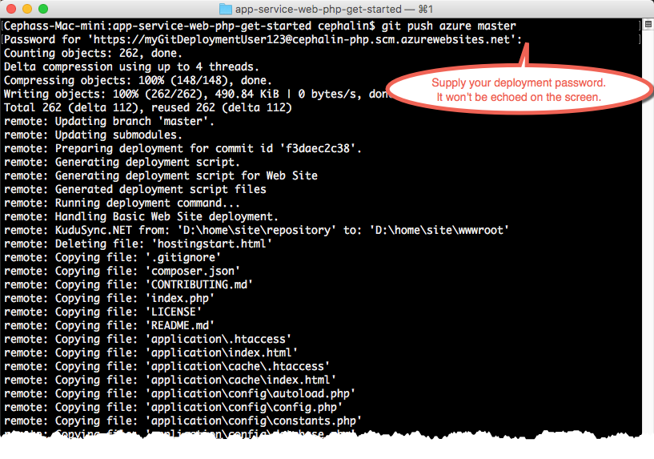

<properties 
	pageTitle="在 5 分钟内将第一个 PHP Web 应用部署到 Azure | Azure" 
	description="了解如何部署示例应用，轻松地在应用服务中运行 Web 应用。快速进行实际的开发，立即查看结果。" 
	services="app-service\web"
	documentationCenter=""
	authors="cephalin"
	manager="wpickett"
	editor=""
/>  

<tags
	ms.service="app-service-web"
	ms.workload="web"
	ms.tgt_pltfrm="na"
	ms.devlang="na"
	ms.topic="hero-article"
	ms.date="09/16/2016"
	wacn.date=“10/10/2016” 
	ms.author="cephalin"
/>  

	
# 在 5 分钟内将第一个 PHP Web 应用部署到 Azure

本教程旨在帮助用户将第一个 PHP Web 应用部署到 [Azure App Service](/documentation/articles/app-service-value-prop-what-is/)。应用服务可用于创建 Web 应用、[移动应用后端](/documentation/services/app-service/mobile/)和 [API 应用](/documentation/articles/app-service-api-apps-why-best-platform/)。

用户将能够：

- 在 Azure App Service 中创建 Web 应用。
- 部署示例 PHP 代码。
- 查看代码在生产环境中的实时运行。
- 以[推送 Git 提交](https://git-scm.com/docs/git-push)的相同方式来更新 Web 应用。

## 先决条件

- [安装 Git](http://www.git-scm.com/downloads)。从新的 Windows 命令提示符、PowerShell 窗口、Linux shell 或 OS X 终端，运行 `git --version`，验证安装是否成功。
- 获取 Azure 帐户。如果你没有帐户，可以[注册试用版](/pricing/1rmb-trial/?WT.mc_id=A261C142F)。

##  创建 Web 应用

1. 使用 Azure 帐户登录到 [Azure 门户预览](https://portal.azure.cn)。

2. 在左侧菜单中，单击“新建”>“Web + 移动”>“Web 应用”。

      

3. 在应用创建边栏选项卡中，对新应用使用以下设置：

    - **应用名称**：键入唯一名称。
    - **资源组**：选择“新建”，为资源组指定名称。
    - **应用服务计划/位置**：单击进行配置，然后单击“新建”，设置应用服务计划的名称、位置和定价层。可随意使用“免费”定价层。

    完成后，应用创建边栏选项卡如下所示：

      

3. 单击底部的“创建”。可以单击顶部的“通知”图标，查看进度。

      

4. 完成部署后，会看到此通知消息。单击该消息可打开部署的边栏选项卡。

      

5. 在“成功的部署”边栏选项卡中，单击“资源”链接，打开新 Web 应用的边栏选项卡。

      

## 将代码部署到 Web 应用

接下来，使用 Git 将一些代码部署到 Azure。

1. 使用以下 PowerShell 命令行设置“本地 Git 存储库”。

		$a = Get-AzureRmResource -ResourceId /subscriptions/<subscription id>/resourcegroups/<resource group name>/providers/Microsoft.Web/sites/<web app name>/Config/web -ApiVersion 2015-08-01

		$a.Properties.scmType = "LocalGit"

		Set-AzureRmResource -PropertyObject $a.Properties -ResourceId /subscriptions/<subscription id>/resourcegroups/<resource group name>/providers/Microsoft.Web/sites/<web app name>/Config/web -ApiVersion 2015-08-01

7. 返回 Azure 门户预览的 Web 应用边栏选项卡，单击“部署凭据”。

8. 设置部署凭据，单击“保存”。

7. 返回 Web 应用边栏选项卡，向下滚动到“属性”或进行搜索，然后单击。单击“Git URL”旁的“复制”按钮。

      

    现在可以使用 Git 部署代码了。

1. 在命令行终端，更改为工作目录 (`CD`)，复制如下所示的示例代码：

        git clone https://github.com/Azure-Samples/app-service-web-php-get-started.git

      

    对于 *&lt;github\_sample\_url>* ，请使用以下 URL 中的一个，具体视所需的框架而定：

2. 更改为示例应用的存储库。例如，

        cd app-service-web-html-get-started

3. 使用前几步从门户复制的 Git URL，为 Azure 应用配置 Git 远程。

        git remote add azure <giturlfromportal>

4. 像使用 Git 推送代码一样，将示例代码部署到 Azure 应用：

        git push azure master

      

    如果使用了某种语言框架，看到的输出将不同。这是因为，`git push` 不仅会将代码放在 Azure 中，还会在部署引擎中触发部署任务。如果项目（存储库）根目录中存在 package.json，部署脚本会还原所需的包。另外，还可以[启用编辑器扩展](/documentation/articles/web-sites-php-mysql-deploy-use-git/#composer)，以在 PHP 应用中自动处理 composer.json 文件。

就这么简单！ 代码现在已在 Azure 中实时运行。在浏览器中，导航到 http:// *&lt;appname>* .chinacloudsites.cn，查看效果。

## 更新应用

现在可以使用 Git 随时从项目（存储库）根目录进行推送，以更新实时站点。操作方式与首次部署代码时相同。例如，每次想要推送已在本地测试的新更改时，只需从项目（存储库）根目录运行以下命令：

    git add .
    git commit -m "<your_message>"
    git push azure master

## 后续步骤

[创建、配置 Laravel Web 应用，并将其部署到 Azure](/documentation/articles/app-service-web-php-get-started/)。通过学习本教程，可以了解在 Azure 中运行 PHP Web 应用所需的基本技能，如：

- 使用 PowerShell/Bash 在 Azure 中创建和配置应用。
- 设置 PHP 版本。
- 使用不在根应用程序目录中的开始文件。
- 实现 Commposer 自动化。
- 访问环境特定的变量。
- 排查常见错误。

或者，对第一个 Web 应用执行更多操作。例如：

- 尝试[将代码部署到 Azure 的其他方法](/documentation/articles/web-sites-deploy/)。
- 使 Azure 应用上升到更高的层次。对用户进行身份验证。按需缩放。设置一些性能警报。所有这些操作只需按几下鼠标即可完成。请参阅[在第一个 Web 应用中添加功能](/documentation/articles/app-service-web-get-started-2/)。

<!---HONumber=Mooncake_0926_2016-->