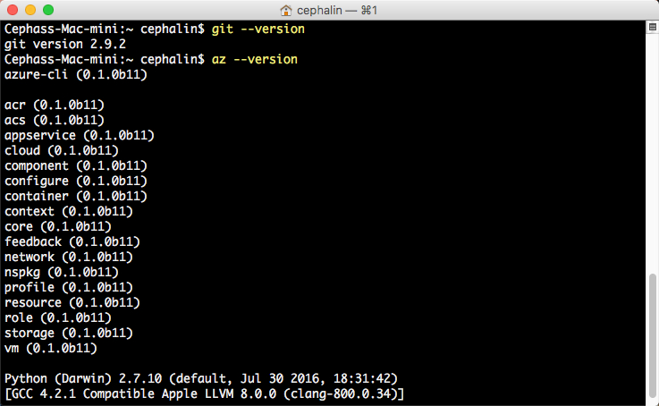
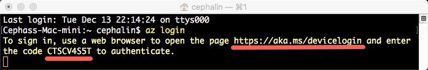
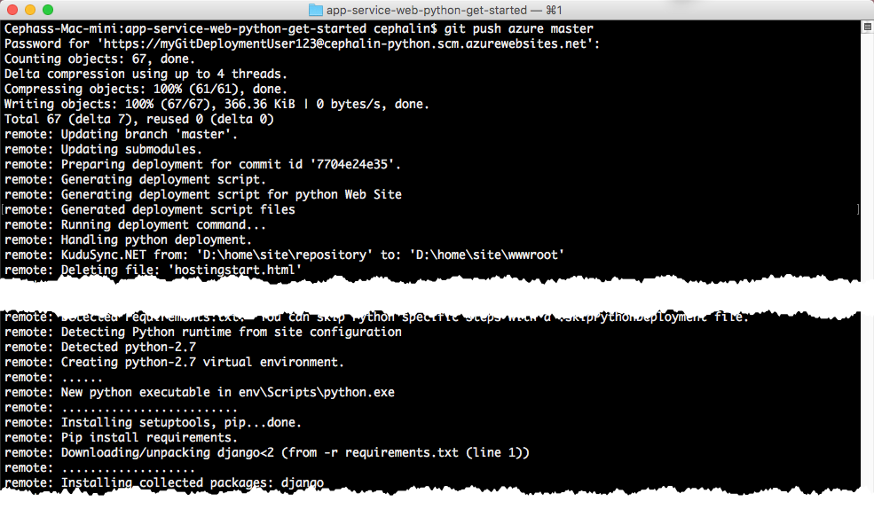

<properties
    pageTitle="在 5 分钟内将第一个 Python Web 应用部署到 Azure（CLI 2.0 预览版）| Azure"
    description="了解如何通过部署示例 Python 应用，轻松地在应用服务中运行 Web 应用。快速进行实际的开发，立即查看结果。"
    services="app-service\web"
    documentationcenter=""
    author="cephalin"
    manager="wpickett"
    editor="" />
<tags
    ms.assetid="928ee2e5-6143-4c0c-8546-366f5a3d80ce"
    ms.service="app-service-web"
    ms.workload="web"
    ms.tgt_pltfrm="na"
    ms.devlang="na"
    ms.topic="hero-article"
    ms.date="01/04/2017"
    wacn.date="02/10/2017"
    ms.author="cephalin" />  

# 在 5 分钟内将第一个 Python Web 应用部署到 Azure（CLI 2.0 预览版）
> [AZURE.SELECTOR]
- [第一个 HTML 站点](/documentation/articles/app-service-web-get-started-html/)
- [第一个 .NET 应用](/documentation/articles/app-service-web-get-started-dotnet/)
- [第一个 PHP 应用](/documentation/articles/app-service-web-get-started-php/)
- [第一个 Node.js 应用](/documentation/articles/app-service-web-get-started-nodejs/)
- [第一个 Python 应用](/documentation/articles/app-service-web-get-started-python/)
- [第一个 Java 应用](/documentation/articles/app-service-web-get-started-java/)

本教程旨在帮助用户将第一个 Python Web 应用部署到 [Azure App Service](/documentation/articles/app-service-value-prop-what-is/)。应用服务可用于创建 Web 应用、[移动应用后端](/documentation/services/app-service/mobile/)和 [API 应用](/documentation/articles/app-service-api-apps-why-best-platform/)。

用户将能够：

* 在 Azure App Service 中创建 Web 应用。
* 部署示例 Python 代码。
* 查看代码在生产环境中的实时运行。
* 以[推送 Git 提交](https://git-scm.com/docs/git-push)的相同方式来更新 Web 应用。

## 用于完成任务的 CLI 版本

可使用以下 CLI 版本之一完成任务：

- [Azure CLI 1.0](/documentation/articles/app-service-web-get-started-python-cli-nodejs/)：用于经典部署模型和资源管理部署模型的 CLI
- [Azure CLI 2.0（预览版）](/documentation/articles/app-service-web-get-started-python/)：用于资源管理部署模型的下一代 CLI

[AZURE.INCLUDE [azure-cli-2-azurechinacloud-environment-parameter](../../includes/azure-cli-2-azurechinacloud-environment-parameter.md)]

## 先决条件
* [Git](http://www.git-scm.com/downloads)。
* [Azure CLI 2.0 预览版](https://docs.microsoft.com/cli/azure/install-az-cli2)。
* 一个 Azure 帐户。如果你没有帐户，可以[注册试用版](/pricing/1rmb-trial/?WT.mc_id=A261C142F)。

## 部署 Python Web 应用
1. 打开新的 Windows 命令提示符、PowerShell 窗口、Linux shell 或 OS X 终端。运行 `git --version` 和 `azure --version`，验证计算机上是否已安装 Git 和 Azure CLI。
   
    
   
    如果尚未安装这些工具，请参阅[先决条件](#Prerequisites)中的下载链接。
2. 如下所示登录 Azure ：
   
        az login
   
    按照帮助消息的提示继续此登录过程。
   
      

3. 设置应用服务的部署用户。稍后会使用这些凭据部署代码。
   
        az appservice web deployment user set --user-name <username> --password <password>

3. 创建新的[资源组](/documentation/articles/resource-group-overview/)。对于第一个应用服务教程，不需要实际知道它是什么。

        az group create --location "<location>" --name my-first-app-group

    若要查看可用于 `<location>` 的可能值，请使用 `az appservice list-locations` CLI 命令。

3. 创建新的“免费”[应用服务计划](/documentation/articles/azure-web-sites-web-hosting-plans-in-depth-overview/)。对于第一个应用服务教程，只需知道不用为此计划中的 Web 应用付费即可。

        az appservice plan create --name my-free-appservice-plan --resource-group my-first-app-group --sku FREE

4. 使用 `<app_name>` 中的唯一名称创建新的 Web 应用。

        az appservice web create --name <app_name> --resource-group my-first-app-group --plan my-free-appservice-plan

4. 接下来，获取要部署的示例 Python 代码。切换到工作目录 (`CD`) 并克隆示例应用，如下所示：
   
        cd <working_directory>
        git clone https://github.com/Azure-Samples/app-service-web-python-get-started.git

5. 更改为示例应用的存储库。例如：
   
        cd app-service-web-python-get-started
5. 使用以下命令配置应用服务 Web 应用的本地 Git 部署：

        az appservice web source-control config-local-git --name <app_name> --resource-group my-first-app-group

    会获得类似如下的 JSON 输出，这意味着已配置远程 Git 存储库：

        {
        "url": "https://<deployment_user>@<app_name>.scm.chinacloudsites.cn/<app_name>.git"
        }

6. 将 JSON 中的 URL 作为本地存储库的 Git remote 添加（为简单起见，调用 `azure`）。

        git remote add azure https://<deployment_user>@<app_name>.scm.chinacloudsites.cn/<app_name>.git
   
7. 像使用 Git 推送任何代码一样，将示例代码部署到 Azure 应用。出现提示时，使用之前配置的密码。
   
        git push azure master
   
      

   
    `git push` 不仅将代码放在 Azure 中，也在部署引擎中触发部署任务。如果项目（存储库）根目录中存在 requirements.txt (Python) 文件，部署脚本会还原所需的包。

恭喜！应用已部署到 Azure App Service。

## 查看应用实时运行
若要查看 Azure 中实时运行的应用，请从存储库中的任何目录运行以下命令：

    azure site browse

## 更新应用
现在可以使用 Git 随时从项目（存储库）根目录进行推送，以更新实时站点。操作方式与首次部署代码时相同。例如，每次想要推送已在本地测试的新更改时，只需从项目（存储库）根目录运行以下命令：

    git add .
    git commit -m "<your_message>"
    git push azure master

## 后续步骤
[在 Visual Studio 中创建、配置 Django Web 应用，并将其部署到 Azure](/documentation/articles/web-sites-python-ptvs-django-mysql/)。通过学习本教程，可以了解在 Azure 中运行 Python Web 应用所需的基本技能，包括：

* 根据模板创建和部署 Python 应用。
* 设置 Python 版本。
* 创建虚拟环境。
* 连接到数据库。

或者，对第一个 Web 应用执行更多操作。例如：

* 尝试[将代码部署到 Azure 的其他方法](/documentation/articles/web-sites-deploy/)。
* 使 Azure 应用上升到更高的层次。对用户进行身份验证。按需缩放。设置一些性能警报。所有这些操作只需按几下鼠标即可完成。请参阅[在第一个 Web 应用中添加功能](/documentation/articles/app-service-web-get-started-2/)。

<!---HONumber=Mooncake_0206_2017-->
<!--Update_Description: change for azure cli to azure cli 2.0-->