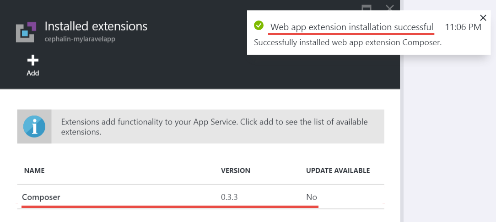
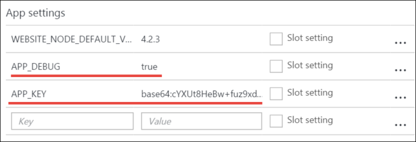

<properties
	pageTitle="创建、配置 PHP Web 应用，并将其部署到 Azure"
	description="演示如何创建在 Azure App Service 中运行的 PHP (Laravel) Web 应用的教程。了解如何配置 Azure App Service 以满足所选择的 PHP 框架的要求。"
	services="app-service\web"
	documentationCenter="php"
	authors="cephalin"
	manager="wpickett"
	editor=""
	tags="mysql"/>

<tags
	ms.service="app-service-web"
	ms.date="06/03/2016"
	wacn.date=""/>

# 创建、配置 PHP Web 应用，并将其部署到 Azure

[AZURE.INCLUDE [选项卡](../../includes/app-service-web-get-started-nav-tabs.md)]

本教程演示了如何为 Azure 创建、配置和部署 PHP Web 应用，以及如何配置 Azure App Service 以满足 PHP Web 应用的要求。在本教程结束时，将在 [Azure App Service](/documentation/articles/app-service-value-prop-what-is/) 中实时运行一个工作 [Laravel](https://www.laravel.com/) Web 应用。

作为 PHP 开发人员，你可在 Azure 中引入你最喜欢的 PHP 框架。本教程只是将 Laravel 用作具体的应用示例。你将学习以下内容：

- 使用 Git 进行部署
- 设置 PHP 版本
- 使用不在根应用程序目录中的启动文件
- 访问特定于环境的变量
- 在 Azure 中更新应用程序

你可以将在此处了解的知识应用到部署到 Azure 的其他 PHP Web Apps。

## 先决条件

- 安装 [PHP 5.6.x](http://php.net/downloads.php)（支持 PHP 7 的为 beta 版）
- 安装 [Composer](https://getcomposer.org/download/)
- 安装 [Azure CLI](/documentation/articles/xplat-cli-install/)
- 安装 [Git](http://www.git-scm.com/downloads)
- 获取 Azure 帐户。如果没有帐户，可以[注册免费试用帐户](/pricing/1rmb-trial/?WT.mc_id=A261C142F)，或者[激活 Visual Studio 订户权益](/pricing/member-offers/msdn-benefits-details/?WT.mc_id=A261C142F)。

## 在你的开发计算机上创建一个 PHP (Laravel) 应用

1. 打开新的 Windows 命令提示符、PowerShell 窗口、Linux shell 或 OS X 终端。运行以下命令以验证是否在你的计算机上正确安装了所需工具。

        php --version
        composer --version
        azure --version
        git --version

    

    如果尚未安装这些工具，请参阅[先决条件](#Prerequisites)中的下载链接。
    
2. 安装 Laravel，如下：

        composer global require "laravel/installer

3. 使用 `CD` 命令切换到工作目录并创建新的 Laravel 应用程序，如下：

        cd <working_directory>
        laravel new <app_name>

4. 使用 `CD` 命令切换到新创建的 `<app_name>` 目录并测试该应用程序，如下：

        cd <app_name>
        php artisan serve
        
    现在可以在浏览器中导航到 http://localhost:8000，并查看 Laravel 初始屏幕。
    
    
    
到目前为止，我们只是介绍了常规的 Laravel 工作流，你尚未<a href="https://laravel.com/docs/5.2" rel="nofollow">了解 Laravel</a>。因此，让我们继续以下章节的讲解。

## 创建 Azure Web 应用并设置 Git 部署

>[AZURE.NOTE] “稍等！ 如果我想要使用 FTP 进行部署该怎么做？” 可以参阅 [FTP 教程](/documentation/articles/web-sites-php-mysql-deploy-use-ftp/)来满足你的需求。

借助 Azure CLI，可以使用单行命令在 Azure App Service 中创建 Web 应用并针对 Git 部署对其进行设置。让我们执行此操作。

3. 如下所示登录到 Azure：

        azure login
    
    按照帮助消息的提示继续此登录过程。
    
    

4. 运行以下命令以使用 Git 部署创建 Azure Web 应用。出现提示时，请指定所需区域数目。

        azure site create --git <app_name>
    
    
    
    >[AZURE.NOTE] 如果从未设置 Azure 订阅的部署凭据，系统将提示你进行创建。应用服务只将这些凭据（而不是 Azure 帐户凭据）用于 Git 部署与 FTP 登录。
    
    该命令在当前目录上创建新的 Git 存储库（使用 `git init`），并将其作为 Git 远程存储库连接到 Azure 中的存储库（使用 `git remote add`）。

## 配置 Azure Web 应用

若要在 Azure 中使用 Laravel 应用，你需要注意以下几件事。你将对你选择的 PHP 框架做此类似的练习。

- 配置 PHP 5.5.9 或更高版本。请参阅 [Latest Laravel 5.2 Server Requirements](https://laravel.com/docs/5.2#server-requirements)（最新的 Laravel 5.2 服务器要求），以获取服务器要求的完整列表。列表的其余部分是 Azure 的 PHP 安装已启用的扩展。
- 设置你的应用程序所需要的环境变量。Laravel 使用 `.env` 文件来简单设置环境变量。但是，由于不建议将该文件提交到源控件（请参阅 [Laravel Environment Configuration](https://laravel.com/docs/5.2/configuration#environment-configuration)（Laravel 环境配置）），将改为设置 Azure Web 应用的应用设置。
- 请确保首先加载 Laravel 应用的入口点 `public/index.php`。请参阅 [Laravel Lifecycle Overview](https://laravel.com/docs/5.2/lifecycle#lifecycle-overview)（Laravel 生命周期概述）。换而言之，需要设置指向 `public` 目录的 Web 应用的根 URL。
- 由于已具有 composer.json，因此可以在 Azure 中启用 Composer 扩展。这样，在使用 `git push` 进行部署时可以让 Composer 负责获取所需的程序包。这是一个有关便利性的问题。如果未启用 Composer 自动化，只需从 `.gitignore` 文件中删除 `/vendor`，以便在提交和部署代码时 Git 包括（“un-ignores”）`vendor` 目录中的所有内容。

让我们按顺序配置这些任务。

4. 设置 Laravel 应用需要的 PHP 版本。

        azure site set --php-version 5.6

    你完成了 PHP 版本的设置！
    
4. 为 Azure Web 应用生成新的 `APP_KEY`，并针对 Azure Web 应用将其设置为一个应用程序设置。

        php artisan key:generate --show
        azure site appsetting add APP_KEY="<output_of_php_artisan_key:generate_--show>"

4. 此外，启用 Laravel 调试功能以解决任何含义模糊的错误消息 `Whoops, looks like something went wrong.` 页面。

        azure site appsetting add APP_DEBUG=true

    你已完成环境变量的设置！
    
    >[AZURE.NOTE] 请稍等，让我们停下来解释一下此处 Laravel 和 Azure 进行了哪些操作。Laravel 使用根目录中的 `.env` 文件向应用提供环境变量，可以在该文件中找到行 `APP_DEBUG=true`（以及 `APP_KEY=...`）。通过代码 `'debug' => env('APP_DEBUG', false),` 可在 `config/app.php` 中访问该变量。其中 [env()](https://laravel.com/docs/5.2/helpers#method-env) 是使用底层的 PHP [getenv()](http://php.net/manual/en/function.getenv.php) 函数的 Laravel helper 方法。
    >
    >但是，Git 忽略了 `.env` 文件，因为根目录中的 `.gitignore` 文件列出了该文件。简而言之，本地 Git 存储库中的 `.env` 未和文件的其余部分一起推送到 Azure。当然，可以从 `.gitignore` 中移除该行，但是我们已经确定了不建议将此文件提交到源控件。不过，你仍需要一种方法在 Azure 中指定这些环境变量。
    >
    >好消息是 Azure App Service 中的应用程序设置支持 PHP 中的 [getenv()](http://php.net/manual/en/function.getenv.php)。因此，当使用 FTP 或其他方法将 `.env` 文件手动上载到 Azure 时，只需将所需变量指定为 Azure 应用程序设置，而无需在 Azure 中使用 `.env` 文件，正如你在前面所做的。而且，如果变量同时存在于 `.env` 文件和 Azure 应用程序设置中，则 Azure 应用程序设置具有更高优先级。

4. 最后两个任务（设置虚拟目录和启用 Composer）需要使用 [Azure 门户](https://portal.azure.cn)，因此请使用 Azure 帐户登录该[门户](https://portal.azure.cn)。

4. 在左侧菜单中，单击“应用程序服务”>“&lt;应用程序名称>”>“工具”。

    
    
    >[AZURE.TIP] 如果单击“设置”而不是“工具”，则可以访问“应用程序设置”边栏选项卡，可以在其中设置 PHP 版本、应用程序设置和虚拟目录，就像刚才的操作一样。
    
4. 单击“扩展”>“添加”可以添加扩展。

4. 在“选择扩展”[边栏选项卡](/documentation/articles/azure-portal-overview/)中选择“Composer”（ *边栏选项卡* ：水平打开的门户页）。

4. 在“接受法律条款”边栏选项卡中单击“确定”。

5. 在“添加扩展”边栏选项卡中单击“确定”。

    当 Azure 完成添加扩展后，可以看到角落里友好的弹出消息，以及在“扩展”边栏选项卡中列出的“Composer”。

    

    你已启用 Composer！
    
4. 返回到 Web 应用边栏选项卡中，单击“设置”>“应用程序设置”。

    

    在“应用程序设置”边栏选项卡中，请注意之前设置的 PHP 版本：

    

    和你添加的应用程序设置：
    
    

4. 滚动到边栏选项卡的底部，将根虚拟目录更改为指向 **site\\wwwroot\\public** 而不是 **site\\wwwroot**。

    

4. 单击边栏选项卡顶部的“保存”。

    你已完成虚拟目录的设置！

## 使用 Git 部署 Web 应用（并设置环境变量）

你可以开始部署你的代码了。你将返回到命令提示符或终端来执行该操作。

4. 提交所有更改，并将代码部署到 Azure Web 应用，就像在任何 Git 存储库中一样：

        git add .
        git commit -m "Hurray! My first commit for my Azure app!"
        git push azure master 

    运行 `git push` 时，将要求提供 Git 部署密码。如果在之前的 `azure site create` 中要求你创建部署凭据，请键入你使用的密码。
    
5. 通过运行以下命令在浏览器中查看它的运行：

        azure site browse

    浏览器应显示 Laravel 初始屏幕。
    
    
    
    祝贺你，你已经在 Azure 中运行 Laravel Web 应用了！
             
## 排查常见错误

以下是你学习本教程时可能会遇到的一些错误：

- [Azure CLI 显示“‘站点’不是 azure 命令”](#clierror)
- [Web 应用显示 HTTP 403 错误](#http403)
- [Web 应用显示“糟糕！看起来某些地方出错了。”](#whoops)
- [Web 应用显示“未找到支持的加密器。”](#encryptor)

### Azure CLI 显示“‘站点’不是 azure 命令”

在命令行终端运行 `azure site *` 时，会看到错误 `error:   'site' is not an azure command. See 'azure help'.`

这通常是切换到“ARM”（Azure Resource Manager）模式的结果。若要解决此问题，请运行 `azure config mode asm` 以切换回到“ASM”（Azure 服务管理）模式。

### Web 应用显示 HTTP 403 错误

已经成功将 Web 应用部署到 Azure，但当浏览到 Azure Web 应用时，遇到 `HTTP 403` 或 `You do not have permission to view this directory or page.` 错误

这很可能是因为该 Web 应用找不到 Laravel 应用的入口点。请确保已将根虚拟目录更改为指向 Laravel 的 `index.php` 所在的 `site\wwwroot\public`（请参阅[配置 Azure Web 应用](#configure)）。

### Web 应用显示“糟糕！看起来某些地方出错了。”

已经成功将 Web 应用部署到 Azure，但当浏览到 Azure Web 应用时，遇到含义模糊的错误消息 `Whoops, looks like something went wrong.`

若要获取更加详细的错误信息，请将 `APP_DEBUG` 环境变量设置为 `true` 以启用 Laravel 调试功能（请参阅[配置 Azure Web 应用](#configure)）。

### Web 应用显示“未找到支持的加密器。”

你已经成功将 Web 应用部署到 Azure，但当你浏览到你的 Azure Web 应用时，将遇到下面的错误消息：

    
这是一个严重错误，但是由于你启用了 Laravel 调试功能，因此至少它不是难懂的。在 Laravel 论坛上粗略地搜索一下错误字符串，可显示该错误的原因是未在 `.env` 中设置 APP\_KEY，或者在 Azure 中根本不存在 `.env` 文件。可以通过将设置 `APP_KEY` 添加为 Azure 应用程序设置来解决此问题（请参阅[配置 Azure Web 应用](#configure)）。
    
## 后续步骤

通过[在 Azure 中创建 MySQL 数据库](/documentation/articles/store-php-create-mysql-database/)了解如何将数据添加到应用程序。另外，你可以查看 Azure 中以下更加有用的 PHP 链接：

- [PHP 开发人员中心](/develop/php/)。
- [通过 Azure 应用商店创建 Web 应用](/documentation/articles/app-service-web-create-web-app-from-marketplace/)
- [在 Azure App Service Web Apps 中配置 PHP](/documentation/articles/web-sites-php-configure/)
- [在 Azure App Service 中将 WordPress 转换为 Multisite](/documentation/articles/web-sites-php-convert-wordpress-multisite/)
- [Azure App Service 上的企业级 WordPress](/documentation/articles/web-sites-php-enterprise-wordpress/)

<!---HONumber=Mooncake_0919_2016-->