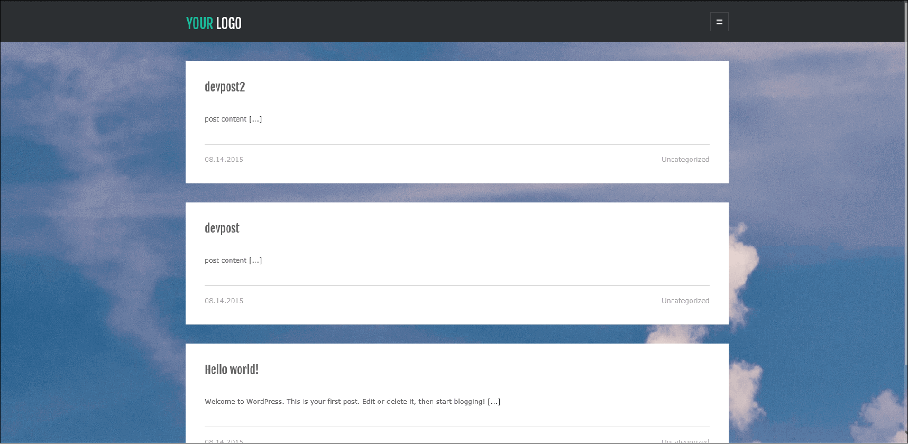
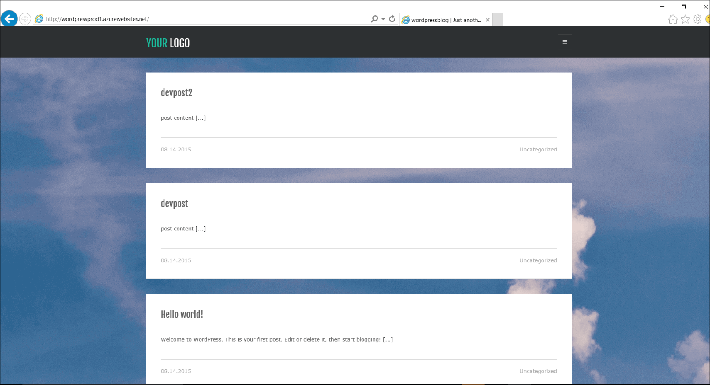
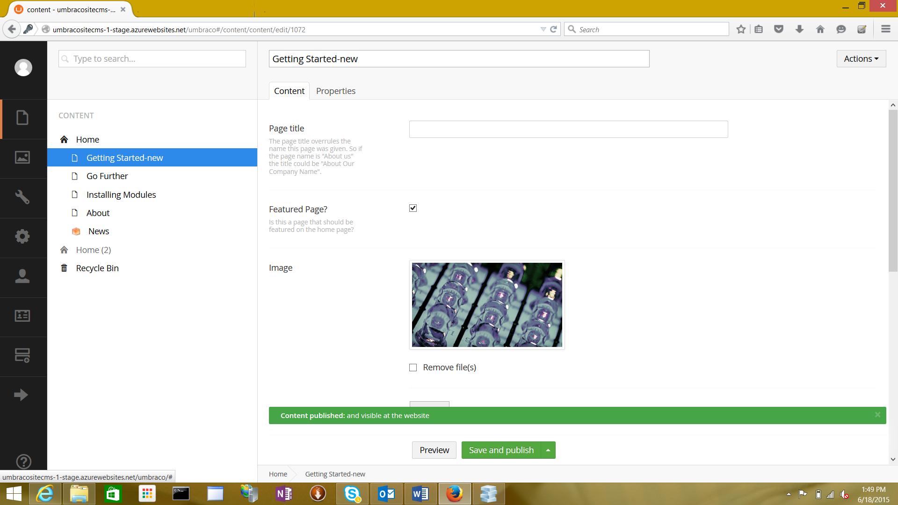
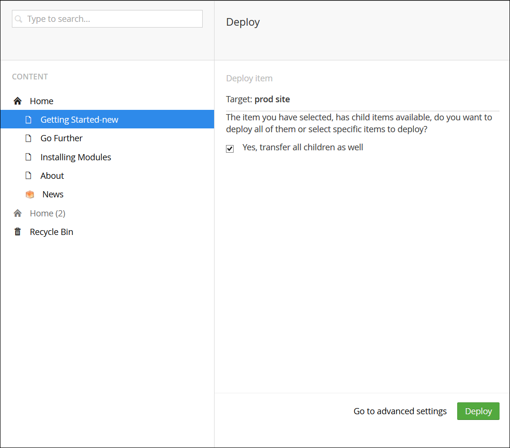
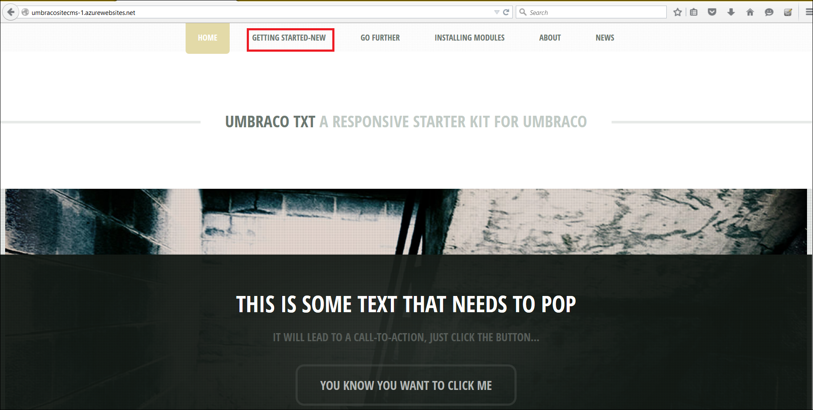

<properties
    pageTitle="对 Web 应用有效使用 DevOps 环境 | Azure"
    description="了解如何使用部署槽来设置和管理应用程序的多个开发环境"
    services="app-service\web"
    documentationcenter=""
    author="sunbuild"
    manager="yochayk"
    editor="" />  

<tags
    ms.assetid="16a594dc-61f5-4984-b5ca-9d5abc39fb1e"
    ms.service="app-service"
    ms.devlang="na"
    ms.topic="article"
    ms.tgt_pltfrm="na"
    ms.workload="web"
    ms.date="10/24/2016"
    wacn.date="03/28/2017"
    ms.author="sumuth" />

# 对 Web 应用有效使用 DevOps 环境
本文说明如何针对应用程序的多个版本处于不同环境（例如开发、过渡、质量保证 (QA) 和生产）的情况，设置和管理 Web 应用程序部署。应用程序的每个版本均可视为满足部署过程中特定目的的开发环境。例如，在将更改推送到生产前，开发人员可使用 QA 环境测试应用程序的质量。多个开发环境十分具有挑战性，因为需要在这些环境中跟踪代码、管理资源（计算、Web 应用、数据库、缓存等）和部署代码。

## 设置非生产环境（过渡、开发、QA）
生产 Web 应用启动并运行后，下一步是创建非生产环境。若要使用部署槽，请确保在标准或高级 Azure App Service 计划模式下运行。部署槽是具有自己的主机名的动态 Web 应用。两个部署槽（包括生产槽）之间的 Web 应用内容与配置元素可以交换。将应用程序部署到部署槽具有以下优点：

- 可先在过渡部署槽中验证 Web 应用更改，然后再与生产槽交换应用。
- 先将 Web 应用部署到槽，然后再将其交换到生产时，可确保槽的所有实例都在预热后才交换到生产。此过程可在部署 Web 应用时避免出现停机。流量重定向是无缝的，且不会因交换操作而删除任何请求。若要自动化整个工作流，可在不需要预交换验证时配置[自动交换](/documentation/articles/web-sites-staged-publishing/#configure-auto-swap)。
- 交换后，具有以前的过渡 Web 应用的槽现在具有以前的生产 Web 应用。如果交换到生产槽的更改与预期不同，可立即执行同一交换来取回“上一已知良好的”Web 应用。

若要设置过渡部署槽位，请参阅[为 Azure 应用服务中的 Web 应用设置过渡环境](/documentation/articles/web-sites-staged-publishing/)。每个环境都应包括自己的资源集。例如，如果 Web 应用使用数据库，则生产和过渡 Web 应用应使用不同的数据库。添加过渡开发环境资源（例如数据库、存储或缓存），设置过渡开发环境。

## 使用多个开发环境的示例
任何项目都应遵循至少两个环境的源代码的管理：开发和生产。如果使用内容管理系统 (CMS)、应用程序框架等，则如果不进行自定义，应用程序可能不会支持此方案。此后果同样适用于以下各部分讨论的一些常用框架。使用 CMS/框架时，需要考虑到很多问题，例如：

- 如何将内容分为不同的环境？
- 可以更改哪些文件而不会影响框架版本更新？
- 如何管理每个环境的配置？
- 如何管理模块、插件和核心框架的版本更新？

有多种方法可为项目设置多个环境。以下示例说明针对各个应用程序的一种方法。

### WordPress
在本部分中，会学习如何使用 WordPress 槽来设置部署工作流。与大多数 CMS 解决方案一样，在未进行自定义时，WordPress 不支持多个开发环境。Azure App Service 的 Web 应用有一些功能可帮助轻松地在代码之外存储配置设置。

1. 在创建过渡槽前，请设置应用程序代码以支持多个环境。若要在 WordPress 中支持多个环境，需要在本地开发 Web 应用上编辑 `wp-config.php`，并在文件的开头添加以下代码。此过程让应用程序能够根据所选环境选择正确的配置。

        // Support multiple environments
        // set the config file based on current environment
        if (strpos($_SERVER['HTTP_HOST'],'localhost') !== false) {
        // local development
         $config_file = 'config/wp-config.local.php';
        }
        elseif ((strpos(getenv('WP_ENV'),'stage') !== false) || (strpos(getenv('WP_ENV'),'prod' )!== false ))
        //single file for all azure development environments
         $config_file = 'config/wp-config.azure.php';
        }
        $path = dirname(__FILE__). '/';
        if (file_exists($path. $config_file)) {
        // include the config file if it exists, otherwise WP is going to fail
        require_once $path. $config_file;

2. 在 Web 应用的根目录下创建名为 `config` 的文件夹，并添加 `wp-config.azure.php` 和 `wp-config.local.php` 这两个文件，它们分别代表 Azure 环境和本地环境。

3. 复制 `wp-config.local.php` 中的以下内容：

        <?php
        // MySQL settings
        /** The name of the database for WordPress */

        define('DB_NAME', 'yourdatabasename');

        /** MySQL database username */
        define('DB_USER', 'yourdbuser');

        /** MySQL database password */
        define('DB_PASSWORD', 'yourpassword');

        /** MySQL hostname */
        define('DB_HOST', 'localhost');
        /**
         * For developers: WordPress debugging mode.
         * * Change this to true to enable the display of notices during development.
         * It is strongly recommended that plugin and theme developers use WP_DEBUG
         * in their development environments.
         */
        define('WP_DEBUG', true);

        //Security key settings
        define('AUTH_KEY', 'put your unique phrase here');
        define('SECURE_AUTH_KEY','put your unique phrase here');
        define('LOGGED_IN_KEY','put your unique phrase here');
        define('NONCE_KEY', 'put your unique phrase here');
        define('AUTH_SALT', 'put your unique phrase here');
        define('SECURE_AUTH_SALT', 'put your unique phrase here');
        define('LOGGED_IN_SALT', 'put your unique phrase here');
        define('NONCE_SALT', 'put your unique phrase here');

        /**
         * WordPress Database Table prefix.
         *
         * You can have multiple installations in one database if you give each a unique
         * prefix. Only numbers, letters, and underscores please!
         */
        $table_prefix = 'wp_';

    设置如以上代码中所述的安全密钥可帮助防止 Web 应用受到黑客攻击，因此请使用唯一值。如果需要为代码中提及的安全密钥生成字符串，可[转到自动生成器](https://api.wordpress.org/secret-key/1.1/salt)，创建新的键/值对。

4. 复制 `wp-config.azure.php` 中的以下代码：

        <?php
        // MySQL settings
        /** The name of the database for WordPress */

        define('DB_NAME', getenv('DB_NAME'));

        /** MySQL database username */
        define('DB_USER', getenv('DB_USER'));

        /** MySQL database password */
        define('DB_PASSWORD', getenv('DB_PASSWORD'));

        /** MySQL hostname */
        define('DB_HOST', getenv('DB_HOST'));

        /**
        * For developers: WordPress debugging mode.
        *
        * Change this to true to enable the display of notices during development.
        * It is strongly recommended that plugin and theme developers use WP_DEBUG
        * in their development environments.
        * Turn on debug logging to investigate issues without displaying to end user. For WP_DEBUG_LOG to
        * do anything, WP_DEBUG must be enabled (true). WP_DEBUG_DISPLAY should be used in conjunction
        * with WP_DEBUG_LOG so that errors are not displayed on the page */

        */
        define('WP_DEBUG', getenv('WP_DEBUG'));
        define('WP_DEBUG_LOG', getenv('TURN_ON_DEBUG_LOG'));
        define('WP_DEBUG_DISPLAY',false);

        //Security key settings
        /** If you need to generate the string for security keys mentioned above, you can go the automatic generator to create new keys/values: https://api.wordpress.org/secret-key/1.1/salt **/
        define('AUTH_KEY',getenv('DB_AUTH_KEY'));
        define('SECURE_AUTH_KEY', getenv('DB_SECURE_AUTH_KEY'));
        define('LOGGED_IN_KEY', getenv('DB_LOGGED_IN_KEY'));
        define('NONCE_KEY', getenv('DB_NONCE_KEY'));
        define('AUTH_SALT', getenv('DB_AUTH_SALT'));
        define('SECURE_AUTH_SALT', getenv('DB_SECURE_AUTH_SALT'));
        define('LOGGED_IN_SALT',  getenv('DB_LOGGED_IN_SALT'));
        define('NONCE_SALT',  getenv('DB_NONCE_SALT'));

        /**
        * WordPress Database Table prefix.
        *
        * You can have multiple installations in one database if you give each a unique
        * prefix. Only numbers, letters, and underscores please!
        */
        $table_prefix = getenv('DB_PREFIX');

#### 使用相对路径
最后需要在 WordPress 应用中配置的是相对路径。WordPress 在数据库中存储 URL 信息。此存储让从一个环境将内容移动到另一个环境的操作变得更加困难。每次从本地环境移到过渡环境或从过渡环境移到生产环境时，都需要更新数据库。若要降低每次在不同环境间部署数据库时造成问题的风险，请使用[相对根链接插件](https://wordpress.org/plugins/root-relative-urls/)，可使用 WordPress 管理员仪表板来安装该插件。

将以下条目添加到 `wp-config.php` 文件中的 `That's all, stop editing!` 注释前面：

        define('WP_HOME', 'http://'. filter_input(INPUT_SERVER, 'HTTP_HOST', FILTER_SANITIZE_STRING));
        define('WP_SITEURL', 'http://'. filter_input(INPUT_SERVER, 'HTTP_HOST', FILTER_SANITIZE_STRING));
        define('WP_CONTENT_URL', '/wp-content');
        define('DOMAIN_CURRENT_SITE', filter_input(INPUT_SERVER, 'HTTP_HOST', FILTER_SANITIZE_STRING));

通过 WordPress 管理员仪表板中的 `Plugins` 菜单激活该插件。保存 WordPress 应用的 permalink 设置。

#### 最终的 `wp-config.php` 文件
任何 WordPress 核心更新都不会影响 `wp-config.php`、`wp-config.azure.php` 和 `wp-config.local.php` 文件。下面是 `wp-config.php` 文件的最终版本：

    <?php
    /**
     * The base configurations of the WordPress.
     *
     * This file has the following configurations: MySQL settings, Table Prefix,
     * Secret Keys, and ABSPATH. You can find more information by visiting
     *
     * Codex page. You can get the MySQL settings from your web host.
     *
     * This file is used by the wp-config.php creation script during the
     * installation. You don't have to use the web web app, you can just copy this file
     * to "wp-config.php" and fill in the values.
     *
     * @package WordPress
     */

    // Support multiple environments
    // set the config file based on current environment
    if (strpos($_SERVER['HTTP_HOST'],'localhost') !== false) { // local development
      $config_file = 'config/wp-config.local.php';
    }
    elseif ((strpos(getenv('WP_ENV'),'stage') !== false) ||(strpos(getenv('WP_ENV'),'prod' )!== false )){
      $config_file = 'config/wp-config.azure.php';
    }

    $path = dirname(__FILE__). '/';
    if (file_exists($path. $config_file)) {
      // include the config file if it exists, otherwise WP is going to fail
      require_once $path. $config_file;
    }

    /** Database Charset to use in creating database tables. */
    define('DB_CHARSET', 'utf8');

    /** The Database Collate type. Don't change this if in doubt. */
    define('DB_COLLATE', '');

    /* That's all, stop editing! Happy blogging. */

    define('WP_HOME', 'http://'. $_SERVER['HTTP_HOST']);
    define('WP_SITEURL', 'http://'. $_SERVER['HTTP_HOST']);
    define('WP_CONTENT_URL', '/wp-content');
    define('DOMAIN_CURRENT_SITE', $_SERVER['HTTP_HOST']);

    /** Absolute path to the WordPress directory. */
    if ( !defined('ABSPATH') )
        define('ABSPATH', dirname(__FILE__). '/');

    /** Sets up WordPress vars and included files. */
    require_once(ABSPATH. 'wp-settings.php');

#### 设置过渡环境
1. 如果已经拥有在 Azure 订阅上运行的 WordPress Web 应用，请登录 [Azure 门户](http://portal.azure.cn)，然后转到该 WordPress Web 应用。如果没有 WordPress web 应用，可创建一个。单击“设置”>“部署槽”>“添加”，创建名为 *过渡* 的部署槽。部署槽是与前面创建的主 Web 应用共享相同资源的另一个 Web 应用程序。

      

2. 向资源组 `wordpressapp-group` 中添加另一个 MySQL 数据库 `wordpress-stage-db`。

      

3. 将过渡部署槽的连接字符串更新为指向新数据库 `wordpress-stage-db`。生产 Web 应用 `wordpressprodapp` 和过渡 Web 应用 `wordpressprodapp-stage` 必须指向不同的数据库。

#### 配置环境特定的应用设置
开发人员可在 Azure 中将键/值字符串对作为与 Web 应用关联的配置信息的一部分存储，称为**应用设置**。在运行时，Web 应用会自动检索这些值，并使这些值可供 Web 应用中运行的代码使用。从安全角度来看，这可以带来不错的辅助优势，因为包含密码的数据库连接字符串等敏感信息永远不会以明文形式显示在文件（例如 `wp-config.php`）中。

此过程（在以下各段中进行说明）十分有用，因为它同时包括 WordPress 应用的文件更改和数据库更改：

* WordPress 版本升级
* 新增、编辑或升级插件
* 新增、编辑或升级主题

配置应用设置：

* 数据库信息
* 打开/关闭 WordPress 日志记录
* WordPress 安全设置

  

确保为生产 Web 应用和过渡槽添加以下应用设置。请注意，生产 Web 应用和过渡 Web 应用使用不同的数据库。

1. 取消选中除 WP\_ENV 以外的所有设置参数的“槽设置”复选框。此过程会交换 Web 应用、文件内容和数据库的配置。如果已选中“槽设置”，则执行**交换**操作时，Web 应用的应用设置和连接字符串配置 *不会* 跨环境移动。存在的任何数据库更改都不会中断生产 Web 应用。

2. 使用 WebMatrix 或所选的工具（例如 FTP、Git 或 PhpMyAdmin）将本地开发环境 Web 应用部署到过渡 Web 应用和数据库。

      

3. 浏览并测试你的过渡 Web 应用。假设要更新 Web 应用的主题，可以使用以下过渡 Web 应用。

      

4. 如果一切正常，请单击过渡 Web 应用上的“交换”按钮，将内容移动到生产环境。在此情况下，每个**交换**操作期间都会跨环境交换 Web 应用和数据库。

      

    > [AZURE.NOTE]
    如果方案需要仅推送文件（而不推送数据库更新），那么在执行**交换**操作前，在 Azure 门户的“Web 应用设置”边栏选项卡中，选中所有数据库相关的 *应用设置* 和 *连接字符串设置* 的“槽设置”。在此情况下，执行**交换**操作时，不应在预览更改中显示 DB\_NAME、DB\_HOST、DB\_PASSWORD、DB\_USER 和默认连接字符串设置。在此情况下，完成**交换**操作后，WordPress Web 应用只具有更新文件。
    >
    >

    在执行**交换**操作前，存在 WordPress 生产 Web 应用。
    

    执行**交换**操作后，主题已在生产 Web 应用上更新。

      

5. 如果需要回退，可转到生产 Web 应用的“应用设置”，并单击“交换”按钮将 Web 应用和数据库从生产槽交换到过渡槽。请记住，如果数据库更改包含在**交换**操作中，则下次部署到过渡 Web 应用时，需要将数据库更改部署到过渡 Web 应用的当前数据库。当前数据库可能是以前的生产数据库或过渡数据库。

#### 摘要
以下是适用于任何具有数据库的应用程序的通用过程：

1. 在本地环境中安装应用程序。
2. 包含环境特定的配置（本地和 Azure Web 应用）。
3. 为 Web 应用设置过渡和生产环境。
4. 如果拥有已在 Azure 上运行的生产应用程序，请将生产内容（文件/代码和数据库）同步到本地和过渡环境。
5. 在本地环境中开发应用程序。
6. 将生产 Web 应用置于维护或锁定模式，并将数据库内容从生产环境同步到过渡环境和开发环境。
7. 部署到过渡环境和测试环境。
8. 部署到生产环境。
9. 重复步骤 4 至 6。

### Umbraco
在本部分中，会学习 Umbraco CMS 如何使用自定义模块跨多个 DevOps 环境进行部署。本示例提供用于管理多个开发环境的不同方法。

[Umbraco CMS](http://umbraco.com/) 是许多开发人员使用的常用 .NET CMS 解决方案。它提供 [Courier2](http://umbraco.com/products/more-add-ons/courier-2) 模块，可用于从开发环境部署到过渡环境，再部署到生产环境。可使用 Visual Studio 或 WebMatrix 为 Umbraco CMS Web 应用轻松创建本地开发环境。

- [使用 Visual Studio 创建 Umbraco Web 应用](https://our.umbraco.org/documentation/Installation/install-umbraco-with-nuget)
- [使用 WebMatrix 创建 Umbraco Web 应用](http://umbraco.tv/videos/umbraco-v7/implementor/fundamentals/installation/creating-umbraco-site-from-webmatrix-web-gallery/)

务必记住删除应用程序下的 `install` 文件夹，不要将其上传到过渡或生产 Web 应用。本教程使用 WebMatrix。

#### 设置过渡环境
1. 假设已启动并运行 Umbraco CMS Web 应用，如前所述，为该应用创建部署槽。否则，可通过应用商店创建一个。
2. 将过渡部署槽的连接字符串更新为指向新的 **umbraco-stage-db** 数据库。生产 Web 应用 (umbraositecms-1) 和过渡 Web 应用 (umbracositecms-1-stage) *必须* 指向不同的数据库。

      

3. 针对**过渡**部署槽单击“获取发布设置”。此过程会下载发布设置文件，该文件存储 Visual Studio 或 WebMatrix 将应用程序从本地开发 Web 应用发布到 Azure Web 应用所需的全部信息。

      

4. 在 WebMatrix 或 Visual Studio 中打开本地开发 Web 应用。本教程使用 WebMatrix。首先，需要导入过渡 Web 应用的发布设置文件。

      

5. 检查对话框中的更改，并将本地 Web 应用部署到 Azure Web 应用 *umbracositecms-1-stage* 。将文件直接部署到过渡 Web 应用时，可忽略 `~/app_data/TEMP/` 文件夹中的文件，因为在首次启动过渡 Web 应用时会重新生成这些文件。还应忽略 `~/app_data/umbraco.config` 文件，因为也会进行重新生成。

      

6. 将 Umbraco 本地 Web 应用成功发布到过渡 Web 应用后，浏览到过渡 Web 应用，并运行一些测试以便排除任何问题。

#### 设置 Courier2 部署模块
借助 [Courier2](http://umbraco.com/products/more-add-ons/courier-2) 模块，只需右键单击即可从过渡 Web 应用将内容、样式表和开发模块推送到生产 Web 应用。此过程可降低部署更新时中断生产 Web 应用的风险。为 `*.chinacloudsites.cn` 域和自定义域（例如 http://abc.com ）购买 Courier2 许可证。购买许可证后，将下载的许可证（.LIC 文件）放在 `bin` 文件夹中。

  

1. [下载 Courier2 包](https://our.umbraco.org/projects/umbraco-pro/umbraco-courier-2/)。 登录过渡 Web 应用 http://umbracocms-site-stage.chinacloudsites.cn/umbraco， 单击“开发人员”菜单，然后单击“包”>“安装本地包”。

      

2. 使用安装程序上传 Courier2 包。

      

3. 若要配置包，需要更新 Web 应用的 **Config** 文件夹下的 courier.config 文件。

        <!-- Repository connection settings -->
         <!-- For each site, a custom repository must be configured, so Courier knows how to connect and authenticate-->
         <repositories>
            <!-- If a custom Umbraco Membership provider is used, specify login & password + set the passwordEncoding to clear: -->
            <repository name="production web app" alias="stage" type="CourierWebserviceRepositoryProvider" visible="true">
              <url>http://umbracositecms-1.chinacloudsites.cn</url>
              <user>0</user>
              <!--<login>user@email.com</login> -->
              <!-- <password>user_password</password>-->
              <!-- <passwordEncoding>Clear</passwordEncoding>-->
              </repository>
         </repositories>

4. 在 `<repositories>` 下面输入生产站点 URL 和用户信息。如果使用默认的 Umbraco 成员资格提供程序，则在 <user> 部分中添加管理用户的 ID。如果使用自定义的 Umbraco 成员资格提供程序，则使用 Courier2 模块中的 `<login>`、`<password>` 连接到生产站点。有关更多详细信息，[请参阅 Courier2 模块文档](http://umbraco.com/help-and-support/customer-area/courier-2-support-and-download/developer-documentation)。

5. 同样，在生产站点上安装 Courier2 模块，并在其相应的 courier.config 文件中将其配置为指向过渡 Web 应用，如下所示。

         <!-- Repository connection settings -->
         <!-- For each site, a custom repository must be configured, so Courier knows how to connect and authenticate-->
         <repositories>
            <!-- If a custom Umbraco Membership provider is used, specify login & password + set the passwordEncoding to clear: -->
            <repository name="Stage web app" alias="stage" type="CourierWebserviceRepositoryProvider" visible="true">
              <url>http://umbracositecms-1-stage.chinacloudsites.cn</url>
              <user>0</user>
              </repository>
         </repositories>

6. 单击 Umbraco CMS Web 应用仪表板上的“Courier2”选项卡，然后单击“位置”。可以看到 `courier.config` 中提到的存储库名称。在生产和过渡 Web 应用上均执行此过程。

      

7. 若要从过渡站点将内容部署到生产站点，请转到“内容”，然后选择现有页面或创建新页面。我会从我的 Web 应用中选择标题为 **Getting Started - new** 的现有页面，然后单击“保存并发布”。

      

8. 右键单击修改的页面，查看所有选项。单击“Courier”，打开“部署”对话框。单击“部署”以启动部署。

      

9. 查看更改，然后单击“继续”。

      

    部署日志显示部署是否成功。

       

10. 浏览生产 Web 应用以查看是否反映了更改。

       

若要了解有关如何使用 Courier 的详细信息，请查阅文档。

#### 如何升级 Umbraco CMS 版本
Courier 不会帮助用户从 Umbraco CMS 的一个版本升级到另一个版本。升级 Umbraco CMS 版本时，必须检查与自定义模块或合作伙伴模块及 Umbraco 核心库的不兼容性。以下是最佳做法：

* 在升级前始终备份 Web 应用和数据库。在 Azure Web 应用中，可使用备份功能为网站设置自动备份，以及在需要时使用还原功能还原网站。有关详细信息，请参阅[如何备份 Web 应用](/documentation/articles/web-sites-backup/)和[如何还原 Web 应用](/documentation/articles/web-sites-restore/)。
* 检查合作伙伴包是否与要升级到的版本兼容。在包的下载页上，查看项目与 Umbraco CMS 版本的兼容性。

有关如何在本地升级 Web 应用的更多详细信息，[请参阅常规升级指南](https://our.umbraco.org/documentation/getting-started/setup/upgrading/general)。

升级本地开发站点后，将更改发布到过渡 Web 应用。测试应用程序。如果一切正常，使用“交换”按钮将过渡站点交换到生产 Web 应用。使用**交换**操作时，可在 Web 应用的配置中查看会受到影响的更改。此**交换**操作可交换 Web 应用和数据库。执行**交换**操作后，生产 Web 应用会指向 umbraco-stage-db 数据库，过渡 Web 应用会指向 umbraco-prod-db 数据库。

  

以下是交换 Web 应用和数据库的优点：

* 如果应用程序存在任何问题，可使用另一个**交换**操作回滚到 Web 应用的前一个版本。
* 若要升级，需要将文件和数据库从过渡 Web 应用部署到生产 Web 应用和数据库。部署文件和数据库时，可能会出现很多错误。通过使用槽的**交换**功能，可减少升级过程中的停机时间，并降低部署更改时发生错误的风险。
* 可通过以下方式执行 **A/B 测试**：

本示例向你展示了平台的灵活性，你可以生成类似于 Umbraco Courier 模块的自定义模块，来跨环境管理部署。

## 参考
[使用 Azure App Service 进行敏捷软件开发](/documentation/articles/app-service-agile-software-development/)

[为 Azure App Service 中的 Web 应用设置过渡环境](/documentation/articles/web-sites-staged-publishing/)

[如何阻止对非生产部署槽的 Web 访问](http://ruslany.net/2014/04/azure-web-sites-block-web-access-to-non-production-deployment-slots/)

<!---HONumber=Mooncake_1226_2016-->