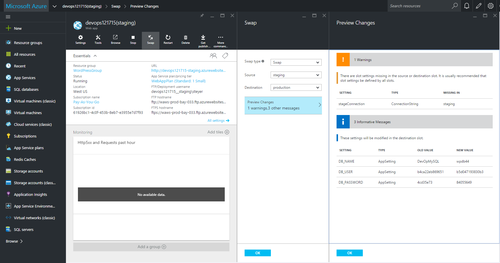
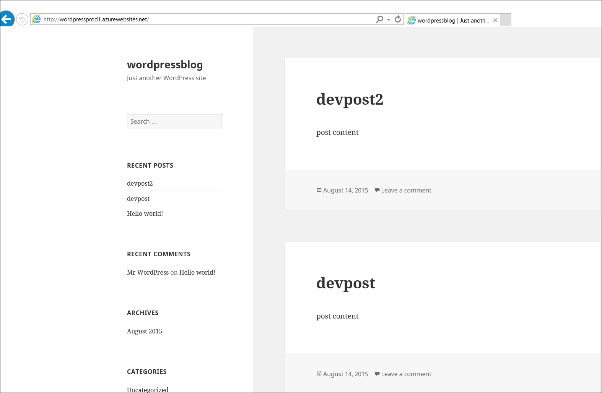
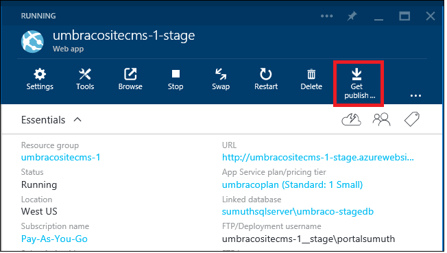
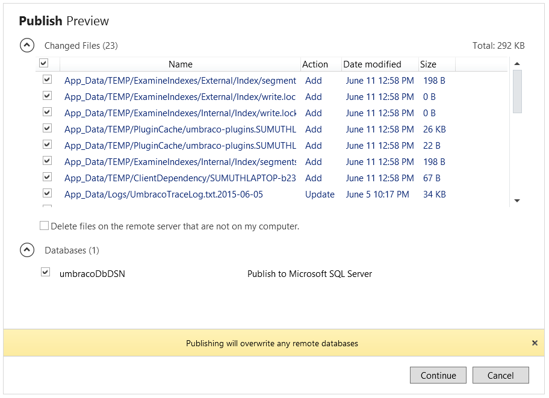
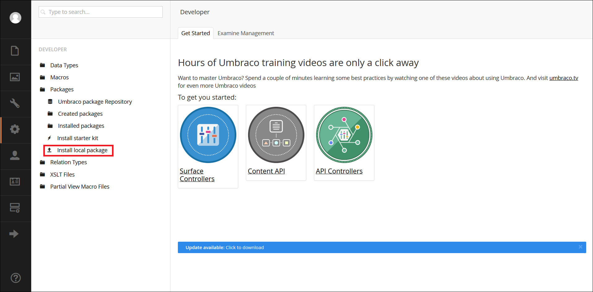
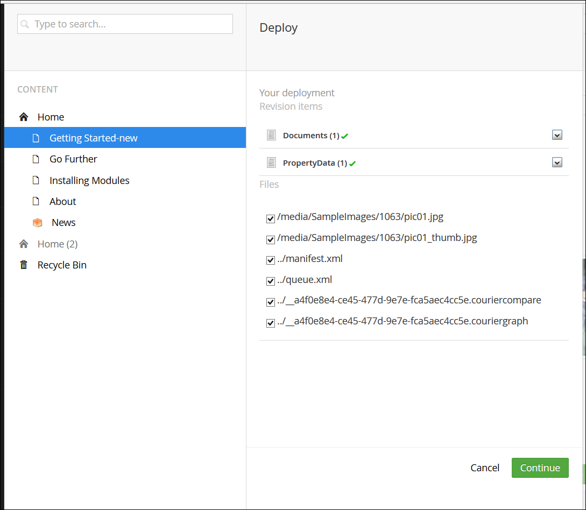
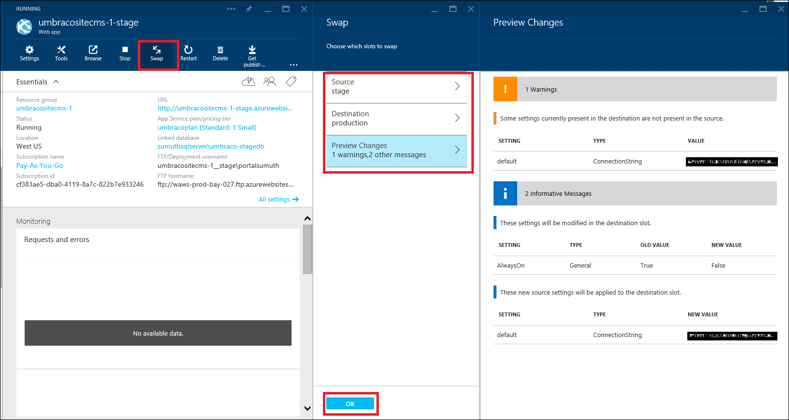

<properties
   pageTitle="对 Web 应用有效使用 DevOps 环境"
   description="了解如何使用部署槽来设置和管理应用程序的多个开发环境"
   services="app-service\web"
   documentationCenter=""
   authors="sunbuild"
   manager="yochayk"
   editor=""/>

<tags
	ms.service="app-service"
	ms.date="05/31/2016"
	wacn.date="09/26/2016"/>

# 对 Web 应用有效使用 DevOps 环境

本文说明如何针对应用程序的多个版本（例如开发、过渡、QA 和生产）来设置和管理 Web 应用程序部署。应用程序的每个版本可被视为满足部署过程特定需求的开发环境，例如，开发团队可以使用 QA 环境来测试应用程序的质量，然后将更改推送到生产环境。设置多个开发环境可能是具挑战性的任务，因为需要在这些环境之间跟踪、管理资源（计算、Web 应用程序、数据库、缓存等），以及在不同的环境之间部署内容。

## 设置非生产环境（过渡、开发、QA）
生产 Web 应用启动并运行之后，下一步是创建非生产环境。为了使用部署槽位，请确保在**标准**或**高级**应用服务计划模式下运行。部署槽实际上是具有自身主机名的实时 Web 应用。两个部署槽（包括生产槽）之间的 Web 应用内容与配置元素可以交换。将应用程序部署到部署槽具有以下优点：

1. 你可以在分阶段部署槽中验证 Web 应用更改，然后将其与生产槽交换。
2. 首先将 Web 应用部署到槽，然后将其交换到生产，这确保槽的所有实例都预热，然后交换到生产。部署你的 Web 应用时，这消除了停机时间。流量重定向是无缝的，且不会因交换操作而删除任何请求。当不需要预交换验证时，可以通过配置[自动交换](/documentation/articles/web-sites-staged-publishing/#configure-auto-swap-for-your-web-app)来自动化这整个工作流。
3. 交换后，具有以前分阶段 Web 应用的槽现在具有以前的生产 Web 应用。如果交换到生产槽的更改与你的预期不同，你可以立即执行同一交换来收回“上一已知的良好 Web 应用”。

若要设置过渡部署槽位，请参阅[为 Azure App Service 中的 Web 应用设置过渡环境](/documentation/articles/web-sites-staged-publishing/)。每个环境应该包含自有的一组资源，例如，如果 Web 应用使用数据库，则生产和过渡 Web 应用应该使用不同的数据库。添加过渡开发环境资源，例如数据库、存储或缓存，用于设置过渡开发环境。

## 使用多个开发环境的示例

任何项目应该遵循具有至少两个环境（开发和生产环境）的源代码管理，但在使用内容管理系统、应用程序框架等时，我们可能遇到应用程序原本不支持这种方案的问题。下面讨论的某些流行框架正是如此。使用 CMS/框架时，你要考虑到很多问题，例如

1. 如何分解成不同的环境
2. 可以更改哪些文件且不影响框架版本更新
3. 如何管理每个环境的配置
4. 如何管理模块/插件版本更新、核心框架版本更新

有多种方法可为项目设置多个环境，以下示例只是相关应用程序使用的一种方法。

### WordPress
在本部分中，你将学习如何使用 WordPress 槽来设置部署工作流。与大多数 CMS 解决方案一样，WordPress 原本并不支持使用多个开发环境。应用服务 Web 应用有一些功能可让你更轻松地将配置设置存储在代码之外。

在创建过渡槽之前，请设置应用程序代码以支持多个环境。若要在 WordPress 中支持多个环境，需要在本地开发 Web 应用上编辑 `wp-config.php`，并在文件的开头添加以下代码。这样，应用程序就可以根据所选环境选择正确的配置。

	// Support multiple environments
	// set the config file based on current environment
	/**/
	if (strpos(filter_input(INPUT_SERVER, 'HTTP_HOST', FILTER_SANITIZE_STRING),'localhost') !== false) {
	    // local development
	    $config_file = 'config/wp-config.local.php';
	}
	elseif  ((strpos(getenv('WP_ENV'),'stage') !== false) ||  (strpos(getenv('WP_ENV'),'prod' )!== false )){
	      //single file for all azure development environments
	      $config_file = 'config/wp-config.azure.php';
	}
	$path = dirname(__FILE__) . '/';
	if (file_exists($path . $config_file)) {
	    // include the config file if it exists, otherwise WP is going to fail
	    require_once $path . $config_file;
	}

在 Web 应用根目录下创建名为 `config` 的文件夹，并添加两个文件：`wp-config.azure.php` 和 `wp-config.local.php`，分别代表 Azure 和本地环境。

复制 `wp-config.local.php` 中的以下内容：

	<?php
	
	// MySQL settings
	/** The name of the database for WordPress */
	
	define('DB_NAME', 'yourdatabasename');
	
	/** MySQL database username */
	define('DB_USER', 'yourdbuser');
	
	/** MySQL database password */
	define('DB_PASSWORD', 'yourpassword');
	
	/** MySQL hostname */
	define('DB_HOST', 'localhost');
	/**
	 * For developers: WordPress debugging mode.
	 * * Change this to true to enable the display of notices during development.
	 * It is strongly recommended that plugin and theme developers use WP_DEBUG
	 * in their development environments.
	 */
	define('WP_DEBUG', true);
	
	//Security key settings
	define('AUTH_KEY',         'put your unique phrase here');
	define('SECURE_AUTH_KEY',  'put your unique phrase here');
	define('LOGGED_IN_KEY',    'put your unique phrase here');
	define('NONCE_KEY',        'put your unique phrase here');
	define('AUTH_SALT',        'put your unique phrase here');
	define('SECURE_AUTH_SALT', 'put your unique phrase here');
	define('LOGGED_IN_SALT',   'put your unique phrase here');
	define('NONCE_SALT',       'put your unique phrase here');
	
	/**
	 * WordPress Database Table prefix.
	 *
	 * You can have multiple installations in one database if you give each a unique
	 * prefix. Only numbers, letters, and underscores please!
	 */
	$table_prefix  = 'wp_';

设置上述安全密钥可以帮助防止 Web 应用受到黑客攻击，因此请使用唯一值。如果需要为前面所述的安全密钥生成字符串，你可通过此[链接](https://api.wordpress.org/secret-key/1.1/salt)使用自动生成器来创建新密钥/值

复制 `wp-config.azure.php` 中的以下代码：

	<?php
	// MySQL settings
	/** The name of the database for WordPress */
	
	define('DB_NAME', getenv('DB_NAME'));
	
	/** MySQL database username */
	define('DB_USER', getenv('DB_USER'));
	
	/** MySQL database password */
	define('DB_PASSWORD', getenv('DB_PASSWORD'));
	
	/** MySQL hostname */
	define('DB_HOST', getenv('DB_HOST'));
	
	/**
	* For developers: WordPress debugging mode.
	*
	* Change this to true to enable the display of notices during development.
	* It is strongly recommended that plugin and theme developers use WP_DEBUG
	* in their development environments.
	* Turn on debug logging to investigate issues without displaying to end user. For WP_DEBUG_LOG to
	* do anything, WP_DEBUG must be enabled (true). WP_DEBUG_DISPLAY should be used in conjunction
	* with WP_DEBUG_LOG so that errors are not displayed on the page */
	
	*/
	define('WP_DEBUG', getenv('WP_DEBUG'));
	define('WP_DEBUG_LOG', getenv('TURN_ON_DEBUG_LOG'));
	define('WP_DEBUG_DISPLAY',false);
	
	//Security key settings
	/** If you need to generate the string for security keys mentioned above, you can go the automatic generator to create new keys/values: https://api.wordpress.org/secret-key/1.1/salt **/
	define('AUTH_KEY' ,getenv('DB_AUTH_KEY'));
	define('SECURE_AUTH_KEY',  getenv('DB_SECURE_AUTH_KEY'));
	define('LOGGED_IN_KEY', getenv('DB_LOGGED_IN_KEY'));
	define('NONCE_KEY', getenv('DB_NONCE_KEY'));
	define('AUTH_SALT',  getenv('DB_AUTH_SALT'));
	define('SECURE_AUTH_SALT', getenv('DB_SECURE_AUTH_SALT'));
	define('LOGGED_IN_SALT',   getenv('DB_LOGGED_IN_SALT'));
	define('NONCE_SALT',   getenv('DB_NONCE_SALT'));
	
	/**
	* WordPress Database Table prefix.
	*
	* You can have multiple installations in one database if you give each a unique
	* prefix. Only numbers, letters, and underscores please!
	*/
	$table_prefix  = getenv('DB_PREFIX');

#### 使用相对路径
最后一件事是允许 WordPress 应用使用相对路径。WordPress 在数据库中存储 URL 信息。这会使得在不同环境间移动内容变得困难，因为每次从本地转移到过渡环境或者从过渡环境转移到生产环境时，都需要更新数据库。若要降低每次在不同环境间部署数据库时造成问题的风险，请使用[相对根链接插件](https://wordpress.org/plugins/root-relative-urls/)，你可以使用 WordPress 管理员仪表板来安装它，或者从[此处](https://downloads.wordpress.org/plugin/root-relative-urls.zip)手动下载。

将以下条目添加到 `wp-config.php` 文件中的 `That's all, stop editing!` 注释前面：

    define('WP_HOME', 'http://' . filter_input(INPUT_SERVER, 'HTTP_HOST', FILTER_SANITIZE_STRING));
	define('WP_SITEURL', 'http://' . filter_input(INPUT_SERVER, 'HTTP_HOST', FILTER_SANITIZE_STRING));
	define('WP_CONTENT_URL', '/wp-content');
	define('DOMAIN_CURRENT_SITE', filter_input(INPUT_SERVER, 'HTTP_HOST', FILTER_SANITIZE_STRING));

通过 WordPress 管理员仪表板中的“`Plugins`”菜单激活该插件。保存 WordPress 应用的 permalink 设置。

#### 最终的 `wp-config.php` 文件
任何 WordPress 核心更新并不影响 `wp-config.php`、`wp-config.azure.php` 和 `wp-config.local.php` 文件。`wp-config.php` 文件最终如下所示

	<?php
	/**
	 * The base configurations of the WordPress.
	 *
	 * This file has the following configurations: MySQL settings, Table Prefix,
	 * Secret Keys, and ABSPATH. You can find more information by visiting
	 *
	 * Codex page. You can get the MySQL settings from your web host.
	 *
	 * This file is used by the wp-config.php creation script during the
	 * installation. You don't have to use the web web app, you can just copy this file
	 * to "wp-config.php" and fill in the values.
	 *
	 * @package WordPress
	 */
	
	// Support multiple environments
	// set the config file based on current environment
	if (strpos($_SERVER['HTTP_HOST'],'localhost') !== false) { // local development
	    $config_file = 'config/wp-config.local.php';
	}
	elseif  ((strpos(getenv('WP_ENV'),'stage') !== false) ||  (strpos(getenv('WP_ENV'),'prod' )!== false )){
	    $config_file = 'config/wp-config.azure.php';
	}
	
	
	$path = dirname(__FILE__) . '/';
	if (file_exists($path . $config_file)) {
	    // include the config file if it exists, otherwise WP is going to fail
	    require_once $path . $config_file;
	}
	
	/** Database Charset to use in creating database tables. */
	define('DB_CHARSET', 'utf8');
	
	/** The Database Collate type. Don't change this if in doubt. */
	define('DB_COLLATE', '');
	
	
	/* That's all, stop editing! Happy blogging. */
	
	define('WP_HOME', 'http://' . filter_input(INPUT_SERVER, 'HTTP_HOST', FILTER_SANITIZE_STRING));
	define('WP_SITEURL', 'http://' . filter_input(INPUT_SERVER, 'HTTP_HOST', FILTER_SANITIZE_STRING));
	define('WP_CONTENT_URL', '/wp-content');
	define('DOMAIN_CURRENT_SITE', filter_input(INPUT_SERVER, 'HTTP_HOST', FILTER_SANITIZE_STRING));
	
	/** Absolute path to the WordPress directory. */
	if ( !defined('ABSPATH') )
		define('ABSPATH', dirname(__FILE__) . '/');
	
	/** Sets up WordPress vars and included files. */
	require_once(ABSPATH . 'wp-settings.php');

#### 设置过渡环境
假设已在 Azure Web 上运行 WordPress Web 应用，请登录 [Azure 门户预览](https://portal.azure.cn/)并转到该 WordPress Web 应用。否则，你可以通过应用商店创建一个环境。单击“设置”->“部署槽位”->“添加”，以创建具有名称过渡的部署槽位。部署槽位是与上面创建的主 Web 应用共享相同资源的另一个 Web 应用。

通过经典管理门户，添加另一个 MySQL 数据库 `wordpress-stage-db`。

将过渡部署槽位的连接字符串更新为指向新建的数据库 `wordpress-stage-db`。请注意，生产 Web 应用 `wordpressprodapp` 和过渡 Web 应用 `wordpressprodapp-stage` 必须指向不同的数据库。

#### 配置环境特定的应用设置
开发人员可以在 Azure 中存储键-值字符串对，作为与名为“应用设置”的 Web 应用关联的配置信息的一部分。在运行时，应用服务 Web 应用自动检索这些值，并使这些值可供 Web 应用中运行的代码使用。从安全角度来看，这可以带来优势，因为包含密码的数据库连接字符串等敏感信息永远不会以明文形式显示在文件（例如 `wp-config.php`）中。

执行更新时，下面定义的过程会很有帮助，因为它同时包含 WordPress 应用的文件更改和数据库更改：

- WordPress 版本升级
- 新增、编辑或升级插件
- 新增、编辑或升级主题

配置应用设置：

- 数据库信息
- 打开/关闭 WordPress 日志记录
- WordPress 安全设置

请确保为生产 Web 应用和过渡槽添加了以下应用设置。请注意，生产 Web 应用和过渡 Web 应用使用不同的数据库。取消选中除 WP\_ENV 以外的所有设置参数的“槽设置”复选框。这会交换 Web 应用以及文件内容和数据库的配置。如果“槽设置”**已选中**，则执行交换操作时，Web 应用的应用设置和连接字符串配置不会跨环境移动，因此，如果存在任何数据库更改，此更改不会中断生产 Web 应用。

使用 WebMatrix 或所选的工具（例如 FTP、Git 或 PhpMyAdmin）将本地开发环境 Web 应用部署到过渡 Web 应用和数据库。

浏览并测试你的过渡 Web 应用。假设要更新 Web 应用的主题，可以使用以下过渡 Web 应用。

 如果一切正常，请单击过渡 Web 应用上的“交换”按钮，将内容移动到生产环境。在此用例中的每个**交换**操作过程中，跨环境交换了 Web 应用和数据库。

 > [AZURE.NOTE]
 如果在一个应用场景中只需要推送文件（而不是数据库更新），那么在执行交换操作之前，在 Azure 门户预览的“Web 应用设置”边栏选项卡中，**选中**所有数据库相关的 *应用设置* 和 *连接字符串设置* 的“槽设置”。在此用例中，执行**交换**操作时，不在预览更改中显示 DB\_NAME、DB\_HOST、DB\_PASSWORD、DB\_USER 和默认的连接字符串设置。在此情况下，完成**交换**操作后 WordPress Web 应用**只有**已更新的文件。

这是在执行交换之前的 WordPress 生产 Web 应用 

执行交换操作之后，主题已在生产 Web 应用上更新。

如果需要**回滚**，可以转到生产 Web 应用设置，并单击“交换”按钮将 Web 应用与数据库从生产槽交换到过渡槽。要记住的重点是，如果在任意给定时间数据库的更改包含在**交换**操作中，则下次重新部署到过渡 Web 应用时，需要将数据库更改部署到过渡 Web 应用的当前数据库，而该数据库可以是以前的生产数据库或过渡数据库。

#### 摘要
将适用于包含数据库的任何应用程序的过程通用化

1. 在本地环境中安装应用程序
2. 包含环境特定的配置（本地和 Azure Web 应用）
3. 在应用服务 Web 应用中设置环境 - 过渡、生产
4. 如果已在 Azure 上运行生产应用程序，请将生产内容（文件/代码和数据库）同步到本地和过渡环境。
5. 在本地环境中开发应用程序
6. 将生产 Web 应用置于维护或锁定模式，并将数据库内容从生产环境同步到过渡环境和开发环境
7. 部署到过渡环境和测试环境
8. 部署到生产环境
9. 重复步骤 4 至 6

### Umbraco
在本节中将学习 Umbraco CMS 如何使用自定义模块跨多个 DevOps 环境进行部署。本示例中介绍了一种用于管理多个开发环境的不同方法。

[Umbraco CMS](http://umbraco.com/) 是许多开发人员所使用的一种流行的 .NET CMS 解决方案，它提供了 [Courier2](http://umbraco.com/products/more-add-ons/courier-2) 模块用于从开发到过渡，再到生产环境的部署。你可以使用 Visual Studio 或 WebMatrix 为 Umbraco CMS Web 应用轻松创建本地开发环境。

1. 若要使用 Visual Studio 创建 Umbraco Web 应用，请单击[此处](https://our.umbraco.org/documentation/Installation/install-umbraco-with-nuget)。
2. 若要使用 WebMatrix 创建 Umbraco Web 应用，请单击[此处](https://our.umbraco.org/documentation/getting-started/setup/install/install-umbraco-with-microsoft-webmatrix)。

务必记住删除应用程序下的 `install` 文件夹，不要将其上载到过渡或生产 Web 应用。本教程使用 WebMatrix

#### 设置过渡环境
假设已打开并运行 Umbraco CMS Web 应用，为该应用创建如前所述的部署槽位。否则，你可以通过应用商店创建一个环境。

将过渡部署槽位的连接字符串更新为指向新建的数据库 **umbraco-stage-db**。生产 Web 应用 (umbraositecms-1) 和过渡 Web 应用 (umbracositecms-1-stage) **必须**指向不同的数据库。

针对部署槽位**过渡**单击“获取发布设置”。此操作将下载发布设置文件，该文件存储了 Visual Studio 或 Web Matrix 将应用程序从本地开发 Web 应用发布到 Azure Web 应用所需的所有信息。

 

- 在 **WebMatrix** 或 **Visual Studio** 中打开本地开发 Web 应用。本教程使用 Web Matrix，首先需要导入过渡 Web 应用的发布设置文件

- 检查此对话框中的更改，并将本地 Web 应用部署到 Azure Web 应用 umbracositecms-1-stage。将文件直接部署到过渡 Web 应用时可忽略 `~/app_data/TEMP/` 文件夹中的任何文件，因为在首次启动过渡 Web 应用时将重新生成这些文件。还应忽略 `~/app_data/umbraco.config` 文件，因为也将重新生成它们。

- 将 Umbraco 本地 Web 应用成功发布到过渡 Web 应用后，浏览到过渡 Web 应用，并运行一些测试以便排除任何问题。

#### 安装 Courier2 部署模块
使用 [Courier2](http://umbraco.com/products/more-add-ons/courier-2) 模块，通过简单的右键单击即可将内容、样式表、开发模块等等从过渡 Web 应用推送到生产 Web 应用，从而实现更加便捷的部署，并且降低了在部署更新时中断生产 Web 应用运行的风险。为域 `*.chinacloudsites.cn` 和自定义域（称为 http://abc.com） 购买 Courier2 的许可证。
购买许可证后，将下载的许可证（.LIC 文件）放在 `bin` 文件夹中。

从[此处](https://our.umbraco.org/projects/umbraco-pro/umbraco-courier-2/)下载 Courier2 程序包。登录过渡 Web 应用，即访问网址 http://umbracocms-site-stage.chinacloudsites.cn/umbraco， 单击“开发人员”菜单，然后选择“包”。单击“安装”以安装本地包

使用安装程序上载 courier2 包。

若要进行配置，需要更新 Web 应用的 **Config** 文件夹下的 courier.config 文件。

	<!-- Repository connection settings -->
	<!-- For each site, a custom repository must be configured, so Courier knows how to connect and authenticate-->
	<repositories>
			<!-- If a custom Umbraco Membership provider is used, specify login & password + set the passwordEncoding to clear:  -->
			<repository name="production web app" alias="stage" type="CourierWebserviceRepositoryProvider" visible="true">
				<url>http://umbracositecms-1.chinacloudsites.cn</url>
				<user>0</user>
				<!--<login>user@email.com</login> -->
				<!-- <password>user_password</password>-->
			<!-- <passwordEncoding>Clear</passwordEncoding>-->
			</repository>
	</repositories>

在 `<repositories>` 下面输入生产站点 URL 和用户信息。如果使用默认的 Umbraco 成员资格提供程序，则在 <用户> 部分添加管理用户的 ID。如果使用自定义的 Umbraco 成员资格提供程序，则使用 Courier2 模块的 `<login>`、`<password>` 了解如何连接到生产站点。有关详细信息，请参阅 Courier 模块的[文档](https://our.umbraco.org/documentation/Add-ons/UmbracoCourier/Developer/)。

同样，在生产站点上安装 Courier 模块，并在其相应的 courier.config 文件中将其配置为指向过渡 Web 应用，如下所示

	<!-- Repository connection settings -->
	<!-- For each site, a custom repository must be configured, so Courier knows how to connect and authenticate-->
	<repositories>
			<!-- If a custom Umbraco Membership provider is used, specify login & password + set the passwordEncoding to clear:  -->
			<repository name="Stage web app" alias="stage" type="CourierWebserviceRepositoryProvider" visible="true">
				<url>http://umbracositecms-1-stage.chinacloudsites.cn</url>
				<user>0</user>
			</repository>
	</repositories>

单击 Umbraco CMS Web 应用仪表板上的 Courier2 选项卡，并选择位置。可以看到 `courier.config` 中提到的存储库名称。在生产和过渡 Web 应用上均执行此操作。

现在将一些内容从过渡站点部署到生产站点。转到“内容”，选择现有页面或创建新的页面。从我的 Web 应用中选择现有页，该页的标题更改为“Getting Started - new”，再单击“保存并发布”。

现在，选择已修改的页， *右键单击* 以查看所有选项。单击“Courier”查看“部署”对话框。单击“部署”以启动部署

查看所做的更改，然后单击“继续”。

部署日志显示部署是否成功。

 

浏览生产 Web 应用以查看是否反映了更改。

 

若要了解有关如何使用 Courier 的详细信息，请查阅文档。

#### 如何升级 Umbraco CMS 版本

Courier 不会通过将 Umbraco CMS 从一个版本升级到另一个版本来为部署提供帮助。升级 Umbraco CMS 版本时，必须检查与自定义模块或第三方模块和 Umbraco 核心库的不兼容性。作为最佳实践，需要：

1. 在执行升级之前始终备份 Web 应用和数据库。在 Azure Web 应用中，可以使用备份功能设置网站的自动备份，以及在需要时使用还原功能还原网站。有关详细信息，请参阅[如何备份 Web 应用](/documentation/articles/web-sites-backup/)和[如何还原 Web 应用](/documentation/articles/web-sites-restore/)。

2. 检查正在使用的第三方包是否与要升级到的版本兼容。在包的下载页上，查看项目与 Umbraco CMS 版本的兼容性。

有关如何在本地升级 Web 应用的详细信息，请遵循[此处](https://our.umbraco.org/documentation/getting-started/setup/upgrading/general)所述的准则。

升级本地开发站点后，将更改发布到过渡 Web 应用。测试应用程序，如果一切正常，使用“交换”按钮将过渡站点**交换**到生产 Web 应用。执行**交换**操作时，可以在 Web 应用的配置中查看将受到影响的更改。通过**交换**操作，可以交换 Web 应用和数据库。这意味着在交换后，生产 Web 应用将指向 umbraco-stage-db 数据库，过渡 Web 应用将指向 umbraco-prod-db 数据库。

交换 Web 应用和数据库的优点：
1. 如果应用程序存在任何问题，可以使用另一个**交换**操作回滚到 Web 应用的前一个版本。
2. 若要升级，需要将文件和数据库从过渡 Web 应用部署到生产 Web 应用和数据库。部署文件和数据库时许多地方可能会出现错误。通过使用槽的**交换**功能，可以减少升级过程中的停机时间，并降低部署更改时发生故障的风险。
3. 可以使用在生产环境中测试的功能执行 **A/B 测试**

本示例向你展示了平台的灵活性，你可以生成类似于 Umbraco Courier 模块的自定义模块，来跨环境管理部署。

## 参考
[使用 Azure App Service 进行敏捷软件开发](/documentation/articles/app-service-agile-software-development/)

[为 Azure App Service 中的 Web 应用设置过渡环境](/documentation/articles/web-sites-staged-publishing/)

<!---HONumber=Mooncake_0919_2016-->