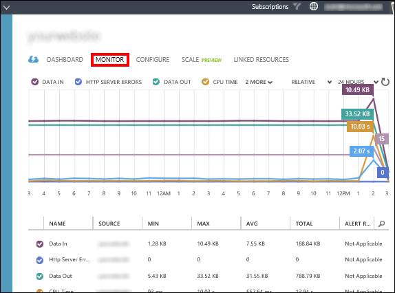

<properties
	pageTitle="解决 502 错误的网关、503 服务不可用错误 | Azure"
	description="排查 Azure App Service 中托管的 Web 应用出现的“502 错误的网关”和“503 服务不可用”错误。"
	services="app-service\web"
	documentationCenter=""
	authors="cephalin"
	manager="wpickett"
	editor=""
	tags="top-support-issue"
	keywords="502 错误的网关, 503 服务不可用, 错误 503, 错误 502"/>

<tags
	ms.service="app-service-web"
	ms.date="07/06/2016"
	wacn.date="09/26/2016"/>  

# 排查 Azure Web 应用中的“502 错误的网关”和“503 服务不可用”HTTP 错误

[Azure App Service](/documentation/articles/app-service-changes-existing-services/) 中托管的 Web 应用经常出现“502 错误的网关”和“503 服务不可用”错误。本文将帮助你排查这些错误。

如果你对本文中的任何观点存在疑问，可以联系 [MSDN Azure 和 CSDN Azure](/support/forums/) 上的 Azure 专家。或者，你也可以提出 Azure 支持事件。请转到 [Azure 支持站点](/support/contact/)并单击“获取支持”。

## 症状

浏览 Web 应用时返回 HTTP 错误“502 错误的网关”或 HTTP 错误“503 服务不可用”。

## 原因

此问题通常是应用程序级别的问题造成的，例如：

-	请求耗费过长的时间
-	应用程序的内存/CPU 使用率过高
-	应用程序因异常而崩溃

## 解决“502 错误的网关”和“503 服务不可用”错误的故障排除步骤

故障排除可划分为三种不同的任务，依次为：

1.	[观察和监视应用程序行为](#observe)
2.	[收集数据](#collect)
3.	[缓解问题](#mitigate)

[应用服务 Web 应用](/home/features/app-service/web-apps/)为每个步骤提供了多种选项。

###  1.观察和监视应用程序行为

####	跟踪服务运行状况

每次发生服务中断或性能下降时 Azure 会进行宣传。可以在 [Azure 门户预览](https://portal.azure.cn/)中跟踪服务的运行状况。有关详细信息，请参阅[跟踪服务的运行状况](/documentation/articles/insights-service-health/)。

####	监视你的 Web 应用

此页可让你找出应用程序是否存在任何问题。在 Azure 经典管理门户中，单击 Web 应用对应的“监视”。

你可能想要在 Web 应用中监视的一些指标包括

-	平均内存工作集
-	平均响应时间
-	CPU 时间
-	内存工作集
-	请求

  

有关详细信息，请参阅：

-	[在 Azure App Service 中监视 Web Apps](/documentation/articles/web-sites-monitor/)
-	[接收警报通知](/documentation/articles/insights-receive-alert-notifications/)

###  2.收集数据

####	使用 Azure App Service 支持门户

在 Web 应用中，可通过查看 HTTP 日志、事件日志、进程转储等信息来排查与 Web 应用相关的问题。你可以使用支持门户 (**http://&lt;your app name>.scm.chinacloudsites.cn/Support**) 访问所有这些信息。

Azure App Service 支持门户具有三个不同的选项卡，用于支持常见故障排除方案的三个步骤：

1.	观察当前行为
2.	通过收集诊断信息和运行内置分析器进行分析
3.	缓解

如果目前正在发生问题，请单击“分析”>“诊断”>“立即诊断”创建诊断会话，该会话将收集 HTTP 日志、事件查看器日志、内存转储、PHP 错误日志和 PHP 进程报告。

完成数据收集后，该会话将对数据运行分析并提供一份 HTML 报告。

如果你想要下载数据，数据默认情况下会存储在 D:\\home\\data\\DaaS 文件夹中。

有关 Azure App Service 支持门户的详细信息，请参阅[用于支持 Azure 网站的站点扩展的最新更新](http://azure.microsoft.com/blog/new-updates-to-support-site-extension-for-azure-websites)。

####	使用 Kudu 调试控制台

Web Apps 随附可用于调试、浏览和上载文件的调试控制台，以及用于获取环境相关信息的 JSON 终结点。此控制台称为 Web 应用的 _Kudu 控制台_或 _SCM 仪表板_。

你可以通过转到链接 **https://&lt;Your app name>.scm.chinacloudsites.cn/** 来访问此仪表板。

Kudu 提供的一些信息和功能包括：

-	应用程序的环境设置
-	日志流
-	诊断转储
-	调试控制台，你可以在其中运行 Powershell cmdlet 和基本 DOS 命令。

Kudu 的另一项有用功能是，如果应用程序引发第一次异常，你可以使用 Kudu 和 SysInternals 工具 Procdump 创建内存转储。这些内存转储是进程的快照，通常可以帮助你排查较复杂的 Web 应用问题。

有关 Kudu 提供的功能的详细信息，请参阅[你应该了解的 Azure 网站联机工具](https://azure.microsoft.com/blog/windows-azure-websites-online-tools-you-should-know-about/)。

###  3.缓解问题

####	缩放 Web 应用

在 Azure App Service 中，为了提高性能和吞吐量，可以调整运行应用程序的规模。向上缩放 Web 应用涉及到两个相关操作：将 App Service 计划更改为较高的定价层，以及在切换到较高的定价层后配置特定的设置。

有关缩放的详细信息，请参阅[在 Azure App Service 中缩放 Web 应用](/documentation/articles/web-sites-scale/)。

此外，你可以选择在多个实例上运行应用程序。这不仅能提供更强大的处理能力，而且还能提供一定程度的容错。如果进程在某个实例上中断，其他实例仍将继续处理请求。

可以将缩放设置为手动或自动。

####	使用 AutoHeal

AutoHeal 会根据你选择的设置（例如配置更改、请求、基于内存的限制或执行请求所需的时间），回收应用程序的工作进程。在大多数情况下，回收进程是在出现问题后进行恢复的最快方式。尽管始终可以从 Azure 门户预览直接重新启动 Web 应用，但 AutoHeal 可以自动为你执行此操作。你只需在 Web 应用的根 web.config 中添加一些触发器即可。请注意，即使你的应用程序并非 .Net 应用程序，这些设置的工作方式也仍然相同。

有关详细信息，请参阅[自动修复 Azure 网站](https://azure.microsoft.com/blog/auto-healing-windows-azure-web-sites/)。

####	重新启动 Web 应用

这通常是在发生一次性问题后进行恢复的最简单方式。[Azure 门户预览](https://portal.azure.cn/)上的 Web 应用边栏选项卡中提供了用于停止或重新启动应用的选项。

 

你还可以使用 Azure Powershell 管理 Web 应用。有关详细信息，请参阅[将 Azure PowerShell 与 Azure 资源管理器配合使用](/documentation/articles/powershell-azure-resource-manager/)。

<!---HONumber=Mooncake_0919_2016-->