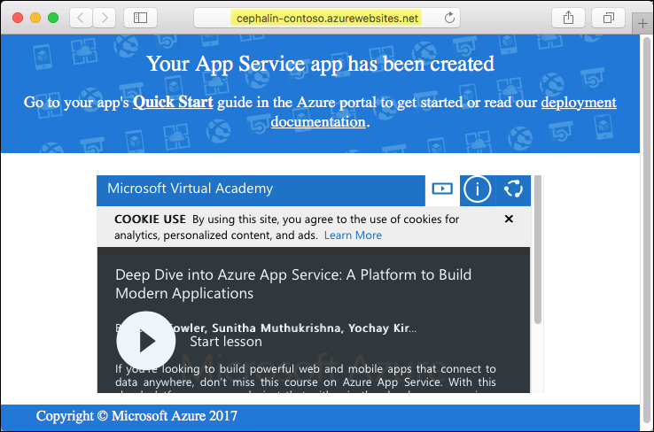
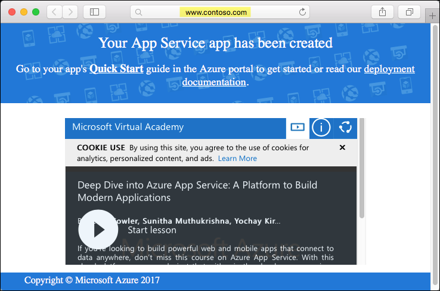
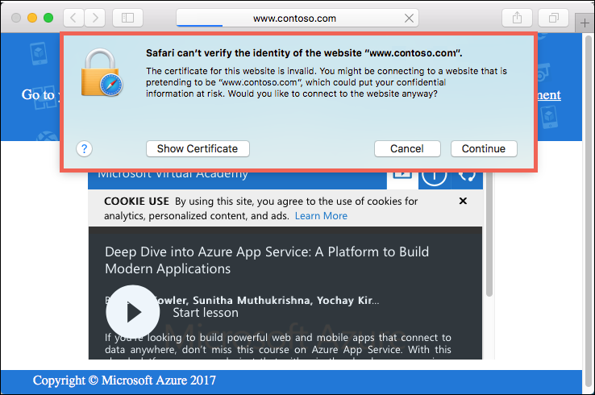
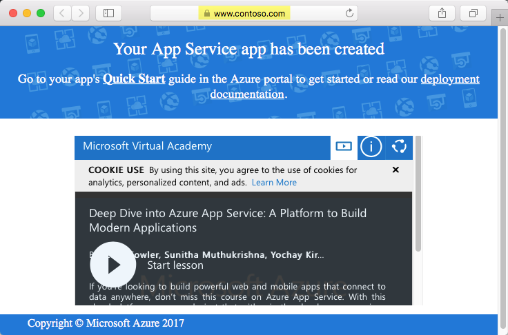

<properties
    pageTitle="将自定义域和 SSL 添加到 Azure Web 应用 | Azure"
    description="了解如何通过添加公司品牌为投入生产准备 Azure Web 应用。 将自定义域名（虚域）映射到 Web 应用并使用自定义 SSL 证书保护其安全。"
    services="app-service\web"
    documentationcenter="nodejs"
    author="cephalin"
    manager="erikre"
    editor=""
    translationtype="Human Translation" />
<tags
    ms.assetid="dc446e0e-0958-48ea-8d99-441d2b947a7c"
    ms.service="app-service-web"
    ms.workload="web"
    ms.tgt_pltfrm="na"
    ms.devlang="nodejs"
    ms.topic="article"
    ms.date="03/29/2017"
    wacn.date="05/02/2017"
    ms.author="cephalin"
    ms.sourcegitcommit="78da854d58905bc82228bcbff1de0fcfbc12d5ac"
    ms.openlocfilehash="565367691c28abb53ccac54c9d414e42be866598"
    ms.lasthandoff="04/22/2017" />

# 将自定义域和 SSL 添加到 Azure Web 应用

本教程介绍如何快速将自定义域名映射到 Azure Web 应用并使用自定义 SSL 证书保护其安全。 

## 开始之前

在运行此示例之前，请在本地安装 [Azure CLI 2.0](https://docs.microsoft.com/zh-cn/cli/azure/install-azure-cli)。

你还需要对相应域提供商的 DNS 配置页拥有管理访问权限。 例如，若要添加 `www.contoso.com`，需要能够配置 `contoso.com` 的 DNS 条目。

最后，对于要上载和绑定的 SSL 证书，需要具有一个有效的 .PFX 文件及其密码。 应配置此 SSL 证书来保护所需的自定义域名。 在上面的示例中，SSL 证书应保护 `www.contoso.com`。 

## 步骤 1 - 创建 Azure Web 应用

### 登录 Azure

现在，我们将在终端窗口中使用 Azure CLI 2.0 创建所需的资源用于在 Azure 中托管该 Node.js 应用。  使用 [az login](https://docs.microsoft.com/zh-cn/cli/azure/#login) 命令登录到 Azure 订阅，并按照屏幕上的说明进行操作。 

    az login 

[AZURE.INCLUDE [azure-cli-2-azurechinacloud-environment-parameter](../../includes/azure-cli-2-azurechinacloud-environment-parameter.md)]

### 创建资源组   
使用 [az group create](https://docs.microsoft.com/zh-cn/cli/azure/group#create) 创建资源组。 Azure 资源组是在其中部署和管理 Azure 资源（例如 Web 应用、数据库和存储帐户）的逻辑容器。 

    az group create --name myResourceGroup --location chinanorth 

若要查看适用于 `--location` 的可能值，请使用 `az appservice list-locations` Azure CLI 命令。

## 创建应用服务计划

使用 [az appservice plan create](https://docs.microsoft.com/zh-cn/cli/azure/appservice/plan#create) 命令创建应用服务计划。 

> [AZURE.NOTE] 
> 应用服务计划表示用于托管应用的物理资源集合。 分配到应用服务计划的所有应用程序将共享该计划定义的资源，在托管多个应用时可以节省成本。 
>   
> 应用服务计划定义： 
> * 区域（中国北部、中国东部） 
> * 实例大小（小、中、大） 
> * 规模计数（一个、两个、三个实例，等等） 
> * SKU（免费、共享、基本、标准、高级）

以下示例创建一个名为 `myAppServicePlan` 且使用**基本**定价层的应用服务计划。

    az appservice plan create --name myAppServicePlan --resource-group myResourceGroup --sku B1

创建应用服务计划后，Azure CLI 将显示类似于以下示例的信息。 

    { 
        "id": "/subscriptions/00000000-0000-0000-0000-000000000000/resourceGroups/myResourceGroup/providers/Microsoft.Web/serverfarms/myAppServicePlan", 
        "kind": "app", 
        "location": "China North", 
        "sku": { 
        "capacity": 1, 
        "family": "B", 
        "name": "B1", 
        "tier": "Basic" 
        }, 
        "status": "Ready", 
        "type": "Microsoft.Web/serverfarms" 
    } 

## 创建 Web 应用

创建应用服务计划后，请在 `myAppServicePlan` 应用服务计划中创建 Web 应用。 该 Web 应用提供托管空间用于部署代码，并提供一个 URL 用于查看已部署的应用程序。 使用 [az appservice web create](https://docs.microsoft.com/zh-cn/cli/azure/appservice/web#create) 命令创建该 Web 应用。 

在以下命令中，请将出现的 `<app_name>` 占位符替换为你自己的唯一应用名称。 此唯一名称将用作 Web 应用的默认域名的一部分，因此，该名称需要在 Azure 中的所有应用之间保持唯一。 稍后，可以先将任何自定义 DNS 条目映射到 Web 应用，然后向用户公开该条目。 

    az appservice web create --name <app_name> --resource-group myResourceGroup --plan myAppServicePlan 

创建 Web 应用后，Azure CLI 将显示类似于以下示例的信息。 

    { 
        "clientAffinityEnabled": true, 
        "defaultHostName": "<app_name>.chinacloudsites.cn", 
        "id": "/subscriptions/00000000-0000-0000-0000-000000000000/resourceGroups/myResourceGroup/providers/Microsoft.Web/sites/<app_name>", 
        "isDefaultContainer": null, 
        "kind": "app", 
        "location": "China North", 
        "name": "<app_name>", 
        "repositorySiteName": "<app_name>", 
        "reserved": true, 
        "resourceGroup": "myResourceGroup", 
        "serverFarmId": "/subscriptions/00000000-0000-0000-0000-000000000000/resourceGroups/myResourceGroup/providers/Microsoft.Web/serverfarms/myAppServicePlan", 
        "state": "Running", 
        "type": "Microsoft.Web/sites", 
    } 

在 JSON 输出中，`defaultHostName` 显示了你的 Web 应用的默认域名。 在浏览器中，导航到此地址。

    http://<app_name>.chinacloudsites.cn 

  

## 步骤 2 - 配置 DNS 映射

在此步骤中，你将添加一个从自定义域到 Web 应用默认域名 `<app_name>.chinacloudsites.cn` 的映射。 通常，需要在域提供商的网站上执行此步骤。 每个域注册机构的网站都略有不同，因此你应查阅提供商的文档。 但是，仍然有一些一般准则。 

### 导航到 DNS 管理页

首先，登录到域注册机构的网站。  

然后，找到用于管理 DNS 记录的页面。 查找站点中标签为“域名”、“DNS”或“名称服务器管理”的链接或区域。 通常可通过查看帐户信息，然后查找如“我的域” 之类的链接，便可以找到链接。

在找到该页面后，查找允许添加或编辑 DNS 记录的链接。 这可能是**区域文件**或**DNS 记录**链接，也可能是**高级配置**链接。

### 创建 CNAME 记录

添加一条 CNAME 记录，用于将所需的子域名称映射到 Web 应用的默认域名（`<app_name>.chinacloudsites.cn`，其中 `<app_name>` 是应用的唯一名称）。

对于 `www.contoso.com` 示例，请创建一个将 `www` 主机名映射到 `<app_name>.chinacloudsites.cn` 的 CNAME。

## 步骤 3 - 在 Web 应用中配置自定义域

在域提供商的网站上完成主机名映射配置后，可以在 Web 应用中配置自定义域。 可以使用 [az appservice web config hostname add](https://docs.microsoft.com/zh-cn/cli/azure/appservice/web/config/hostname#add) 命令添加此配置。 

在以下命令中，请将 `<app_name>` 替换为唯一的应用名称，将 <your_custom_domain> 替换为完全限定的自定义域名（例如 `www.contoso.com`）。 

    az appservice web config hostname add --webapp <app_name> --resource-group myResourceGroup --name <your_custom_domain>

自定义域现在已完全映射到 Web 应用。 在浏览器中，导航到自定义域名。 例如：

    http://www.contoso.com 

  

## 步骤 4 - 将自定义 SSL 证书绑定到 Web 应用

现在你已有了一个 Azure Web 应用，你希望为其提供的域名显示在浏览器的地址栏中。 但是，如果现在导航到 `https://<your_custom_domain>`，将会发生证书错误。 

  

之所以发生此错误，是因为 Web 应用还没有与自定义域名匹配的 SSL 证书绑定。 但是，如果导航到 `https://<app_name>.chinacloudsites.cn`，则不会发生错误。 这是因为，默认情况下，应用以及所有 Azure 应用服务应用都由 `*.chinacloudsites.cn` 通配符域的 SSL 证书提供保护。 

若要通过自定义域名访问 Web 应用，需要将自定义域的 SSL 证书绑定到该 Web 应用。 你将在此步骤中执行此操作。 

### 上载 SSL 证书

使用 [az appservice web config ssl upload](https://docs.microsoft.com/zh-cn/cli/azure/appservice/web/config/ssl#upload) 命令将自定义域的 SSL 证书上载到 Web 应用。

在以下命令中，请将 `<app_name>` 替换为唯一的应用名称，将 `<path_to_ptx_file>` 替换为 .PFX 文件的路径，将 `<password>` 替换为证书的密码。 

    az appservice web config ssl upload --name <app_name> --resource-group myResourceGroup --certificate-file <path_to_pfx_file> --certificate-password <password> 

上载证书后，Azure CLI 将显示类似于以下示例的信息：

    {
      "cerBlob": null,
      "expirationDate": "2018-03-29T14:12:57+00:00",
      "friendlyName": "",
      "hostNames": [
        "www.contoso.com"
      ],
      "hostingEnvironmentProfile": null,
      "id": "/subscriptions/00000000-0000-0000-0000-000000000000/resourceGroups/myResourceGroup/providers/Microsoft.Web/cert
    ificates/9FD1D2D06E2293673E2A8D1CA484A092BD016D00__China North_myResourceGroup",
      "issueDate": "2017-03-29T14:12:57+00:00",
      "issuer": "www.contoso.com",
      "keyVaultId": null,
      "keyVaultSecretName": null,
      "keyVaultSecretStatus": "Initialized",
      "kind": null,
      "location": "China North",
      "name": "9FD1D2D06E2293673E2A8D1CA484A092BD016D00__China North_myResourceGroup",
      "password": null,
     "pfxBlob": null,
      "publicKeyHash": null,
      "resourceGroup": "myResourceGroup",
      "selfLink": null,
      "serverFarmId": null,
      "siteName": null,
      "subjectName": "www.contoso.com",
      "tags": null,
      "thumbprint": "9FD1D2D06E2293673E2A8D1CA484A092BD016D00",
      "type": "Microsoft.Web/certificates",
      "valid": null
    }

在 JSON 输出中，`thumbprint` 显示了上载的证书的指纹。 请复制其值供下一步骤使用。

### 将上载的 SSL 证书绑定到 Web 应用

Web 应用现在具有了所需的自定义域名，并且它还具有一个用于保护该自定义域的 SSL 证书。 剩下的唯一要做的事情就是将已上载的证书绑定到 Web 应用。 可以使用 [az appservice web config ssl bind](https://docs.microsoft.com/zh-cn/cli/azure/appservice/web/config/ssl#bind) 命令实现此目的。

在以下命令中，请将 `<app_name>` 替换为唯一的应用名称，将 `<thumbprint-from-previous-output>` 替换为通过前面所示的命令获取的证书指纹。 

    az appservice web config ssl bind --name <app_name> --resource-group myResourceGroup --certificate-thumbprint <thumbprint-from-previous-output> --ssl-type SNI

将证书绑定到 Web 应用后，Azure CLI 将显示类似于以下示例的信息：

    {
      "availabilityState": "Normal",
      "clientAffinityEnabled": true,
      "clientCertEnabled": false,
      "cloningInfo": null,
      "containerSize": 0,
      "dailyMemoryTimeQuota": 0,
      "defaultHostName": "<app_name>.chinacloudsites.cn",
      "enabled": true,
      "enabledHostNames": [
        "www.contoso.com",
        "<app_name>.chinacloudsites.cn",
        "<app_name>.scm.chinacloudsites.cn"
      ],
      "gatewaySiteName": null,
      "hostNameSslStates": [
        {
          "hostType": "Standard",
          "name": "<app_name>.chinacloudsites.cn",
          "sslState": "Disabled",
          "thumbprint": null,
          "toUpdate": null,
          "virtualIp": null
        },
        {
          "hostType": "Repository",
          "name": "<app_name>.scm.chinacloudsites.cn",
          "sslState": "Disabled",
          "thumbprint": null,
          "toUpdate": null,
          "virtualIp": null
        },
        {
          "hostType": "Standard",
          "name": "www.contoso.com",
          "sslState": "SniEnabled",
          "thumbprint": "9FD1D2D06E2293673E2A8D1CA484A092BD016D00",
          "toUpdate": null,
          "virtualIp": null
        }
      ],
      "hostNames": [
        "www.contoso.com",
        "<app_name>.chinacloudsites.cn"
      ],
      "hostNamesDisabled": false,
      "hostingEnvironmentProfile": null,
      "id": "/subscriptions/00000000-0000-0000-0000-000000000000/resourceGroups/myResourceGroup/providers/Microsoft.Web/site
    s/<app_name>",
      "isDefaultContainer": null,
      "kind": "WebApp",
      "lastModifiedTimeUtc": "2017-03-29T14:36:18.803333",
      "location": "China North",
      "maxNumberOfWorkers": null,
      "microService": "false",
      "name": "<app_name>",
      "outboundIpAddresses": "13.94.143.57,13.94.136.57,40.68.199.146,13.94.138.55,13.94.140.1",
      "premiumAppDeployed": null,
      "repositorySiteName": "<app_name>",
      "reserved": false,
      "resourceGroup": "myResourceGroup",
      "scmSiteAlsoStopped": false,
      "serverFarmId": "/subscriptions/00000000-0000-0000-0000-000000000000/resourceGroups/myResourceGroup/providers/Microsof
    t.Web/serverfarms/myAppServicePlan",
      "siteConfig": null,
      "slotSwapStatus": null,
      "state": "Running",
      "suspendedTill": null,
      "tags": null,
      "targetSwapSlot": null,
      "trafficManagerHostNames": null,
      "type": "Microsoft.Web/sites",
      "usageState": "Normal"
    }

在浏览器中，导航到自定义域名的 HTTPS 终结点。 例如：

    https://www.contoso.com 

