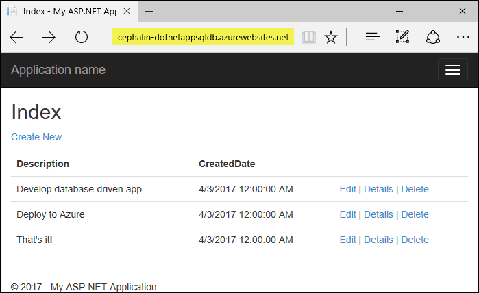
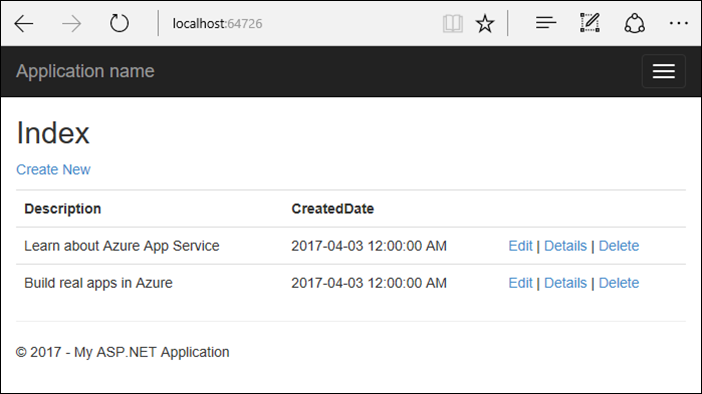
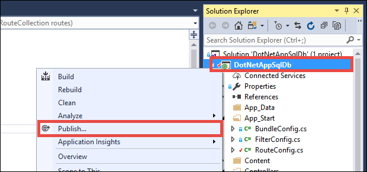
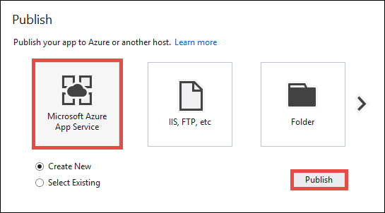
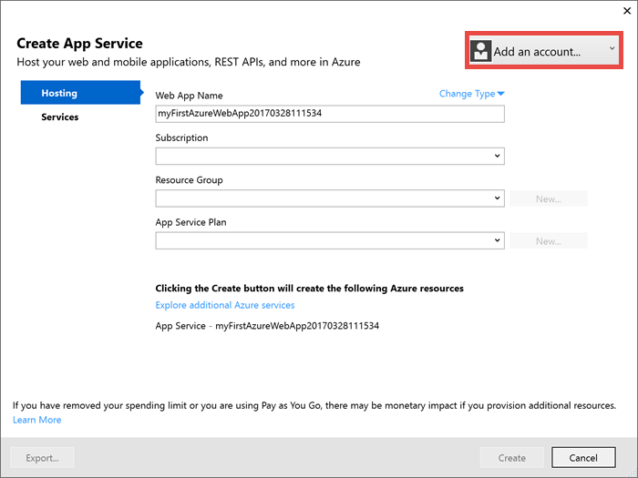
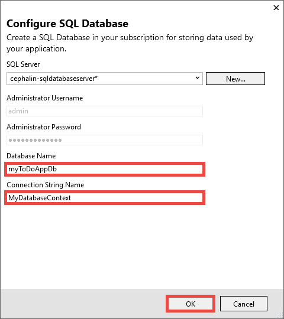
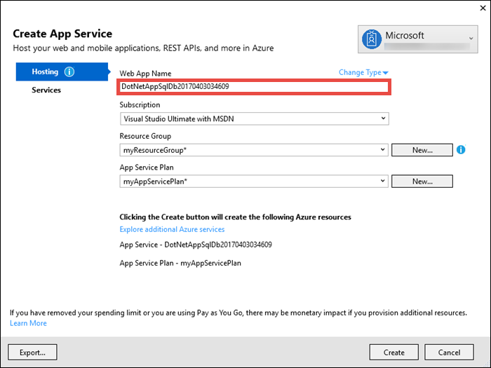
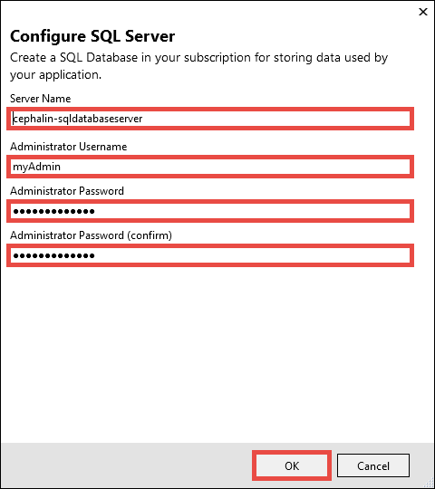

<properties
    pageTitle="使用 SQL 数据库在 Azure 中创建 ASP.NET | Azure"
    description="了解如何在 Azure 中运行 MEAN.js 应用，并使用 MongoDB 连接字符串连接到 DocumentDB 数据库。"
    services="app-service\web"
    documentationcenter="nodejs"
    author="cephalin"
    manager="erikre"
    editor=""
    translationtype="Human Translation" />
<tags
    ms.assetid="03c584f1-a93c-4e3d-ac1b-c82b50c75d3e"
    ms.service="app-service-web"
    ms.workload="web"
    ms.tgt_pltfrm="na"
    ms.devlang="nodejs"
    ms.topic="article"
    ms.date="04/03/2017"
    wacn.date="05/02/2017"
    ms.author="cephalin"
    ms.sourcegitcommit="78da854d58905bc82228bcbff1de0fcfbc12d5ac"
    ms.openlocfilehash="943f44538488f82063c414c4f0974f699e22dcb7"
    ms.lasthandoff="04/22/2017" />

# 使用 SQL 数据库在 Azure 中创建 ASP.NET

[AZURE.INCLUDE [azure-sdk-developer-differences](../../includes/azure-sdk-developer-differences.md)]

本教程介绍如何在 Azure 中开发数据驱动的 ASP.NET Web 应用。 只需花费几分钟即可将 Web 应用连接到 Azure SQL 数据库，并在经过极少量的配置后启用数据驱动的功能。 完成此过程后，便可以在 [Azure 应用服务](/documentation/articles/app-service-value-prop-what-is/)中运行数据驱动的 ASP.NET Web 应用，并将其连接到 SQL 数据库。

本教程以**个人用户帐户**使用 ASP.NET 模板。 此模板使用 [ASP.NET 实体框架](https://docs.microsoft.com/aspnet/entity-framework)来管理 Web 应用程序中的用户配置文件。 

## 开始之前

本教程演示如何使用 Visual Studio 2017 构建 ASP.NET Web 应用并将其部署到 Azure。 如果尚未安装 Visual Studio 2017，可以下载并使用**免费的** [Visual Studio 2017 Community Edition](https://www.visualstudio.com/zh-cn/downloads/)。 在安装 Visual Studio 的过程中，请确保启用“Azure 开发”。

此外，还需要安装 [Git](http://www.git-scm.com/downloads)。

## 步骤 1 - 设置示例应用程序
在此步骤中，你将设置本地 ASP.NET 项目。

### 克隆示例应用程序

打开 PowerShell 窗口，然后运行 `CD` 切换到工作目录。

运行以下命令克隆示例存储库。 此示例存储库包含一个标准 [ASP.NET](http://asp.net) 应用程序。

    git clone https://github.com/cephalin/DotNetAppSqlDb.git

### 运行应用程序

在 Visual Studio 2017 中，从存储库根目录启动 `DotNetAppSqlDb.sln`。

打开示例解决方案后，键入 `F5` 在浏览器中运行该 Web 应用。

主页中应会显示一个简单的 CRUD（创建-读取-更新-删除）应用。 请尝试在空列表中添加几个待办事项。

应用将使用 ASP.NET 实体框架来访问本地数据库。 数据库上下文使用名为 `MyDbConnection` 的连接字符串。 此连接字符串在 `Web.config` 中定义，在 `Models\MyDatabaseContext.cs` 中引用。 稍后将 Azure Web 应用连接到 Azure SQL 数据库时，只需使用此连接字符串名称。 

## 发布到 Azure

在“解决方案资源管理器”中，右键单击 “myWebAppWithSqlDb”项目，然后选择“发布”。

确保已选择“Azure 应用服务”，然后单击“发布”。

此时将打开“创建应用服务”对话框，帮助你创建所需的所有 Azure 资源，以便在 Azure 中运行 ASP.NET Web 应用。

### 登录 Azure

[AZURE.INCLUDE [azure-visual-studio-login-guide](../../includes/azure-visual-studio-login-guide.md)]

在“创建应用服务”对话框中单击“添加帐户”，然后登录到你的 Azure 订阅。 如果已登录到 Azure 帐户，请确保该帐户包含你的 Azure 订阅。 如果登录的 Azure 帐户不包含你的 Azure 订阅，请单击该帐户添加正确的帐户。

登录后，可在此对话框中创建 Azure Web 应用所需的所有资源。

### 创建资源组

首先需要一个_资源组_。 

> [AZURE.NOTE] 
> 资源组是在其中部署和管理 Azure 资源（例如 Web 应用、数据库和存储帐户）的逻辑容器。
>
>

在“资源组”旁边单击“新建”。

将资源组命名为 **myResourceGroup**，然后单击“确定”。

### 创建应用服务计划

Azure Web 应用还需要一个_应用服务计划_。 

> [AZURE.NOTE]
> 应用服务计划表示用于托管应用的物理资源集合。 分配到应用服务计划的所有应用将共享该计划定义的资源，在托管多个应用时可以节省成本。 
>  
> 应用服务计划定义：
> - 区域（中国北部、中国东部）
> - 实例大小（小、中、大）
> - 规模计数（一个、两个、三个实例，等等） 
> - SKU（免费、共享、基本、标准、高级）
>

在“应用服务计划”旁边单击“新建”。 

在“配置应用服务计划”对话框中，使用以下设置配置新的应用服务计划：

- **应用服务计划**：键入 **myAppServicePlan**。 
- **位置**：选择“中国北部”或想要使用的其他任何区域。
- **大小**：选择“免费”或想要使用的其他任何[定价层](/pricing/details/app-service/)。

单击 **“确定”**。

### 配置 Web 应用名称

在“Web 应用名称”中键入唯一的应用名称。 此名称将用作应用 (`<app_name>.chinacloudsites.cn`) 的默认 DNS 名称的一部分，因此，需要在 Azure 中的所有应用之间保持唯一。 稍后，可以先将自定义域名映射到应用，然后向用户公开该域名。

也可以接受自动生成的名称，这已是一个唯一的名称。

### 配置 SQL 数据库

单击“浏览其他 Azure 服务”。

在“服务”选项卡中，单击“SQL 数据库”旁边的 **+** 图标。 

在“配置 SQL 数据库”对话框中，单击“新建”创建一个新的数据库服务器。 

在“服务器名称”中键入唯一的名称。 此名称将用作数据库服务器 (`<server_name>.database.chinacloudapi.cn`) 的默认 DNS 名称的一部分，因此，需要在 Azure 中的所有 SQL 数据库服务器之间保持唯一。 

根据需要配置剩余的字段，然后单击“确定”。

在“数据库名称”中，键入 `myToDoAppDb` 或任何偏好的名称。

在“连接字符串名称”中，键入 `MyDatabaseContext`。 此名称必须与 `Models\MyDatabaseContext.cs` 中引用的连接字符串匹配。

## 创建并发布 Web 应用

单击“创建” 。 

向导完成创建 Azure 资源后，会自动将 ASP.NET 应用程序发布到 Azure（首次发布），然后在默认浏览器中启动发布的 Azure Web 应用。

请尝试在空列表中添加几个待办事项。

祝贺你！数据驱动的 ASP.NET 应用程序正在 Azure 应用服务中实时运行。

## 后续步骤

浏览预先创建的 [Web 应用 PowerShell 脚本](/documentation/articles/app-service-powershell-samples/)。