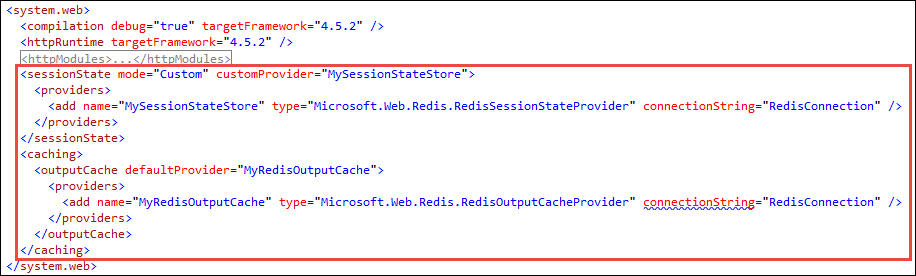

<properties
    pageTitle="在 Azure 中构建超大规模应用 | Azure"
    description="了解如何在 Azure 中使用不同的 Azure 服务最大化 ASP.NET 应用的性能。"
    services="app-service\web"
    documentationcenter="dotnet"
    author="cephalin"
    manager="erikre"
    editor=""
    translationtype="Human Translation" />
<tags
    ms.assetid="a4d49ac7-0f97-4997-84c5-cdb9c4465757"
    ms.service="app-service-web"
    ms.workload="web"
    ms.tgt_pltfrm="na"
    ms.devlang="nodejs"
    ms.topic="article"
    ms.date="03/23/2017"
    wacn.date="05/02/2017"
    ms.author="cephalin"
    ms.sourcegitcommit="78da854d58905bc82228bcbff1de0fcfbc12d5ac"
    ms.openlocfilehash="4cc873f33c0e6b5710d070706d79b417a8cfd225"
    ms.lasthandoff="04/22/2017" />

# 在 Azure 中构建超大规模 Web 应用

本教程介绍如何扩展 Azure 中的 ASP.NET Web 应用，以最大化用户请求数。

开始学习本教程之前，请确保在计算机上[安装 Azure CLI](https://docs.microsoft.com/zh-cn/cli/azure/install-azure-cli)。 此外，需要在运行示例应用程序的本地计算机上安装 [Visual Studio](https://www.visualstudio.com/vs/)。

## 步骤 1 - 获取示例应用程序
在此步骤中，你将设置本地 ASP.NET 项目。

### 克隆应用程序存储库

打开所选的命令行终端，并使用 `CD` 切换到工作目录。 然后，运行以下命令克隆示例应用程序。 

    git clone https://github.com/cephalin/HighScaleApp.git

### 在 Visual Studio 中运行示例应用程序

在 Visual Studio 中打开解决方案。

    cd HighScaleApp
    .\HighScaleApp.sln

键入 `F5` 运行应用程序。

此示例 ASP.NET Web 应用程序来自默认模板，可以保存用户会话并使用输出缓存。 查看 `HighScaleApp\Controllers\HomeController.cs`。 `Index()` 方法将一个数据片段添加到会话。

    Session.Add("visited", "true"); 

`About()` 和 `Contact()` 方法缓存它们的输出。

    [OutputCache(Duration = 60)]

## 步骤 2 - 部署到 Azure
在此步骤中，你将创建一个 Azure Web 应用并在其中部署示例 ASP.NET 应用程序。

### 创建资源组   

[AZURE.INCLUDE [azure-cli-2-azurechinacloud-environment-parameter](../../includes/azure-cli-2-azurechinacloud-environment-parameter.md)]

使用 [az group create](https://docs.microsoft.com/zh-cn/cli/azure/group#create) 在中国北部区域中创建一个[资源组](/documentation/articles/resource-group-overview/)。 资源组是放置你要统一管理的所有 Azure 资源（例如 Web 应用及其 SQL 数据库后端）的位置。

    az group create --location "China North" --name myResourceGroup

若要查看可对 `--location` 使用的可能值，请使用 [az appservice list-locations](https://docs.microsoft.com/zh-cn/cli/azure/appservice#list-locations) 命令。

### 创建应用服务计划
使用 [az appservice plan create](https://docs.microsoft.com/zh-cn/cli/azure/appservice/plan#create) 创建“B1”[应用服务计划](/documentation/articles/azure-web-sites-web-hosting-plans-in-depth-overview/)。 

    az appservice plan create --name myAppServicePlan --resource-group myResourceGroup --sku B1

应用服务计划是一个缩放单位，可以包含你要通过示例应用服务体系结构统一纵向扩展或横向扩展的任意数目的应用。 每个计划还分配有[定价层](/pricing/details/app-service/)。 更高的层包含更好的硬件和更多的功能，例如更多的横向扩展实例。

在本教程中，B1 是允许横向扩展到三个实例的最小层。 以后，随时可以运行 [az appservice plan update](https://docs.microsoft.com/zh-cn/cli/azure/appservice/plan#update) 来上下调整应用的定价层。 

### 创建 Web 应用
使用 [az appservice web create](https://docs.microsoft.com/zh-cn/cli/azure/appservice/web#create) 创建在 `$appName` 中具有唯一名称的 Web 应用。

    $appName = "<replace-with-a-unique-name>"
    az appservice web create --name $appName --resource-group myResourceGroup --plan myAppServicePlan

### 设置部署凭据
使用 [az appservice web deployment user set](https://docs.microsoft.com/zh-cn/cli/azure/appservice/web/deployment/user#set) 设置应用服务的帐户级部署凭据。

    az appservice web deployment user set --user-name <letters-numbers> --password <mininum-8-char-captital-lowercase-letters-numbers>

### 配置 Git 部署
使用 [az appservice web source-control config-local-git](https://docs.microsoft.com/zh-cn/cli/azure/appservice/web/source-control#config-local-git) 配置本地 Git 部署。

    az appservice web source-control config-local-git --name $appName --resource-group myResourceGroup

此命令提供类似于下面的输出：

    {
      "url": "https://user123@myuniqueappname.scm.chinacloudsites.cn/myuniqueappname.git"
    }

使用返回的 URL 配置 Git remote。 以下命令使用前面的输出示例。

    git remote add azure https://user123@myuniqueappname.scm.chinacloudsites.cn/myuniqueappname.git

### 部署示例应用程序
现已准备好部署示例应用程序。 运行 `git push`。

    git push azure master

当系统提示输入密码时，请使用运行 `az appservice web deployment user set` 时指定的密码。

### 浏览到 Azure Web 应用
使用 [az appservice web browse](https://docs.microsoft.com/zh-cn/cli/azure/appservice/web#browse) 命令查看 Azure 中实时运行的应用。

    az appservice web browse --name $appName --resource-group myResourceGroup

## 步骤 3 - 连接到 Redis
在此步骤中，你要将 Azure Redis 缓存设置为 Azure Web 应用的外部归置缓存。 可以快速利用 Redis 来缓存页面输出。 此外，以后当你横向扩展 Web 应用时，Redis 可帮助你在多个实例之间可靠保存用户会话。

### 创建 Azure Redis 缓存
使用 [az redis create](https://docs.microsoft.com/zh-cn/cli/azure/redis#create) 创建 Azure Redis 缓存并保存 JSON 输出。 请在 `$cacheName` 中使用唯一的名称。

    $cacheName = "<replace-with-a-unique-cache-name>"
    $redis = (az redis create --name $cacheName --resource-group myResourceGroup --location "China North" --sku-capacity 0 --sku-family C --sku-name Basic | ConvertFrom-Json)

### 将应用程序配置为使用 Redis
设置缓存连接字符串的格式。

    $connstring = "$($redis.hostname):$($redis.sslPort),password=$($redis.accessKeys.primaryKey),ssl=True,abortConnect=False"
    $connstring 

第二行应该提供类似于下面的输出：

    mycachename.redis.cache.chinacloudapi.cn:6380,password=/rQP/TLz1mrEPpmh9b/gnfns/t9vBRXqXn3i1RwBjGA=,ssl=True,abortConnect=False

在 Visual Studio 上的项目根中创建名为 `redis.config` 的 Web 配置文件，并将以下代码粘贴到该文件中。 在 `value` 中，使用 PowerShell 输出中的连接字符串。

    <appSettings>
      <add key="RedisConnection" value="your-azure-redis-cache-connection-string"/>
    </appSettings>

在 Git 存储库中查看 `.gitignore` 文件时，可以看到此文件已从源代码管理中排除。 这样，就会安全保存你的敏感信息。 

打开 `Web.config`。 请注意 `<appSettings file="redis.config">` 元素，它可以获取 `redis.config` 中创建的设置。 

找到包含 `<sessionState>` 和 `<caching>` 的带有注释的节。 取消注释此节。

此代码将查找 `RedisConnection` 中定义的 Redis 连接字符串。 

现在，你的应用程序将使用 Redis 来管理会话和缓存。 键入 `F5` 运行应用程序。 如果需要，可以下载 Redis 管理客户端来可视化现已保存到缓存中的数据。

### 在 Azure 中配置连接字符串

要使应用程序在 Azure 中正常工作，需要在 Azure Web 应用中配置相同的 Redis 连接字符串。 由于 `redis.config` 未保留在源代码管理中，因此，运行 Git 部署时，它不会部署到 Azure。

使用 [az appservice web config appsettings update](https://docs.microsoft.com/zh-cn/cli/azure/appservice/web/config/appsettings#update) 添加同名 (`RedisConnection`) 的连接字符串。

    az appservice web config appsettings update --settings "RedisConnection=$connstring" --name $appName --resource-group myResourceGroup

请记住，`$connstring` 包含带格式的连接字符串。

### 将应用程序重新部署到 Azure
使用 Git 命令将更改推送到 Azure

    git add .
    git commit -m "now use Redis providers"
    git push azure master

当系统提示输入密码时，请使用运行 `az appservice web deployment user set` 时指定的密码。

### 浏览到 Azure Web 应用
使用 [az appservice web browse](https://docs.microsoft.com/zh-cn/cli/azure/appservice/web#browse) 查看 Azure 中的实时更改。

    az appservice web browse --name $appName --resource-group myResourceGroup

## 步骤 4 - 扩展到多个实例
应用服务计划是 Azure Web 应用的缩放单位。 若要横向扩展 Web 应用，可以扩展应用服务计划。

使用 [az appservice plan update](https://docs.microsoft.com/zh-cn/cli/azure/appservice/plan#update) 将应用服务计划横向扩展到三个实例，这是 B1 定价层允许的最大数目。 请记住，B1 是之前创建应用服务计划时选择的定价层。 

    az appservice plan update --name myAppServicePlan --resource-group myResourceGroup --number-of-workers 3 

## 步骤 5 - 按地理位置扩展
按地理位置扩展时，需在 Azure 云的多个区域中运行应用。 这种设置可以根据地理位置进一步对应用进行负载均衡，并通过将应用放置在更靠近客户端浏览器的位置来减小响应时间。

在此步骤中，你将使用 [Azure 流量管理器](/documentation/services/traffic-manager/)将 ASP.NET Web 应用扩展到另一个区域。 结束此步骤后，中国北部将运行一个 Web 应用（已创建），中国东部将运行另一个 Web 应用（尚未创建）。 应该从同一个流量管理器 URL 提供这两个应用。

### 将中国北部的应用纵向扩展到标准层
在应用服务中，与 Azure 流量管理器的集成需要使用标准定价层。 使用 [az appservice plan update](https://docs.microsoft.com/zh-cn/cli/azure/appservice/plan#update) 将应用服务计划纵向扩展到 S1。 

    az appservice plan update --name myAppServicePlan --resource-group myResourceGroup --sku S1

### 创建流量管理器配置文件 
使用 [az network traffic-manager profile create](https://docs.microsoft.com/zh-cn/cli/azure/network/traffic-manager/profile#create) 创建流量管理器配置文件并将其添加到资源组。 在 $dnsName 中使用唯一的 DNS 名称。

    $dnsName = "<replace-with-unique-dns-name>"
    az network traffic-manager profile create --name myTrafficManagerProfile --resource-group myResourceGroup --routing-method Performance --unique-dns-name $dnsName

> [AZURE.NOTE]
> `--routing-method Performance` 指定此配置文件要[将用户流量路由到最靠近的终结点](/documentation/articles/traffic-manager-routing-methods/)。

### 获取中国北部应用的资源 ID
使用 [az appservice web show](https://docs.microsoft.com/zh-cn/cli/azure/appservice/web#show) 获取 Web 应用的资源 ID。

    $appId = az appservice web show --name $appName --resource-group myResourceGroup --query id --output tsv

### 为中国北部的应用添加流量管理器终结点
使用 [az network traffic-manager endpoint create](https://docs.microsoft.com/zh-cn/cli/azure/network/traffic-manager/endpoint#create) 将一个终结点添加到流量管理器配置文件，并使用 Web 应用的资源 ID 作为目标。

    az network traffic-manager endpoint create --name myChinaNorthEndpoint --profile-name myTrafficManagerProfile --resource-group myResourceGroup --type azureEndpoints --target-resource-id $appId

### 获取流量管理器终结点 URL
现在，流量管理器配置文件包含一个指向现有 Web 应用的终结点。 使用 [az network traffic-manager profile show](https://docs.microsoft.com/zh-cn/cli/azure/network/traffic-manager/profile#show) 获取该终结点的 URL。 

    az network traffic-manager profile show --name myTrafficManagerProfile --resource-group myResourceGroup --query dnsConfig.fqdn --output tsv

将输出复制到浏览器中。 随后应会再次显示你的 Web 应用。

### 在中国东部创建 Azure Redis 缓存
现在，请将 Azure Web 应用程序复制到中国东部区域。 若要开始，请使用 [az redis create](https://docs.microsoft.com/zh-cn/cli/azure/redis#create) 在中国东部创建另一个 Azure Redis 缓存。 此缓存需要与中国东部的应用放置在一起。

    $redis = (az redis create --name $cacheName-east --resource-group myResourceGroup --location "China East" --sku-capacity 0 --sku-family C --sku-name Basic | ConvertFrom-Json)

`--name $cacheName-east` 为该缓存指定与中国北部的缓存相同的名称，并添加 `-east` 后缀。

### 在中国东部创建应用服务计划
运行 [az appservice plan create](https://docs.microsoft.com/zh-cn/cli/azure/appservice/plan#create)，使用 S1 层（中国北部的计划也使用此层）在中国东部区域创建另一个应用服务计划。

    az appservice plan create --name myAppServicePlanEast --resource-group myResourceGroup --location "China North" --sku S1

### 在中国东部创建 Web 应用
使用 [az appservice web create](https://docs.microsoft.com/zh-cn/cli/azure/appservice/web#create) 创建另一个 Web 应用。

    az appservice web create --name $appName-east --resource-group myResourceGroup --plan myAppServicePlanEast

`--name $appName-east` 为该应用指定与中国北部应用相同的名称，并添加 `-east` 后缀。

### 配置 Redis 的连接字符串
使用 [az appservice web config appsettings update](https://docs.microsoft.com/zh-cn/cli/azure/appservice/web/config/appsettings#update) 将中国东部缓存的连接字符串添加到该 Web 应用。

    az appservice web config appsettings update --settings "RedisConnection=$($redis.hostname):$($redis.sslPort),password=$($redis.accessKeys.primaryKey),ssl=True,abortConnect=False" --name $appName-east --resource-group myResourceGroup

### 配置中国东部应用的 Git 部署。
使用 [az appservice web source-control config-local-git](https://docs.microsoft.com/zh-cn/cli/azure/appservice/web/source-control#config-local-git) 配置第二个 Web 应用的本地 Git 部署。

    az appservice web source-control config-local-git --name $appName-east --resource-group myResourceGroup

此命令提供类似于下面的输出：

    {
      "url": "https://user123@myuniqueappname-east.scm.chinacloudsites.cn/myuniqueappname.git"
    }

使用返回的 URL 为本地存储库配置另一个 Git remote。 以下命令使用前面的输出示例。

    git remote add azure-east https://user123@myuniqueappname-east.scm.chinacloudsites.cn/myuniqueappname.git

### 部署示例应用程序
运行 `git push` 将示例应用程序部署到第二个 Git remote。 

    git push azure-east master

当系统提示输入密码时，请使用运行 `az appservice web deployment user set` 时指定的密码。

### 浏览到中国东部的应用
使用 [az appservice web browse](https://docs.microsoft.com/zh-cn/cli/azure/appservice/web#browse) 验证你的应用是否在 Azure 中实时运行。

    az appservice web browse --name $appName-east --resource-group myResourceGroup

### 获取中国东部应用的资源 ID
使用 [az appservice web show](https://docs.microsoft.com/zh-cn/cli/azure/appservice/web#show) 获取中国东部 Web 应用的资源 ID。

    $appIdEast = az appservice web show --name $appName-east --resource-group myResourceGroup --query id --output tsv

### 为中国东部的应用添加流量管理器终结点
使用 [az network traffic-manager endpoint create](https://docs.microsoft.com/zh-cn/cli/azure/network/traffic-manager/endpoint#create) 将另一个终结点添加到流量管理器配置文件。

    az network traffic-manager endpoint create --name myEastEndpoint --profile-name myTrafficManagerProfile --resource-group myResourceGroup --type azureEndpoints --target-resource-id $appIdEast

### 将区域标识符添加到 Web 应用
使用 [az appservice web config appsettings update](https://docs.microsoft.com/zh-cn/cli/azure/appservice/web/config/appsettings#update) 添加区域特定的环境变量。

    az appservice web config appsettings update --settings "Region=China North" --name $appName --resource-group myResourceGroup
    az appservice web config appsettings update --settings "Region=China East" --name $appName-east --resource-group myResourceGroup

应用程序代码已使用此应用程序设置。 查看 `HighScaleApp\Views\Home\Index.cshtml`。

### 搞定！

现在，请尝试通过不同地理区域中的浏览器访问流量管理器配置文件的 URL。 中国北部的客户端浏览器应显示“ASP.NET China North”，中国东部的客户端浏览器应显示“ASP.NET China East”。