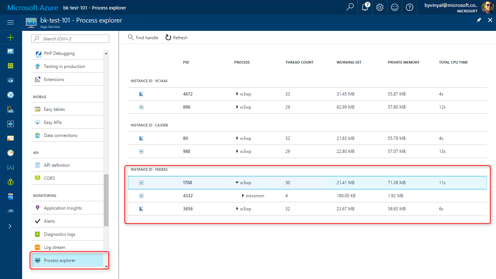
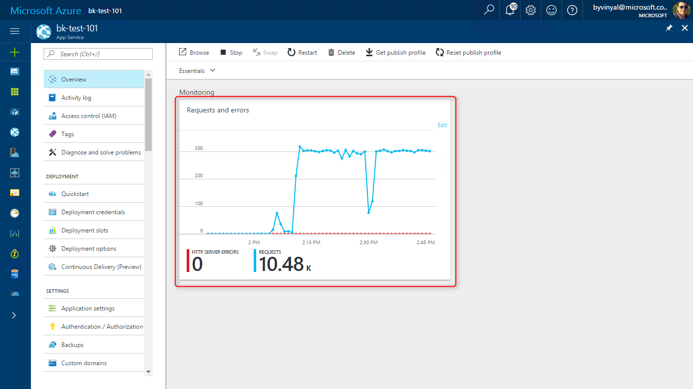
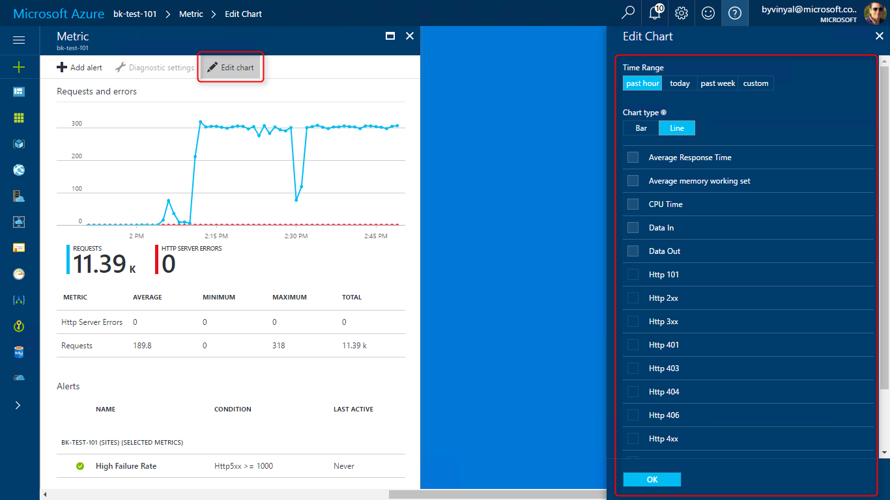
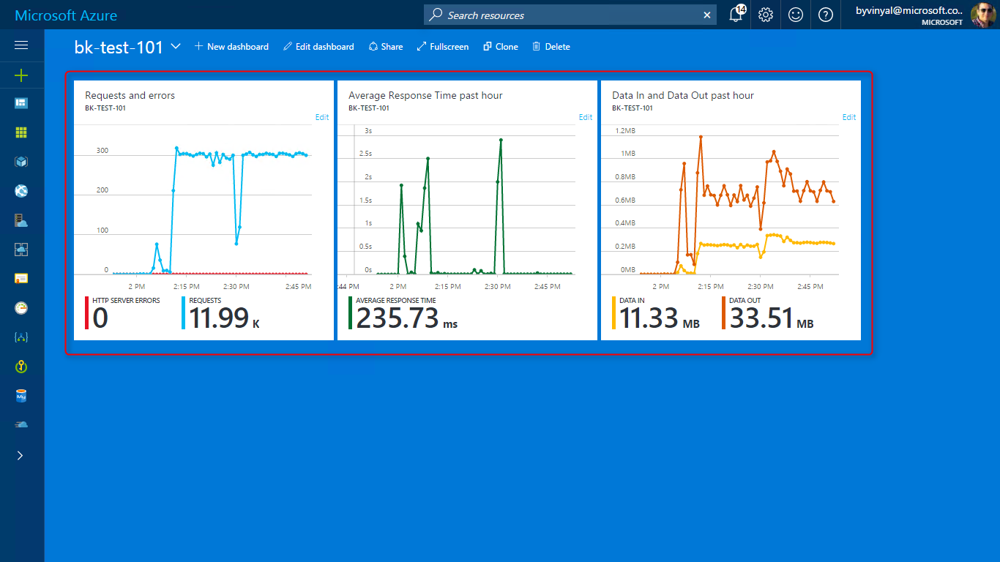
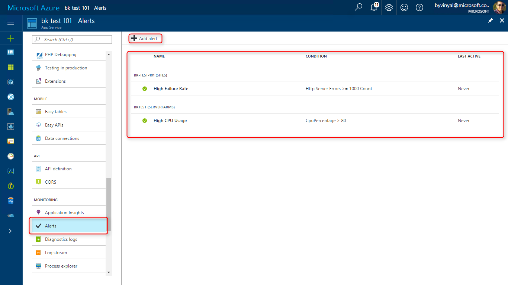
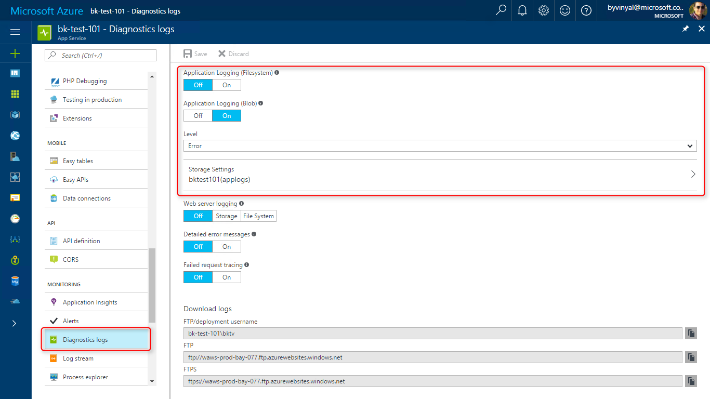
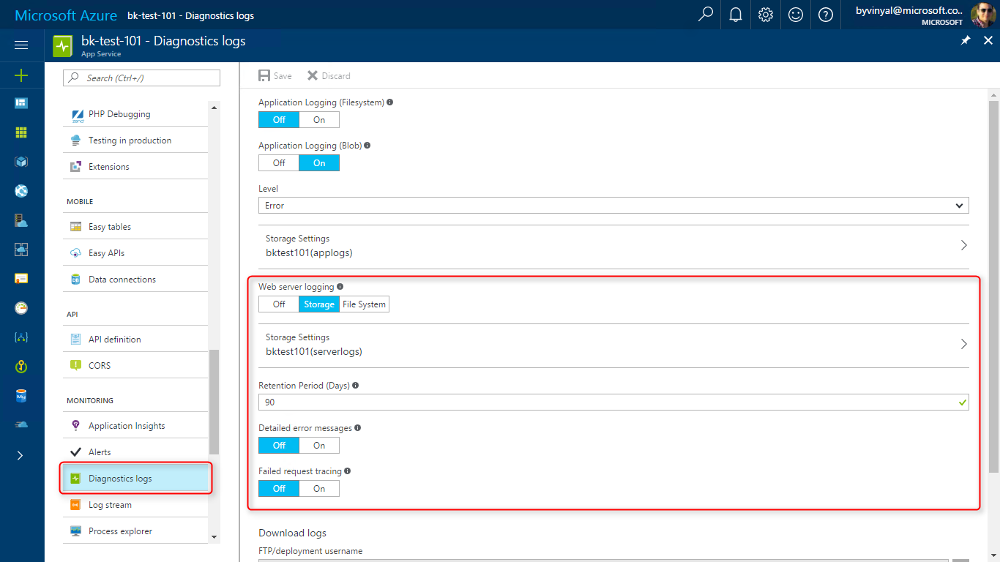
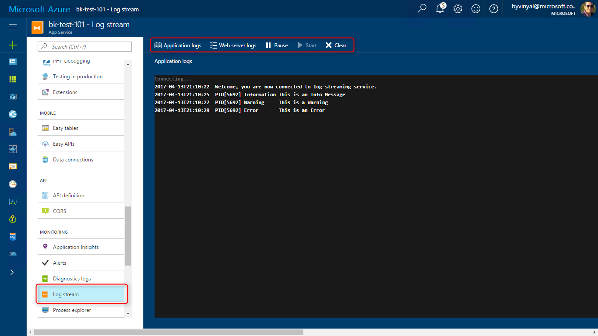
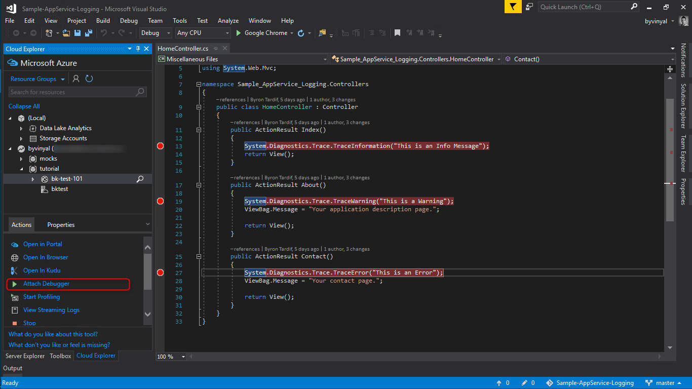

<properties
    pageTitle="监视 Web 应用 | Azure"
    description="了解如何在 Web 应用中设置监视"
    services="App-Service"
    keywords=""
    author="btardif"
    translationtype="Human Translation" />
<tags
    ms.author="byvinyal"
    ms.date="04/04/2017"
    wacn.date="05/02/2017"
    ms.topic="article"
    ms.service="app-service-web"
    ms.sourcegitcommit="78da854d58905bc82228bcbff1de0fcfbc12d5ac"
    ms.openlocfilehash="6c7e705921d5fab427722f5fbf912251c034e7cb"
    ms.lasthandoff="04/22/2017" />

# 监视应用服务
本教程介绍如何使用内置平台工具来监视和诊断应用服务中托管的应用。 

## 本教程的内容

1. [进程资源管理器](#explorer)
    - 获取有关应用服务计划的各个实例中运行的应用的详细信息
1. [应用服务指标](#metrics) 
    - 了解如何使用内置图表监视应用
    - 根据需要配置图表
    - 通过固定自定义图表创建自定义仪表板
1. [配置警报](#alerts)
    - 了解如何为应用和应用服务计划配置警报
1. [配置日志记录](#logging)
    - 了解如何收集服务器日志和应用程序日志。
    - 了解用于存储日志的不同位置以及如何访问这些日志。
1. [日志流式传输](#streaming)
    - 使用“流式传输日志”查看发出的应用程序日志和 wc3 日志。
1. [远程调试](#remote)
    - 使用 Visual Studio 远程调试应用服务中运行的项目。

## 开始之前

- 需要使用一个 Web 应用来监视活动和遵循所述的步骤。 
    - 可以遵循 [Create an ASP.NET app in Azure with SQL Database](/documentation/articles/app-service-web-tutorial-dotnet-sqldatabase/)（在 Azure 中创建包含 SQL 数据库的 ASP.NET 应用）教程中所述的步骤创建一个应用程序。

- 如果想要对应用程序试用**远程调试**，需要安装 Visual Studio。 
    - 如果尚未安装 Visual Studio 2017，可以下载并使用免费的 [Visual Studio 2017 Community Edition](https://www.visualstudio.com/zh-cn/downloads/)。 
    - 在安装 Visual Studio 的过程中，请确保启用“Azure 开发”。

##  步骤 1 - 进程资源管理器

进程资源管理器是可让你获取有关应用服务计划内部工作状态的详细信息的工具。

使用**进程资源管理器**可以：

- 枚举应用服务计划的不同实例中的所有进程。
- 钻取和查看与每个进程关联的句柄与模块。 
- 在进程级别查看 CPU、工作集和线程计数，帮助识别失控的进程
- 查找打开的文件句柄，甚至可以终止特定的进程实例。

可以通过“监视” > “进程资源管理器”调用进程资源管理器。

##  步骤 2 - 查看应用服务指标
**指标**提供有关 Web 应用及其与用户和平台之间的交互的详细信息。

可以使用指标来获取以下方面的见解：
- 应用使用的资源量
- 应用的流量
- 总体请求/失败数
- 传入/传出数据量

对于应用服务中托管的任何应用，必须监视 Web 应用和应用服务计划。

- “应用”指标提供有关 http 请求数/失败数和平均响应时间的信息。
- “应用服务计划”指标提供有关资源利用率的信息。

在 Azure 门户中，可以使用 **Azure Monitor** 快速直观地检查应用的指标，

- 转到想要监视的应用的“概述”边栏选项卡即可。

- 可以通过**“监视”磁贴**查看应用的指标。
- 单击该磁贴可以编辑和配置要查看哪些指标，以及要显示哪个时间范围。

- 可将自定义图表固定到仪表板，以方便访问和快速参考。

> [AZURE.TIP]
> 使用以下链接了解有关 Azure Monitor 的详细信息：
> 
 - [Azure Monitor 入门](/documentation/articles/monitoring-overview/)
> 
 - [Azure 门户仪表板](/documentation/articles/azure-portal-dashboards/)

##  步骤 3 - 配置警报

使用**警报**可以自动监视应用程序。

检测到影响应用的相关条件时，警报会发出通知。

若要创建警报，请执行以下操作：
- 转到想要监视的应用的“概述”边栏选项卡即可。
- 在菜单中，导航到“监视” > “警报”
- 选择“[+] 添加警报”
- 根据需要配置警报。

> [AZURE.TIP]
> 使用以下链接了解有关 Azure 警报的详细信息：
> 
 - [对指标执行操作](/documentation/articles/monitoring-overview/)

##  步骤 4 - 日志记录
使用日志记录可以收集 Web 应用的**应用程序诊断**日志和 **Web 服务器诊断**日志。

使用诊断日志可以了解应用程序的行为、排查应用程序问题，以及了解故障状态。

### 应用程序诊断
使用应用程序诊断可以捕获应用程序在运行时生成的跟踪。 

若要启用应用程序日志记录，请执行以下操作：

- 转到“监视” > “诊断日志”。 
- 使用切换开关启用应用程序日志记录。

可将应用程序日志存储到 Web 应用的文件系统，或推送到 Blob 存储。

> [AZURE.TIP]
> 对于生产方案，建议使用 Blob 存储

在 ASP.NET 中，可以使用 [System.Diagnostics.Trace 类](https://msdn.microsoft.com/zh-cn/library/system.diagnostics.trace.aspx)记录应用程序跟踪，生成可由日志基础结构捕获的事件。 还可以指定跟踪的严重性以方便筛选。

    public ActionResult Delete(Guid? id)
    {
        System.Diagnostics.Trace.TraceInformation("GET /Todos/Delete/" + id);
        if (id == null)
        {
            System.Diagnostics.Trace.TraceError("/Todos/Delete/ failed, ID is null");
            return new HttpStatusCodeResult(HttpStatusCode.BadRequest);
        }
        Todo todo = db.Todoes.Find(id);
        if (todo == null)
        {
            System.Diagnostics.Trace.TraceWarning("/Todos/Delete/ failed, ID: " + id + " could not be found");
            return HttpNotFound();
        }
        System.Diagnostics.Trace.TraceInformation("GET /Todos/Delete/" + id + "completed successfully");
        return View(todo);
    }

> [AZURE.IMPORTANT]
> 启用日志记录会对应用程序的性能和资源利用率造成影响。 对于生产方案，建议使用错误日志。 仅当需要调查问题时，才启用更详细的日志记录。

### Web 服务器诊断
应用服务可以收集三种不同类型的服务器日志：

- **Web 服务器日志记录** 
    - 有关使用 [W3C 扩展日志文件格式](https://msdn.microsoft.com/zh-cn/library/windows/desktop/aa814385.aspx)的 HTTP 事务的信息。 
    - 确定总体站点指标（例如处理的请求数或来自特定 IP 地址的请求数）时，这些信息非常有用。
- **详细错误日志记录** 
    - 指示故障的 HTTP 状态代码（状态代码 400 或更高）的详细错误消息。 
- **失败请求跟踪** 
    - 有关失败请求的详细信息，包括对用于处理请求的 IIS 组件和每个组件所用的时间的跟踪。 
    - 在尝试查找导致特定 HTTP 错误的问题时，失败请求跟踪很有用。

若要启用服务器日志记录，请执行以下操作：
- 转到“监视” > “诊断日志”。 
- 使用切换开关启用不同类型的 Web 服务器诊断。

> [AZURE.IMPORTANT]
> 启用日志记录会对应用程序的性能和资源利用率造成影响。 对于生产方案，建议使用错误日志；仅当需要调查问题时，才启用更详细的日志记录。

### 访问日志
使用 Azure 存储资源管理器访问 Blob 存储中存储的日志。

通过 FTP 访问 Web 应用的文件系统中存储的日志，路径如下：

- **应用程序日志** - /LogFiles/Application/。 
    - 此文件夹包含一个或多个包含应用程序日志记录生成的信息的文本文件。
- **失败请求跟踪** - /LogFiles/W3SVC#########/。 
    - 此文件夹包含一个 XSL 文件和一个或多个 XML 文件。 
- **详细错误日志** - /LogFiles/DetailedErrors/。 
    - 此文件夹包含一个或多个 .htm 文件，其中提供了有关应用生成的 HTTP 错误的广泛信息。
- **Web 服务器日志** - /LogFiles/http/RawLogs。 
    - 此文件夹包含使用 W3C 扩展日志文件格式进行格式化的一个或多个文本文件。

##  步骤 5 - 日志流式传输
生成**应用程序日志**和 **Web 服务器日志**后，应用服务可以流式传输这些日志。 

调试应用程序时，流式传输日志非常方便，因为与通过 FTP 或其他方法访问日志相比，这可以节省时间。

> [AZURE.TIP]
> 在流式传输日志之前，请务必根据[日志记录](#logging)部分中所述启用日志收集。

若要流式传输日志，请执行以下操作：
- 转到“监视”> “日志流”
- 根据要查找的信息，选择“应用程序日志”或“Web 服务器日志”。
- 在此处还可以暂停、重新启动和清除缓冲区。

> [AZURE.TIP]
> 仅当应用中发生流量时才会生成日志；你也可以增大日志的详细程度，以获取更多事件或信息。

##  步骤 6 - 远程调试
使用**远程调试**可将调试器附加到云中运行的 Web 应用。 可以设置断点、直接操作内存、逐行执行代码，甚至更改代码路径，就像在本地运行应用一样。

将远程调试与诊断日志结合使用可以查找并解决应用程序问题。

若要将调试器附加到云中运行的应用，请执行以下操作：

- 使用 Visual Studio 2017 打开要调试的应用的解决方案 
- 像本地开发时一样，设置一些断点。
- 打开**云资源管理器**（Ctrl + /、Ctrl + X）。
- 根据需要使用 Azure 凭据登录。
- 找到要调试的应用
- 在“操作”窗格中选择“附加调试器”。

Visual Studio 将为应用程序配置远程调试，并启动一个浏览器窗口用于导航到你的应用。 请浏览你的应用以触发断点并逐行执行代码。

> [AZURE.WARNING]
> 不建议在生产环境中以调试模式运行。 如果生产应用未扩展，无法容纳多个服务器实例，则调试会阻止 Web 服务器响应其他请求。 若要排查生产问题，可利用的最佳资源是[配置日志记录](#logging)