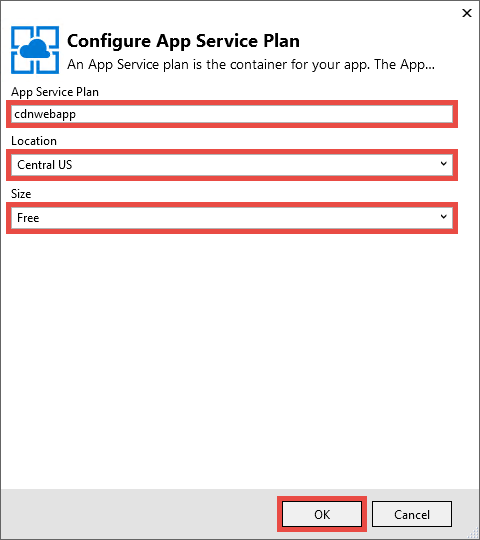
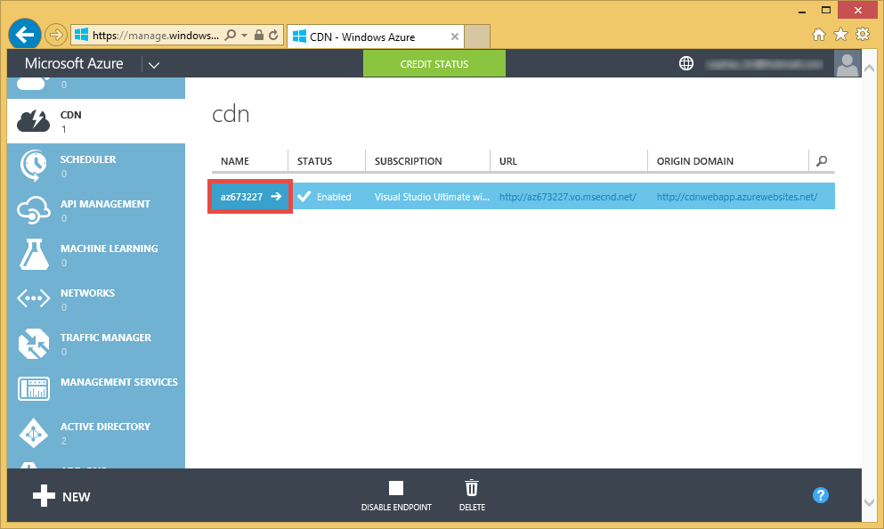
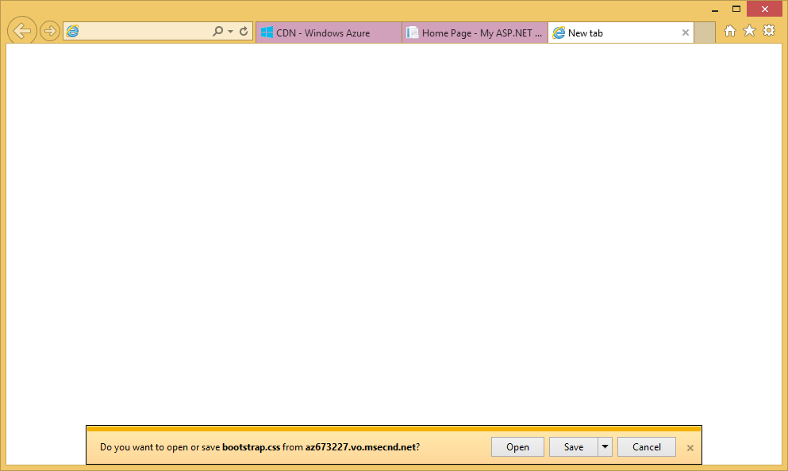
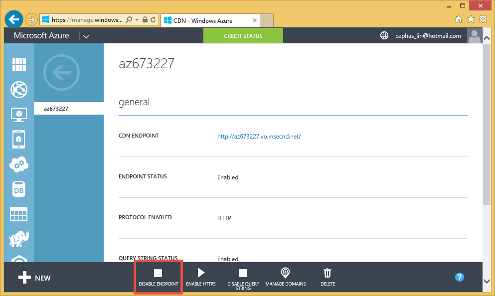

<properties 
	pageTitle="在 Azure App Service 中使用 Azure CDN" 
	description="本教程演示如何将 Web 应用部署到 Azure App Service，以便从集成的 Azure CDN 终结点提供内容" 
	services="app-service\web,cdn" 
	documentationCenter=".net" 
	authors="cephalin" 
	manager="wpickett" 
	editor="jimbe"/>

<tags 
	ms.service="app-service" 
	ms.workload="tbd" 
	ms.tgt_pltfrm="na" 
	ms.devlang="dotnet" 
	ms.topic="article" 
	ms.date="07/01/2016" 
	wacn.date="02/21/2017" 
	ms.author="cephalin"/>

# 在 Azure App Service 中使用 Azure CDN

[AZURE.INCLUDE [azure-sdk-developer-differences](../../includes/azure-sdk-developer-differences.md)]

[应用服务](/documentation/articles/app-service-changes-existing-services/)可以与 [Azure CDN](/home/features/cdn/) 集成，增强[应用服务 Web 应用](/documentation/articles/app-service-changes-existing-services/)中固有的全局缩放功能，在全国通过靠近客户的服务器节点提供 Web 应用内容（如需已更新的包含所有最新节点位置的列表，请单击[此处](http://msdn.microsoft.com/zh-cn/library/azure/gg680302.aspx)）。在特定情况下（例如提供静态映像），此集成可以大幅提高 Azure 应用服务 Web 应用的性能，在全国显著改善 Web 应用的用户体验。

将 Web 应用与 Azure CDN 集成具有以下优点：

- 在 Web 应用的[持续部署](/documentation/articles/app-service-continuous-deployment/)过程中集成内容部署（映像、脚本和样式表）
- 轻松升级 Azure 应用服务的 Web 应用中的 NuGet 包，例如 jQuery 或 Bootstrap 版本
- 在同一 Visual Studio 界面中管理 Web 应用程序和 CDN 提供的内容
- 将 ASP.NET 绑定和缩减与 Azure CDN 集成

[AZURE.INCLUDE [app-service-web-to-api-and-mobile](../../includes/app-service-web-to-api-and-mobile.md)]

## 要生成的项目 ##

[AZURE.INCLUDE [azure-sdk-developer-differences](../../includes/azure-visual-studio-login-guide.md)]

你需要在 Visual Studio 中使用默认的 ASP.NET MVC 模板将一个 Web 应用部署到 Azure 应用服务，需要添加代码来处理集成 Azure CDN 所提供的内容（例如映像、控制器操作结果、默认的 JavaScript 和 CSS 文件），还需要编写代码来配置回退机制以处理 CDN 脱机时提供的捆绑包。

## 所需的项目 ##

本教程需要满足以下前提条件：

-	有效的 [Azure 帐户](/pricing/1rmb-trial/)
-	带有[用于 .NET 的 Azure SDK](http://go.microsoft.com/fwlink/p/?linkid=323510&clcid=0x409) 的 Visual Studio 2015如果使用 Visual Studio，步骤可能有所不同。

> [AZURE.NOTE] 完成本教程需要有一个 Azure 帐户：
> 可以[注册一个 Azure 帐户](/pricing/1rmb-trial/) — 获取可用来试用付费版 Azure 服务的信用额度，用完信用额度后，仍可以保留帐户和使用免费的 Azure 服务（如 Web 应用）。

## 将 Web 应用部署到具有集成 CDN 终结点的 Azure ##

在本部分，你需要将 Visual Studio 2015 中的默认 ASP.NET MVC 应用程序模板部署到应用服务，然后将其与新 CDN 终结点集成。请根据以下说明进行操作：

1. 在 Visual Studio 2015 中转到“文件”>“新建”>“项目”>“Web”>“ASP.NET Web 应用程序”，以便从菜单栏创建新 ASP.NET Web 应用程序。为该应用程序提供一个名称，然后单击“确定”。

	  

3. 选择“MVC”，然后单击“确定”。

	  

4. 如果尚未登录 Azure 帐户，请单击右上角的帐户图标，并按照对话框提示登录 Azure 帐户。完成后，如下所示配置应用，然后单击“新建”来为应用创建新应用服务计划。

	  

5. 如下所示在对话框中配置一个新应用服务计划，然后单击“确定”。

	  

8. 单击“创建”以创建 Web 应用。

	  

9. 创建完 ASP.NET 应用程序后，可以将其发布到 Azure，只需在“Azure 应用服务活动”窗格中单击“立刻将 `<app name>` 发布到此 Web 应用”即可。单击“发布”完成此过程。

	  

	发布完成后，可在浏览器中看到发布的 Web 应用。

1. 若要创建 CDN 终结点，请登录 [Azure 经典管理门户](https://manage.windowsazure.cn)。
2. 单击“新建 > 应用服务 > CDN > 快速创建”。选择 **http://*&lt;sitename>*.chinacloudsites.cn/** 并单击**“创建”**。

	  

	> [AZURE.NOTE] 创建 CDN 终结点以后，管理门户就会显示其 URL 以及所集成的源域。不过，需要一定的时间才能将新 CDN 终结点的配置完全传播到所有 CDN 节点位置。

3. 返回经典管理门户，在“CDN”选项卡中，单击刚才创建的 CDN 终结点的名称。

	  

3. 单击“启用查询字符串”在 CDN 缓存中启用查询字符串。启用此功能后，通过不同的查询字符串进行访问的同一链接就可以缓存为不同的项。

	  

启用此功能后，通过不同的查询字符串进行访问的同一链接就可以缓存为不同的项。

>[AZURE.NOTE] 虽然启用查询字符串对于教程的此部分来说不是必需的，但为方便起见，最好是尽早启用此功能，因为在这里所做的任何更改都需要一定的时间才能传播到所有 CDN 节点，而你并不想让任何非查询字符串支持的内容充斥 CDN 缓存（稍后将讨论如何更新 CDN 内容）。

2. 现在，导航到 CDN 终结点地址。如果终结点已准备就绪，则会看到 Web 应用。如果收到 **HTTP 404** 错误，则说明 CDN 终结点尚未准备好。CDN 配置传播到所有边缘节点可能需要长达 1 小时。

	  

1. 接下来，可尝试访问 ASP.NET 项目中的 **~/Content/bootstrap.css** 文件。在浏览器窗口中，导航到 **http://*&lt;cdnName>*.azureedge.net/Content/bootstrap.css**。在我的设置中，此 URL 为：

		http://az673227.azureedge.net/Content/bootstrap.css

	这对应于 CDN 终结点的以下源 URL：

		http://cdnwebapp.chinacloudsites.cn/Content/bootstrap.css

	导航到 **http://*&lt;cdnName>*.azureedge.net/Content/bootstrap.css** 时，系统会提示下载 bootstrap.css，该文件来自你在 Azure 中的 Web 应用。

	  

你可以直接通过 CDN 终结点，采用类似方式访问 **http://*&lt;serviceName>*.chinacloudapp.cn/** 中提供的任何可公开访问的 URL。例如：

-	/Script 路径中的 .js 文件
-	/Content 路径中的任何内容文件
-	任何控制器/操作
-	任何带查询字符串的 URL（如果在 CDN 终结点启用了查询字符串功能）
-	整个 Azure Web 应用（如果所有内容都是公共的）

请注意，通过 Azure CDN 提供整个 Azure Web 应用可能并不适合所有情况（或者说，可能并不是通用的作法）。部分注意事项如下：

-	此方法要求你的整个站点都是公共的，因为 Azure CDN 不能提供任何私有内容。
-	如果 CDN 终结点因某种原因而脱机（不管是因为计划的维护，还是因为用户错误），则整个 Web 应用都会脱机，除非可以将客户重定向到源 URL **http://*&lt;sitename>*.chinacloudsites.cn/**。
-	即使使用自定义的缓存-控制设置（参见[在Azure Web 应用中配置静态文件的缓存选项](#configure-caching-options-for-static-files-in-your-azure-web-app)），CDN 终结点也不会改善活动度极强的动态内容的性能。请注意，如果尝试从如上所示的 CDN 终结点加载主页，则第一次操作时至少需要 5 秒钟才能加载默认主页，该主页非常简单。想象一下，如果此页包含每分钟必须更新的动态内容，则客户端体验会是一种什么样的情景？从 CDN 终结点提供动态内容要求缓存过期时间短，这会造成在 CDN 终结点处频繁出现缓存未命中的情况。这会损害 Azure Web 应用的性能，与 CDN 的初衷背道而驰。

替代方法是在 Azure Web 应用中按每次的具体情况来判断哪些内容可以由 Azure CDN 提供。就这点来说，我们已向你介绍了如何通过 CDN 终结点访问各个内容文件。我会在[通过 Azure CDN 的控制器操作提供内容](#serve-content-from-controller-actions-through-azure-cdn)中向你演示如何处理通过 CDN 终结点进行的特定控制器操作。

##  在 Azure Web 应用中配置静态文件的缓存选项 ##

通知在 Azure Web 应用中进行 Azure CDN 集成，你可以指定你所希望的在 CDN 终结点中缓存静态内容的方式。为此，请通过某个 ASP.NET 项目（例如 **cdnwebapp**）打开 *Web.config*，然后将 `<staticContent>` 元素添加到 `<system.webServer>`。以下 XML 将缓存配置为 3 天后过期。

    <system.webServer>
      <staticContent>
        <clientCache cacheControlMode="UseMaxAge" cacheControlMaxAge="3.00:00:00"/>
      </staticContent>
      ...
    </system.webServer>

执行完此操作后，Azure Web 应用中的所有静态文件将会遵守 CDN 缓存中的同一规则。若要对缓存设置进行更细致的控制，可将 *Web.config* 文件添加到一个文件夹中，然后在该处添加你的设置。例如，可将 *Web.config* 文件添加到 *\\Content* 文件夹中，然后使用以下 XML 替换其中的内容：

	<?xml version="1.0"?>
	<configuration>
	  <system.webServer>
	    <staticContent>
	      <clientCache cacheControlMode="UseMaxAge" cacheControlMaxAge="15.00:00:00"/>
	    </staticContent>
	  </system.webServer>
	</configuration>

此设置可以让 *\\Content* 文件夹中的所有静态文件缓存 15 天。

有关如何配置 `<clientCache>` 元素的详细信息，请参阅[客户端缓存 &lt;clientCache>](http://www.iis.net/configreference/system.webserver/staticcontent/clientcache)。

在下一部分，我还将向你演示如何针对 CDN 缓存中的控制器操作结果配置缓存设置。

##  通过 Azure CDN 的控制器操作提供内容 ##

将 Web Apps 与 Azure CDN 集成以后，可以相对轻松地通过 Azure CDN 的控制器操作提供内容。同样，如果你决定通过 CDN 提供整个 Azure Web 应用，则根本不需要执行此操作，因为此时所有控制器操作都已经可以通过 CDN 进行访问。不过，考虑到我在[通过集成 CDN 终结点部署 Azure Web 应用](#deploy-a-web-app-to-azure-with-an-integrated-cdn-endpoint)中指出的原因，不应执行这样的操作，而应选择需要通过 Azure CDN 来处理的控制器操作。Maarten Balliauw 在[通过 Azure CDN 减少 Web 延迟](http://channel9.msdn.com/events/TechDays/Techdays-2014-the-Netherlands/Reducing-latency-on-the-web-with-the-Windows-Azure-CDN)中演示了如何使用有趣的 MemeGenerator 控制器执行该操作。在这里，我将简单地再现该过程。

假设在 Web 应用中，你希望根据年轻的 Chuck Norris 的照片（由 [Alan Light](http://www.flickr.com/photos/alan-light/218493788/) 拍摄）来制作一个搞笑的表情包，如下所示：

  

你提供了一个简单的 `Index` 操作，让客户能够指定照片中的夸张元素，然后待这些元素发布到操作后制作表情包。由于这是 Chuck Norris，可以想见该页面会在全球热传。这是通过 Azure CDN 提供半动态内容的一个很好的示例。

按照上述步骤设置此控制器操作：

1. 在 *\\Controllers* 文件夹中，创建一个名为 *MemeGeneratorController.cs* 的 .cs 新文件，然后使用以下代码替换其中的内容。将 `~/Content/chuck.bmp` 替换为你的文件路径，将 `yourCDNName` 替换为你的 CDN 名称。

        using System;
        using System.Collections.Generic;
        using System.Diagnostics;
        using System.Drawing;
        using System.IO;
        using System.Net;
        using System.Web.Hosting;
        using System.Web.Mvc;
        using System.Web.UI;

        namespace cdnwebapp.Controllers
        {
          public class MemeGeneratorController : Controller
          {
            static readonly Dictionary<string, Tuple<string ,string>> Memes = new Dictionary<string, Tuple<string, string>>();

            public ActionResult Index()
            {
              return View();
            }

            [HttpPost, ActionName("Index")]
            public ActionResult Index_Post(string top, string bottom)
            {
              var identifier = Guid.NewGuid().ToString();
              if (!Memes.ContainsKey(identifier))
              {
                Memes.Add(identifier, new Tuple<string, string>(top, bottom));
              }

              return Content("<a href="" + Url.Action("Show", new {id = identifier}) + "">here's your meme</a>");
            }

            [OutputCache(VaryByParam = "*", Duration = 1, Location = OutputCacheLocation.Downstream)]
            public ActionResult Show(string id)
            {
              Tuple<string, string> data = null;
              if (!Memes.TryGetValue(id, out data))
              {
                return new HttpStatusCodeResult(HttpStatusCode.NotFound);
              }

              if (Debugger.IsAttached) // Preserve the debug experience
              {
                return Redirect(string.Format("/MemeGenerator/Generate?top={0}&bottom={1}", data.Item1, data.Item2));
              }
              else // Get content from Azure CDN
              {
                return Redirect(string.Format("http://<yourCDNName>.azureedge.net/MemeGenerator/Generate?top={0}&bottom={1}", data.Item1, data.Item2));
              }
            }

            [OutputCache(VaryByParam = "*", Duration = 3600, Location = OutputCacheLocation.Downstream)]
            public ActionResult Generate(string top, string bottom)
            {
              string imageFilePath = HostingEnvironment.MapPath("~/Content/chuck.bmp");
              Bitmap bitmap = (Bitmap)Image.FromFile(imageFilePath);

              using (Graphics graphics = Graphics.FromImage(bitmap))
              {
                SizeF size = new SizeF();
                using (Font arialFont = FindBestFitFont(bitmap, graphics, top.ToUpperInvariant(), new Font("Arial Narrow", 100), out size))
                {
                    graphics.DrawString(top.ToUpperInvariant(), arialFont, Brushes.White, new PointF(((bitmap.Width - size.Width) / 2), 10f));
                }
                using (Font arialFont = FindBestFitFont(bitmap, graphics, bottom.ToUpperInvariant(), new Font("Arial Narrow", 100), out size))
                {
                    graphics.DrawString(bottom.ToUpperInvariant(), arialFont, Brushes.White, new PointF(((bitmap.Width - size.Width) / 2), bitmap.Height - 10f - arialFont.Height));
                }
              }
              MemoryStream ms = new MemoryStream();
              bitmap.Save(ms, System.Drawing.Imaging.ImageFormat.Png);
              return File(ms.ToArray(), "image/png");
            }

            private Font FindBestFitFont(Image i, Graphics g, String text, Font font, out SizeF size)
            {
              // Compute actual size, shrink if needed
              while (true)
              {
                size = g.MeasureString(text, font);

                // It fits, back out
                if (size.Height < i.Height &&
                     size.Width < i.Width) { return font; }

                // Try a smaller font (90% of old size)
                Font oldFont = font;
                font = new Font(font.Name, (float)(font.Size * .9), font.Style);
                oldFont.Dispose();
              }
            }
          }
        }

2. 右键单击默认的 `Index()` 操作，然后选择“添加视图”。

	  

3.  接受下面的设置，然后单击“添加”。

	  

4. 打开这个新的 *Views\\MemeGenerator\\Index.cshtml*，将其中的内容替换为下面这个简单的 HTML，以便提交夸张元素：

		<h2>Meme Generator</h2>
		
		<form action="" method="post">
		    <input type="text" name="top" placeholder="Enter top text here" />
		     
		    <input type="text" name="bottom" placeholder="Enter bottom text here" />
		     
		    <input class="btn" type="submit" value="Generate meme" />
		</form>

5. 重新发布到 Azure Web 应用，然后在浏览器中导航到 **http://*&lt;serviceName>*.chinacloudapp.cn/MemeGenerator/Index**。

将窗体值提交到 `/MemeGenerator/Index` 时，`Index_Post` 操作方法会返回一个指向 `Show` 操作方法的链接，其中包含相应的输入标识符。单击该链接即可访问以下代码：

    [OutputCache(VaryByParam = "*", Duration = 1, Location = OutputCacheLocation.Downstream)]
    public ActionResult Show(string id)
    {
      Tuple<string, string> data = null;
      if (!Memes.TryGetValue(id, out data))
      {
        return new HttpStatusCodeResult(HttpStatusCode.NotFound);
      }

      if (Debugger.IsAttached) // Preserve the debug experience
      {
        return Redirect(string.Format("/MemeGenerator/Generate?top={0}&bottom={1}", data.Item1, data.Item2));
      }
      else // Get content from Azure CDN
      {
        return Redirect(string.Format("http://<yourCDNName>.azureedge.net/MemeGenerator/Generate?top={0}&bottom={1}", data.Item1, data.Item2));
      }
    }

如果连接了本地调试器，就可以通过本地重定向获得常规的调试体验。如果是在 Azure Web 应用中运行，则会重定向到：

	http://<yourCDNName>.azureedge.net/MemeGenerator/Generate?top=<formInput>&bottom=<formInput>

这对应于 CDN 终结点的以下源 URL：

	http://<yourSiteName>.chinacloudsites.cn/cdn/MemeGenerator/Generate?top=<formInput>&bottom=<formInput>

由于已应用过 URL 重写规则，缓存到 CDN 终结点的实际文件为：

	http://<yourSiteName>.chinacloudsites.cn/MemeGenerator/Generate?top=<formInput>&bottom=<formInput>

然后，可以使用 `Generate` 方法的 `OutputCacheAttribute` 属性来指定 Azure CDN 认可的操作结果缓存方式。以下代码指定缓存在 1 小时（3,600 秒）后过期。

    [OutputCache(VaryByParam = "*", Duration = 3600, Location = OutputCacheLocation.Downstream)]

同样，还可以使用所需的缓存选项，在 Azure Web 应用中通过 Azure CDN 的任何控制器操作提供内容。

在下一部分，我将向你演示如何通过 Azure CDN 提供绑定型和缩减型脚本和 CSS。

## 将 ASP.NET 绑定和缩减与 Azure CDN 集成 ##

脚本和 CSS 样式表很少变化，尤其适合 Azure CDN 缓存。若要将绑定和缩减集成到 Azure CDN，最便捷的方式是通过 Azure CDN 提供整个 Web 应用。不过，出于[将 Azure CDN 终结点与 Azure Web 应用集成，通过 Azure CDN 在网页中提供静态内容](#deploy-a-web-app-to-azure-with-an-integrated-cdn-endpoint)中描述的原因，你可能不倾向于选择此方法，因此我会向你演示如何在实现既定目标的同时，保留所需的有关 ASP.NET 绑定和缩减的开发人员体验，例如：

-	理想的调试模式体验
-	简化的部署
-	即时更新客户端，进行脚本/CSS 版本升级
-	在 CDN 终结点故障时适用的回退机制
-	最大程度减少代码修改

在[将 Azure CDN 终结点与 Azure Web 应用集成，通过 Azure CDN 在网页中提供静态内容](#deploy-a-web-app-to-azure-with-an-integrated-cdn-endpoint)部分创建的 ASP.NET 项目中，打开 *App\_Start\\BundleConfig.cs*，然后查看 `bundles.Add()` 方法调用情况。

    public static void RegisterBundles(BundleCollection bundles)
    {
        bundles.Add(new ScriptBundle("~/bundles/jquery").Include(
                    "~/Scripts/jquery-{version}.js"));
        ...
    }

第一个 `bundles.Add()` 语句将脚本捆绑包添加到了虚拟目录 `~/bundles/jquery`。然后，打开 *Views\\Shared\_Layout.cshtml* 以查看脚本捆绑包标记的呈现方式。你应该能够找到以下 Razor 代码行：

    @Scripts.Render("~/bundles/jquery")

当该 Razor 代码在 Azure Web 应用中运行时，它会呈现脚本捆绑包的 `

但是，通过键入 `F5` 而让其在 Visual Studio 中运行时，它会逐一呈现捆绑包中的每个脚本文件（在上述示例中，捆绑包中只有一个脚本文件）：

    

这样可以让你在开发环境中调试 JavaScript 代码时，减少生产环境中出现的并发客户端连接（绑定），改进文件下载性能（缩减）。这是一项很适合保留在 Azure CDN 集成中的功能。此外，由于呈现的捆绑包已包含自动生成的版本字符串，因此你希望能够复制该功能，这样当你通过 NuGet 更新 jQuery 版本时，就能够尽快在客户端进行相应的更新。

按照以下步骤操作，将 ASP.NET 绑定和缩减功能集成到 CDN 终结点。

1. 回到 *App\_Start\\BundleConfig.cs*，修改 `bundles.Add()` 方法以使用其他[捆绑包构造函数](http://msdn.microsoft.com/zh-cn/library/jj646464.aspx)来指定 CDN 地址。为此，请使用以下代码替换 `RegisterBundles` 方法定义：
	
        public static void RegisterBundles(BundleCollection bundles)
        {
          bundles.UseCdn = true;
          var version = System.Reflection.Assembly.GetAssembly(typeof(Controllers.HomeController))
            .GetName().Version.ToString();
          var cdnUrl = "http://<yourCDNName>.azureedge.net/{0}?" + version;

          bundles.Add(new ScriptBundle("~/bundles/jquery", string.Format(cdnUrl, "bundles/jquery")).Include(
                "~/Scripts/jquery-{version}.js"));

          bundles.Add(new ScriptBundle("~/bundles/jqueryval", string.Format(cdnUrl, "bundles/jqueryval")).Include(
                "~/Scripts/jquery.validate*"));

          // Use the development version of Modernizr to develop with and learn from. Then, when you're
          // ready for production, use the build tool at http://modernizr.com to pick only the tests you need.
          bundles.Add(new ScriptBundle("~/bundles/modernizr", string.Format(cdnUrl, "bundles/modernizr")).Include(
                "~/Scripts/modernizr-*"));

          bundles.Add(new ScriptBundle("~/bundles/bootstrap", string.Format(cdnUrl, "bundles/bootstrap")).Include(
                "~/Scripts/bootstrap.js",
                "~/Scripts/respond.js"));

          bundles.Add(new StyleBundle("~/Content/css", string.Format(cdnUrl, "Content/css")).Include(
                "~/Content/bootstrap.css",
                "~/Content/site.css"));
        }

	请确保将 `<yourCDNName>` 替换为 Azure CDN 的名称。

	你要使用纯单词来设置 `bundles.UseCdn = true` 且已将仔细编写的 CDN URL 添加到每个捆绑包。例如，代码中的第一个构造函数：

		new ScriptBundle("~/bundles/jquery", string.Format(cdnUrl, "bundles/jquery"))

	相当于：

		new ScriptBundle("~/bundles/jquery", string.Format(cdnUrl, "http://<yourCDNName>.azureedge.net/bundles/jquery?<W.X.Y.Z>"))

	进行本地调试时，此构造函数会指示 ASP.NET 绑定和缩减功能呈现各个脚本文件，但会使用指定的 CDN 地址来访问相关脚本。不过，请注意这个仔细编写的 CDN URL 存在两个重要的特征：
	
	- 此 CDN URL 的源是 `http://<yourSiteName>.chinacloudsites.cn/bundles/jquery?<W.X.Y.Z>`，这实际上是 Web 应用程序中脚本捆绑包的虚拟目录。
	- 由于你使用的是 CDN 构造函数，因此捆绑包的 CDN 脚本标记不再包含在呈现的 URL 中自动生成的版本字符串。每次对脚本捆绑包进行修改而造成 Azure CDN 中出现缓存未命中的情况时，你都必须手动生成唯一的脚本字符串。同时，这个唯一的版本字符串在部署过程中必须保持不变，以便在捆绑包部署完以后，最大程度地提高 Azure CDN 中的缓存命中率。

3. 查询字符串 `<W.X.Y.Z>` 的功能是从 ASP.NET 项目中的 *Properties\\AssemblyInfo.cs* 进行拉取。你可以建立一个部署工作流，这样当你每次将相关内容发布到 Azure 时，程序集版本就会递增一次。你也可以使用通配符“*”直接修改项目中的 *Properties\\AssemblyInfo.cs*，以便每次进行构建时让版本字符串自动递增。例如，如下所示更改 `AssemblyVersion`：
	
		[assembly: AssemblyVersion("1.0.0.*")]
	
	在这里，可以使用任何其他的策略来简化部署过程中唯一字符串的生成。

3. 重新发布 ASP.NET 应用程序并访问主页。
 
4. 查看页面的 HTML 代码。每次重新发布对 Azure Web 应用的更改时，都可以看到所呈现的 CDN URL，其中包含唯一版本字符串。例如：
	
        ...
        <link href="http://az673227.azureedge.net/Content/css?1.0.0.25449" rel="stylesheet"/>
        
        ...
        
        
        ...

5. 在 Visual Studio 中，键入 `F5` 即可调试 ASP.NET 应用程序。

6. 查看页面的 HTML 代码。你仍然会看到每个脚本文件独立呈现，因此，在 Visual Studio 中的调试体验是一致的。
	
        ...
        <link href="/Content/bootstrap.css" rel="stylesheet"/>
        <link href="/Content/site.css" rel="stylesheet"/>
        
        ...
        
        
        
        ...    

## CDN URL 的回退机制 ##

当网页在 Azure CDN 终结点因某种原因而出现故障时，你希望能够智能处理，即能够访问作为回退选项的源 Web 服务器，以便加载 JavaScript 或 Bootstrap。因 CDN 不可用而丢失 Web 应用上的映像是很严重的问题，但更为严重的是失去脚本和样式表提供的重要页面功能。

[捆绑包](http://msdn.microsoft.com/zh-cn/library/system.web.optimization.bundle.aspx)类包含一个名为 [CdnFallbackExpression](http://msdn.microsoft.com/zh-cn/library/system.web.optimization.bundle.cdnfallbackexpression.aspx) 的属性，该属性可以让你配置回退机制以应对 CDN 故障情况。若要使用此属性，请执行以下步骤：

1. 在 ASP.NET 项目中打开 *App\_Start\\BundleConfig.cs*（你已在其中将 CDN URL 添加到了每个[捆绑包构造函数](http://msdn.microsoft.com/zh-cn/library/jj646464.aspx)），然后将 `CdnFallbackExpression` 代码添加到所示的四个位置，以便将回退机制添加到默认捆绑包中。
	
        public static void RegisterBundles(BundleCollection bundles)
        {
          var version = System.Reflection.Assembly.GetAssembly(typeof(BundleConfig))
            .GetName().Version.ToString();
          var cdnUrl = "http://cdnurl.azureedge.net/.../{0}?" + version;
          bundles.UseCdn = true;

          bundles.Add(new ScriptBundle("~/bundles/jquery", string.Format(cdnUrl, "bundles/jquery")) 
                { CdnFallbackExpression = "window.jquery" }
                .Include("~/Scripts/jquery-{version}.js"));

          bundles.Add(new ScriptBundle("~/bundles/jqueryval", string.Format(cdnUrl, "bundles/jqueryval")) 
                { CdnFallbackExpression = "$.validator" }
                .Include("~/Scripts/jquery.validate*"));

          // Use the development version of Modernizr to develop with and learn from. Then, when you're
          // ready for production, use the build tool at http://modernizr.com to pick only the tests you need.
          bundles.Add(new ScriptBundle("~/bundles/modernizr", string.Format(cdnUrl, "bundles/modernizer")) 
                { CdnFallbackExpression = "window.Modernizr" }
                .Include("~/Scripts/modernizr-*"));

          bundles.Add(new ScriptBundle("~/bundles/bootstrap", string.Format(cdnUrl, "bundles/bootstrap"))     
                { CdnFallbackExpression = "$.fn.modal" }
                .Include(
                        "~/Scripts/bootstrap.js",
                        "~/Scripts/respond.js"));

          bundles.Add(new StyleBundle("~/Content/css", string.Format(cdnUrl, "Content/css")).Include(
                "~/Content/bootstrap.css",
                "~/Content/site.css"));
        }

	当 `CdnFallbackExpression` 不为 null 时，会将脚本注入 HTML 中以测试捆绑包是否已成功加载，而如果没有成功加载，则会直接从源 Web 服务器访问捆绑包。需要将此属性设置成一个 JavaScript 表达式，以便测试相应的 CDN 捆绑包是否已正确加载。根据内容的不同，测试每个捆绑包所需的表达式也会有所不同。对于上面的默认捆绑包：
	
	- `window.jquery` 在 jquery-{version}.js 中定义
	- `$.validator` 在 jquery.validate.js 中定义
	- `window.Modernizr` 在 modernizer-{version}.js 中定义
	- `$.fn.modal` 在 bootstrap.js 中定义
	
	你可能已注意到，我并没有为 `~/Cointent/css` 捆绑包设置 CdnFallbackExpression。这是因为，目前 [System.Web.Optimization 中的 Bug](https://aspnetoptimization.codeplex.com/workitem/104) 会针对回退 CSS 注入 `
		
		
		 	
			... 
		
			
		
		
		 	
			...

	请注意，CSS 捆绑包的注入脚本仍包含以下行中 `CdnFallbackExpression` 属性的残存错误：

		}())||document.write('

	不过，由于 || 表达式的第一部分始终会返回 true（在紧邻其上的行中），因此始终不会运行 document.write() 函数。

6. 若要测试该回退脚本是否可正常运行，请回到 CDN 终结点的仪表板，然后单击“禁用终结点”。

	  

7. 刷新 Azure Web 应用的浏览器窗口。现在可看到所有脚本和样式表都已正常加载。

## 更多信息 
- [Azure 内容交付网络 (CDN) 概述](/documentation/articles/cdn-overview/)
- [ASP.NET 绑定和缩减](http://www.asp.net/mvc/tutorials/mvc-4/bundling-and-minification)

<!---HONumber=Mooncake_Quality_Review_1215_2016-->