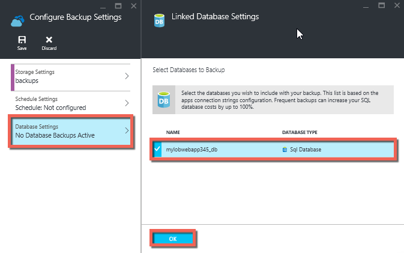

<properties 
	pageTitle="在 Azure 中备份应用" 
	description="了解如何在 Azure App Service 中创建应用备份。" 
	services="app-service" 
	documentationCenter="" 
	authors="cephalin" 
	manager="wpickett" 
	editor="jimbe"/>

<tags 
	ms.service="app-service" 
	ms.workload="na" 
	ms.tgt_pltfrm="na" 
	ms.devlang="na" 
	ms.topic="article" 
	ms.date="07/06/2016" 
	wacn.date="12/12/2016" 
	ms.author="cephalin"/>

# 在 Azure 中备份应用

利用 [Azure App Service](/documentation/articles/app-service-value-prop-what-is/) 中的备份和还原功能，可以轻松地手动或自动创建应用备份。你可以将应用还原到以前的状态，或者基于原始应用的备份之一创建新的应用。

有关从备份中还原应用的信息，请参阅 [Restore an app in Azure](/documentation/articles/web-sites-restore/)（在 Azure 中还原应用）。

## 备份的内容 
应用服务可备份以下信息：

* 应用配置
* 文件内容
* 任何连接到你的应用的 Azure SQL 数据库或 Azure MySQL 数据库（你可以选择备份中要包括哪些数据库）

此信息会备份到你指定的 Azure 存储帐户和容器。

> [AZURE.NOTE] 每个备份都是你的应用的完整脱机副本，而不是增量更新。

## 要求和限制

* 备份和还原功能要求应用服务计划位于**标准**层或更高层。有关缩放应用服务计划以使用更高层的详细信息，请参阅 [Scale up an app in Azure](/documentation/articles/web-sites-scale/)（增加 Azure 中的应用）。请注意，相比于**标准**层，**高级**层每日允许更多备份量。
* 在与要备份的应用相同的订阅中，需要有一个 Azure 存储帐户和容器。有关 Azure 存储帐户的详细信息，请参阅本文结尾处的[链接](#moreaboutstorage)。
* 最多可备份 10GB 的应用和数据库内容。如果备份大小超过此限制，将会出错。

## 创建手动备份

2. 在 [Azure 门户](https://portal.azure.cn)中，导航到应用的边栏选项卡，选择“设置”，然后选择“备份”。将显示“备份”边栏选项卡。
	
	![“备份”页面][ChooseBackupsPage]

	>[AZURE.NOTE] 若显示以下消息，请单击该消息升级应用服务计划，然后才能继续备份。有关详细信息，请参阅[增加 Azure 中的应用](/documentation/articles/web-sites-scale/)。

3. 在“备份”边栏选项卡中，单击“存储: 未配置”来配置存储帐户。

	![选择存储帐户][ChooseStorageAccount]
	
4. 选择“存储帐户”和“容器”来选择备份目标。该存储帐户必须与要备份的应用属于同一订阅。也可在各自的边栏选项卡中新建存储帐户或容器。完成后，单击“选择”。
	
	
	
5. 在仍处于打开状态的“配置备份设置”边栏选项卡中，单击“数据库设置”，选择备份要包含的数据库（SQL 数据库或 MySQL），然后单击“确定”。

	

	> [AZURE.NOTE] 	若要使数据库显示在此列表中，其连接字符串必须位于应用中“应用程序设置”边栏选项卡的“连接字符串”部分中。

6. 在“配置备份设置”边栏选项卡上，单击“保存”。

7. 在“备份”边栏选项卡的命令栏中，单击“立即备份”。
	
	![BackUpNow 按钮][BackUpNow]
	
	备份过程中将显示进度消息。

配置用于备份的存储帐户和容器后，可随时进行手动备份。

## 配置自动备份

1. 在“备份”边栏选项卡上，单击“计划: 未配置”。

	
	
1. 在“备份计划设置”边栏选项卡上，将“计划备份”设为“开”，然后根据需要配置备份计划，并单击“确定”。
	
	![启用自动化的备份][SetAutomatedBackupOn]
	
4. 在仍处于打开状态的“配置备份设置”边栏选项卡上单击“存储设置”，然后通过选择“存储帐户”和“容器”来选择备份目标。该存储帐户必须与要备份的应用属于同一订阅。也可在各自的边栏选项卡中新建存储帐户或容器。完成后，单击“选择”。
	
	
	
5. 在“配置备份设置”边栏选项卡中，单击“数据库设置”，选择备份要包含的数据库（SQL 数据库或 MySQL），然后单击“确定”。

	

	> [AZURE.NOTE] 	若要使数据库显示在此列表中，其连接字符串必须位于应用中“应用程序设置”边栏选项卡的“连接字符串”部分中。

6. 在“配置备份设置”边栏选项卡上，单击“保存”。

## 备份只是应用的一部分

有时你不想备份应用中的所有内容。以下是一些示例：

-	你[设置每周备份](/documentation/articles/web-sites-backup/#configure-automated-backups)应用，其中包含永远不会更改的静态内容，例如旧的博客文章或图映像。
-	应用的内容超过 10GB（这是一次可以备份的最大数量）。
-	你不想备份日志文件。

使用部分备份可以精确选择想要备份的文件。

### 从备份中排除文件

若要从备份中排除文件和文件夹，在应用的 D:\\home\\site\\wwwroot 文件夹中创建 `_backup.filter` 文件，并指定想要在这里排除的文件和文件夹列表。通过 [Kudu 控制台](https://github.com/projectkudu/kudu/wiki/Kudu-console)，即可轻松访问它。

假设你的应用中包含永远不会更改的历年的日志文件和静态映像。你已有包括旧映像的应用的完整备份。现在你想要每天备份应用，但不想为永远不会更改的存储日志文件或静态映像文件支付费用。

![日志文件夹][LogsFolder] ![映像文件夹][ImagesFolder]
	
以下步骤展示了如何从备份中排除这些文件。

1. 转到 `http://{yourapp}.scm.chinacloudsites.cn/DebugConsole` 并确定想要从备份中排除的文件夹。在此示例中，你想要排除该用户界面中所示的以下文件和文件夹：

		D:\home\site\wwwroot\Logs
		D:\home\LogFiles
		D:\home\site\wwwroot\Images\2013
		D:\home\site\wwwroot\Images\2014
		D:\home\site\wwwroot\Images\brand.png

	[AZURE.NOTE] 最后一行显示了你可以排除单个文件以及文件夹。

2. 创建名为 `_backup.filter` 的文件并将上述列表放在文件中，但删除 `D:\home`。每行列出一个目录或文件。文件的内容应为：

	    \site\wwwroot\Logs
	    \LogFiles
	    \site\wwwroot\Images\2013
	    \site\wwwroot\Images\2014
	    \site\wwwroot\Images\brand.png

3. 使用 [ftp](/documentation/articles/web-sites-deploy/#ftp) 或任何其他方法将此文件上载到站点的 `D:\home\site\wwwroot` 目录。如果你愿意，可以直接在 `http://{yourapp}.scm.chinacloudsites.cn/DebugConsole` 中创建文件并在那里插入内容。

4. 采用通常使用的相同方式运行备份，即[手动](#create-a-manual-backup)或[自动](#configure-automated-backups)。

现在，`_backup.filter` 中指定的所有文件和文件夹都会从备份中排除。在此示例中，将不再对日志文件，2013 年和 2014 年的映像文件以及 brand.png 进行备份。

>[AZURE.NOTE] 采用[还原定期备份](/documentation/articles/web-sites-restore/)的相同方式还原站点的部分备份。还原过程会执行正确的操作。
还原完整备份后，站点上的所有内容都被替换为备份中的所有内容。如果文件在站点上但不在备份中，则会将其删除。但是，还原部分备份时，位于其中一个黑名单目录或任何黑名单文件中的任何内容都保持不变。

## 如何存储备份

对应用进行一次或多次备份后，则会在你的存储帐户的“容器”边栏选项卡中看到该备份以及你的应用。在存储帐户中，每个备份都由一个 .zip 文件和一个 .xml 文件组成，前者包含备份数据，后者包含 .zip 文件内容的清单。如果你想要在无需实际执行应用还原的情况下访问备份，则可以解压缩并浏览这些文件。

应用的数据库备份存储在 .zip 文件的根目录中。对于 SQL 数据库，这是 BACPAC 文件（无文件扩展名），并且可以导入。若要基于 BACPAC 导出创建新的 SQL 数据库，请参阅[导入 BACPAC 文件以创建新的用户数据库](http://technet.microsoft.com/zh-cn/library/hh710052.aspx)。

> [AZURE.WARNING] 改动“websitebackups”容器中的任何文件都会导致备份无效，进而无法还原。

## 后续步骤
有关从备份中还原应用的信息，请参阅 [Restore an app in Azure](/documentation/articles/web-sites-restore/)（在 Azure 中还原应用）。还可使用 REST API 备份和还原应用服务应用（请参阅 [使用 REST 备份和还原应用服务应用](/documentation/articles/websites-csm-backup/)）。

>[AZURE.NOTE] 若要开始使用 Azure，请参阅 [Azure 试用版](/pricing/1rmb-trial/)。

<!-- IMAGES -->
[ChooseBackupsPage]: ./media/web-sites-backup/01ChooseBackupsPage.png
[ChooseStorageAccount]: ./media/web-sites-backup/02ChooseStorageAccount.png
[IncludedDatabases]: ./media/web-sites-backup/03IncludedDatabases.png
[BackUpNow]: ./media/web-sites-backup/04BackUpNow.png
[BackupProgress]: ./media/web-sites-backup/05BackupProgress.png
[SetAutomatedBackupOn]: ./media/web-sites-backup/06SetAutomatedBackupOn.png
[Frequency]: ./media/web-sites-backup/07Frequency.png
[StartDate]: ./media/web-sites-backup/08StartDate.png
[StartTime]: ./media/web-sites-backup/09StartTime.png
[SaveIcon]: ./media/web-sites-backup/10SaveIcon.png
[ImagesFolder]: ./media/web-sites-backup/11Images.png
[LogsFolder]: ./media/web-sites-backup/12Logs.png
[GhostUpgradeWarning]: ./media/web-sites-backup/13GhostUpgradeWarning.png
 

<!---HONumber=Mooncake_Quality_Review_1118_2016-->