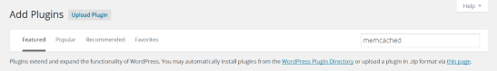
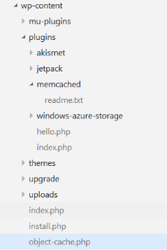

<properties
	pageTitle="通过 Memcache 协议将 Azure App Service 中的 Web 应用连接到 Redis 缓存 | Azure"
	description="使用 Memcache 协议将 Azure App Service 中的 Web 应用连接到 Redis 缓存"
	services="app-service\web"
	documentationCenter="php"
	authors="SyntaxC4"
	manager="wpickett"
	editor="riande"/>

<tags
	ms.service="app-service-web"
	ms.devlang="php"
	ms.topic="get-started-article"
	ms.tgt_pltfrm="windows"
	ms.workload="na"
	ms.date="02/29/2016"
	wacn.date="12/12/2016"
	ms.author="cfowler"/>

# 通过 Memcache 协议将 Azure App Service 中的 Web 应用连接到 Redis 缓存

[AZURE.INCLUDE [azure-sdk-developer-differences](../../includes/azure-sdk-developer-differences.md)]

本文将介绍如何使用 [Memcache][13] 协议将 [Azure App Service](/documentation/articles/app-service-changes-existing-services/) 中的 WordPress Web 应用连接到 [Azure Redis 缓存][12]。如果某个现有 Web 应用使用 Memcached 服务器进行内存中缓存，可将其迁移到 Azure App Service 并使用 Azure 中不（几乎不）更改应用程序代码的第一方缓存解决方案。还可利用现有的 Memcache 专业知识在 Azure App Service（带用于内存中缓存的 Azure Redis 缓存）中创建高度可缩放的分布式应用，同时使用常用的应用程序框架，例如 .NET、PHP、Node.js、Java 和 Python。

应用服务 Web 应用使用 Web 应用 Memcache 填充码启用该应用程序方案，这是充当 Memcache 代理服务器的本地 Memcached 服务器，用于缓存对 Azure Redis 缓存的调用。这使得使用 Memcache 协议通信的任何应用可以使用 Redis 缓存缓存数据。此 Memcache 填充码在协议级别运行，因此只要它使用 Memcached 协议通信，就可以供任何应用程序或应用程序框架使用。

[AZURE.INCLUDE [app-service-web-to-api-and-mobile](../../includes/app-service-web-to-api-and-mobile.md)]

## 先决条件

Web 应用 Memcache 填充码可以与任何应用程序一起使用，前提是使用 Memcached 协议通信。就此特定示例来说，引用应用程序是一个可缩放的 WordPress 站点，它可以从 Azure 应用商店设置。

请按照以下文章中所述的步骤操作：

* [设置 Azure Redis 缓存服务的实例][0]
* [在 Azure 中部署可缩放的 WordPress 站点][1]

部署可缩放的 WordPress 站点并设置 Redis 缓存实例后，你随时可以启用 Azure App Service Web 应用中的 Memcache 填充码。

## 启用 Web 应用 Memcache 填充码

若要配置 Memcache 填充码，你必须创建三个应用设置。可使用多种方法来完成，包括 [Azure 门户预览][3]、[经典管理门户](https://manage.windowsazure.cn/)、[Azure PowerShell Cmdlet][4] 或 [Azure 命令行接口][5]。本文将使用 [Azure 门户预览][3]来设置应用设置。从 Redis 缓存实例的“设置”边栏选项卡中，可以检索以下值。

### 添加 REDIS\_HOST 应用设置

你需要创建的第一个应用设置是 **REDIS\_HOST** 应用设置。此设置将对该填充码将缓存信息转发到的目的地进行设置。REDIS\_HOST 应用设置所需的值可以从 Redis 缓存实例的“属性”边栏选项卡中检索。

将应用设置的密钥设置为 **REDIS\_HOST**，将应用设置的值设置为 Redis 缓存实例的**主机名**。

### 添加 REDIS\_KEY 应用设置

你需要创建的第二个应用设置是 **REDIS\_KEY** 应用设置。此设置提供了安全访问 Redis 缓存实例所需的身份验证令牌。可从 Redis 缓存实例的“访问密钥”边栏选项卡中检索 REDIS\_KEY 应用设置所需的值。

将应用设置的密钥设置为 **REDIS\_KEY**，将应用设置的值设置为 Redis 缓存实例的**主密钥**。

### 添加 MEMCACHESHIM\_REDIS\_ENABLE 应用设置

最后一个应用设置用于启用 Web 应用中的 Memcache 填充码，以便使用 REDIS\_HOST 和 REDIS\_KEY 连接到 Azure Redis 缓存并转发缓存调用。将应用设置的密钥设置为 **MEMCACHESHIM\_REDIS\_ENABLE**，并将其值设置为 **true**。

添加完这三 (3) 个应用设置后，单击“保存”。

## 启用针对 PHP 的 Memcache 扩展

若要让应用程序使用 Memcache 协议进行沟通，必须将 Memcache 扩展安装到 PHP（用于 WordPress 站点的语言框架）。

### 下载 php\_memcache 扩展

浏览到 [PECL][6]。在缓存类别下，单击 [memcache][7]。在下载列中，单击 DLL 链接。

下载 Web 应用中启用的 PHP 版本的非线性安全 (NTS) x86 链接。（默认为 PHP 5.4）

### 启用 php\_memcache 扩展

下载文件后，将 **php\_memcache.dll** 解压缩并上传到 **d:\\home\\site\\wwwroot\\bin\\ext\** 目录。将 php\_memcache.dll 上载到 Web 应用后，你需要启用 PHP 运行时的扩展。若要在 Azure 门户预览中启用 Memcache 扩展，请打开 Web 应用的“应用程序设置”边栏选项卡，然后添加密钥为 **PHP\_EXTENSIONS**、值为 **bin\\ext\\php\_memcache.dll** 的新应用设置。

> [AZURE.NOTE] 如果 Web 应用需要加载多个 PHP 扩展，则 PHP\_EXTENSIONS 的值应为由逗号分隔的 DLL 文件相对路径的列表。

完成后，单击“保存”。

## 安装 Memcache WordPress 插件

> [AZURE.NOTE] 你也可以从 WordPress.org 下载 [Memcached 对象缓存插件](https://wordpress.org/plugins/memcached/)。

在 WordPress 插件页上，单击“添加新项”。

在搜索框中，键入 **memcached**，然后按 **Enter**。

在列表中查找“Memcached 对象缓存”，然后单击“立即安装”。

### 启用 Memcache WordPress 插件

>[AZURE.NOTE] 按照此博客中关于[如何启用 Web 应用中的站点扩展][8]的说明，安装 Visual Studio Team Services。

在 `wp-config.php` 文件中，将以下代码添加到该文件末尾附近停止编辑备注的上方。

	$memcached_servers = array(
		'default' => array('localhost:' . getenv("MEMCACHESHIM_PORT"))
	);

粘贴此代码后，monaco 会自动保存该文档。

下一步是启用对象缓存插件。操作方式是：将 **object-cache.php** 从 **wp-content/plugins/memcached** 文件夹拖放到 **wp-content** 文件夹，以启用 Memcache 对象缓存功能。

现在，**object-cache.php** 文件位于 **wp-content** 文件夹中，且已启用 Memcached 对象缓存。

## 验证 Memcache 对象缓存插件运行是否正常

启用 Web 应用 Memcache 填充码的所有步骤现已完成。剩下的唯一一件事是，验证 Redis 缓存实例是否正在填充数据。

### 启用 Azure Redis 缓存中的非 SSL 端口支持

>[AZURE.NOTE] 撰写本文时，Redis CLI 尚不支持 SSL 连接，因此以下步骤是必需的。

在 Azure 门户预览中，浏览到为此 Web 应用创建的 Redis 缓存实例。打开缓存边栏选项卡后，单击“设置”图标。

从列表中选择“访问端口”。

单击“只允许通过 SSL 访问”旁边的“否”。

你将看到非 SSL 端口现在已设置。单击“保存”。

### 从 redis-cli 连接到 Azure Redis 缓存

>[AZURE.NOTE] 此步骤假定 redis 已通过本地方式安装在你的开发计算机上。[按以下说明在本地安装 Redis][9]。

打开你选择的命令行控制台并键入以下命令：

	redis-cli -h <hostname-for-redis-cache> -a <primary-key-for-redis-cache> -p 6379

将 **&lt;hostname-for-redis-cache&gt;** 替换为实际的 xxxxx.redis.cache.chinacloudapi.cn 主机名，将 **&lt;primary-key-for-redis-cache&gt;** 替换为缓存的访问密钥，然后按 **Enter**。CLI 连接到 Redis 缓存实例后，发出任何 Redis 命令。在下面的屏幕截图中，我已选择列出密钥。

列出密钥的调用应返回一个值。如果没有，请尝试导航到 Web 应用，然后再重试。

## 结束语

祝贺你！ WordPress 应用现在有了集中式的内存中缓存，这将有助于提高吞吐量。请记住，Web 应用 Memcache 填充码可以与任何 Memcache 客户端结合使用，无需考虑编程语言或应用程序框架。若要提供反馈或就 Web 应用 Memcache 填充码提问，请在 [MSDN 论坛][10]或 [CSDN][11] 上发布相关文章。

## 更改内容
* 有关从网站更改为应用服务的指南，请参阅 [Azure 应用服务及其对现有 Azure 服务的影响](/documentation/articles/app-service-changes-existing-services/)

[0]: /documentation/articles/cache-dotnet-how-to-use-azure-redis-cache/#create-a-cache
[1]: http://bit.ly/1t0KxBQ
[2]: http://manage.windowsazure.cn
[3]: http://portal.azure.cn
[4]: /documentation/articles/powershell-install-configure/
[5]: /downloads
[6]: http://pecl.php.net
[7]: http://pecl.php.net/package/memcache
[8]: http://blog.syntaxc4.net/post/2015/02/05/how-to-enable-a-site-extension-in-azure-websites.aspx
[9]: http://redis.io/download#installation
[10]: https://social.msdn.microsoft.com/Forums/zh-cn/home?forum=windowsazurewebsitespreview
[11]: http://azure.csdn.net/
[12]: /home/features/redis-cache/
[13]: http://memcached.org

<!---HONumber=Mooncake_Quality_Review_1118_2016-->