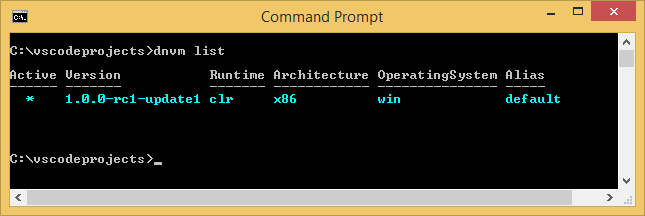
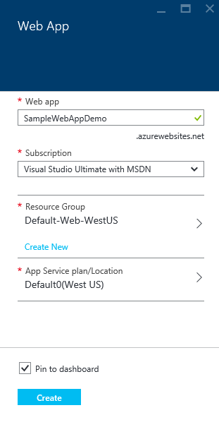
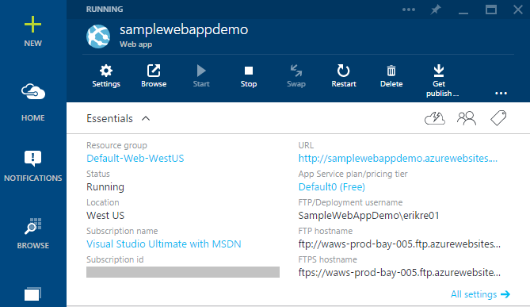
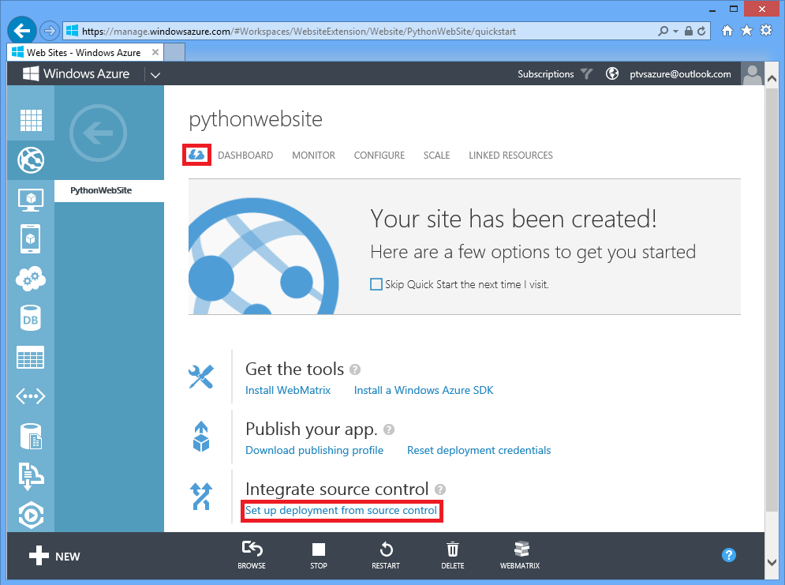
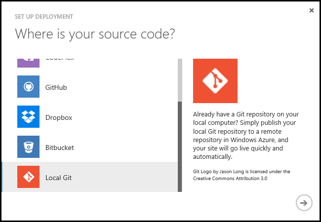
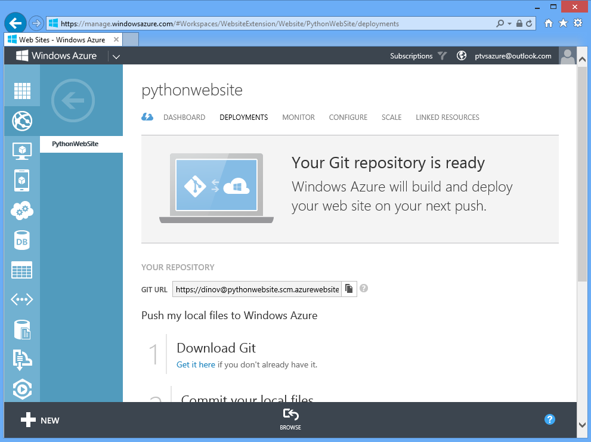

<properties
   pageTitle="在 Visual Studio Code 中创建 ASP.NET 5 Web 应用"
   description="本教程演示了如何使用 Visual Studio Code 创建 ASP.NET 5 Web 应用。"
   services="app-service\web"
   documentationCenter=".net"
   authors="erikre"
   manager="wpickett"
   editor="jimbe"/>

<tags
	ms.service="app-service-web"
	ms.date="02/26/2016"
	wacn.date="09/26/2016"/>  

# 在 Visual Studio Code 中创建 ASP.NET 5 Web 应用

## 概述

本教程演示如何使用 [Visual Studio Code](http://code.visualstudio.com//Docs/whyvscode) (VS Code) 创建 ASP.NET Web 5 应用，并将其部署到 [Azure App Service](/documentation/articles/app-service-value-prop-what-is/)。

> [AZURE.NOTE] 尽管本文中指的是 Web 应用，但内容同样适用于 API 应用和移动应用。

ASP.NET 5 是大幅重新设计的 ASP.NET。ASP.NET 5 是新的开源跨平台框架，用于通过 .NET 构建基于云的现代 Web 应用。有关详细信息，请参阅 [ASP.NET 5 简介](http://docs.asp.net/en/latest/conceptual-overview/aspnet.html)。有关 Azure App Service Web 应用的信息，请参阅 [Web 应用概述](/documentation/articles/app-service-web-overview/)。

## 先决条件  

* 安装 [VS Code](http://code.visualstudio.com/Docs/setup)。
* 安装 [Node.js](http://nodejs.org) - Node.js 是一种平台，用于通过 JavaScript 构建快速、可缩放的服务器应用程序。Node 是运行时 (Node)，而 [npm](http://www.npmjs.com/) 是 Node 模块的程序包管理器。在本教程中，你将使用 npm 创建 ASP.NET 5 Web 应用的基架。
* 安装 Git - 可以从以下位置安装：[Chocolatey](https://chocolatey.org/packages/git) 或 [git scm.com](http://git-scm.com/downloads)。如果你是 Git 新手，请选择 [git-scm.com](http://git-scm.com/downloads)，并选择“从 Windows 命令提示符使用 Git”的选项。安装 Git 后，还需要设置 Git 用户名和电子邮件，因为本教程稍后需要用到（从 VS Code 执行提交时）。

## 安装 ASP.NET 5 和 DNX
ASP.NET 5/DNX（.NET 执行环境）是精简的 .NET 堆栈，用于构建在 OS X、Linux 和 Windows 上运行的现代云应用及 Web 应用。它已从头开始构建，可将优化的开发框架提供给已部署到云或本地运行的应用。它由系统开销最低的模块化组件构成，因此你可以在构建解决方案时保持弹性。

本教程旨在帮助你使用最新开发版本的 ASP.NET 5 和 DNX 开始构建应用程序。以下说明特定于 Windows。有关 OS X、 Linux 和 Windows 的更详细安装说明，请参阅[安装 ASP.NET 5 和 DNX](https://code.visualstudio.com/Docs/ASPnet5#_installing-aspnet-5-and-dnx)。

1. 若要在 Windows 中安装 .NET 版本管理器 (DNVM)，请打开命令提示符并运行以下命令。

		@powershell -NoProfile -ExecutionPolicy unrestricted -Command "&{$Branch='dev';iex ((new-object net.webclient).DownloadString('https://raw.githubusercontent.com/aspnet/Home/dev/dnvminstall.ps1'))}"

	这将下载 DNVM 脚本，并将其放入你的用户配置文件目录。

2. **重新启动 Windows** 以完成 DNVM 安装。

	重新启动 Windows 后，你可以打开命令提示符，通过输入以下内容来验证 DNVM 的位置：

		where dnvm

	命令提示符将显示如下所示的路径。

	

3. 安装 DNVM 后，必须使用它来下载 DNX 以运行应用程序。在命令提示符下运行以下命令：

		dnvm upgrade

	验证你的 DNVM，并通过在命令提示符下输入以下命令，来查看活动的运行时：

		dnvm list

	命令提示符将显示活动运行时的详细信息。

	

	如果列出了多个 DNX 运行时，则可以选择在命令提示符下输入以下命令（或更新版本）来设置活动 DNX 运行时。稍后在本教程中创建 Web 应用时，请将其设置为 ASP.NET 5 生成器使用的同一版本。 *如果活动的运行时已设置为最新的可用运行时，你可能不需要更改运行时。*

		dnvm use 1.0.0-update1 -p

> [AZURE.NOTE] 有关 OS X、 Linux 和 Windows 的更详细安装说明，请参阅[安装 ASP.NET 5 和 DNX](https://code.visualstudio.com/Docs/ASPnet5#_installing-aspnet-5-and-dnx)。

## 创建 Web 应用 

本部分说明如何创建新应用 ASP.NET Web 应用的基架。你将使用 node 程序包管理器 (npm) 来安装 [Yeoman](http://yeoman.io/)（应用程序基架工具 - 相当于 Visual Studio“文件”>“新建项目”操作的 VS Code）、[Grunt](http://gruntjs.com/)（JavaScript 任务运行程序）和 [Bower](http://bower.io/)（客户端程序包管理器）。

1. 以管理员权限打开命令提示符，并导航到你要在其中创建 ASP.NET 项目的位置。例如，在 C: 根目录中创建一个 *vscodeprojects* 目录。

2. 在命令提示符下输入以下命令以安装 Yeoman 和支持工具。

		npm install -g yo grunt-cli generator-aspnet bower

	> [AZURE.NOTE] 你可能会收到警告，提示你 npm 版本已过期。此警告不会影响本教程。

3. 在命令提示符下输入以下命令，以创建项目文件夹，并创建应用的基架。

		yo aspnet

4. 使用箭头键从 ASP.NET 5 生成器菜单中选择“Web 应用程序基本”类型，然后按 **&lt;Enter>**。

	

5. 将新的 ASP.NET Web 应用的名称设置为 **SampleWebApp**。由于整个教程将使用此名称，因此如果你选择不同的名称，则需要替换每个出现的 **SampleWebApp**。当你按 **&lt;Enter>** 时，Yeoman 将创建名为 **SampleWebApp** 的新文件夹，以及新应用的必要文件。

6. 在命令提示符下，将目录更改为新的项目文件夹：

		cd SampleWebApp

7. 此外，在命令提示符下，输入以下命令安装必要的 NuGet 包，以便运行应用程序：

		dnu restore

8. 在命令提示符下输入以下命令打开 VS Code：

		code .

## 在本地运行 Web 应用

在创建 Web 应用并检索应用的所有 NuGet 包后，你可以在本地运行该 Web 应用。

1. 在 VS Code 的“命令控制板”中，输入以下命令以显示可用的运行命令选项：

		dnx: Run Command

	> [AZURE.NOTE] 如果 Omnisharp 服务器当前未运行，则它将会启动。重新输入上述命令。

	接下来，选择以下命令以运行你的 Web 应用：
		
		dnx web - (SampleWebApp)

	命令窗口将显示该应用程序已启动。如果命令窗口未显示此消息，请检查 VS Code 左下角以找出项目中的错误。
	
	> [AZURE.NOTE] 从**命令控制板**发出命令需要在命令行的开头输入 **>** 字符。你可以在 *project.json* 文件中查看与 **web** 命令相关的详细信息。
	> 如果该命令未出现或不可用，你可能需要安装 C# 扩展。运行 `>Extensions: Install Extension` 和 `ext install c#` 以安装 C# 扩展。

2. 打开浏览器并导航到以下 URL。

	**http://localhost:5000**

	将显示 Web 应用的默认页面，如下所示。

	  

3. 关闭你的浏览器。在**命令窗口**中，按 **Ctrl+C** 关闭应用程序并关闭**命令窗口**。

## 在 Azure 门户预览中创建 Web 应用

以下步骤将指导用户在 Azure 门户预览中创建 Web 应用。

1. 登录到 [Azure 门户预览](https://portal.azure.cn)。

2. 单击门户左上角的“新建”。

3. 单击“Web Apps”>“Web 应用”。

	

4. 输入“名称”的值，例如 **SampleWebAppDemo**。请注意，此名称必须是唯一的；当你尝试输入名称时，门户会强制此要求。因此，如果你选择或输入了不同的值，需要以该值替换本教程中每个出现的 **SampleWebAppDemo**。

5. 选择现有的 **App Service 计划**或创建新的计划。如果创建新计划，请选择定价层、位置和其他选项。有关 App Service 计划的详细信息，请参阅 [Azure App Service 计划深入概述](/documentation/articles/azure-web-sites-web-hosting-plans-in-depth-overview/)一文。

	

6. 单击“创建”。

	

## 为新 Web 应用启用 Git 发布

Git 是分布式版本控制系统，可用于部署 Azure App Service Web 应用。你将在本地 Git 存储库中存储你为 Web 应用编写的代码，并通过推送到远程存储库将代码部署到 Azure。

登录到 [Azure 经典管理门户](https://manage.windowsazure.cn)，找到你的 web 应用，选择**从源代码控制设置部署**。

从“设置部署”对话框中，向下滚动并选择“本地 Git”选项。单击向右箭头以继续。

在设置 Git 发布之后，你将立即看到通知你正在创建存储库的页面。在存储库就绪时，会将你转至“部署”选项卡。“部署”选项卡包括有关如何连接的说明。

  

## 将 Web 应用发布到 Azure App Service

在本部分中，你将创建一个本地 Git 存储库，并从该存储库推送到 Azure，以将 Web 应用部署到 Azure。

1. 在 VS Code 的左侧导航栏中，选择“Git”选项。

	  

2. 选择“初始化 git 存储库”，确保你的工作区受 git 源代码管理。

	

3. 打开命令窗口，并切换到 Web 应用的目录。然后输入以下命令：

		git config core.autocrlf false

	此命令可防止包含 CRLF 结束符和 LF 结束符的文本出现问题。

4. 在 VS Code 中，添加提交消息，然后单击“全部提交”复选图标。

	

5. 完成处理 Git 之后，你会发现，Git 窗口中的“更改”下面未列出任何文件。

	  

6. 切换回到命令窗口，其中的命令提示符现在指向 Web 应用所在的目录。

7. 使用前面复制的 Git URL（结尾是“.git”）创建远程引用，以便将更新推送到 Web 应用。

		git remote add azure [URL for remote repository]

8. 配置 Git 以在本地保存你的凭据，以便自动将凭据附加到从 VS Code 生成的推送命令。

		git config credential.helper store

9. 输入以下命令，将更改推送到 Azure。在向 Azure 完成初始推送后，你可以从 VS Code 执行所有推送命令。

		git push -u azure master

	系统将提示你输入之前在 Azure 中创建的密码。**注意：你的密码将不可见。**

	上述命令的输出将以部署成功消息结尾。

		remote: Deployment successful.
		To https://user@testsite.scm.chinacloudsites.cn/testsite.git
		[new branch]      master -> master

> [AZURE.NOTE] 如果你更改了应用，可以通过依次选择“全部提交”选项和“推送”选项，直接在 VS Code 中使用内置 Git 功能重新发布应用。可以在“全部提交”和“刷新”按钮旁边的下拉菜单中找到可用的“推送”选项。

如果需要与其他人对项目进行协作，应该考虑在推送到 Azure 之前先推送到 GitHub。

## 在 Azure 中运行应用
在部署 Web 应用后，让我们运行 Azure 中托管的该应用。

可以通过两种方法实现此目的：

* 打开浏览器并输入 Web 应用的名称，如下所示。

		http://SampleWebAppDemo.chinacloudsites.cn
 
* 在 Azure 门户预览中，找到 Web 应用的 Web 应用边栏选项卡，然后单击“浏览”以在默认游览器中
* 查看应用。

## 摘要
在本教程中，你已学习如何在 VS Code 创建 Web 应用并将其部署到 Azure。有关 VS Code 的详细信息，请参阅[为何使用 Visual Studio Code？](https://code.visualstudio.com/Docs/)一文 若要了解应用服务 Web 应用，请参阅 [Web 应用概述](/documentation/articles/app-service-web-overview/)。

<!---HONumber=Mooncake_0919_2016-->