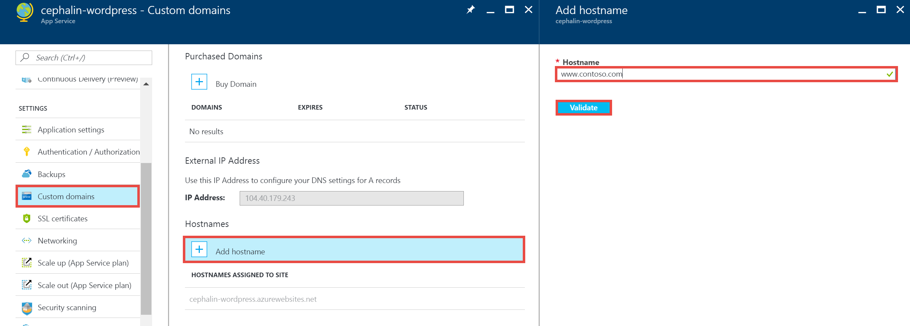

<properties
    pageTitle="将自定义域名映射到 Azure 应用"
    description="了解如何在 Azure App Service 中将自定义域名（虚域）映射到应用。"
    services="app-service"
    documentationcenter=""
    author="cephalin"
    manager="wpickett"
    editor="jimbe"
    tags="top-support-issue" />
<tags
    ms.assetid="48644a39-107c-45fb-9cd3-c741974ff590"
    ms.service="app-service"
    ms.workload="na"
    ms.tgt_pltfrm="na"
    ms.devlang="na"
    ms.topic="article"
    ms.date="01/30/2017"
    wacn.date="03/03/2017"
    ms.author="cephalin" />

# 将自定义域名映射到 Azure 应用
[AZURE.INCLUDE [web-selector](../../includes/websites-custom-domain-selector.md)]

本文演示如何在 [Azure App Service](/documentation/articles/app-service-value-prop-what-is/) 中手动将自定义域名映射到 Web 应用、移动应用后端或 API 应用。

如果已从第三方提供商购买了自定义域，则可按照以下三个主要步骤将自定义域映射到应用：

1. [*（仅 A 记录）*获取应用的 IP 地址](#vip)。
2. [创建将域映射到应用的 DNS 记录](#createdns)。
    * **位置**：域注册机构自己的管理工具（例如 Azure DNS、GoDaddy 等）。
    * **原因**：这样域注册机构便知道要将所需的自定义域解析到 Azure 应用。
3. [为 Azure 应用启用自定义域名](#enable)。
    * **位置**：[Azure 门户](https://portal.azure.cn)。
    * **原因**：这样应用便知道响应对自定义域名所发出的请求。
4. [验证 DNS 传播](#verify)。

## 可映射的域类型
Azure App Service 允许将以下类别的自定义域映射到应用。

* **根域** - 通过域注册机构所保留的域名（通常由 `@` 主机记录表示）。例如 **contoso.com**。
* **子域** - 根域下的所有域。例如，**www.contoso.com**（由 `www` 主机记录表示）。在 Azure 中可将相同根域的不同子域映射到不同的应用中。
* **通配符域** - [其最左边的 DNS 标签为 `*` 的所有子域](https://en.wikipedia.org/wiki/Wildcard_DNS_record)（例如主机记录 `*` 和 `*.blogs`）。例如 ***.contoso.com**。

## 可使用的 DNS 记录类型
根据需要，可以使用两种不同类型的标准 DNS 记录来映射自定义域：

* [A](https://en.wikipedia.org/wiki/List_of_DNS_record_types#A) - 直接将自定义域名映射到 Azure 应用的虚拟 IP 地址。
* [CNAME](https://en.wikipedia.org/wiki/CNAME_record) - 将自定义域名映射到应用的 Azure 域名，**&lt;*appname*>.chinacloudsites.cn**。

CNAME 的优点是其不会随 IP 地址的更改而更改。如果删除和重新创建应用，或从更高的定价层更改回**共享**层，应用的虚拟 IP 地址可能会发生更改。经过这种更改后，CNAME 记录仍然有效，而 A 记录则需要更新。

本教程将演示使用 A 记录和使用 CNAME 记录的步骤。

> [AZURE.IMPORTANT]
不要为根域（即“根记录”）创建 CNAME 记录。有关详细信息，请参阅 [Why can't a CNAME record be used at the root domain](http://serverfault.com/questions/613829/why-cant-a-cname-record-be-used-at-the-apex-aka-root-of-a-domain)（为什么不能将 CNAME 记录用于根域）。若要将根域映射到 Azure 应用，请改用 A 记录。
> 
> 

## 步骤 1。*（仅 A 记录）*获取应用的 IP 地址
若要使用 A 记录映射自定义域名，则需要 Azure 应用的 IP 地址。如果要使用 CNAME 记录进行映射，请跳过此步骤并转到下一节。

1. 登录 [Azure 门户](https://portal.azure.cn)。
2. 在左侧菜单上，单击“应用服务”。
3. 单击应用，然后单击“自定义域”。
4. 记下“主机名”部分上方的 IP 地址。
   
    
5. 将此门户边栏选项卡保持打开状态。在创建 DNS 记录后会返回这里。

## 步骤 2。创建 DNS 记录
登录域注册机构，并使用他们的工具添加 A 记录或 CNAME 记录。由于每个注册机构的 UI 都略有不同，因此应查阅提供商的文档。但是，仍然有一些一般准则。

1. 查找管理 DNS 记录的页面。查找站点中标签为“域名”、“DNS”或“名称服务器管理”的链接或区域。通常可通过查看帐户信息，然后查找如“我的域”之类的链接，便可以找到链接。
2. 查找允许添加或编辑 DNS 记录的链接。此链接可能为“区域文件”、“DNS 记录”链接或“高级”配置链接。
3. 创建记录并保存所做的更改。
    * [此处为 A 记录的说明](#a)。
    * [此处为 CNAME 记录的说明](#cname)。

### 创建 A 记录
若要使用 A 记录映射到 Azure 应用的 IP 地址，实际上需要同时创建 A 记录和 TXT 记录。A 记录用于 DNS 解析本身，TXT 记录是供 Azure 用于验证用户是否具有自己的自定义域名。

按如下所示配置 A 记录（@ 通常表示根域）：

<table cellspacing="0" border="1">
  <tr>
    <th>FQDN 示例</th>
    <th>A 主机</th>
    <th>A 值</th>
  </tr>
  <tr>
    <td>contoso.com (root)</td>
    <td>@</td>
    <td><a href="#vip">步骤 1</a> 中的 IP 地址</td>
  </tr>
  <tr>
    <td>www.contoso.com (sub)</td>
    <td>www</td>
    <td><a href="#vip">步骤 1</a> 中的 IP 地址</td>
  </tr>
  <tr>
    <td>*.contoso.com (wildcard)</td>
    <td>*</td>
    <td><a href="#vip">步骤 1</a> 中的 IP 地址</td>
  </tr>
</table>

其他 TXT 记录遵循从 &lt;*子域*>.&lt;*根域*> 映射到 &lt;*应用名称*>.chinacloudsites.cn 的约定。按如下所示配置 TXT 记录：

<table cellspacing="0" border="1">
  <tr>
    <th>FQDN 示例</th>
    <th>TXT 主机</th>
    <th>TXT 值</th>
  </tr>
  <tr>
    <td>contoso.com (root)</td>
    <td>@</td>
    <td>&lt;<i>appname</i>>.chinacloudsites.cn</td>
  </tr>
  <tr>
    <td>www.contoso.com (sub)</td>
    <td>www</td>
    <td>&lt;<i>appname</i>>.chinacloudsites.cn</td>
  </tr>
  <tr>
    <td>*.contoso.com (wildcard)</td>
    <td>*</td>
    <td>&lt;<i>appname</i>>.chinacloudsites.cn</td>
  </tr>
</table>

### 创建 CNAME 记录
如果使用 CNAME 记录映射到 Azure 应用的默认域名，则不需要其他 TXT 记录，这一点与使用 A 记录不同。

> [AZURE.IMPORTANT]
不要为根域（即“根记录”）创建 CNAME 记录。有关详细信息，请参阅 [Why can't a CNAME record be used at the root domain](http://serverfault.com/questions/613829/why-cant-a-cname-record-be-used-at-the-apex-aka-root-of-a-domain)（为什么不能将 CNAME 记录用于根域）。若要将根域映射到 Azure 应用，请改用 [A 记录](#a)。
> 
> 

按以下方式配置 CNAME 记录（@ 通常表示根域）：

<table cellspacing="0" border="1">
  <tr>
    <th>FQDN 示例</th>
    <th>CNAME 主机</th>
    <th>CNAME 值</th>
  </tr>
  <tr>
    <td>www.contoso.com (sub)</td>
    <td>www</td>
    <td>&lt;<i>appname</i>>.chinacloudsites.cn</td>
  </tr>
  <tr>
    <td>*.contoso.com (wildcard)</td>
    <td>*</td>
    <td>&lt;<i>appname</i>>.chinacloudsites.cn</td>
  </tr>
</table>

## 步骤3。为应用启用自定义域名
返回 Azure 门户中的“自定义域”边栏选项卡（请参阅[步骤 1](#vip)），需要将自定义域的完全限定域名 (FQDN) 添加到列表中。

1. 登录到 [Azure 门户](https://portal.azure.cn)（如果尚未登录）。
2. 在 Azure 门户中，单击左侧菜单中的“应用程序服务”。
3. 单击应用，然后单击“自定义域”>“添加域”。
4. 将自定义域的 FQDN 添加到列表中（例如 **www.contoso.com**）。
   
    
   
    > [AZURE.NOTE]
    Azure 将尝试验证在此处使用的域名。请确保它与在[步骤 2](#createdns) 中用于创建 DNS 记录的域名是同一域名。
    > 
    > 
5. 单击“验证”。
6. 单击“验证”后，Azure 将启动域验证工作流。这将检查域的所有权和主机名的可用性，并报告成功或错误详情（附带有关如何修复错误的说明性指导）。
7. 验证成功后，“添加主机名”按钮变为激活状态，就可以分配主机名了。
8. Azure 完成配置新的自定义域名后，可在浏览器中导航到自定义域名。浏览器应会打开 Azure 应用，这意味着已正确配置自定义域名。

## 迁移活动域名

如果想要映射的域名已被现有网站使用，并且想要避免故障时间，请参阅[将活动自定义域迁移到应用服务](/documentation/articles/app-service-custom-domain-name-migrate/)。

## 验证 DNS 传播
完成配置步骤后，更改可能需要一些时间来进行传播，传播速度取决于 DNS 提供商。可以通过使用 [http://digwebinterface.com/](http://digwebinterface.com/) 验证 DNS 传播是否按预期方式工作。浏览到站点后，在文本框中指定主机名并单击“深入发掘”。验证结果以确认最近所做的更改是否已生效。

> [AZURE.NOTE]
DNS 条目的传播可能需要 48 小时（有时会更久）。如果已正确进行了所有配置，仍需要等待传播成功。
> 
> 

## 后续步骤
请参阅 [using an SSL certificate from elsewhere](/documentation/articles/web-sites-configure-ssl-certificate/)（使用在其他地方购买的 SSL 证书），了解如何使用 HTTPS 保护自定义域名。

<!-- Images -->

[subdomain]: ./media/web-sites-custom-domain-name/azurewebsites-subdomain.png

<!---HONumber=Mooncake_0227_2017-->
<!--Update_Description: move "migrating active domain name to app-service-custom-domain-name-migrate"-->