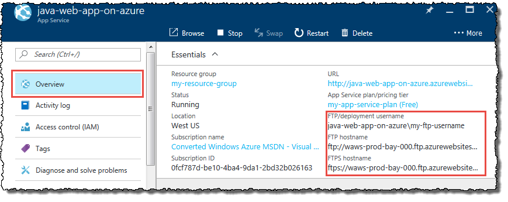
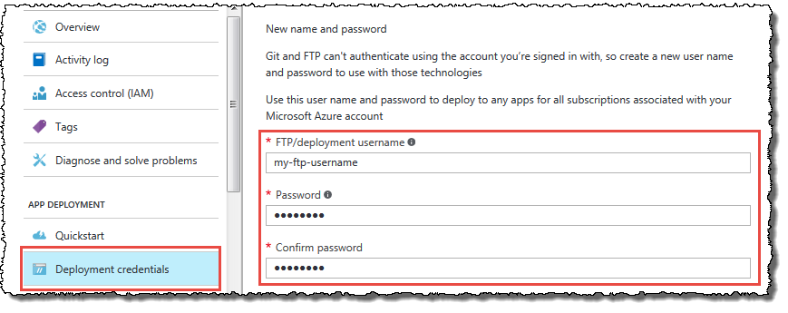

<properties
    pageTitle="将应用部署到 Azure 应用服务 | Azure"
    description="了解如何将你的应用部署到 Azure App Service。"
    services="app-service"
    documentationcenter=""
    author="cephalin"
    manager="erikre"
    editor="" />
<tags
    ms.assetid="f1464f71-2624-400e-86a2-e687e385804f"
    ms.service="app-service"
    ms.workload="na"
    ms.tgt_pltfrm="na"
    ms.devlang="na"
    ms.topic="article"
    ms.date="01/05/2017"
    wacn.date="02/10/2017"
    ms.author="cephalin;dariac" />

# 将应用部署到 Azure App Service
本文可帮助你确定将 Web 应用、移动应用后端或 API 应用的文件部署到 [Azure App Service](/documentation/articles/app-service-changes-existing-services/) 的最佳选项，然后将你引导到相应的资源，其中包含特定于你的首选选项的操作说明。

## Azure App Service 部署概述
Azure App Service 保留了应用程序框架（ASP.NET、PHP、Node.js 等等）。某些框架在默认情况下已启用，而其他框架（如 Java 和 Python）可能需要进行简单的复选标记配置才能启用。此外，你还可以自定义应用程序框架，如运行时的 PHP 版本或位元。有关详细信息，请参阅 [Configure your app in Azure App Service](/documentation/articles/web-sites-configure/)（在 Azure App Service 中配置你的应用）。

由于你无需担心 Web 服务器或应用程序框架，因此将应用部署到应用服务只需将代码、二进制文件、内容文件及其各自的目录结构部署到 Azure 中的 [**/site/wwwroot** 目录](https://github.com/projectkudu/kudu/wiki/File-structure-on-azure)（对于 Web 作业，部署到 **/site/wwwroot/App\_Data/Jobs/** 目录）。应用服务支持三个不同的部署进程。本文中的所有部署方法都使用以下过程之一：

* [FTP 或 FTPS](https://en.wikipedia.org/wiki/File_Transfer_Protocol)：使用你常用的支持 FTP 或 FTPS 的工具（从 [FileZilla](https://filezilla-project.org) 到功能齐全的 IDE，如 [NetBeans](https://netbeans.org)）将文件移至 Azure。这完全是文件上载进程。应用服务不提供任何附加服务，例如版本控制、文件结构管理等。
* [Kudu (Git/Mercurial)](https://github.com/projectkudu/kudu/wiki/Deployment)：Kudu 是应用服务中的[部署引擎](https://github.com/projectkudu/kudu/wiki)。从任何存储库将你的代码直接推送到 Kudu。只要代码推送到 Kudu，Kudu 还提供附加服务，包括版本控制、程序包还原、MSBuild 和 [Web 挂钩](https://github.com/projectkudu/kudu/wiki/Web-hooks)以用于连续部署和其他自动化任务。Kudu 部署引擎支持 2 种不同类型的部署源：
  
    * 从 GitHub 使用自动同步进行基于存储库的连续部署
    * 从本地 Git 使用手动同步进行基于存储库的部署
* [Web 部署](http://www.iis.net/learn/publish/using-web-deploy/introduction-to-web-deploy)：使用自动部署到 IIS 服务器的相同工具，直接从偏好的 Microsoft 工具（例如 Visual Studio）将代码部署到应用服务。此工具支持仅差异部署、创建数据库、连接字符串转换等操作。Web 部署与 Kudu 的不同之处在于，应用程序二进制文件在部署到 Azure 之前生成。与 FTP 类似，应用服务不提供任何附加服务。

常用的 Web 开发工具支持其中的一个或多个部署进程。虽然你选择的工具确定了你可以利用的部署进程，但是由你支配的实际 DevOps 功能取决于部署进程和你选择的特定工具的组合。例如，如果你从[包含 Azure SDK 的 Visual Studio](#vspros) 执行 Web 部署，即使你未从 Kudu 自动执行，你也会在 Visual Studio 中自动执行程序包还原和 MSBuild。

> [AZURE.NOTE]
这些部署过程并不会真正[预配应用可能需要的 Azure 资源](/documentation/articles/resource-group-template-deploy-portal/)。但是，大多数链接的操作方法文章会向你展示如何预配应用并端到端地将代码部署到该应用。你还可以在[使用命令行工具自动部署](#automate)部分中找到用于预配 Azure 资源的其他选项。
> 
> 

## 通过 FTP 上载文件，以便进行手动部署
如果你习惯于手动将 Web 内容复制到 Web 服务器，可以使用 [FTP](http://en.wikipedia.org/wiki/File_Transfer_Protocol) 实用工具（如 Windows 资源管理器或 [FileZilla](https://filezilla-project.org/)）复制文件。

手动复制文件的优点是：

* FTP 工具使用顺手且复杂性很低。
* 完全知道文件要复制到何处。
* 使用 FTPS 可增加安全性。

手动复制文件的缺点是：

* 必须知道如何将文件部署到应用服务中的正确目录。
* 发生故障时没有针对回退的版本控制。
* 无法提供用于排查部署问题的内置部署历史记录。
* 部署时间可能很长，因为许多 FTP 工具不提供仅差异复制，而只是复制所有文件。

### 如何使用 FTP 上载文件
[Azure 门户预览](https://portal.azure.cn)为用户提供所有需要的信息，以便使用 FTP 或 FTPS 连接到应用的目录。

* [使用 FTP 将应用部署到 Azure 应用服务](/documentation/articles/app-service-deploy-ftp/)

将文件复制到 Azure 涉及几个简单步骤：

1. 假设你已建立部署凭据，请转到“设置”>“属性”获取 FTP 连接信息，然后复制“FTP/开发用户”、“FTP 主机名”和“FTPS 主机名”的值。请复制 Azure 门户预览中显示的“FTP/部署用户”值（包括应用名称），以便为 FTP 服务器提供适当的上下文。
   
     
2. 从 FTP 客户端，使用收集到的连接信息连接到你的应用。
3. 将你的文件及其各自的目录结构复制到 Azure 中的 [**/site/wwwroot** 目录](https://github.com/projectkudu/kudu/wiki/File-structure-on-azure)（或者将 Web 作业复制到 **/site/wwwroot/App\_Data/Jobs/** 目录）。
4. 浏览到你的应用的 URL，以验证该应用是否正在正常运行。

有关详细信息，请参阅以下资源：

* [创建 PHP-MySQL Web 应用并使用 FTP 进行部署](/documentation/articles/web-sites-php-mysql-deploy-use-ftp/)。
## 从基于云的源代码管理服务连续部署
如果开发团队使用基于云的源代码管理 (SCM) 服务，如 [GitHub](https://www.github.com)，则可以将应用服务配置为与存储库集成并连续进行部署。

从基于云的源代码管理服务部署的优点是：

* 版本控制支持回退。
* 能够为 Git（以及 Mercurial，如果适用）存储库配置连续部署。
* 分支特定的部署，可以将不同分支部署到不同的[槽](/documentation/articles/web-sites-staged-publishing/)。
* Kudu 部署引擎中的所有功能都可用（例如，部署版本控制、回退、程序包还原、自动化）。

从基于云的源代码管理服务部署的缺点是：

* 需要对相关 SCM 服务有一定的了解。

### 如何从基于云的源代码管理服务连续部署
在 Kudu 中，可以配置从 GitHub 进行的连续部署。

* [Continous Deployment to Azure App Service](/documentation/articles/app-service-continuous-deployment/)（连续部署到 Azure App Service）。

若要了解如何从 Azure 门户预览未列出的云存储库（如 [GitLab](https://gitlab.com/)）手动配置连续部署，请参阅[使用手动步骤设置连续部署](https://github.com/projectkudu/kudu/wiki/Continuous-deployment#setting-up-continuous-deployment-using-manual-steps)。

## 从本地 Git 部署
如果你的开发团队使用基于 Git 的本地源代码管理 (SCM) 服务，可将它配置为应用服务的部署源。

从本地 Git 进行部署的优点是：

* 版本控制支持回退。
* 分支特定的部署，可以将不同分支部署到不同的[槽](/documentation/articles/web-sites-staged-publishing/)。
* Kudu 部署引擎中的所有功能都可用（例如，部署版本控制、回退、程序包还原、自动化）。

从本地 Git 进行部署的缺点是：

* 需要对相关 SCM 系统有一定的了解。
* 连续部署没有任何现成的解决方案。

### 如何从本地 Git 部署
在 [Azure 门户预览](https://portal.azure.cn)中，可以配置本地 Git 部署。

* [Local Git Deployment to Azure App Service](/documentation/articles/app-service-deploy-local-git/)（从本地 Git 部署到 Azure App Service）。
* [从任何 git/hg 存储库发布到 Web 应用](http://blog.davidebbo.com/2013/04/publishing-to-azure-web-sites-from-any.html)。

## 使用 IDE 进行部署
如果你已在使用包含 [Azure SDK](/downloads/) 的 [Visual Studio](https://www.visualstudio.com/products/visual-studio-community-vs.aspx) 或其他 IDE 套件（如 [Xcode](https://developer.apple.com/xcode/)、[Eclipse](https://www.eclipse.org) 和 [IntelliJ IDEA](https://www.jetbrains.com/idea/)），可以直接从 IDE 内部署到 Azure。此选项非常适合于单个开发人员。

Visual Studio 支持所有这三种部署过程（FTP、Git 和 Web 部署），具体取决于你的首选项，而其他 IDE 在已集成 FTP 或 Git 时可部署到应用服务（请参阅 [Overview of deployment processes](#overview)（部署过程概述））。

使用 IDE 进行部署的优点是：

* 可最大程度减少在端到端应用程序生命周期中使用工具。开发、调试、跟踪你的应用以及将其部署到 Azure，所有这些操作都在 IDE 内部执行。

使用 IDE 进行部署的缺点是：

* 增加了工具使用方面的复杂性。
* 团队项目仍需要源代码管理系统。

使用包含 Azure SDK 的 Visual Studio 进行部署的其他优点是：

* Azure SDK 使 Azure 资源在 Visual Studio 中处于第一等级。创建、删除、编辑、启动和停止应用、查询后端 SQL 数据库、实时调试 Azure 应用，以及执行更多操作。
* 实时编辑 Azure 上的代码文件。
* 实时调试 Azure 上的应用。
* 已集成 Azure 资源管理器。
* 允许进行仅差异部署。

### 如何直接从 Visual Studio 部署
* [Azure 和 ASP.NET 入门](/documentation/articles/web-sites-dotnet-get-started/)。如何使用 Visual Studio 和 Web 部署来创建和部署一个简单的 ASP.NET MVC Web 项目。
* [如何使用 Visual Studio 部署 Azure Web 作业](/documentation/articles/websites-dotnet-deploy-webjobs/)。如何配置控制台应用程序项目，以便将它们部署为 Web 作业。
* [将包含成员资格、OAuth 和 SQL 数据库的安全 ASP.NET MVC 5 应用程序部署到 Web 应用](/documentation/articles/web-sites-dotnet-deploy-aspnet-mvc-app-membership-oauth-sql-database/)。如何使用 Visual Studio、Web 部署和 Entity Framework Code First 迁移通过 SQL 数据库来创建和部署 ASP.NET MVC Web 项目。
* [使用 Visual Studio 的 ASP.NET Web 部署](http://www.asp.net/mvc/tutorials/deployment/visual-studio-web-deployment/introduction)。共 12 篇的系列教程涵盖了比此列表中其他部署任务更完整的部署任务。自编写本教程以来添加了一些 Azure 部署功能，但注释是后来添加的，说明缺少哪些内容。
* [在 Visual Studio 2012 中直接从 Git 存储库将 ASP.NET 网站部署到 Azure](http://www.dotnetcurry.com/ShowArticle.aspx?ID=881)。说明如何在 Visual Studio 中部署 ASP.NET Web 项目（使用 Git 插件将代码提交到 Git 并将 Azure 连接到 Git 存储库）。从 Visual Studio 2013 开始，Git 支持是内置的，不需要安装插件。

## 使用命令行工具自动部署
如果你偏好命令行终端作为所选开发环境，则可使用命令行工具针对应用服务应用编写部署任务的脚本。

使用命令行工具进行部署的优点是：

* 允许编写部署方案的脚本。
* 集成 Azure 资源和代码部署的预配。
* 将 Azure 部署集成到现有的连续集成脚本。

使用命令行工具进行部署的缺点是：

* 不适用于首选 GUI 的开发人员。

### 如何使用命令行工具实现部署自动化

请参阅[使用命令行工具自动执行 Azure 应用部署](/documentation/articles/app-service-deploy-command-line/)，获取命令行工具和教程链接的列表。

## 后续步骤
在某些情况下，你可能想要能够轻松地在应用的过渡版本和生产版本之间来回切换。有关详细信息，请参阅 [Web 应用上的过渡部署](/documentation/articles/web-sites-staged-publishing/)。

准备好备份和还原计划是任何部署工作流的一个重要部分。有关应用服务备份和还原功能的信息，请参阅 [Web Apps Backups](/documentation/articles/web-sites-backup/)（Web 应用备份）。

有关如何使用 Azure 的基于角色的访问控制来管理应用服务部署访问权限的信息，请参阅 [RBAC and Web App Publishing](https://azure.microsoft.com/blog/2015/01/05/rbac-and-azure-websites-publishing/)（RBAC 和 Web 应用发布）。

<!---HONumber=Mooncake_0206_2017-->
<!--Update_Description: add a sentence about git ropo other than github and move the automate steps to a new article app-service-deploy-command-line-->