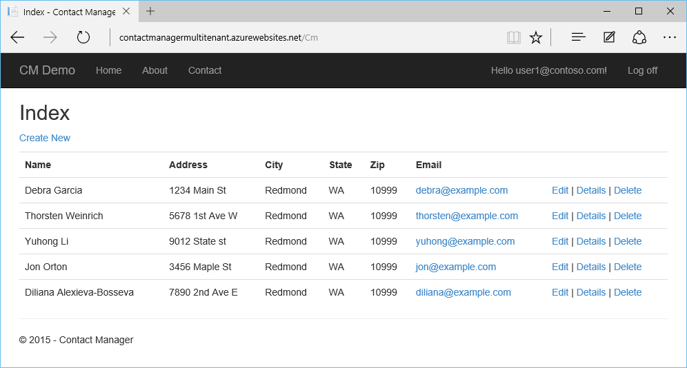

<properties
	pageTitle="教程：使用多租户数据库和 Entity Framework 及行级别安全性的 Web 应用"
	description="了解如何通过 Entity Framework 和行级安全性来开发使用多租户 SQL 数据库后端的 ASP.NET MVC 5 Web 应用。"
	metaKeywords="Azure ASP.NET MVC Entity Framework 多租户行级别安全 RLS SQL 数据库"
	services="app-service\web"
	documentationCenter=".net"
	manager="jeffreyg"
	authors="tmullaney"/>

<tags
	ms.service="app-service-web"
	ms.date="04/25/2016"
	wacn.date="06/29/2016"/>

# 教程：使用多租户数据库和 Entity Framework 及行级别安全性的 Web 应用

本教程说明了如何构建多租户 Web 应用，该应用使用“[共享数据库，共享架构](https://msdn.microsoft.com/zh-cn/library/aa479086.aspx)”租户模型，并使用 Entity Framework 和[行级别安全性](https://msdn.microsoft.com/zh-cn/library/dn765131.aspx)。在此模型中，单个数据库包含多个租户的数据，每个表中的每一行都与“租户 ID”相关联。 行级别安全性 (RLS) 是 Azure SQL 数据库的新功能，用于防止租户访问彼此的数据。该功能只需对应用程序进行单个的小改动。通过将租户访问逻辑集中于数据库本身，RLS 简化了应用程序代码，降低了租户之间发生意外数据泄露的风险。

让我们先看看[通过身份验证和 SQL 数据库创建 ASP.NET MVP 应用并将其部署到 Azure Web 应用](/documentation/articles/web-sites-dotnet-deploy-aspnet-mvc-app-membership-oauth-sql-database/)中一个简单的联系人管理器应用程序。该应用程序现在允许所有用户（租户）查看所有联系人：

只需进行一些很小的改动，我们就可以增加对多租户的支持，让用户只能查看属于自己的联系人。

## 步骤 1：在应用程序中添加一个侦听器类，以便设置 SESSION\_CONTEXT

需要进行一项应用程序更改。由于所有应用程序用户都使用相同的连接字符串（即相同的 SQL 登录名）来连接到数据库，因此目前的 RLS 策略并不知道应该针对哪个用户进行筛选。这种方法在 Web 应用程序中很常见，因为它可以确保连接池的高效率，但也意味着我们需要使用其他方法来标识当前正在数据库中的应用程序用户。解决方法是让应用程序在打开连接之后、执行任何查询之前，先在 [SESSION\_CONTEXT](https://msdn.microsoft.com/zh-cn/library/mt590806) 中针对当前的 UserId 设置一个键-值对。SESSION\_CONTEXT 是一个会话范围的键/值存储空间，我们的 RLS 策略将使用存储在该空间的 UserId 来标识当前用户。

我们将添加一个[拦截器](https://msdn.microsoft.com/data/dn469464.aspx)（具体而言，为 [DbConnectionInterceptor](https://msdn.microsoft.com/zh-cn/library/system.data.entity.infrastructure.interception.idbconnectioninterceptor)，这是 Entity Framework (EF) 6 中的新功能），以便每当 EF 打开连接时，通过执行一个 T-SQL 语句在 SESSION\_CONTEXT 中自动设置当前 UserId。

1.	在 Visual Studio 中打开 ContactManager 项目。
2.	右键单击解决方案资源管理器中的 Models 文件夹，然后选择“添加”>“类”。
3.	将新类命名为“SessionContextInterceptor.cs”，然后单击“添加”。
4.	将 SessionContextInterceptor.cs 的内容替换为以下代码。

		using System;
		using System.Collections.Generic;
		using System.Linq;
		using System.Web;
		using System.Data.Common;
		using System.Data.Entity;
		using System.Data.Entity.Infrastructure.Interception;
		using Microsoft.AspNet.Identity;
		
		namespace ContactManager.Models
		{
		    public class SessionContextInterceptor : IDbConnectionInterceptor
		    {
		        public void Opened(DbConnection connection, DbConnectionInterceptionContext interceptionContext)
		        {
		        	// Set SESSION_CONTEXT to current UserId whenever EF opens a connection
		            try
		            {
		                var userId = System.Web.HttpContext.Current.User.Identity.GetUserId();
		                if (userId != null)
		                {
		                    DbCommand cmd = connection.CreateCommand();
		                    cmd.CommandText = "EXEC sp_set_session_context @key=N'UserId', @value=@UserId";
		                    DbParameter param = cmd.CreateParameter();
		                    param.ParameterName = "@UserId";
		                    param.Value = userId;
		                    cmd.Parameters.Add(param);
		                    cmd.ExecuteNonQuery();
		                }
		            }
		            catch (System.NullReferenceException)
		            {
		                // If no user is logged in, leave SESSION_CONTEXT null (all rows will be filtered)
		            }
		        }
		        
		        public void Opening(DbConnection connection, DbConnectionInterceptionContext interceptionContext)
		        {
		        }
		
		        public void BeganTransaction(DbConnection connection, BeginTransactionInterceptionContext interceptionContext)
		        {
		        }
		
		        public void BeginningTransaction(DbConnection connection, BeginTransactionInterceptionContext interceptionContext)
		        {
		        }
		
		        public void Closed(DbConnection connection, DbConnectionInterceptionContext interceptionContext)
		        {
		        }
		
		        public void Closing(DbConnection connection, DbConnectionInterceptionContext interceptionContext)
		        {
		        }
		
		        public void ConnectionStringGetting(DbConnection connection, DbConnectionInterceptionContext<string> interceptionContext)
		        {
		        }
		
		        public void ConnectionStringGot(DbConnection connection, DbConnectionInterceptionContext<string> interceptionContext)
		        {
		        }
		
		        public void ConnectionStringSet(DbConnection connection, DbConnectionPropertyInterceptionContext<string> interceptionContext)
		        {
		        }
		
		        public void ConnectionStringSetting(DbConnection connection, DbConnectionPropertyInterceptionContext<string> interceptionContext)
		        {
		        }
		
		        public void ConnectionTimeoutGetting(DbConnection connection, DbConnectionInterceptionContext<int> interceptionContext)
		        {
		        }
		
		        public void ConnectionTimeoutGot(DbConnection connection, DbConnectionInterceptionContext<int> interceptionContext)
		        {
		        }
		
		        public void DataSourceGetting(DbConnection connection, DbConnectionInterceptionContext<string> interceptionContext)
		        {
		        }
		
		        public void DataSourceGot(DbConnection connection, DbConnectionInterceptionContext<string> interceptionContext)
		        {
		        }
		
		        public void DatabaseGetting(DbConnection connection, DbConnectionInterceptionContext<string> interceptionContext)
		        {
		        }
		
		        public void DatabaseGot(DbConnection connection, DbConnectionInterceptionContext<string> interceptionContext)
		        {
		        }
		
		        public void Disposed(DbConnection connection, DbConnectionInterceptionContext interceptionContext)
		        {
		        }
		
		        public void Disposing(DbConnection connection, DbConnectionInterceptionContext interceptionContext)
		        {
		        }
		
		        public void EnlistedTransaction(DbConnection connection, EnlistTransactionInterceptionContext interceptionContext)
		        {
		        }
		
		        public void EnlistingTransaction(DbConnection connection, EnlistTransactionInterceptionContext interceptionContext)
		        {
		        }
		
		        public void ServerVersionGetting(DbConnection connection, DbConnectionInterceptionContext<string> interceptionContext)
		        {
		        }
		
		        public void ServerVersionGot(DbConnection connection, DbConnectionInterceptionContext<string> interceptionContext)
		        {
		        }
		
		        public void StateGetting(DbConnection connection, DbConnectionInterceptionContext<System.Data.ConnectionState> interceptionContext)
		        {
		        }
		
		        public void StateGot(DbConnection connection, DbConnectionInterceptionContext<System.Data.ConnectionState> interceptionContext)
		        {
		        }
		    }
		
		    public class SessionContextConfiguration : DbConfiguration
		    {
		        public SessionContextConfiguration()
		        {
		            AddInterceptor(new SessionContextInterceptor());
		        }
		    }
		}

只需对应用程序进行这样的更改。继续操作，构建并发布应用程序。

## 步骤 2：将 UserId 列添加到数据库架构

接下来，我们需要将 UserId 列添加到 Contacts 表，以便将每一行与用户（租户）相关联。我们会直接在数据库中更改架构，这样就不需要在 EF 数据模型中包括该字段。

使用 SQL Server Management Studio 或 Visual Studio 直接连接到数据库，然后执行以下 T-SQL：

	ALTER TABLE Contacts ADD UserId nvarchar(128)
	    DEFAULT CAST(SESSION_CONTEXT(N'UserId') AS nvarchar(128))

此时会将 UserId 列添加到 Contacts 表。我们使用与 AspNetUsers 表中存储的 UserId 相匹配的 nvarchar(128) 数据类型，同时创建一个 DEFAULT 约束条件，以便自动将新插入行的 UserId 设置为当前存储在 SESSION\_CONTEXT 中的 UserId。

现在，该表将如下所示：

当创建新的联系人时，系统会自动向其分配正确的 UserId。不过，为了演示方便，我们可以将一部分现有的联系人分配给现有的用户。

如果你已在应用程序中创建了一些用户（例如，使用本地帐户进行创建），则会在 AspNetUsers 表中看到这些用户。在下面的屏幕快照中，目前只有一个用户。

复制 user1@contoso.com 的 ID，将其粘贴到下面的 T-SQL 语句中。执行该语句，将 3 个联系人与此 UserId 相关联。

	UPDATE Contacts SET UserId = '19bc9b0d-28dd-4510-bd5e-d6b6d445f511'
	WHERE ContactId IN (1, 2, 5)

## 步骤 3：在数据库中创建行级安全性策略

最后一步是创建一个安全策略，以便使用 SESSION\_CONTEXT 中的 UserId 自动筛选查询返回的结果。

在仍然连接到数据库的情况下，执行以下 T-SQL：

	CREATE SCHEMA Security
	go
	
	CREATE FUNCTION Security.userAccessPredicate(@UserId nvarchar(128))
		RETURNS TABLE
		WITH SCHEMABINDING
	AS
		RETURN SELECT 1 AS accessResult
		WHERE @UserId = CAST(SESSION_CONTEXT(N'UserId') AS nvarchar(128))
	go
	
	CREATE SECURITY POLICY Security.userSecurityPolicy
		ADD FILTER PREDICATE Security.userAccessPredicate(UserId) ON dbo.Contacts,
		ADD BLOCK PREDICATE Security.userAccessPredicate(UserId) ON dbo.Contacts
	go

此代码执行三项操作。首先，它会根据最佳实践创建一个新的架构，以便对 RLS 对象的访问权限进行集中管理和限制。接下来，它会创建一个谓词函数，该函数会在行的 UserId 与 SESSION\_CONTEXT 中的 UserId 相匹配时返回“1”。最后，它会创建一项安全策略，以便将此函数添加为 Contacts 表的筛选谓词和阻塞谓词。筛选谓词迫使查询仅返回属于当前用户的行，阻塞谓词则充当保护角色，防止应用程序意外插入错误用户的行。

现在请运行该应用程序，然后以 user1@contoso.com 身份登录。此用户现在只能看到我们此前分配给该 UserId 的联系人：

若要进一步验证这一点，请尝试注册一个新用户。新用户将看不到任何联系人，因为尚未向新用户分配任何联系人。如果新用户创建了一个新的联系人，系统会将该联系人分配给新用户，并且只有此新用户才能看到该联系人。

## 后续步骤

就这么简单！ 简单的联系人管理器 Web 应用已变成一个多租户应用，其中的每个用户都有自己的联系人列表。使用行级安全性以后，就不必在应用程序代码中强制实施租户访问逻辑，从而避免了各种复杂操作。这种透明性使得应用程序可以专注于处理现实中存在的业务问题，还可以降低随着应用程序的代码库增长而发生数据意外泄漏的风险。

本教程仅概要介绍了可以通过 RLS 执行的各种操作。例如，可以创建更完善或更细致的访问逻辑，还可以在 SESSION\_CONTEXT 中存储除当前 UserId 之外的其他内容。还可以[将 RLS 与弹性数据库工具客户端库相集成](/documentation/articles/sql-database-elastic-tools-multi-tenant-row-level-security/)，以便在扩展型数据层中启用多租户分片。

除了提供这些可能的操作，我们还致力于改进 RLS 的功能。如果你有任何问题、想法或者希望看到我们推出特定的功能，请在评论中指出。我们非常感谢你的反馈！

<!---HONumber=Mooncake_0307_2016-->