<properties
    pageTitle="使用 Visual Studio 将 ASP.NET 应用部署到 Azure App Service | Azure"
    description="了解如何使用 Visual Studio 将 ASP.NET Web 项目部署到 Azure App Service 中的新 Web 应用。"
    services="app-service\web"
    documentationcenter=".net"
    author="tdykstra"
    manager="wpickett"
    editor="" />  

<tags
    ms.assetid="69759e3c-384c-4afb-9278-db6724f6cb74"
    ms.service="app-service-web"
    ms.workload="web"
    ms.tgt_pltfrm="na"
    ms.devlang="dotnet"
    ms.topic="get-started-article"
    ms.date="07/22/2016"
    wacn.date="12/05/2016"
    ms.author="rachelap" />

# 使用 Visual Studio 将 ASP.NET Web 应用部署到 Azure App Service
[AZURE.INCLUDE [选项卡](../../includes/app-service-web-get-started-nav-tabs.md)]

## 概述
本教程介绍如何使用 Visual Studio 2015 将 ASP.NET Web 应用程序部署到 [Azure App Service 中的 Web 应用](/documentation/articles/app-service-web-overview/)。

本教程假设你是此前没有 Azure 使用经验的 ASP.NET 开发人员。完成本教程后，你将能够在云中启动并运行简单的 Web 应用程序。

学习内容：

* 在 Visual Studio 中，如何在创建新的 Web 项目的同时创建新的应用服务 Web 应用。
* 如何使用 Visual Studio 将 Web 项目部署到应用服务 Web 应用。

下图说明了在本教程中执行的操作。

教程末尾的[故障排除](#troubleshooting)部分介绍了在出现故障的情况下应如何操作，[后续步骤](#next-steps)部分提供了其他教程的链接，方便用户更深入地了解如何使用 Azure App Service。

由于这是一篇入门教程，其中只是说明了部署 Web 项目有多么简单 - 不需要使用数据库，也不需要进行身份验证或授权。有关更多高级部署主题的链接，请参阅 [How to deploy an Azure web app（如何部署 Azure Web 应用）](/documentation/articles/web-sites-deploy/)。

除了安装用于 .NET 的 Azure SDK 所需的时间，本教程需要大约 10-15 分钟才能完成。

## 先决条件
* 本教程假设你用过 ASP.NET MVC 和 Visual Studio。如需简介，请参阅 [Getting Started with ASP.NET MVC 5（ASP.NET MVC 5 入门）](http://www.asp.net/mvc/overview/getting-started/introduction/getting-started)。
* 需要一个 Azure 帐户。可以[建立 Azure 试用帐户](/pricing/1rmb-trial/?WT.mc_id=A261C142F)。

## 设置开发环境
本教程专为配合使用 Visual Studio 2015 和 [用于 .NET 的 Azure SDK](/documentation/articles/dotnet-sdk/) 2.9 或更高版本编写。

* [下载最新的用于 Visual Studio 2015 的 Azure SDK](http://go.microsoft.com/fwlink/?linkid=518003)。该 SDK 将会安装 Visual Studio 2015（如果尚未安装）。
  
  > [AZURE.NOTE]
  根据计算机上已有 SDK 依赖项数量的不同，安装 SDK 可能耗时较长，从几分钟到半小时或更长时间不等。
  > 
  > 

如果你有 Visual Studio 2013 并想要使用它，可以[下载最新的 Azure SDK for Visual Studio 2013](http://go.microsoft.com/fwlink/?LinkID=324322)。某些屏幕可能看起来与这些插图不同。

## 配置新的 Web 项目
下一步是在 Visual Studio 中创建一个 Web 项目，并在 Azure App Service 中创建一个 Web 应用。在本教程部分，你将配置新的 Web 项目。

1. 打开 Visual Studio 2015。
2. 单击“文件”>“新建”>“项目”。
3. 在“新建项目”对话框中，单击“Visual C#”>“Web”>“ASP.NET Web 应用程序”。
4. 确保选择 **.NET Framework 4.5.2** 作为目标框架。
4.  Azure 中国不支持 Application Insights。安装 Visual Studio 后，首次创建 Web 项目时，会默认选中“将 Application Insights 添加到项目”复选框。请清除复选框。
6. 将应用程序命名为 **MyExample**，然后单击“确定”。
   
    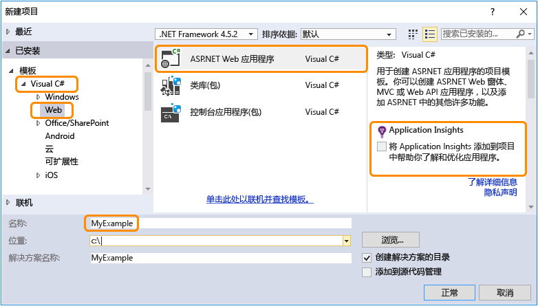
7. 在“新建 ASP.NET 项目”对话框中，选择“MVC”模板，然后单击“更改身份验证”。
   
    在本教程中，你将要部署 ASP.NET MVC Web 项目。如果想要了解如何部署 ASP.NET Web API 项目，请参阅[后续步骤](#next-steps)部分。
   
    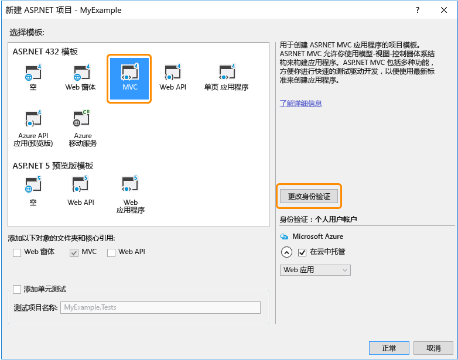
8. 在“更改身份验证”对话框中，单击“无身份验证”，然后单击“确定”。
   
    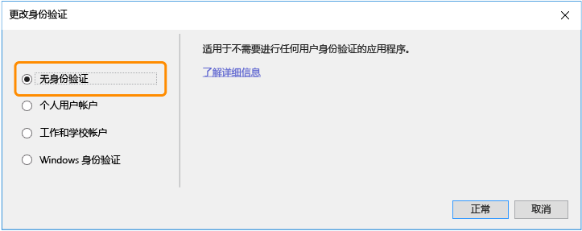
   
    在本快速入门教程中，你要部署一个不执行用户登录的简单应用。
9. 在“新建 ASP.NET 项目”对话框的“Azure”部分，确保已选择“在云中托管”，并且下拉列表中已选择“应用服务”。
   
      

   
    这些设置将指示 Visual Studio 为你的 Web 项目创建 Azure Web 应用。
10. 单击“确定”

##  配置新 Web 应用的 Azure 资源
现在告知 Visual Studio 希望其创建的 Azure 资源。

1. 在“创建应用服务”对话框中，单击“添加帐户”，然后使用用于管理 Azure 订阅的帐户的 ID 和密码登录到 Azure。
   
      

   
    如果之前已经在同一台计算机上登录，可能看不到“添加帐户”按钮。在这种情况下，可以跳过此步骤，也可以根据需要重新输入凭据。
2. 输入在 *chinacloudsites.cn* 域中唯一的 **Web 应用名称**。例如，可以将它命名为 MyExample 并在右侧加上数字，使其成为唯一名称，例如 MyExample810。如果为你创建了默认的 Web 名称，则该名称是唯一的，你可以使用该名称。
   
    如果其他人已经使用了你输入的名称，你将看到右边是一个红色感叹号而不是绿色复选标记，此时你必须输入其他名称。
   
    应用程序的 URL 是此名称加上 *.chinacloudsites.cn*。例如，如果名称为 `MyExample810`，则 URL 为 `myexample810.chinacloudsites.cn`。
   
    此外也可以通过 Azure Web 应用使用自定义域。有关详细信息，请参阅[在 Azure 应用服务中配置自定义域名](/documentation/articles/web-sites-custom-domain-name/)。
3. 单击“资源组”框旁边的“新建”按钮，然后根据需要输入“MyExample”或其他名称。
   
      

   
    资源组是 Azure 资源的集合，例如 Web 应用、数据库和 VM。在本教程中，最好创建新的资源组，因为这样可以通过一个步骤轻松删除你为本教程创建的所有 Azure 资源。有关详细信息，请参阅 [Azure Resource Manager overview](/documentation/articles/resource-group-overview/)（Azure Resource Manager 概述）。
4. 单击“应用服务计划”下拉列表旁边的“新建”按钮。
   
      

   
    此时会出现“配置应用服务计划”对话框。
   
    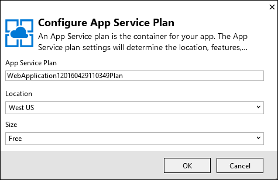  

   
    在以下步骤中，为新资源组配置应用服务计划。App Service 计划指定 Web 应用程序运行所在的计算资源。例如，如果你选择免费层，则 API 应用程序将在共享 VM 上运行；如果你选择某些付费层，则它在专用 VM 上运行。有关详细信息，请参阅 [App Service plans overview（应用服务计划概述）](/documentation/articles/azure-web-sites-web-hosting-plans-in-depth-overview/)。
5. 在“配置应用服务计划”对话框中，输入“MyExamplePlan”或其他所需的名称。
6. 在“位置”下拉列表中，选择最靠近的位置。
   
    此设置指定你的应用将在哪个 Azure 数据中心运行。就本教程来说，你可以选择任何区域，不会有明显差异。但是，对于生产应用，则需让服务器尽可能靠近访问该应用的客户端，以最大程度地减少[延迟](http://www.bing.com/search?q=web%20latency%20introduction&qs=n&form=QBRE&pq=web%20latency%20introduction&sc=1-24&sp=-1&sk=&cvid=eefff99dfc864d25a75a83740f1e0090)。
7. 在“大小”下拉列表中，单击“免费”。
   
    对于本教程，免费定价层可提供足够出色的性能。
8. 在“配置应用服务计划”对话框中，单击“确定”。
9. 在“创建应用服务”对话框中，单击“创建”。

## Visual Studio 创建项目和 Web 应用
通常在不到一分钟的时间内，Visual Studio 就能创建 Web 项目和 Web 应用。

“解决方案资源管理器”窗口将显示新项目中的文件和文件夹。

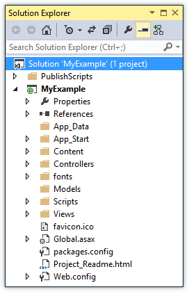  

“Azure App Service 活动”窗口将显示已创建的 Web 应用。

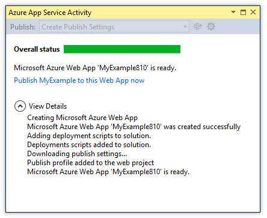  

可以在“Cloud Explorer”窗口查看和管理 Azure 资源，包括刚刚创建的新 Web 应用。

  

	
##  将 Web 项目部署到 Azure Web 应用
本部分需将 Web 项目部署到 Web 应用。

1. 在“解决方案资源管理器”中，右键单击该项目并选择“发布”。
   
    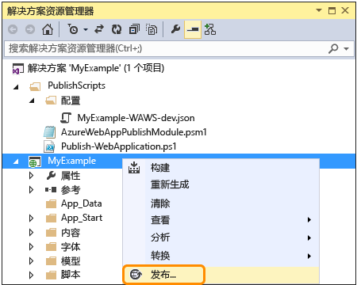
   
    几秒钟后，将显示“发布 Web”向导。此向导将打开某个*发布配置文件*，其中包含可将 Web 项目部署到新 Web 应用的设置。
   
    发布配置文件包含用于部署的用户名和密码。这些凭据已事先生成，因此不需要输入。密码已在 `Properties\PublishProfiles` 文件夹中某个隐藏的用户特定文件内加密。
2. 在“发布 Web”向导的“连接”选项卡中，单击“下一步”。
   
    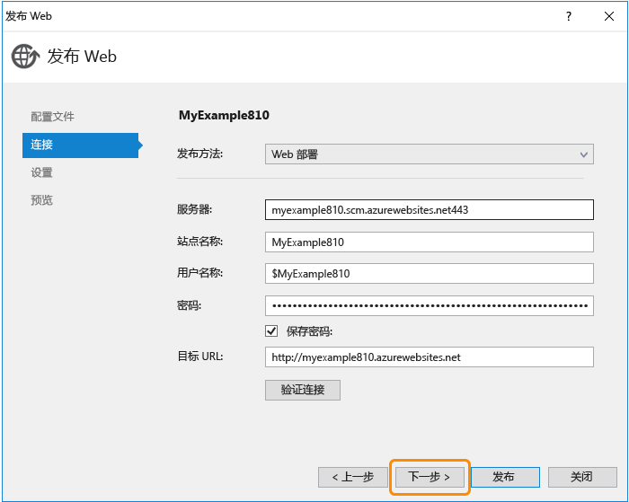  

   
    下一步是“设置”选项卡。可以在此处更改调试版本的配置，以部署用于[远程调试](/documentation/articles/web-sites-dotnet-troubleshoot-visual-studio/#remotedebug)的调试版本。该选项卡还提供了多个“文件发布选项”。
3. 在“设置”选项卡中，单击“下一步”。
   
   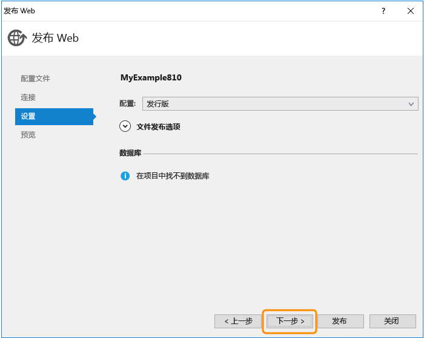  

   
   然后是“预览”选项卡。可以在此处查看要从项目复制到 API 应用的文件。如果要将项目部署到前面已部署到的 API 应用，则只会复制已更改的文件。如果想要查看要复制的项列表，请单击“开始预览”按钮。
4. 在“预览”选项卡中，单击“发布”。
   
   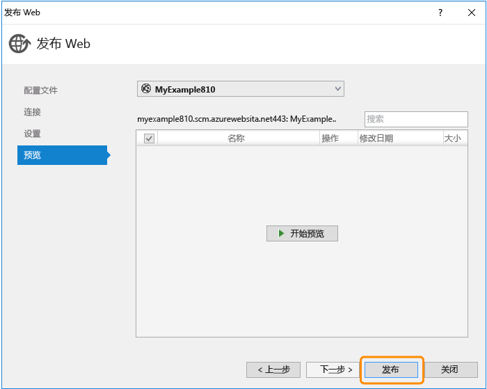
   
   单击“发布”后，Visual Studio 开始执行将文件复制到 Azure 服务器的过程。这可能需要一到两分钟。
   
   “输出”和“Azure 应用服务活动”窗口将显示已执行的部署操作并报告已成功完成部署。
   
   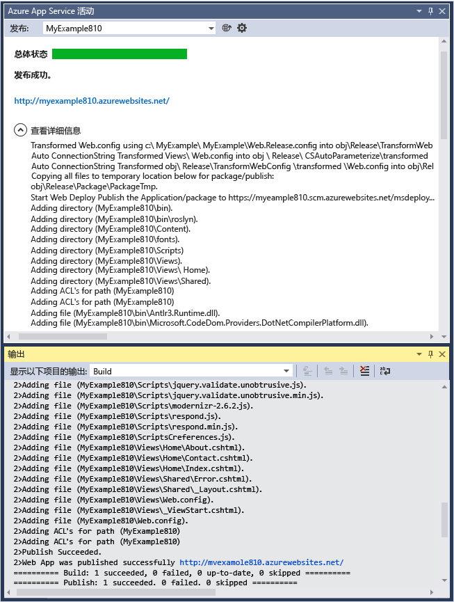
   
   成功完成部署后，默认浏览器将自动打开指向已部署 Web 应用的 URL。你创建的应用程序现在运行于云中。浏览器地址栏中的 URL 显示正在从 Internet 加载该 Web 应用。
   
   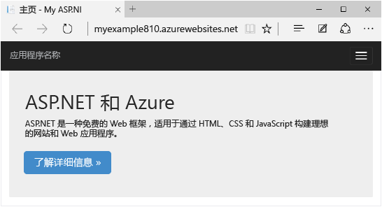
   
   > [AZURE.TIP]
   > 可以启用“Web 单键发布”工具栏以快速完成部署。单击“视图”>“工具栏”，然后选择“Web 单键发布”。可以通过工具栏选择一个配置文件，然后单击相关按钮进行发布，或者单击相关按钮打开“发布 Web”向导。
   > 
   > 
   > 

## 故障排除
如果在学习本教程的过程中遇到问题，请确保你使用的是最新版本的用于 .NET 的 Azure SDK。检查版本的最简单方法是[下载用于 Visual Studio 2015 的 Azure SDK](http://go.microsoft.com/fwlink/?linkid=518003)。如果你已安装最新版本，Web 平台安装程序会指出不需要进行安装。

如果在企业网络中并尝试通过防火墙部署到 Azure App Service，请确保已针对 Web 部署打开端口 443 和 8172。如果无法打开这些端口，请参阅下面的“后续步骤”部分以了解其他部署选项。

在 Azure App Service 中运行 ASP .NET Web 应用后，你可能想要深入了解可简化故障排除的 Visual Studio 功能。有关日志记录、远程调试等功能的信息，请参阅 [Troubleshooting Azure web apps in Visual Studio（在 Visual Studio 中对 Azure Web 应用进行故障排除）](/documentation/articles/web-sites-dotnet-troubleshoot-visual-studio/)。

## 后续步骤
在本教程中，你已了解如何创建简单的 Web 应用程序并将其部署到 Azure Web 应用。可通过以下相关主题和资源来详细了解 Azure App Service：

* 在 [Azure 门户预览](https://portal.azure.cn/)中监视和管理 Web 应用。
  
	有关详细信息，请参阅 [Configure web app in Azure App Service（在 Azure App Service 中配置 Web 应用）](/documentation/articles/web-sites-configure/)。
* 使用 Visual Studio 将现有 Web 项目部署到新的 Web 应用
  
    在“解决方案资源管理器”中右键单击该项目，然后单击“发布”。选择“Azure 应用服务”作为发布目标，然后单击“新建”。对话框与本教程所见相同。
* 从源代码管理部署 Web 项目
  
    有关通过[源代码管理系统](http://www.asp.net/aspnet/overview/developing-apps-with-windows-azure/building-real-world-cloud-apps-with-windows-azure/source-control)[自动完成部署](http://www.asp.net/aspnet/overview/developing-apps-with-windows-azure/building-real-world-cloud-apps-with-windows-azure/continuous-integration-and-continuous-delivery)的信息，请参阅 [Get started with web apps in Azure App Service（Azure App Service 中的 Web 应用入门）](/documentation/articles/app-service-web-get-started/)和 [How to deploy an Azure web app（如何部署 Azure Web 应用）](/documentation/articles/web-sites-deploy/)。
* 将 ASP.NET Web API 部署到 Azure App Service 中的 API 应用
  
    你已经了解如何创建主要用于托管网站的 Azure App Service 实例。应用服务还提供了用于托管 Web API 的功能，例如，用于生成客户端代码的 CORS 支持和 API 元数据支持。你可以在 Web 应用中使用 API 功能，但如果你主要希望在应用服务的实例中托管 API，则 **API 应用**是更好的选择。有关详细信息，请参阅 [Get started with API Apps and ASP.NET in Azure App Service（Azure App Service 中的 API 应用和 ASP.NET 入门）](/documentation/articles/app-service-api-dotnet-get-started/)。
* 添加自定义域名和 SSL
  
    有关如何使用 SSL 和你自己的域（例如 www.contoso.com 而不是 contoso.chinacloudsites.cn）的信息，请参阅以下资源：
  
  * [在 Azure App Service 中配置自定义域名](/documentation/articles/web-sites-custom-domain-name/)
  * [为 Azure 网站启用 HTTPS](/documentation/articles/web-sites-configure-ssl-certificate/)
* 当你不再使用 Web 应用和任何相关的 Azure 资源时，请删除包含这些资源的资源组。
  
	有关如何在 Azure 门户预览中使用资源组的信息，请参阅[使用 Resource Manager 模板和 Azure 门户预览部署资源](/documentation/articles/resource-group-template-deploy-portal/)。
* 有关在应用服务中创建 ASP.NET Web 应用的更多示例，请参阅 [HealthClinic.biz](https://github.com/Microsoft/HealthClinic.biz) 2015 Connect [演示](https://blogs.msdn.microsoft.com/visualstudio/2015/12/08/connectdemos-2015-healthclinic-biz/)中的 [Create and deploy an ASP.NET web app in Azure App Service（在 Azure App Service 中创建和部署 ASP.NET Web 应用）](https://github.com/Microsoft/HealthClinic.biz/wiki/Create-and-deploy-an-ASP.NET-web-app-in-Azure-App-Service)和 [Create and deploy a mobile app in Azure App Service（在 Azure App Service 中创建和部署移动应用）](https://github.com/Microsoft/HealthClinic.biz/wiki/Create-and-deploy-a-mobile-app-in-Azure-App-Service)。有关 HealthClinic.biz 演示的多个快速入门，请参阅 [Azure Developer Tools Quickstarts（Azure 开发人员工具快速入门）](https://github.com/Microsoft/HealthClinic.biz/wiki/Azure-Developer-Tools-Quickstarts)。

<!---HONumber=Mooncake_1128_2016-->