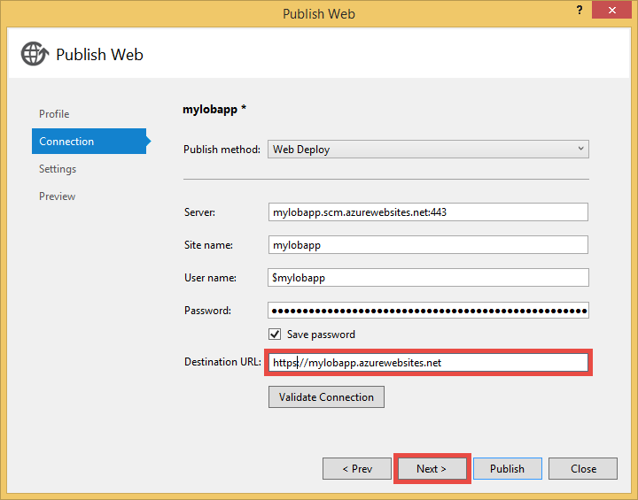
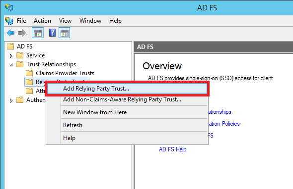
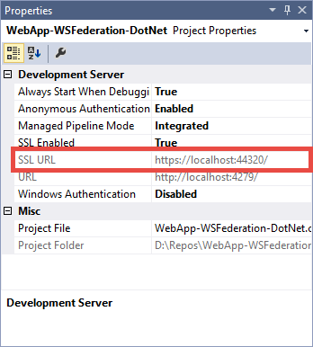
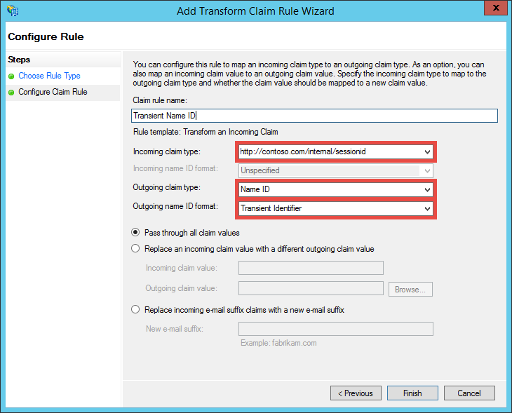

<properties 
	pageTitle="使用 AD FS 身份验证创建业务线 Azure 应用 | Azure" 
	description="了解如何在 Azure 应用服务中创建使用本地 STS 进行身份验证的业务线应用。本教程将 AD FS 定位为本地 STS。" 
	services="app-service\web" 
	documentationCenter=".net" 
	authors="cephalin" 
	manager="wpickett" 
	editor=""/>

<tags 
	ms.service="app-service-web" 
	ms.devlang="dotnet" 
	ms.topic="article" 
	ms.tgt_pltfrm="na" 
	ms.workload="web" 
	ms.date="08/31/2016" 
	wacn.date="11/25/2016" 
	ms.author="cephalin"/>
	ms.author="cephalin"/>

# 使用 AD FS 身份验证创建业务线 Azure 应用

[AZURE.INCLUDE [azure-sdk-developer-differences](../../includes/azure-sdk-developer-differences.md)]

本文说明如何使用本地 [Active Directory 联合身份验证服务](http://technet.microsoft.com/zh-cn/library/hh831502.aspx)作为标识提供者，在 [Azure 应用服务](/documentation/articles/app-service-value-prop-what-is/)中创建 ASP.NET MVC 业务线应用程序。如果要在 Azure 应用服务中创建业务线应用程序，并且组织要求在现场存储目录数据，则可以使用此方案。

>[AZURE.NOTE] 有关 Azure 应用服务的不同企业身份验证和授权选项的概述，请参阅 [Authenticate with on-premises Active Directory in your Azure app](/documentation/articles/web-sites-authentication-authorization/)（在 Azure 应用中使用本地 Active Directory 进行身份验证）。

## 要构建的项目 ##

您将在 Azure App Service Web Apps 中生成具有以下功能的基本 ASP.NET 应用程序：

- 根据 AD FS 对用户进行身份验证
- 使用 `[Authorize]` 授权用户执行不同操作
- 用于在 Visual Studio 中进行调试和发布到 App Service Web Apps 的静态配置（配置一次，随时调试和发布）

## 所需条件 ##

[AZURE.INCLUDE [free-trial-note](../../includes/free-trial-note.md)]

若要完成本教程，你需要以下项目：

- 本地 AD FS 部署（有关本教程中使用的测试实验室的端到端演练，请参阅 [Test Lab: Standalone STS with AD FS in Azure VM (for test only)](https://blogs.msdn.microsoft.com/cephalin/2014/12/21/test-lab-standalone-sts-with-ad-fs-in-azure-vm-for-test-only/)（测试实验室：Azure VM 中使用 AD FS 的独立 STS（仅用于测试））
- 用于在 AD FS 管理中创建信赖方信任的权限
- Visual Studio 2013 Update 4 或更高版本
- [Azure SDK 2.8.1](https://www.microsoft.com/web/handlers/webpi.ashx/getinstaller/VWDOrVs2013AzurePack.appids) 或更高版本

## 将示例应用程序用作业务线模板 ##

本教程中的示例应用程序 [WebApp-WSFederation-DotNet)](https://github.com/AzureADSamples/WebApp-WSFederation-DotNet) 是由 Azure Active Directory 团队创建。由于 AD FS 支持 WS 联合身份验证，因此可以将它用作模板来轻松创建业务线应用程序。该示例应用程序具有以下功能：

- 使用 [WS 联合身份验证](http://msdn.microsoft.com/zh-cn/library/bb498017.aspx)进行本地 AD FS 部署身份验证
- 登录和注销功能
- 使用 [Microsoft.Owin](http://www.asp.net/aspnet/overview/owin-and-katana/an-overview-of-project-katana)（而不是 Windows Identity Foundation），它代表 ASP.NET 的未来发展方向，与 WIF 相比，它的身份验证和授权设置要简单得多

## 设置示例应用程序 ##

2.	将 [WebApp-WSFederation-DotNet](https://github.com/AzureADSamples/WebApp-WSFederation-DotNet) 的示例解决方案克隆或下载到您的本地目录中。

	> [AZURE.NOTE] [README.md](https://github.com/AzureADSamples/WebApp-WSFederation-DotNet/blob/master/README.md) 中的说明介绍了如何使用 Azure Active Directory 设置应用程序。但本教程中使用 AD FS 进行设置，因此请改用本教程中的步骤。

3.	打开解决方案，然后在“解决方案资源管理器”中打开 Controllers\\AccountController.cs。

	你将看到，代码只是发出身份验证质询以使用 WS-Federation 对用户进行身份验证。所有身份验证都在 App\_Start.Auth.cs 中配置。

4.  打开 App\_Start.Auth.cs。在 `ConfigureAuth` 方法中，记录下面的代码行：

        app.UseWsFederationAuthentication(
            new WsFederationAuthenticationOptions
            {
                Wtrealm = realm,
                MetadataAddress = metadata                                      
            });

	在 OWIN 领域中，此代码片段实际上配置 WS-Federation 所需的最低要求。这比 WIF 要精简得多，因为 Web.config 中的各个位置都注入了 XML。所需的唯一信息就是信赖方 (RP) 标识符和 AD FS 服务元数据文件的 URL。下面是一个示例：

	-	RP 标识符：`https://contoso.com/MyLOBApp`
	-	元数据地址：`http://adfs.contoso.com/FederationMetadata/2007-06/FederationMetadata.xml`

5.	在 App\_Start\\Startup.Auth.cs 中，更改以下静态字符串定义：
	<pre class="prettyprint">
	private static string realm = ConfigurationManager.AppSettings["ida:<mark>RPIdentifier</mark>"];
    <mark><del>private static string aadInstance = ConfigurationManager.AppSettings["ida:AADInstance"];</del></mark>
    <mark><del>private static string tenant = ConfigurationManager.AppSettings["ida:Tenant"];</del></mark>
    <mark><del>private static string metadata = string.Format("{0}/{1}/federationmetadata/2007-06/federationmetadata.xml", aadInstance, tenant);</del></mark>
    <mark>private static string metadata = string.Format("https://{0}/federationmetadata/2007-06/federationmetadata.xml", ConfigurationManager.AppSettings["ida:ADFS"]);</mark>

    <mark><del>string authority = String.Format(CultureInfo.InvariantCulture, aadInstance, tenant);</del></mark>
    </pre>

6.	现在，请在 Web.config 中进行相应的更改。打开 Web.config，修改以下应用设置：
	<pre class="prettyprint">
	&lt;appSettings&gt;
	  &lt;add key="webpages:Version" value="3.0.0.0" /&gt;
	  &lt;add key="webpages:Enabled" value="false" /&gt;
	  &lt;add key="ClientValidationEnabled" value="true" /&gt;
	  &lt;add key="UnobtrusiveJavaScriptEnabled" value="true" /&gt;
	  <mark><del>&lt;add key="ida:Wtrealm" value="[Enter the App ID URI of WebApp-WSFederation-DotNet https://contoso.partner.onmschina.cn/WebApp-WSFederation-DotNet]" /&gt;</del></mark>
	  <mark><del>&lt;add key="ida:AADInstance" value="https://login.chinacloudapi.cn" /&gt;</del></mark>
	  <mark><del>&lt;add key="ida:Tenant" value="[Enter tenant name, e.g. contoso.partner.onmschina.cn]" /&gt;</del></mark>
	  <mark>&lt;add key="ida:RPIdentifier" value="[Enter the relying party identifier as configured in AD FS, e.g. https://localhost:44320/]" /&gt;</mark>
	  <mark>&lt;add key="ida:ADFS" value="[Enter the FQDN of AD FS service, e.g. adfs.contoso.com]" /&gt;</mark>

	&lt;/appSettings&gt;
	</pre>

	根据相应的环境填写键值。

7.	生成应用程序，以确保没有任何错误。

就这么简单。现在，便可以配合 AD FS 运行该示例应用程序。稍后，仍需要在 AD FS 中配置 RP 与此应用程序间的信任关系。

## 将示例应用程序部署到 Azure 应用服务 Web 应用

现在，请将应用程序发布到应用服务 Web 应用中的 Web 应用，同时保留调试环境。请注意，你将要在建立 RP 与 AD FS 之间的信任关系之前发布应用程序，因此身份验证还不起作用。不过，如果现在就执行此操作，则可以获得 Web 应用 URL，稍后可以使用此 URL 来配置 RP 信任。

1. 右键单击您的项目，然后选择“发布”。

	

2. 选择“导入”。
3. 如果尚未下载“发布配置文件”，请转到 [Azure 经典管理门户](https://manage.windowsazure.cn)下载。如果尚未创建 Web 应用，请创建一个。然后，在 Web 应用“仪表板”页中的“速览”下，下载“发布配置文件”。
4. 选择前面下载的“发布配置文件”，然后单击“确定”。
7. 在“目标 URL”中，将 **http** 更改为 **https**。将整个 URL 复制到文本编辑器，以便稍后使用。然后，单击“发布”。

	

11. 在 Visual Studio 中，在项目中打开 **Web.Release.config**。在 `<configuration>` 标记中插入以下 XML，然后将键值替换为发布 Web 应用的 URL。
	<pre class="prettyprint">
&lt;appSettings&gt;
   &lt;add key="ida:RPIdentifier" value="<mark>[e.g. https://mylobapp.chinacloudsites.cn/]</mark>" xdt:Transform="SetAttributes" xdt:Locator="Match(key)" /&gt;
&lt;/appSettings&gt;</pre>

完成后，您的项目中将配置有两个 RP 标识符，一个用于 Visual Studio 中的调试环境，另一个用于 Azure 中发布的 Web 应用。你将为 AD FS 中两个环境的每一个设置 RP 信任。在调试期间，将使用 Web.config 中的应用设置来使**调试**配置适用于 AD FS。发布配置（默认情况下，会发布**版本**配置）后，将上载转换的 Web.config，其中包含 Web.Release.config 中的应用设置更改。

如果您想将 Azure 中已发布的 Web 应用附加到调试器（即必须上载已发布的 Web 应用中的代码调试符号），则可以克隆一个调试配置进行 Azure 调试，但自身需要使用 Web.Release.config 中的应用设置进行自定义 Web.config 转换（例如 Web.AzureDebug.config）。这样，你可以跨不同的环境中维护静态配置。

## 在 AD FS 管理中配置信赖方信任 ##

现在，需要先在 AD FS 管理中配置 RP 信任，然后才能使用示例应用程序并真正在 AD FS 上进行身份验证。您需要单独设置两个 RP 信任，一个用于调试环境，另一个用于已发布的 Web 应用。

> [AZURE.NOTE] 请务必针对两个环境重复以下步骤。

4.	在 AD FS 服务器上，使用对 AD FS 具有管理权限的凭据登录。
5.	打开“AD FS 管理”。右键单击“AD FS\\信任关系\\信赖方信任”，然后选择“添加信赖方信任”。

	

5.	在“选择数据源”页面上，选择“手动输入信赖方数据”。

	

6.	在“指定显示名称”页面上，键入应用程序的显示名称，然后单击“下一步”。
7.	在“选择协议”页面上，单击“下一步”。
8.	在“配置证书”页面上，单击“下一步”。

	> [AZURE.NOTE] 由于你已在使用 HTTPS，因此加密令牌是可选的。如果你确实想要在此页上加密来自 AD FS 的令牌，则还必须在代码中添加令牌解密逻辑。有关详细信息，请参阅[手动配置 OWIN WS 联合身份验证中间件和接受加密令牌](http://chris.59north.com/post/2014/08/21/Manually-configuring-OWIN-WS-Federation-middleware-and-accepting-encrypted-tokens.aspx)。
  
5.	在转到下一步之前，需要获得 Visual Studio 项目中的一个信息片段。在项目属性中，记录应用程序的 **SSL URL**。

	

6.	返回“AD FS 管理”，在“添加信赖方信任向导”的“配置 URL”页面中，选择“启用支持 WS 联合身份验证被动协议”，然后键入您在上一步中记录的 Visual Studio 项目 SSL URL。然后，单击“下一步”。

	

	> [AZURE.NOTE] URL 指定身份验证成功后要将客户端发送到的位置。对于调试环境，它应为 <code>https://localhost:&lt;port&gt;/</code>。对于发布的 Web 应用，它应该是 Web 应用 URL。

7.	在“配置标识符”页面上，确认您的项目 SSL URL 是否已列出，然后单击“下一步”。保持默认选择不变，同时单击“下一步”，一直到向导结束。

	> [AZURE.NOTE] 在 Visual Studio 项目的 App\_Start\\Startup.Auth.cs 中，此标识符与联合身份验证期间 <code>WsFederationAuthenticationOptions.Wtrealm</code> 的值相匹配。默认情况下，将添加上一步中的应用程序 URL 作为 RP 标识符。

8.	现在，你已在 AD FS 中为项目完成了 RP 应用程序的配置。接下来，要将此应用程序配置为发送应用程序所需的声明。在向导结束时，系统会默认打开“编辑声明规则”对话框，方便您立即启动。至少配置以下声明（括号中为架构）：

	-	名称 (http://schemas.xmlsoap.org/ws/2005/05/identity/claims/name) - ASP.NET 用来解冻 `User.Identity.Name`。
	-	用户主体名称 (http://schemas.xmlsoap.org/ws/2005/05/identity/claims/upn) - 用于唯一标识组织中的用户。
	-	将成员资格分组为角色 (http://schemas.microsoft.com/ws/2008/06/identity/claims/role) - 可与 `[Authorize(Roles="role1, role2,...")]` 修饰符配合使用来授权控制器/操作。事实上，这可能不是角色授权的最有效方法。如果 AD 用户属于数百个安全组，他们将变成 SAML 令牌中的数百个角色声明。另一种方法是在某个特定组发送单个角色声明有条件地根据用户的成员身份。但是，本教程将简化其结构。
	-	名称 ID (http://schemas.xmlsoap.org/ws/2005/05/identity/claims/nameidentifier) - 可用于防伪验证。若要详细了解如何使其适用于防伪验证，请参阅 [Create a line-of-business Azure app with Azure Active Directory authentication](/documentation/articles/web-sites-dotnet-lob-application-azure-ad/#bkmk_crud)（使用 Azure Active Directory 身份验证创建业务线 Azure 应用）中的**Add line-of-business functionality**（添加业务线功能）部分。

	> [AZURE.NOTE] 需要为应用程序配置的声明类型取决于应用程序的需求。有关 Azure Active Directory 应用程序支持的声明列表（即 RP 信任），请参阅[支持的令牌和声明类型](/documentation/articles/active-directory-token-and-claims/)。

8.	在“编辑声明规则”对话框中，单击“添加规则”。
9.	如以下屏幕截图所示配置名称、UPN 和角色声明，然后单击“完成”。

	

	接下来，使用 [SAML 断言中的名称标识符](http://blogs.msdn.com/b/card/archive/2010/02/17/name-identifiers-in-saml-assertions.aspx)中演示的步骤，创建一个临时名称 ID 声明。

9.	再次单击“添加规则”。
10.	选择“使用自定义规则发送声明”，然后单击“下一步”。
11.	将以下规则语言粘贴到“自定义规则”框中，**根据会话标识符**命名规则，然后单击“完成”。
	<pre class="prettyprint">
	c1:[Type == "http://schemas.microsoft.com/ws/2008/06/identity/claims/windowsaccountname"] &amp;&amp;
	c2:[Type == "http://schemas.microsoft.com/ws/2008/06/identity/claims/authenticationinstant"]
		=> add(
			store = "_OpaqueIdStore",
			types = ("<mark>http://contoso.com/internal/sessionid</mark>"),
			query = "{0};{1};{2};{3};{4}",
			param = "useEntropy",
			param = c1.Value,
			param = c1.OriginalIssuer,
			param = "",
			param = c2.Value);
	</pre>

	自定义规则应如以下屏幕截图所示：

	

9.	再次单击“添加规则”。
10.	选择“转换传入声明”，然后单击“下一步”。
11.	如屏幕截图所示配置规则（使用在自定义规则中创建的声明类型），然后单击“完成”。

	

	若要详细了解如何创建临时名称 ID 声明，请参阅 [Name Identifiers in SAML assertions](http://blogs.msdn.com/b/card/archive/2010/02/17/name-identifiers-in-saml-assertions.aspx)（SAML 断言中的名称标识符）。

12.	单击“编辑声明规则”对话框中的“应用”。现在，该规则应如以下屏幕截图所示：

	

	> [AZURE.NOTE] 同样，请确保对调试环境和发布的 Web 应用重复这些步骤。

## 测试应用程序的联合身份验证

现在，你可以针对 AD FS 测试应用程序的身份验证逻辑。在 AD FS 实验室环境中，我有一个属于 Active Directory (AD) 中测试组的测试用户。

若要在调试器中测试身份验证，只需按 `F5` 即可。若要在已发布的 Web 应用中测试身份验证，请转到 URL 对应的页面。

加载 Web 应用程序后，单击“登录”。现在，应该会显示 AD FS 提供的登录对话框或登录页（具体取决于 AD FS 选择的身份验证方法）。下面是 Internet Explorer 11 中显示的元素。

使用 AD FS 部署的 AD 域中的用户登录后，应会在屏幕角落中再次看到显示“欢迎 <用户名>!”的主页。以下我看到的元素。

现在，你已在以下方面取得了成功：

- 你的应用程序已成功访问 AD FS，并且在 AD FS 数据库中找到了匹配的 RP 标识符
- AD FS 已成功对 AD 用户进行身份验证，并将你重定向回到应用程序的主页
- AD FS 已成功向应用程序发送名称声明 (http://schemas.xmlsoap.org/ws/2005/05/identity/claims/name)，这可以通过网页一角显示的用户名来判断。

如果缺少名称声明，您看到的是“您好！”。如果查看 Views\\Shared\_LoginPartial.cshtml，会发现它使用 `User.Identity.Name` 显示用户名。如前所述，如果可以在 SAML 令牌中获取经过身份验证用户的名称声明，ASP.NET 将使用它来生成此属性。若要查看 AD FS 发送的所有声明，请在索引操作方法的 Controllers\\HomeController.cs 中放置一个断点。对用户进行身份验证后，检查 `System.Security.Claims.Current.Claims` 集合。

 

## 为特定控制器或操作的用户授权

由于已在 RP 信任配置中添加组成员资格作为角色声明，因此，现在可以在控制器和操作的 `[Authorize(Roles="...")]` 修饰中直接使用这些声明。在采用创建-读取-更新-删除 (CRUD) 模式的业务线应用程序中，你可以授权特定的角色访问每个操作。目前，你只能对现有的主控制器试用此功能。

1. 打开 Controllers\\HomeController.cs。
2. 使用已经过身份验证的用户具有的安全组成员资格，修饰 `About` 和 `Contact` 操作方法，如以下代码所示。
	<pre class="prettyprint">
    <mark>[Authorize(Roles="Test Group")]</mark>
    public ActionResult About()
    {
        ViewBag.Message = "Your application description page.";

        return View();
    }

    <mark>[Authorize(Roles="Domain Admins")]</mark>
    public ActionResult Contact()
    {
        ViewBag.Message = "Your contact page.";

        return View();
    }
	</pre>

	由于我已在 AD FS 实验室环境中向“测试组”添加了**测试用户**，因此我将使用“测试组”在 `About` 上测试授权。对于 `Contact`，我将测试**测试用户**不属于的**域管理员**的反面情况。

3. 键入 `F5` 启动调试器并登录，然后单击“关于”。如果经过身份验证的用户已获得该操作的授权，那么您现在应该可以成功查看 `~/About/Index` 页面。
4. 现在，单击“联系人”，在此示例中不得授权**测试用户**执行该操作。但是，浏览器将重定向到 AD FS，并最终显示此消息：

	

	如果调查事件查看器中的 AD FS 服务器上出现此错误，将看到此异常消息：
	<pre class="prettyprint">
	Microsoft.IdentityServer.Web.InvalidRequestException: MSIS7042: <mark>同一个客户端浏览器会话在过去1 '11' 秒内发出了 '6' 个请求。</mark> 请联系管理员获取详细信息。
	   位置 Microsoft.IdentityServer.Web.Protocols.PassiveProtocolHandler.UpdateLoopDetectionCookie(WrappedHttpListenerContext context)
	   位置 Microsoft.IdentityServer.Web.Protocols.WSFederation.WSFederationProtocolHandler.SendSignInResponse(WSFederationContext context, MSISSignInResponse response)
	   位置 Microsoft.IdentityServer.Web.PassiveProtocolListener.ProcessProtocolRequest(ProtocolContext protocolContext, PassiveProtocolHandler protocolHandler)
	   位置 Microsoft.IdentityServer.Web.PassiveProtocolListener.OnGetContext(WrappedHttpListenerContext context)
	</pre>

	发生此错误的原因是默认情况下当用户的角色未授权时，MVC 将返回“401 未授权”。这会触发对标识提供程序 (AD FS) 的重新进行身份验证请求。由于用户已经过身份验证，AD FS 将返回同一页，然后再次发出 401，并创建重定向循环。您将使用简单的逻辑替代 AuthorizeAttribute 的 `HandleUnauthorizedRequest` 方法，以显示一些有意义的内容，而不是继续重定向循环。

5. 在项目中创建名为 AuthorizeAttribute.cs 的文件，并将以下代码粘贴到其中。

		using System;
		using System.Web.Mvc;
		using System.Web.Routing;
		
		namespace WebApp_WSFederation_DotNet
		{
		    [AttributeUsage(AttributeTargets.Class | AttributeTargets.Method, Inherited = true, AllowMultiple = true)]
		    public class AuthorizeAttribute : System.Web.Mvc.AuthorizeAttribute
		    {
		        protected override void HandleUnauthorizedRequest(AuthorizationContext filterContext)
		        {
		            if (filterContext.HttpContext.Request.IsAuthenticated)
		            {
		                filterContext.Result = new System.Web.Mvc.HttpStatusCodeResult((int)System.Net.HttpStatusCode.Forbidden);
		            }
		            else
		            {
		                base.HandleUnauthorizedRequest(filterContext);
		            }
		        }
		    }
		}

	在已身份验证但未授权的情况下，重写代码将发送 HTTP 403（禁止）而不是 HTTP 401（未授权）。

6. 再次使用 `F5` 运行调试器。现在，单击“联系人”会显示信息更丰富（但毫无吸引力）的错误消息：

	

7. 再次将应用程序发布到 Azure App Service Web Apps 中，并测试实时应用程序的行为。

## 连接到本地数据

使用 AD FS 而不是 Azure Active Directory 实施业务线应用程序的一个原因是，既能符合法规要求，同时可将组织数据保留在外部。这可能还意味着，您在 Azure 中的 Web 应用必须访问本地数据库，因为您不得使用 [SQL 数据库](/home/features/sql-database/)作为 Web 应用的数据层。

在 Azure 中国区，Azure 应用服务 Web 应用仅支持通过[虚拟网络](/documentation/articles/app-service-vnet-integration-powershell/)访问本地数据库。

## 其他资源

- [通过 SSL 和 Authorize 属性保护应用程序](/documentation/articles/web-sites-dotnet-deploy-aspnet-mvc-app-membership-oauth-sql-database/#protect-the-application-with-ssl-and-the-authorize-attribute)
- [Authenticate with on-premises Active Directory in your Azure app](/documentation/articles/web-sites-authentication-authorization/)（在 Azure 应用中使用本地 Active Directory 进行身份验证）
- [使用 Azure Active Directory 身份验证创建业务线 Azure 应用](/documentation/articles/web-sites-dotnet-lob-application-azure-ad/)
- [在 Visual Studio 2013 中将本地组织的身份验证选项 (ADFS) 与 ASP.NET 结合使用](http://www.cloudidentity.com/blog/2014/02/12/use-the-on-premises-organizational-authentication-option-adfs-with-asp-net-in-visual-studio-2013/)
- [将 VS2013 Web 项目从 WIF 迁移到 Katana](http://www.cloudidentity.com/blog/2014/09/15/MIGRATE-A-VS2013-WEB-PROJECT-FROM-WIF-TO-KATANA/)
- [Active Directory 联合身份验证服务概述](http://technet.microsoft.com/zh-cn/library/hh831502.aspx)
- [WS-Federation 1.1 规范](http://download.boulder.ibm.com/ibmdl/pub/software/dw/specs/ws-fed/WS-Federation-V1-1B.pdf?S_TACT=105AGX04&S_CMP=LP)

<!---HONumber=Mooncake_0926_2016-->