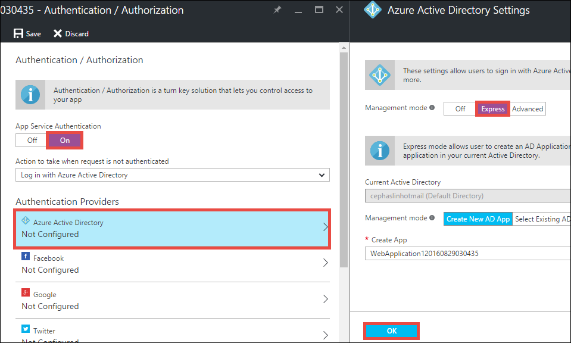
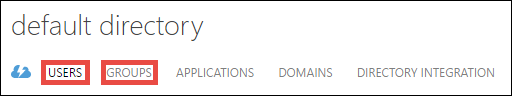
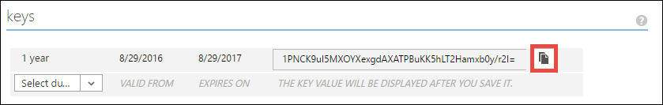
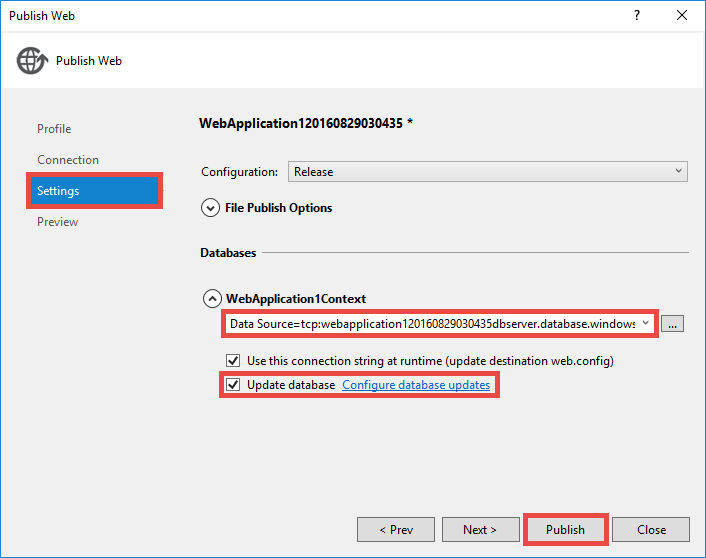
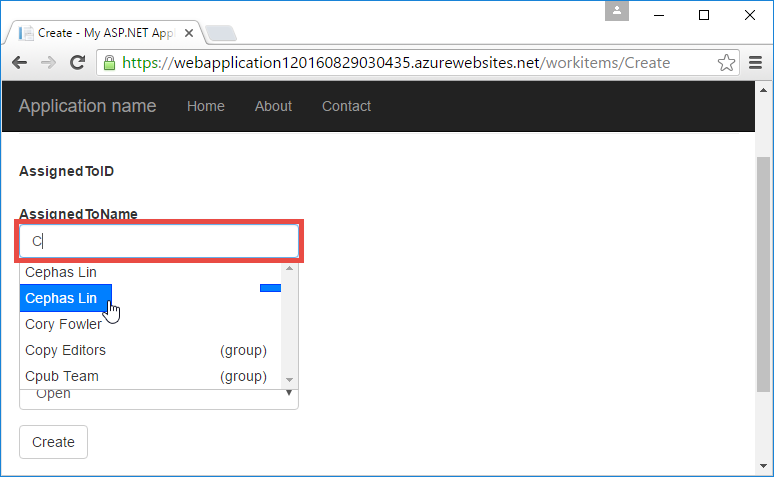

<properties
    pageTitle="使用 Azure Active Directory 身份验证创建业务线 Azure 应用 | Azure"
    description="了解如何在 Azure App Service 中创建使用 Azure Active Directory 进行身份验证的 ASP.NET MVC 业务线应用"
    services="app-service\web, active-directory"
    documentationcenter=".net"
    author="cephalin"
    manager="wpickett"
    editor="" />  

<tags
    ms.assetid="ad947bdb-4463-43ff-a5e3-91d9b2169b60"
    ms.service="app-service-web"
    ms.devlang="dotnet"
    ms.topic="article"
    ms.tgt_pltfrm="na"
    ms.workload="web"
    ms.date="09/01/2016"
    wacn.date="12/05/2016"
    ms.author="cephalin" />

# 使用 Azure Active Directory 身份验证创建业务线 Azure 应用
本文说明如何在 [Azure App Service Web Apps](/documentation/articles/app-service-changes-existing-services/) 中使用[身份验证/授权](/documentation/articles/app-service-authentication-overview/)功能创建 .NET 业务线应用。另外，还说明如何在应用程序中使用 [Azure Active Directory 图形 API](https://msdn.microsoft.com/Library/Azure/Ad/Graph/api/api-catalog) 查询目录数据。

使用的 Azure Active Directory 租户可以是仅限 Azure 的目录。或者，可以将它[与本地 Active Directory 同步](/documentation/articles/active-directory-aadconnect/)，为本地和远程工作者创建单一登录体验。本文使用 Azure 帐户的默认目录。

## 要构建的项目
将在 App Service Web Apps 中构建用于跟踪工作项并具有以下功能的简单的业务线创建-读取-更新-删除 (CRUD) 应用程序：

* 根据 Azure Active Directory 对用户进行身份验证
* 使用 [Azure Active Directory 图形 API](http://msdn.microsoft.com/zh-cn/library/azure/hh974476.aspx) 查询目录用户和组
* 使用 ASP.NET MVC 的*无身份验证*模板

如果 Azure 中的业务线应用需要基于角色的访问控制 (RBAC)，请参阅[后续步骤](#next)。

## 所需条件
[AZURE.INCLUDE [free-trial-note](../../includes/free-trial-note.md)]

若要完成本教程，你需要以下项目：

* 一个 Azure Active Directory 租户，其中的用户已分配到不同的组
* 在 Azure Active Directory 租户上创建应用程序的权限
* Visual Studio 2013 Update 4 或更高版本
* [Azure SDK 2.8.1 或更高版本](/downloads/)

## 创建 Web 应用并将其部署到 Azure
1. 在 Visual Studio 中，单击“文件”>“新建”>“项目”。
2. 选择“ASP.NET Web 应用程序”、为项目命名，然后单击“确定”。
3. 选择“MVC”模板，然后将身份验证更改为“无身份验证”。确保选中“在云中托管”，然后单击“确定”。
   
      

4. 在“创建应用服务”对话框中，单击“添加帐户”（然后在下拉列表中选择“添加帐户”）登录到 Azure 帐户。
5. 登录后，配置 Web 应用。单击“新建”按钮，创建相应的资源组和新的应用服务计划。单击“浏览其他 Azure 服务”继续操作。
   
      

6. 在“服务”选项卡上，单击“+”添加应用的 SQL 数据库。
   
      

7. 在“配置 SQL 数据库”中，单击“新建”创建 SQL Server 实例。
8. 在“配置 SQL Server”中，配置 SQL Server 实例。然后依次单击“确定”、“确定”、“创建”在 Azure 中创建应用。
9. 在“Azure 应用服务活动”中，可以查看应用何时创建完。单击“现在将 &lt;*appname*> 发布到此 Web 应用”，然后单击“发布”。
   
    Visual Studio 完成后，将在浏览器中打开发布应用。
   
    

## 配置身份验证和目录访问
1. 登录到 [Azure 门户预览](https://portal.azure.cn)。
2. 从左侧菜单中，单击“应用程序服务”> **&lt;*应用名称*>** >“身份验证/授权”。
   
    
3. 单击“打开”>“Azure Active Directory”>“Express”>“确定”打开 Azure Active Directory 身份验证。
   
    
4. 单击命令栏中的“保存”。
   
    
   
    成功保存身份验证设置后，尝试在浏览器中再次导航到应用。默认设置将对整个应用实施身份验证。如果尚未登录，将重定向到登录屏幕。登录后，可以看到应用已受 HTTPS 的保护。接下来，需要启用对目录数据的访问。
5. 导航到[经典管理门户](https://manage.windowsazure.cn)。
6. 从左侧菜单中，单击“Active Directory”>“默认目录”>“应用程序”> **&lt;*应用名称*>**。
   
    
   
    这是应用服务为了启用授权/身份验证功能而创建的 Azure Active Directory 应用程序。
7. 单击“用户”和“组”，确保目录中包含一些用户和组。如果不包含，请创建一些测试用户和组。
   
    
8. 单击“配置”以配置此应用程序。
9. 向下滚动到“密钥”部分，通过选择持续时间来添加密钥。然后单击“委托的权限”并选择“读取目录数据”。单击“保存”。
   
    
10. 保存设置后，重新滚动到“密钥”部分，然后单击“复制”按钮来复制客户端密钥。
    
     
    
    > [AZURE.IMPORTANT]
    > 如果现在离开此页，将无法再次访问此客户端密钥。
1. 使用 REST API 配置应用：从以下 URL 获取。

        https://management.chinacloudapi.cn/subscriptions/<Subscription id>/resourceGroups/<resource group>/providers/Microsoft.Web/sites/<you app>/config/authsettings/list?api-version=2015-08-01
2. 将出现类似于下面的内容：

        {
        "id": "/subscriptions/<Subscription id>/resourceGroups/<resource group>/providers/Microsoft.Web/sites/<you app>/config/authsettings",
        "name": "authsettings",
        "type": "Microsoft.Web/sites/config",
        "location": "East Asia",
        "tags": {
            "hidden-related:/subscriptions/<Subscription id>/resourcegroups/<resource group>/providers/Microsoft.Web/serverfarms/<app service plan>": "empty"
        },
        "properties": {
            "enabled": false,
            "httpApiPrefixPath": null,
            "unauthenticatedClientAction": null,
            "tokenStoreEnabled": null,
            "allowedExternalRedirectUrls": null,
            "defaultProvider": null,
            "clientId": null,
            "clientSecret": null,
            "issuer": null,
            "allowedAudiences": null,
            "additionalLoginParams": null,
            "isAadAutoProvisioned": false,
            "googleClientId": null,
            "googleClientSecret": null,
            "googleOAuthScopes": null,
            "facebookAppId": null,
            "facebookAppSecret": null,
            "facebookOAuthScopes": null,
            "twitterConsumerKey": null,
            "twitterConsumerSecret": null,
            "microsoftAccountClientId": null,
            "microsoftAccountClientSecret": null,
            "microsoftAccountOAuthScopes": null
        }
        }
13. 按如下所示更新 `clientSecret` 和 `additionalLoginParams` 属性。
    
        ...
        "clientSecret": "<client key from the Azure Active Directory application>",
        ...
        "additionalLoginParams": ["response_type=code id_token", "resource=https://graph.chinacloudapi.cn"],
        ...
8. 将 json 放置在 URL 的上面。
17. 现在，若要测试是否获得了用于访问 Azure Active Directory 图形 API 的授权令牌，请在浏览器中导航到 **https://&lt;*appname*>.chinacloudsites.cn/.auth/me**。如果一切都配置正确，应会在 JSON 响应中看到 `access_token` 属性。
    
    `~/.auth/me` URL 路径由应用服务身份验证/授权进行管理，提供与经过身份验证的会话相关的所有信息。有关详细信息，请参阅 [Authentication and authorization in Azure App Service（Azure 应用服务中的身份验证和授权）](/documentation/articles/app-service-authentication-overview/)。
    
    > [AZURE.NOTE]
    `access_token` 到时会过期。但是，应用服务身份验证/授权使用 `~/.auth/refresh` 提供令牌刷新功能。有关此功能的用法详细信息，请参阅 [App Service Token Store（应用服务令牌存储）](https://cgillum.tech/2016/03/07/app-service-token-store/)。
    > 
    > 

接下来，对目录数据执行一些有用的操作。

## 将业务线功能添加到应用
现在，可以创建一个简单的 CRUD 工作项跟踪器。

1. 在 ~\\Models 文件夹中，创建名为 WorkItem.cs 的类文件，将 `public class WorkItem {...}` 替换为以下代码：
   
     using System.ComponentModel.DataAnnotations;
   
     public class WorkItem
     {
   
         [Key]
         public int ItemID { get; set; }
         public string AssignedToID { get; set; }
         public string AssignedToName { get; set; }
         public string Description { get; set; }
         public WorkItemStatus Status { get; set; }
     }
   
     public enum WorkItemStatus
     {
   
         Open,
         Investigating,
         Resolved,
         Closed
     }
2. 生成项目，以便能够通过 Visual Studio 中的基架逻辑访问你的新模型。
3. 将新的基架项 `WorkItemsController` 添加到 ~\\Controllers 文件夹（右键单击“控制器”，指向“添加”，然后选择“新建基架项”）。
4. 选择“使用实体框架的包含视图的 MVC 5 控制器”并单击“添加”。
5. 选择创建的模型，依次单击“+”和“添加”来添加数据上下文，然后单击“添加”。
   
   
6. 在 ~\\Views\\WorkItems\\Create.cshtml（自动搭建基架的项）中查找 `Html.BeginForm` 帮助器方法，并根据以下突出显示的内容进行更改：
   
   <pre class="prettyprint">
      @model WebApplication1.Models.WorkItem
      
      @{
       ViewBag.Title = "Create";
      }
      
      &lt;h2>Create&lt;/h2>
      
      @using (Html.BeginForm(<mark>"Create", "WorkItems", FormMethod.Post, new { id = "main-form" }</mark>)) 
      {
       @Html.AntiForgeryToken()
      
       &lt;div class="form-horizontal">
           &lt;h4>WorkItem&lt;/h4>
           &lt;hr />
           @Html.ValidationSummary(true, "", new { @class = "text-danger" })
           &lt;div class="form-group">
               @Html.LabelFor(model => model.AssignedToID, htmlAttributes: new { @class = "control-label col-md-2" })
               &lt;div class="col-md-10">
                   @Html.EditorFor(model => model.AssignedToID, new { htmlAttributes = new { @class = "form-control"<mark>, @type = "hidden"</mark> } })
                   @Html.ValidationMessageFor(model => model.AssignedToID, "", new { @class = "text-danger" })
               &lt;/div>
           &lt;/div>
      
           &lt;div class="form-group">
               @Html.LabelFor(model => model.AssignedToName, htmlAttributes: new { @class = "control-label col-md-2" })
               &lt;div class="col-md-10">
                   @Html.EditorFor(model => model.AssignedToName, new { htmlAttributes = new { @class = "form-control" } })
                   @Html.ValidationMessageFor(model => model.AssignedToName, "", new { @class = "text-danger" })
               &lt;/div>
           &lt;/div>
      
           &lt;div class="form-group">
               @Html.LabelFor(model => model.Description, htmlAttributes: new { @class = "control-label col-md-2" })
               &lt;div class="col-md-10">
                   @Html.EditorFor(model => model.Description, new { htmlAttributes = new { @class = "form-control" } })
                   @Html.ValidationMessageFor(model => model.Description, "", new { @class = "text-danger" })
               &lt;/div>
           &lt;/div>
      
           &lt;div class="form-group">
               @Html.LabelFor(model => model.Status, htmlAttributes: new { @class = "control-label col-md-2" })
               &lt;div class="col-md-10">
                   @Html.EnumDropDownListFor(model => model.Status, htmlAttributes: new { @class = "form-control" })
                   @Html.ValidationMessageFor(model => model.Status, "", new { @class = "text-danger" })
               &lt;/div>
           &lt;/div>
      
           &lt;div class="form-group">
               &lt;div class="col-md-offset-2 col-md-10">
                   &lt;input type="submit" value="Create" class="btn btn-default"<mark> id="submit-button"</mark> />
               &lt;/div>
           &lt;/div>
       &lt;/div>
      }
      
      &lt;div>
       @Html.ActionLink("Back to List", "Index")
      &lt;/div>
      
      @section Scripts {
       @Scripts.Render("~/bundles/jqueryval")
       <mark>&lt;script>
           // People/Group Picker Code
           var maxResultsPerPage = 14;
           var input = document.getElementById("AssignedToName");
      
           // Access token from request header, and tenantID from claims identity
           var token = "@Request.Headers["X-MS-TOKEN-AAD-ACCESS-TOKEN"]";
           var tenant ="@(System.Security.Claims.ClaimsPrincipal.Current.Claims
                           .Where(c => c.Type == "http://schemas.microsoft.com/identity/claims/tenantid")
                           .Select(c => c.Value).SingleOrDefault())";
      
           var picker = new AadPicker(maxResultsPerPage, input, token, tenant);
      
           // Submit the selected user/group to be asssigned.
           $("#submit-button").click({ picker: picker }, function () {
               if (!picker.Selected())
                   return;
               $("#main-form").get()[0].elements["AssignedToID"].value = picker.Selected().objectId;
           });
       &lt;/script></mark>
      }
      </pre>
   
   请注意，`AadPicker` 对象使用 `token` 和 `tenant` 发出 Azure Active Directory 图形 API 调用。稍后将要添加 `AadPicker`。
   
   > [AZURE.NOTE]
   也可以使用 `~/.auth/me` 直接从客户端获取 `token` 和 `tenant`，但这是一个额外的服务器调用。例如：
   > 
   > $.ajax({
   > dataType: "json",
   > url: "/.auth/me",
   > success: function (data) {
   > var token = data[0].access_token;
   > var tenant = data[0].user_claims
   > .find(c => c.typ === 'http://schemas.microsoft.com/identity/claims/tenantid')
   > .val;
   > }
   > });
   > 
   > 
7. 对 ~\\Views\\WorkItems\\Edit.cshtml 进行相同的更改。
8. `AadPicker` 对象在需要添加到项目的脚本中定义。右键单击 ~\\Scripts 文件夹，指向“添加”，然后单击“JavaScript 文件”。键入 `AadPickerLibrary` 作为文件名，然后单击“确定”。
9. 将[此处](https://raw.githubusercontent.com/cephalin/active-directory-dotnet-webapp-roleclaims/master/WebApp-RoleClaims-DotNet/Scripts/AadPickerLibrary.js)的内容复制到 ~\\Scripts\\AadPickerLibrary.js。
   
   在脚本中，`AadPicker` 对象调用 [Azure Active Directory 图形 API](https://msdn.microsoft.com/Library/Azure/Ad/Graph/api/api-catalog) 来搜索与输入内容匹配的用户和组。
10. ~\\Scripts\\AadPickerLibrary.js 还使用 [jQuery UI 自动填充小组件](https://jqueryui.com/autocomplete/)。因此，需要将 jQuery UI 添加到项目。右键单击项目，然后单击“管理 NuGet 包”。
11. 在 NuGet 包管理器中单击“浏览”，在搜索栏中键入 **jquery-ui**，然后单击“jQuery.UI.Combined”。
    
    
12. 在右窗格中单击“安装”，然后单击“确定”继续。
13. 打开 ~\\App\_Start\\BundleConfig.cs，然后根据以下突出显示的内容进行更改：
    
    <pre class="prettyprint">
    public static void RegisterBundles(BundleCollection bundles)
    {
        bundles.Add(new ScriptBundle("~/bundles/jquery").Include(
                    "~/Scripts/jquery-{version}.js"<mark>,
                    "~/Scripts/jquery-ui-{version}.js",
                    "~/Scripts/AadPickerLibrary.js"</mark>));
    
        bundles.Add(new ScriptBundle("~/bundles/jqueryval").Include(
                    "~/Scripts/jquery.validate*"));
    
        // Use the development version of Modernizr to develop with and learn from.Then, when you're
        // ready for production, use the build tool at http://modernizr.com to pick only the tests you need.
        bundles.Add(new ScriptBundle("~/bundles/modernizr").Include(
                    "~/Scripts/modernizr-*"));
    
        bundles.Add(new ScriptBundle("~/bundles/bootstrap").Include(
                    "~/Scripts/bootstrap.js",
                    "~/Scripts/respond.js"));
    
        bundles.Add(new StyleBundle("~/Content/css").Include(
                    "~/Content/bootstrap.css",
                    "~/Content/site.css"<mark>,
                    "~/Content/themes/base/jquery-ui.css"</mark>));
    }
    </pre>
    
    还可以使用更高效的方式管理应用中的 JavaScript 和 CSS 文件。但是，为简单起见，下面只使用加载了每个视图的捆绑包。
14. 最后，在 ~\\Global.asax 中的 `Application_Start()` 方法内添加以下代码行。对每个命名解析错误单击 `Ctrl`+`.` 可进行修复。
    
        AntiForgeryConfig.UniqueClaimTypeIdentifier = ClaimTypes.NameIdentifier;
    
    > [AZURE.NOTE]
    之所以需要这一行代码，是因为默认的 MVC 模板对某些操作使用 <code>[ValidateAntiForgeryToken]</code> 装饰。由于 Brock Allen 在 [MVC 4, AntiForgeryToken and Claims（MVC 4、AntiForgeryToken 和声明）](http://brockallen.com/2012/07/08/mvc-4-antiforgerytoken-and-claims/)中所述的行为，HTTP POST 可能无法通过防伪令牌验证，因为：
    > 
    > * Azure Active Directory 不发送防伪令牌默认所需的 http://schemas.microsoft.com/accesscontrolservice/2010/07/claims/identityprovider。
    > * 如果 Azure Active Directory 目录与 AD FS 同步，AD FS 信任默认也不发送 http://schemas.microsoft.com/accesscontrolservice/2010/07/claims/identityprovider 声明，不过可以手动将 AD FS 配置为发送此声明。
    > 
    > `ClaimTypes.NameIdentifies` 指定 Azure Active Directory 提供的声明 `http://schemas.xmlsoap.org/ws/2005/05/identity/claims/nameidentifier`。
    > 
    > 
15. 现在，请发布更改。右键单击项目，然后单击“发布”。
16. 单击“设置”，确保提供 SQL 数据库的连接字符串，选择“更新数据库”更改模型的架构，然后单击“发布”。
    
    
17. 在浏览器中，导航到 https://&lt;*appname*>.chinacloudsites.cn/workitems，然后单击“新建”。
18. 单击“AssignedToName”框。现在应该可以在下拉列表中看到 Azure Active Directory 租户中的用户和组。可以键入内容进行筛选、使用 `Up` 或 `Down` 键，或者单击选择用户或组。
    
    
19. 单击“创建”保存更改。然后，在创建的工作项上单击“编辑”可观察到相同的行为。

恭喜，现已使用目录访问在 Azure 中运行业务线应用！ 图形 API 还有其他一些用途。请参阅 [Azure AD Graph API reference（Azure AD 图形 API 参考）](https://msdn.microsoft.com/zh-cn/library/azure/ad/graph/api/api-catalog)。

## 后续步骤
如果 Azure 中的业务线应用需要基于角色的访问控制 (RBAC)，请参阅 [WebApp-RoleClaims-DotNet](https://github.com/Azure-Samples/active-directory-dotnet-webapp-roleclaims) 获取 Azure Active Directory 团队提供的示例。该示例演示了如何为 Azure Active Directory 应用程序启用角色，然后使用 `[Authorize]` 装饰为用户授权。

## 其他资源
* [Azure 应用服务中的身份验证和授权](/documentation/articles/app-service-authentication-overview/)
* [Authenticate with on-premises Active Directory in your Azure app（在 Azure 应用中使用本地 Active Directory 进行身份验证）](/documentation/articles/web-sites-authentication-authorization/)
* [Create a line-of-business app in Azure with AD FS authentication（在 Azure 中使用 AD FS 身份验证创建业务线应用）](/documentation/articles/web-sites-dotnet-lob-application-adfs/)
* [App Service Auth and the Azure AD Graph API（应用服务身份验证和 Azure AD 图形 API）](https://cgillum.tech/2016/03/25/app-service-auth-aad-graph-api/)
* [Azure Active Directory Samples and Documentation（Azure Active Directory 示例和文档）](https://github.com/AzureADSamples)
* [Azure Active Directory 支持的令牌和声明类型](/documentation/articles/active-directory-token-and-claims/)

[Protect the Application with SSL and the Authorize Attribute]: /documentation/articles/web-sites-dotnet-deploy-aspnet-mvc-app-membership-oauth-sql-database/#protect-the-application-with-ssl-and-the-authorize-attribute

<!---HONumber=Mooncake_1128_2016-->