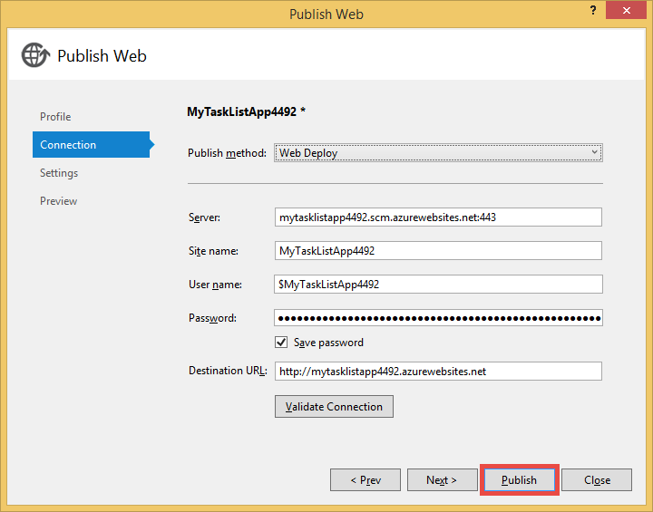

<properties 
	pageTitle="在 Azure 中创建连接到虚拟机上运行的 MongoDB 的 Web 应用" 
	description="本教程介绍如何使用 Git 将 ASP.NET 应用部署到连接至 Azure 虚拟机上 MongoDB 的 Azure Web 应用。"
	tags="azure-portal" 
	services="app-service\web, virtual-machines" 
	documentationCenter=".net" 
	authors="cephalin" 
	manager="wpickett" 
	editor=""/>

<tags
	ms.service="app-service-web"
	ms.date="02/29/2016"
	wacn.date="04/18/2016"/>

# 在 Azure 中创建连接到虚拟机上运行的 MongoDB 的 Web 应用

使用 Git，你可以将 ASP.NET 应用程序部署到 Azure Web Apps。在本教程中，你将构建一个简单的前端 ASP.NET MVC 任务列表应用程序，该程序将连接至在 Azure 内的虚拟机中运行的 MongoDB 数据库。[MongoDB][MongoDB] 是一个受欢迎的开源、高性能 NoSQL 数据库。在开发计算机上运行并测试了该 ASP.NET 应用程序后，可使用 Git 将其上载至 Azure Web Apps。

## 背景知识 ##

以下知识对于学习本教程有用但非必需：

* MongoDB 的 C# 驱动程序。有关针对 MongoDB 开发 C# 应用程序的更多信息，请参阅 [MongoDB CSharp 语言中心][MongoC#LangCenter]。 
* ASP .NET Web 应用程序框架。可通过 [ASP.net 网站][ASP.NET]进行全面了解。
* ASP .NET MVC Web 应用程序框架。可通过 [ASP.NET MVC 网站][MVCWebSite]进行全面了解。
* Azure。你可以先阅读 [Azure][WindowsAzure] 上的文章。

## 先决条件 ##

- [Visual Studio Express 2013 for Web][VSEWeb] 或 [Visual Studio 2013][VSUlt]
- [Azure SDK for .NET](https://www.microsoft.com/web/handlers/webpi.ashx/getinstaller/VWDOrVs2013AzurePack.appids)
- 一个有效的 Azure 订阅

[AZURE.INCLUDE [create-account-and-websites-note](../includes/create-account-and-websites-note.md)]

## 创建虚拟机和安装 MongoDB ##

本教程假定你已在 Azure 中创建了一个虚拟机。创建虚拟机后，你需要在该虚拟机上安装 MongoDB：

* 若要创建 Windows 虚拟机并安装 MongoDB，请参阅[在 Azure 中运行 Windows Server 的虚拟机上安装 MongoDB][InstallMongoOnWindowsVM]。

在 Azure 中创建虚拟机并安装 MongoDB 后，请务必记住该虚拟机的 DNS 名称（例如“testlinuxvm.chinacloudapp.cn”）以及你在终结点中指定的 MongoDB 的外部端口。本教程后面的步骤中将会用到此信息。

## 创建应用程序 ##

在本部分中，你将使用 Visual Studio 创建一个名为“My Task List”的 ASP.NET 应用程序，并执行到 Azure Web Apps 的初始部署。你将在本地运行该应用程序，但其将连接到你在 Azure 上的虚拟机并使用你在此处创建的 MongoDB 实例。

1. 在 Visual Studio 中，单击“新建项目”。

	![新项目开始页面][StartPageNewProject]

1. 在“新建项目”窗口中的左侧窗格中，选择“Visual C#”，然后选择“Web”。在中间窗格中，选择“ASP.NET Web 应用程序”。在底部，将项目命名为“MyTaskListApp”，然后单击“确定”。

	![新建项目对话框][NewProjectMyTaskListApp]

1. 在“新建 ASP.NET 项目”对话框中，选择“MVC”，然后单击“确定”。确保取消选中“在云中托管”，然后单击“确定”。

	如果尚未创建 Web 应用，请转到 [Azure 经典管理门户](https://manage.windowsazure.cn)创建一个。然后，在 Web 应用“仪表板”中的“速览”下，单击“发布配置文件”。

2. 右键单击你的解决方案，然后单击“发布…”

1. 单击“导入”，选择之前下载的“发布配置文件”，然后单击“确定”。

1. 单击“发布”。

	

	将默认的 ASP.NET 应用程序发布到 Azure Web Apps 后，将在浏览器中启动该应用程序。

## 安装 MongoDB C# 驱动程序

MongoDB 通过驱动程序为 C# 应用程序提供客户端支持，你需要在本地开发计算机上安装此驱动程序。C# 驱动程序通过 NuGet 提供。

安装 MongoDB C# 驱动程序的步骤：

1. 在“解决方案资源管理器”中右键单击“MyTaskListApp”项目，然后选择“管理 NuGet 包”。

	![管理 NuGet 包][VS2013ManageNuGetPackages]

2. 在“管理 NuGet 包”窗口的左侧窗格中，单击“联机”。在右侧的“联机搜索”框中，键入“mongodb.driver”。单击“安装”安装此驱动程序。

	![搜索 MongoDB C# 驱动程序][SearchforMongoDBCSharpDriver]

3. 单击“我接受”接受 10gen, Inc. 的许可条款。

4. 安装驱动程序后，单击“关闭”。
	![已安装 MongoDB C# 驱动程序][MongoDBCsharpDriverInstalled]

MongoDB C# 驱动程序现已安装。对 **MongoDB.Bson**、**MongoDB.Driver** 和 **MongoDB.Driver.Core** 库的引用已添加到项目。

![MongoDB C# 驱动程序引用][MongoDBCSharpDriverReferences]

## 添加模型 ##
在“解决方案资源管理器”中，右键单击“Models”文件夹，选择**添加**一个新**类**，并将其命名为 *TaskModel.cs*。在 *TaskModel.cs* 中，将现有代码替换为以下代码：

	using System;
	using System.Collections.Generic;
	using System.Linq;
	using System.Web;
	using MongoDB.Bson.Serialization.Attributes;
	using MongoDB.Bson.Serialization.IdGenerators;
	using MongoDB.Bson;
	
	namespace MyTaskListApp.Models
	{
	    public class MyTask
	    {
	        [BsonId(IdGenerator = typeof(CombGuidGenerator))]
	        public Guid Id { get; set; }
	
	        [BsonElement("Name")]
	        public string Name { get; set; }
	
	        [BsonElement("Category")]
	        public string Category { get; set; }
	
	        [BsonElement("Date")]
	        public DateTime Date { get; set; }
	
	        [BsonElement("CreatedDate")]
	        public DateTime CreatedDate { get; set; }
	
	    }
	}

## 添加数据访问层 ##
在“解决方案资源管理器”中，右键单击“MyTaskListApp”项目并选择**添加**一个名为 “DAL” 的**新文件夹**。右键单击 *DAL* 文件夹并选择**添加**一个新**类**。将该类文件命名为 *Dal.cs*。在 *Dal.cs* 中，将现有代码替换为以下代码：

	using System;
	using System.Collections.Generic;
	using System.Linq;
	using System.Web;
	using MyTaskListApp.Models;
	using MongoDB.Driver;
	using MongoDB.Bson;
	using System.Configuration;
	
	
	namespace MyTaskListApp
	{
	    public class Dal : IDisposable
	    {
	        private MongoServer mongoServer = null;
	        private bool disposed = false;
	
	        // To do: update the connection string with the DNS name
	        // or IP address of your server. 
	        //For example, "mongodb://testlinux.chinacloudapp.cn"
	        private string connectionString = "mongodb://mongodbsrv20151211.chinacloudapp.cn";
	
	        // This sample uses a database named "Tasks" and a 
	        //collection named "TasksList".  The database and collection 
	        //will be automatically created if they don't already exist.
	        private string dbName = "Tasks";
	        private string collectionName = "TasksList";
	
	        // Default constructor.        
	        public Dal()
	        {
	        }
	
	        // Gets all Task items from the MongoDB server.        
	        public List<MyTask> GetAllTasks()
	        {
	            try
	            {
	                var collection = GetTasksCollection();
	                return collection.Find(new BsonDocument()).ToList();
	            }
	            catch (MongoConnectionException)
	            {
	                return new List<MyTask>();
	            }
	        }
	
	        // Creates a Task and inserts it into the collection in MongoDB.
	        public void CreateTask(MyTask task)
	        {
	            var collection = GetTasksCollectionForEdit();
	            try
	            {
	                collection.InsertOne(task);
	            }
	            catch (MongoCommandException ex)
	            {
	                string msg = ex.Message;
	            }
	        }
	
	        private IMongoCollection<MyTask> GetTasksCollection()
	        {
	            MongoClient client = new MongoClient(connectionString);
	            var database = client.GetDatabase(dbName);
	            var todoTaskCollection = database.GetCollection<MyTask>(collectionName);
	            return todoTaskCollection;
	        }
	
	        private IMongoCollection<MyTask> GetTasksCollectionForEdit()
	        {
	            MongoClient client = new MongoClient(connectionString);
	            var database = client.GetDatabase(dbName);
	            var todoTaskCollection = database.GetCollection<MyTask>(collectionName);
	            return todoTaskCollection;
	        }
	
	        # region IDisposable
	
	        public void Dispose()
	        {
	            this.Dispose(true);
	            GC.SuppressFinalize(this);
	        }
	
	        protected virtual void Dispose(bool disposing)
	        {
	            if (!this.disposed)
	            {
	                if (disposing)
	                {
	                    if (mongoServer != null)
	                    {
	                        this.mongoServer.Disconnect();
	                    }
	                }
	            }
	
	            this.disposed = true;
	        }
	
	        # endregion
	    }
	}

## 添加控制器 ##
在“解决方案资源管理器”中打开 *Controllers\\HomeController.cs* 文件，将现有代码替换为以下代码：

	using System;
	using System.Collections.Generic;
	using System.Linq;
	using System.Web;
	using System.Web.Mvc;
	using MyTaskListApp.Models;
	using System.Configuration;
	
	namespace MyTaskListApp.Controllers
	{
	    public class HomeController : Controller, IDisposable
	    {
	        private Dal dal = new Dal();
	        private bool disposed = false;
	        //
	        // GET: /MyTask/
	
	        public ActionResult Index()
	        {
	            return View(dal.GetAllTasks());
	        }
	
	        //
	        // GET: /MyTask/Create
	
	        public ActionResult Create()
	        {
	            return View();
	        }
	
	        //
	        // POST: /MyTask/Create
	
	        [HttpPost]
	        public ActionResult Create(MyTask task)
	        {
	            try
	            {
	                dal.CreateTask(task);
	                return RedirectToAction("Index");
	            }
	            catch
	            {
	                return View();
	            }
	        }
	
	        public ActionResult About()
	        {
	            return View();
	        }
	
	        # region IDisposable
	
	        new protected void Dispose()
	        {
	            this.Dispose(true);
	            GC.SuppressFinalize(this);
	        }
	
	        new protected virtual void Dispose(bool disposing)
	        {
	            if (!this.disposed)
	            {
	                if (disposing)
	                {
	                    this.dal.Dispose();
	                }
	            }
	
	            this.disposed = true;
	        }
	
	        # endregion
	
	    }
	}

## 设置样式 ##
若要更改页面顶部的标题，请在“解决方案资源管理器”中打开 *Views\\Shared\\_Layout.cshtml* 文件，将导航条标头中的“Application name”替换为“My Task List Application”以便其类似如下所示：

 	@Html.ActionLink("My Task List Application", "Index", "Home", null, new { @class = "navbar-brand" })

为了设置 Task List 菜单，请打开 *\\Views\\Home\\Index.cshtml* 文件并将现有代码替换为以下代码：
	
	@model IEnumerable<MyTaskListApp.Models.MyTask>
	
	@{
	    ViewBag.Title = "My Task List";
	}
	
	<h2>My Task List</h2>
	
	<table border="1">
	    <tr>
	        <th>Task</th>
	        <th>Category</th>
	        <th>Date</th>
	        
	    </tr>
	
	@foreach (var item in Model) {
	    <tr>
	        <td>
	            @Html.DisplayFor(modelItem => item.Name)
	        </td>
	        <td>
	            @Html.DisplayFor(modelItem => item.Category)
	        </td>
	        <td>
	            @Html.DisplayFor(modelItem => item.Date)
	        </td>
	        
	    </tr>
	}
	
	</table>
	
  @Html.Partial("Create", new MyTaskListApp.Models.MyTask())

若要增加创建新任务的功能，右键单击“Views\\Home\\”文件夹并选择 **添加** 一个 **视图** 。将该视图命名为 *Create*。将此代码替换为以下代码：

	@model MyTaskListApp.Models.MyTask
	
	
	
	
	
	@using (Html.BeginForm("Create", "Home")) {
	    @Html.ValidationSummary(true)
	    <fieldset>
	        <legend>New Task</legend>
	
	        

	            @Html.LabelFor(model => model.Name)
	        

	        

	            @Html.EditorFor(model => model.Name)
	            @Html.ValidationMessageFor(model => model.Name)
	        

	
	        

	            @Html.LabelFor(model => model.Category)
	        

	        

	            @Html.EditorFor(model => model.Category)
	            @Html.ValidationMessageFor(model => model.Category)
	        

	
	        

	            @Html.LabelFor(model => model.Date)
	        

	        

	            @Html.EditorFor(model => model.Date)
	            @Html.ValidationMessageFor(model => model.Date)
	        

	
	        

	            <input type="submit" value="Create" />
	        

	    </fieldset>
	}

“解决方案资源管理器”应类似如下所示：

![解决方案资源管理器][SolutionExplorerMyTaskListApp]

## 设置 MongoDB 连接字符串 ##
在“解决方案资源管理器”中，打开 *DAL/Dal.cs* 文件。找到以下代码行：

	private string connectionString = "mongodb://<vm-dns-name>";

将 `<vm-dns-name>` 替换为运行 MongoDB 的虚拟机（在本教程的[创建虚拟机并安装 MongoDB][] 步骤中创建）的 DNS 名。若要查找虚拟机的 DNS 名，请转到 Azure 经典管理门户，选择“虚拟机”并找到“DNS 名”。

如果虚拟机的 DNS 名是“testlinuxvm.chinacloudapp.cn”而 MongoDB 在默认端口 27017 进行侦听，连接字符串代码行将如下所示：

	private string connectionString = "mongodb://testlinuxvm.chinacloudapp.cn";

如果虚拟机终结点为 MongoDB 指定了不同的外部端口，你可在连接字符串中指定端口：

 	private string connectionString = "mongodb://testlinuxvm.chinacloudapp.cn:12345";

有关 MongoDB 连接字符串的详细信息，请参阅[连接][MongoConnectionStrings]。

## 测试本地部署 ##

若要在开发计算机上运行应用程序，请从“调试”菜单选择“启动调试”或按 **F5**。IIS Express 启动，浏览器打开并显示该引用程序的主页。你可以添加一个新任务，而后将其添加到在 Azure 中的虚拟机上运行的 MongoDB 数据库。

![My Task List 应用程序][TaskListAppBlank]

## 发布到 Azure Web Apps

在本部分中，你将创建一个网站并使用 Git 部署 My Task List ASP.NET 应用程序。

###创建 Azure 网站###
本部分中，你将创建一个 Azure 网站。

1. 打开 Web 浏览器并浏览至 [Azure 经典管理门户][AzurePortal]。使用您的 Azure 帐户进行登录。 
2. 在页面底部，依次单击“+新建”、“网站”和“速览”。
3. 为应用程序的 URL 输入唯一的前缀。
4. 选择区域。
5. 单击“创建网站”。

![创建新网站][WAWSCreateWebSite]

6. 你的网站将快速创建，并显示在“网站”列表中。

![WAWSDashboardMyTaskListApp][WAWSDashboardMyTaskListApp]

###使用 Git 将 ASP.NET 应用程序部署到网站
在本部分中，你将使用 Git 部署 My Task List 应用程序。

1. 在“网站”中单击你的网站名称，然后单击“仪表板”。在右侧的“速览”下，单击“从源代码管理设置部署”。
2. 在“你的源代码位置”页面，选择“本地 Git 存储库”并单击“下一步”箭头。 
3. Git 存储库将快速创建。请注意生成页面上的说明，这些内容将在后面的部分用到。

	![Git 存储库准备就绪][Image9]

4. 在“将我的本地文件推送至 Azure”下提供了将代码推送至 Azure 的说明。说明内容类似如下所示：

	![将本地文件推送到 Azure][Image10]
	
5. 如果没有安装 Git，可使用步骤 1 中的“从此处获取”链接进行安装。
6. 按照步骤 2 中的说明提交你的本地文件。  
7. 按照步骤 3 中的说明添加远程 Azure 存储库并将你的文件推送至 Azure 网站。
8. 部署完成后，你将看到以下确认信息：

	![部署完成][Image11]

9. 你的 Azure 网站现已可用。查看你的站点的“仪表板”页面，找到“站点 URL”字段以确定站点的 URL。按照本教程的步骤执行，你的站点的 URL 应该是：http://mytasklistapp.chinacloudsites.cn。
## 摘要 ##

现在，你已将 ASP.NET 应用程序成功部署到 Azure Web Apps。查看 Web 应用：

1. 登录到 Azure 经典管理门户。
2. 单击“Web Apps”。 
3. 在“Web Apps”列表中选择你的 Web 应用。

有关针对 MongoDB 开发 C# 应用程序的详细信息，请参阅 [CSharp 语言中心][MongoC#LangCenter]。
 

<!-- HYPERLINKS -->

[AzurePortal]: http://manage.windowsazure.cn
[WindowsAzure]: http://www.windowsazure.cn
[MongoC#LangCenter]: http://docs.mongodb.org/ecosystem/drivers/csharp/
[MVCWebSite]: http://www.asp.net/mvc
[ASP.NET]: http://www.asp.net/
[MongoConnectionStrings]: http://www.mongodb.org/display/DOCS/Connections
[MongoDB]: http://www.mongodb.org
[InstallMongoOnWindowsVM]: /documentation/articles/virtual-machines-windows-classic-install-mongodb/
[VSEWeb]: http://www.visualstudio.com/zh-cn/downloads/download-visual-studio-vs#d-2013-express
[VSUlt]: http://www.visualstudio.com/zh-cn/downloads/download-visual-studio-vs

<!-- IMAGES -->

[StartPageNewProject]: ./media/web-sites-dotnet-store-data-mongodb-vm/NewProject.png
[NewProjectMyTaskListApp]: ./media/web-sites-dotnet-store-data-mongodb-vm/NewProjectMyTaskListApp.png
[VS2013SelectMVCTemplate]: ./media/web-sites-dotnet-store-data-mongodb-vm/VS2013SelectMVCTemplate.png
[VS2013DefaultMVCApplication]: ./media/web-sites-dotnet-store-data-mongodb-vm/VS2013DefaultMVCApplication.png
[VS2013ManageNuGetPackages]: ./media/web-sites-dotnet-store-data-mongodb-vm/VS2013ManageNuGetPackages.png
[SearchforMongoDBCSharpDriver]: ./media/web-sites-dotnet-store-data-mongodb-vm/SearchforMongoDBCSharpDriver.png
[MongoDBCsharpDriverInstalled]: ./media/web-sites-dotnet-store-data-mongodb-vm/MongoDBCsharpDriverInstalled.png
[MongoDBCSharpDriverReferences]: ./media/web-sites-dotnet-store-data-mongodb-vm/MongoDBCSharpDriverReferences.png
[SolutionExplorerMyTaskListApp]: ./media/web-sites-dotnet-store-data-mongodb-vm/SolutionExplorerMyTaskListApp.png
[TaskListAppBlank]: ./media/web-sites-dotnet-store-data-mongodb-vm/TaskListAppBlank.png
[WAWSCreateWebSite]: ./media/web-sites-dotnet-store-data-mongodb-vm/WAWSCreateWebSite.png
[WAWSDashboardMyTaskListApp]: ./media/web-sites-dotnet-store-data-mongodb-vm/WAWSDashboardMyTaskListApp.png
[Image9]: ./media/web-sites-dotnet-store-data-mongodb-vm/RepoReady.png
[Image10]: ./media/web-sites-dotnet-store-data-mongodb-vm/GitInstructions.png
[Image11]: ./media/web-sites-dotnet-store-data-mongodb-vm/GitDeploymentComplete.png

<!-- TOC BOOKMARKS -->
[创建虚拟机并安装 MongoDB]: #virtualmachine
[Create and run the My Task List ASP.NET application on your development computer]: #createapp
[Create an Azure web site]: #createwebsite
[Deploy the ASP.NET application to the web site using Git]: #deployapp

<!---HONumber=Mooncake_0411_2016-->