<!-- need to be verified -->

<properties 
	pageTitle="使用 Visual Studio 对 Azure 应用服务中的 Web 应用进行故障排除" 
	description="了解如何通过内置于 Visual Studio 2013 的远程调试、 跟踪和日志记录工具排除 Azure Web 应用的故障。" 
	services="app-service" 
	documentationCenter=".net" 
	authors="tdykstra" 
	manager="wpickett" 
	editor=""/>

<tags 
	ms.service="app-service" 
	ms.workload="na" 
	ms.tgt_pltfrm="na" 
	ms.devlang="dotnet" 
	ms.topic="article" 
	ms.date="08/29/2016" 
	wacn.date="02/21/2017" 
	ms.author="rachelap"/>  

# 使用 Visual Studio 对 Azure 应用服务中的 Web 应用进行故障排除

## 概述

[AZURE.INCLUDE [azure-sdk-developer-differences](../../includes/azure-sdk-developer-differences.md)]

本教程介绍如何使用 Visual Studio 工具，通过远程运行调试模式或查看应用程序日志和 Web 服务器日志帮助调试 [Azure 应用服务](/documentation/articles/app-service-changes-existing-services/)中的 Web 应用。

[AZURE.INCLUDE [azure-sdk-developer-differences](../../includes/azure-visual-studio-login-guide.md)]

[AZURE.INCLUDE [app-service-web-to-api-and-mobile](../../includes/app-service-web-to-api-and-mobile.md)]

学习内容：

* Visual Studio 中提供的 Azure Web 应用管理功能。
* 如何使用 Visual Studio 远程视图在远程 Web 应用中进行快速更改。
* 项目在 Azure 中运行时，如何对 Web 应用和 Web 作业远程运行调试模式。
* 如何创建应用程序跟踪日志并在该应用程序创建日志时对其进行查看。
* 如何查看 Web 服务器日志，包括详细的错误消息和失败请求跟踪。
* 如何将诊断日志发送至 Azure 存储帐户并在其中进行查看。

如果有 Visual Studio Ultimate，还可以使用 [IntelliTrace](http://msdn.microsoft.com/zh-cn/library/vstudio/dd264915.aspx) 进行调试。本教程未介绍 IntelliTrace。

## 先决条件

本教程适用于 [Azure 和 ASP.NET 入门][GetStarted]中设置的开发环境、Web 项目和 Azure Web 应用。对于 Web 作业部分，需要用到 [Azure WebJobs SDK 入门][GetStartedWJ]中创建的应用程序。

在本教程中所示的代码示例适用于 C# MVC Web 应用程序，但对于 Visual Basic 和 Web 窗体应用程序，故障排除过程是一样的。

本教程假设使用 Visual Studio 2015 或 2013。如果使用 Visual Studio 2013，Web 作业功能需要 [Update 4](http://go.microsoft.com/fwlink/?LinkID=510314) 或更高版本。

流式日志功能仅适用于面向 .NET Framework 4 或更高版本的应用程序。

## Web 应用配置和管理

通过 Visual Studio，用户可以访问 [Azure 门户预览](/documentation/articles/app-service-web-app-azure-portal/)中提供的 Web 应用管理功能和配置设置的子集。本节介绍使用**服务器资源管理器**可以实现的功能。若要了解最新的 Azure 集成功能，请同时试用**云资源管理器**。可以从“视图”菜单打开这两个窗口。

1. 如果还未在 Visual Studio 中登录到 Azure，请单击“服务器资源管理器”中的“连接至 Azure”按钮。

	另一种方法是安装可以访问你的帐户的管理证书。如果选择安装证书，请右键单击“服务器资源管理器”中的“Azure”，然后单击上下文菜单中的“管理和筛选订阅”。在“管理 Azure 订阅”对话框中，单击“证书”选项卡，然后单击“导入”。按照说明为 Azure 帐户下载并导入一个订阅文件（也称为 *.publishsettings* 文件）。

	> [AZURE.NOTE]
	将此订阅文件下载并保存到源代码目录之外的文件夹中（例如，在 Downloads 文件夹中），然后在导入完成后将其删除。获得此订阅文件访问权的恶意用户可以编辑、创建和删除 Azure 服务。

2. 在“服务资源管理器”中，展开“Azure”，然后展开“应用服务”。

3. 展开包含在 [Azure 和 ASP.NET 入门][GetStarted]中创建的 Web 应用的资源组，右键单击该 Web 应用，然后单击“查看设置”。

	

	此时将显示“应用服务”选项卡，可在此处查看 Visual Studio 中提供的 Web 应用管理和配置任务。

	  

	本教程将介绍如何使用日志记录和跟踪下拉列表。其中，还将用到远程调试，但会通过不同方式启用该调试。
   
	有关该窗口中“应用程序设置”和“连接字符串”框的信息，请参阅 [Azure Web 应用：应用程序字符串和连接字符串的工作原理](http://blogs.msdn.com/b/windowsazure/archive/2013/07/17/windows-azure-web-sites-how-application-strings-and-connection-strings-work.aspx)。

	如果要执行的 Web 应用管理任务无法在此窗口进行，请单击“在管理门户中打开”，以便在浏览器窗口中打开 Azure 门户预览。

## 在服务器资源管理器中访问 Web 应用文件

部署 Web 项目时，Web.config 文件中的 `customErrors` 标志通常设置为 `On` 或 `RemoteOnly`，这意味着如果出现问题你不会获得任何有帮助的错误消息。无论发生何种错误，你获得的都是类似如下所示的页面。

**'/' 应用程序中出现服务器错误：**

  

**发生错误：**

  

**网站无法显示页面**

  

找出错误原因的最简捷方法通常是启用详细错误消息，之前保留的屏幕快照中的第一个快照会告诉你如何做。而实现此目的需要在部署的 Web.config 文件中进行更改。可以编辑项目中的 *Web.config* 文件，然后重新部署该项目，或创建 [Web.config 转换](http://www.asp.net/mvc/tutorials/deployment/visual-studio-web-deployment/web-config-transformations)并部署调试版本，但还有一个更快捷的方式：在“解决方案资源管理器”中，可以通过使用*远程视图*功能直接查看并编辑远程 Web 应用上的文件。

1. 在“服务器资源管理器”中，依次展开“Azure”、“应用服务”、Web 应用所在的资源组以及 Web 应用的节点。

	你将看到允许访问 Web 应用的内容文件和日志文件的节点。

2. 展开“文件”节点，然后双击 *Web.config* 文件。

	

	Visual Studio 将从远程 Web 应用打开 Web.config 文件，并在标题栏中的文件名旁显示 [远程]。

3. 将以下行添加到 `system.web` 元素：

	`<customErrors mode="off"></customErrors>`  

	

4. 刷新显示无用错误消息的浏览器，现在将获得详细的错误消息，如下所示：

	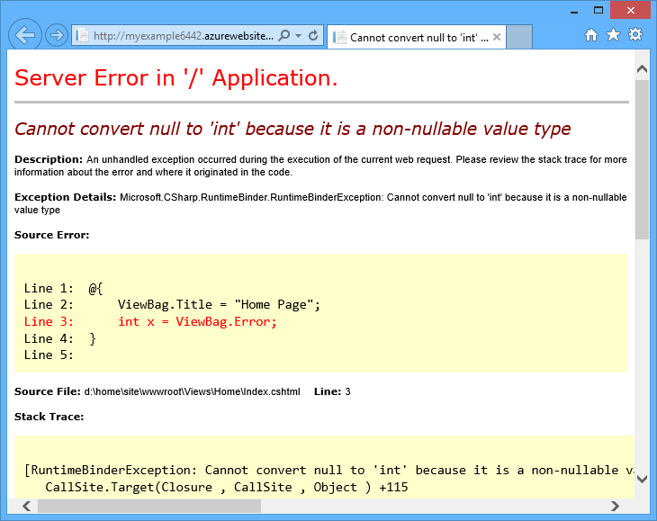

	（通过将以红色显示的行添加到 *Views\Home\Index.cshtml* 创建显示的错误。）

编辑 Web.config 文件示例演示了能够读取并编辑 Azure Web 应用上的文件使得故障排除变得更加简单，而这仅仅只是其中之一。

## 远程调试 Web 应用

如果详细的错误消息提供的信息量不够，且无法本地重新创建该错误，则可以采用远程运行调试模式进行故障排除.可以设置断点、直接操作内存、逐行执行代码，甚至更改代码路径。

远程调试不适用于 Visual Studio Express 版。

本部分介绍如何使用 [Azure 和 ASP.NET 入门][GetStarted]中创建的项目进行远程调试。

1. 打开在 [Azure 和 ASP.NET 入门][GetStarted]中创建的 Web 项目。

1. 打开 *Controllers\HomeController.cs*。

2. 删除 `About()` 方法并在其位置插入以下代码。

        public ActionResult About()
        {
            string currentTime = DateTime.Now.ToLongTimeString();
            ViewBag.Message = "The current time is " + currentTime;
            return View();
        }

2. 在 `ViewBag.Message` 行上[设置一个断点](http://www.visualstudio.com/get-started/debug-your-app-vs.aspx)。

1. 在“解决方案资源管理器”中，右键单击该项目并单击“发布”。

2. 在“配置文件”下拉列表中，选择与 [Azure 和 ASP.NET 入门][GetStarted]中所用相同的配置文件。

3. 单击“设置”选项卡，将“配置”更改为“调试”，然后单击“发布”。

	  

4. 部署结束后，浏览器将打开 Web 应用的 Azure URL，关闭浏览器。

5. 在“服务器资源管理器”中右键单击该 Web 应用，然后单击“附加调试器”。

	  

	浏览器将自动打开运行在 Azure 中的主页。可能需要等待大约 20 秒，以便 Azure 针对调试设置服务器。此延迟只在首次于 Web 应用上运行调试模式时出现。接下来的 48 小时内，再次启动调试将不会出现延迟。

	**注意：**如果启动调试器时出现问题，请尝试使用“云资源管理器”而不是“服务器资源管理器”执行此操作。

6. 单击菜单中的“关于”。

	Visual Studio 将在断点处停止，代码在 Azure 中运行，而不是在本地计算机上。

7. 将鼠标悬停在 `currentTime` 变量上查看时间值。

	  

	看到的时间是 Azure 服务器时间，可能与本地计算机所处时区不同。

8. 为 `currentTime` 变量输入一个新值，如“Now running in Azure”。

5. 按 F5 继续运行。

	运行于 Azure 中的“关于”页面将显示在 currentTime 变量中输入的新值。

	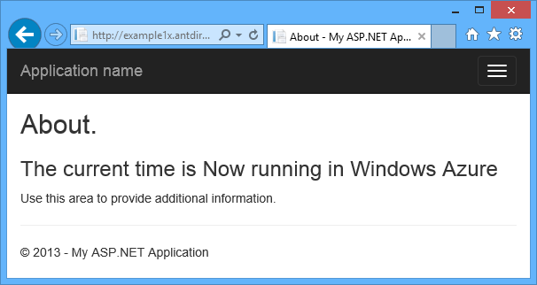  

##  远程调试 Web 作业

本部分说明如何使用在 [Azure WebJobs SDK 入门](/documentation/articles/websites-dotnet-webjobs-sdk/)中创建的项目和 Web 应用进行远程调试。

本部分所示的功能只能在 Visual Studio 2013 Update 4 或更高版本中使用。

远程调试仅适用于连续 Web 作业。计划的和按需 Web 作业不支持调试。

1. 打开在 [Azure WebJobs SDK 入门][GetStartedWJ]中创建的 Web 项目。

1. 在 ContosoAdsWebJob 项目中，打开 *Functions.cs*。

2. 在 `GnerateThumbnail` 方法的第一个语句中[设置一个断点](http://www.visualstudio.com/get-started/debug-your-app-vs.aspx)。

	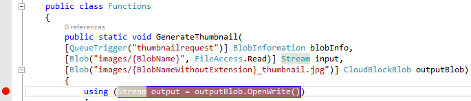  

1. 在“解决方案资源管理器”中，右键单击该 Web 项目（而非 Web 作业项目），然后单击“发布”。

2. 在“配置文件”下拉列表中，选择与 [Azure WebJobs SDK 入门](/documentation/articles/websites-dotnet-webjobs-sdk/)中所用相同的配置文件。

3. 单击“设置”选项卡，将“配置”更改为“调试”，然后单击“发布”。

	Visual Studio 将部署 Web 和 Web 作业项目，浏览器将打开 Web 应用的 Azure URL。

5. 在“服务器资源管理器”中，展开“Azure”>“应用服务”> 你的资源组 > 你的 Web 应用 >“Web 作业”>“连续”，然后右键单击“ContosoAdsWebJob”。

7. 单击“附加调试器”。

	  

	浏览器将自动打开运行在 Azure 中的主页。可能需要等待大约 20 秒，以便 Azure 针对调试设置服务器。此延迟只在首次于 Web 应用上运行调试模式时出现。接下来的 48 小时内，再次启动调试将不会出现延迟。

6. 在打开 Contoso 广告主页的 Web 浏览器中，创建新的广告。

	创建广告会导致创建队列消息，Web 作业将拾取并处理该消息。当 WebJobs SDK 调用函数处理该队列消息时，代码将命中断点。

7. 当调试器在断点处中断时，可以在程序运行云的同时，检查并更改变量值。在下图中，调试器显示了传递给 GenerateThumbnail 方法的 blobInfo 对象的内容。

	  

5. 按 F5 继续运行。

	GenerateThumbnail 方法将完成创建缩略图。

6. 在浏览器中刷新“索引”页，将会看到缩略图。

6. 在 Visual Studio 中，按 SHIFT+F5 停止调试。

7. 在“服务器资源管理器”中，右键单击 ContosoAdsWebJob 节点，然后单击“查看仪表板”。

8. 使用 Azure 凭据登录，然后单击 Web 作业名称转到 Web 作业的页面。

	  

	仪表板将显示最近执行的 GenerateThumbnail 函数。

	（下次单击“查看仪表板”时无需登录，浏览器会直接转到 Web 作业的页面。）

9. 单击函数名称可查看有关函数执行的详细信息。

	

如果将函数[写入了日志](/documentation/articles/websites-dotnet-webjobs-sdk-storage-queues-how-to/#logs)，可以单击 **ToggleOutput** 查看日志。

## 有关远程调试的说明

* 不建议在生产环境中以调试模式运行。如果生产 Web 应用未进行扩展以容纳多个服务器实例，则调试会阻止 Web 服务器响应其他请求。如果具有多个 Web 服务器实例，在附加至调试程序时将获得一个随机实例，而无法确保后续浏览器请求将前往该实例。此外，调试版本一般不会部署到生产环境，针对版本生成的编译器优化可以逐行显示源代码中出现的情况。至于如何解决生产环境中出现的问题，可利用的最佳资源是应用程序跟踪和 Web 服务器日志。

* 远程调试时避免长时间停止在断点处。Azure 会将停止时间超过几分钟的进程视为无反应进程而将其关闭。

* 进行调试的时候，服务器会向 Visual Studio 发送数据，这可能会影响到带宽费用。有关带宽费率的信息，请参阅 [Azure 定价](/pricing/calculator/)。

* 请确保 *Web.config* 文件中 `compilation` 元素的 `debug` 属性设置为 true。在发布调试版本配置时，默认设置为 true。

        <system.web>
          <compilation debug="true" targetFramework="4.5" />
          <httpRuntime targetFramework="4.5" />
        </system.web>

* 如果发现调试程序并未针对希望调试的代码展开行动，可能需要更改“仅我的代码”设置。有关详细信息，请参阅[限制为仅逐行调试我的代码](http://msdn.microsoft.com/zh-cn/library/vstudio/y740d9d3.aspx#BKMK_Restrict_stepping_to_Just_My_Code)。

* 启用远程调试功能时，服务器上会出现一个计时器，48 小时后该功能将自动关闭。这一 48 小时的限制是出于安全性与性能的考虑。可以根据需要轻松地多次重启该功能。我们建议，在不主动进行调试的时候，保持其处于禁用状态。

* 可以手动将调试器附加到任何进程，而不仅仅是 Web 应用进程 (w3wp.exe)。有关如何在 Visual Studio 中使用调试模式的信息，请参阅[在 Visual Studio 中进行调试](http://msdn.microsoft.com/zh-cn/library/vstudio/sc65sadd.aspx)。

## 诊断日志概述

运行在 Azure Web 应用中的 ASP.NET 应用程序可以创建以下几类日志：

* **应用程序跟踪日志** 应用程序通过调用 [System.Diagnostics.Trace](http://msdn.microsoft.com/zh-cn/library/system.diagnostics.trace.aspx) 类的方法创建这些日志。
* **Web 服务器日志** Web 服务器为每一个对 Web 应用的 HTTP 请求创建一个日志条目。
* **详细的错误消息日志** Web 服务器为失败的 HTTP 请求（导致状态代码 400 或更大数字的请求）创建带有一些额外信息的 HTML 页面。
* **失败请求跟踪日志** Web 服务器为失败的 HTTP 请求创建带有详细跟踪信息的 XML 文件。Web 服务器还可提供 XSL 文件以格式化浏览器中的 XML。
  
日志记录会影响 Web 应用性能，因此 Azure 允许提供根据需要启用或禁用各种类型的日志。对于应用程序日志，可以指定只写入特定严重级别以上的日志。创建新的 Web 应用时，默认为禁用所有日志记录功能。

日志将写入 Web 应用文件系统中 *LogFiles* 文件夹内的文件，并可通过 FTP 访问。Web 服务器日志和应用程序日志也可写入 Azure 存储帐户。可在存储帐户中为日志留出大于文件系统预留量的空间。使用文件系统时，最多可存储 100 兆字节的日志。（文件系统日志仅适合短期保留。达到限制后，Azure 将删除旧日志文件以便为新日志腾出空间。）

## 创建并查看应用程序跟踪日志

在本节中，将执行以下任务：

* 将跟踪语句添加到在 [Azure 和 ASP.NET 入门][GetStarted]中创建的 Web 项目。
* 本地运行该项目时查看日志。
* 查看由运行于 Azure 中的应用程序生成的日志。

有关如何在 Web 作业中创建应用程序日志的信息，请参阅[如何使用 WebJobs SDK 处理 Azure 队列存储 - 如何写入日志](/documentation/articles/websites-dotnet-webjobs-sdk-storage-queues-how-to/#logs)。以下有关查看日志以及控制其在 Azure 中的存储方式的说明，同样适用于 Web 作业创建的应用程序日志。

### 向应用程序添加跟踪语句

1. 打开 *Controllers\HomeController.cs* 并将 `Index`、`About` 和 `Contact` 方法替换为以下代码，以便为 `System.Diagnostics` 添加 `Trace` 语句和 `using` 语句：

		public ActionResult Index()
		{
		    Trace.WriteLine("Entering Index method");
		    ViewBag.Message = "Modify this template to jump-start your ASP.NET MVC application.";
		    Trace.TraceInformation("Displaying the Index page at " + DateTime.Now.ToLongTimeString());
		    Trace.WriteLine("Leaving Index method");
		    return View();
		}
		
		public ActionResult About()
		{
		    Trace.WriteLine("Entering About method");
		    ViewBag.Message = "Your app description page.";
		    Trace.TraceWarning("Transient error on the About page at " + DateTime.Now.ToShortTimeString());
		    Trace.WriteLine("Leaving About method");
		    return View();
		}
		
		public ActionResult Contact()
		{
		    Trace.WriteLine("Entering Contact method");
		    ViewBag.Message = "Your contact page.";
		    Trace.TraceError("Fatal error on the Contact page at " + DateTime.Now.ToLongTimeString());
		    Trace.WriteLine("Leaving Contact method");
		    return View();
		}		

2. 将 `using System.Diagnostics;` 语句添加到文件顶部。
				
### 本地查看跟踪输出

3. 按 F5 以调试模式运行应用程序。

	默认跟踪侦听器将所有跟踪输出写入“输出”窗口，同时还有其他调试输出。下图显示了来自添加到 `Index` 方法的跟踪语句的输出。

	

	以下步骤介绍如何在网页中查看跟踪输出而无需在调试模式下进行编译。

2. 打开应用程序 Web.config 文件（位于项目文件夹中），将 `<system.diagnostics>` 元素添加到文件末尾的关闭 `</configuration>` 元素之前：

  		<system.diagnostics>
		    <trace>
		      <listeners>
		        <add name="WebPageTraceListener"
                    type="System.Web.WebPageTraceListener, 
                    System.Web, 
                    Version=4.0.0.0, 
                    Culture=neutral,
                    PublicKeyToken=b03f5f7f11d50a3a" />
		      </listeners>
		    </trace>
		  </system.diagnostics>

	`WebPageTraceListener` 允许通过浏览至 `/trace.axd` 查看跟踪输出。

3. 将<a href="http://msdn.microsoft.com/zh-cn/library/vstudio/6915t83k(v=vs.100).aspx">跟踪元素</a>添加到 Web.config file 文件中的 `<system.web>` 下面，如下所示：

		<trace enabled="true" writeToDiagnosticsTrace="true" mostRecent="true" pageOutput="false" />

3. 按 Ctrl+F5 运行应用程序。

4. 在浏览器窗口的地址栏中，将 *trace.axd* 添加到 URL，然后按 Enter 键（URL 将类似于 http://localhost:53370/trace.axd）。

5. 在“应用程序跟踪”页面上，单击第一行中（非浏览器链接中）的“查看详细信息”。

	

	“请求细节”页面显示，在“跟踪信息”部分会看到添加到 `Index` 方法的跟踪语句的输出。

	  

	默认情况下，`trace.axd` 仅供本地使用。如果希望可以从远程 Web 应用使用，可将 `localOnly="false"` 添加到 `trace` 元素（位于 *Web.config* 文件中），如下所示：

		<trace enabled="true" writeToDiagnosticsTrace="true" localOnly="false" mostRecent="true" pageOutput="false" />

	然而，出于安全考虑，一般不建议在生产 Web 应用中启用 `trace.axd`，在随后的内容中将了解一种在 Azure Web 应用中更为便捷地读取跟踪日志的方法。

### 在 Azure 中查看跟踪输出

1. 在“解决方案资源管理器”中，右键单击该 Web 项目，然后单击“发布”。

2. 在“发布 Web”对话框中，单击“发布”。

	在 Visual Studio 发布更新后，将打开一个到主页的浏览器窗口（假设没有清除“连接”选项卡上的“目标 URL”）。

3. 在“服务器资源管理器”中，右键单击 Web 应用，然后选择“在输出窗口中查看流式传输日志”。

	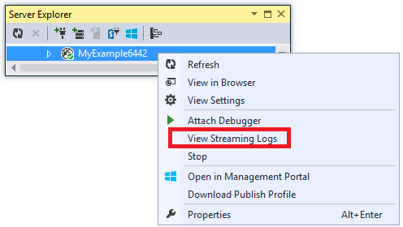

	“输出”窗口显示已连接至日志流式传输服务，每过一分钟没有要显示的日志，就添加一个通知行。

	  

4. 在显示应用程序主页的浏览器窗口，单击“联系人”。

	几秒钟内，添加到 `Contact` 方法的错误级跟踪的输出显示在“输出”窗口中。

	  

	Visual Studio 仅显示错误级跟踪，因为这是启用日志监视服务时的默认设置。创建新的 Azure Web 应用时，默认禁用所有日志记录，正如之前打开设置页面时所见：

	  

	然而，如果选择“查看流式传输日志”，Visual Studio 会自动将“应用程序日志记录(文件系统)”更改为“错误”，这意味着将报告错误级日志。为了查看所有跟踪日志，可将该设置更改为“详细”。如果选择的严重级别低于错误，也将报告所有更高严重级别的日志。因此，如果选择“详细”，还可查看信息、警告以及错误日志。

4. 在“服务器资源管理器”中，右键单击 Web 应用，然后如之前所做单击“查看设置”。

5. 将“应用程序日志记录(文件系统)”更改为“详细”，然后单击“保存”。
 
	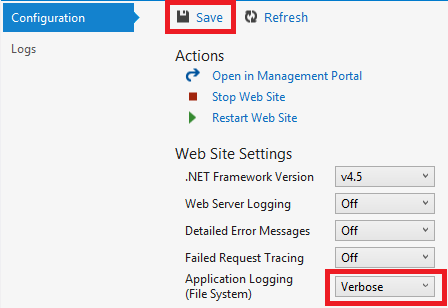  

6. 现在，在显示“联系人”页面的浏览器窗口中，单击“主页”，然后依次单击“关于”和“联系人”。

	几秒钟内，“输出”窗口将显示所有跟踪输出。

	  

	在本节中，已通过使用 Azure Web 应用设置启用和禁用日志记录。此外，还可以通过修改 Web.config 文件启用和禁用跟踪侦听器。然而，修改 Web.config 文件会导致应用域回收，而通过 Web 应用配置启用日志记录则不会出此情况。如果问题重现需要花费较长时间或呈间歇性，回收应用域可能会“修正”该问题并强迫你一直等待直至其再次出现。在 Azure 中启用诊断功能不会如此，因此可以立即开始捕获错误信息。

### 输出窗口特性

“输出”窗口的“Azure 日志”选项卡上有若干按钮和一个文本框：

  

这些控件执行以下功能：

* 清理“输出”窗口。
* 启用或禁用自动换行。
* 启动或停止监视日志。
* 指定要监视的日志。
* 下载日志。
* 基于搜索字符串或正则表达式筛选日志。
* 关闭“输出”窗口。

如果输入搜索字符串或正则表达式，Visual Studio 将在客户端筛选日志记录信息。这意味着可以在日志显示在“输出”窗口后输入条件，并可更改筛选条件而不必重新生成日志。

## 查看 Web 服务器日志

Web 服务器日志将记录 Web 应用上所有的 HTTP 活动。若要在“输出”窗口中查看这些日志，必须为 Web 应用启用日志并告知 Visual Studio 希望对其进行监视。

1. 在通过“服务器资源管理器”打开的“Azure Web 应用配置”选项卡上，将“Web 服务器日志记录”的状态更改为“开启”，然后单击“保存”。

	

2. 在“输出”窗口中，单击“指定要监视的 Azure 日志”按钮。
	
	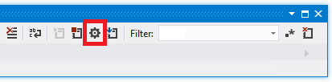  

3. 在“Azure 日志记录选项”对话框中，选择“Web 服务器日志”，然后单击“确定”。

	  

4. 在显示 Web 应用的浏览器窗口中，依次单击“主页”、“关于”、“联系人”。

	应用程序日志通常第一个显示，其后是 Web 服务器日志。可能需要等待一段时间日志才会显示。

	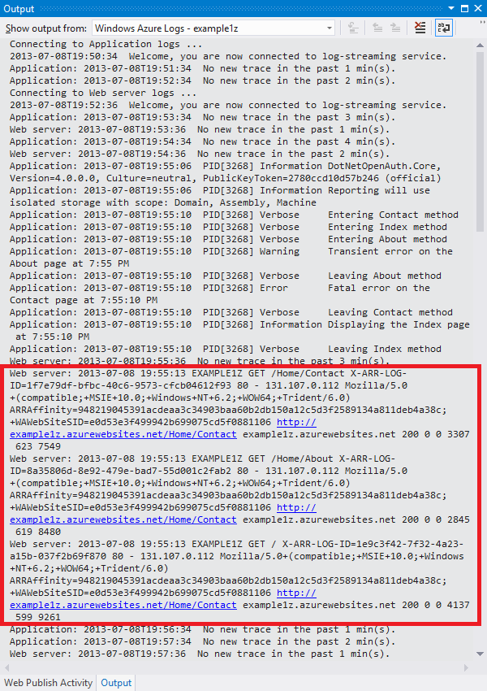  

默认情况下，通过使用 Visual Studio 第一次启用 Web 服务器日志时，Azure 会将日志写入文件系统。或者，可以使用 Azure 门户指定将 Web 服务器日志写入存储帐户的 Blob 容器。

如果使用门户将 Web 服务器日志记录写入 Azure 存储帐户，之后在 Visual Studio 中禁用日志记录，则在 Visual Studio 中重新启用日志记录时，存储帐户设置将还原。

## 查看详细的错误消息日志

详细的错误日志提供了有关导致错误响应代码（400 或更大）的 HTTP 请求的一些额外信息。若要在“输出”窗口中查看这些日志，必须为 Web 应用启用日志并告知 Visual Studio 希望对其进行监视。

1. 在通过“服务器资源管理器”打开的“Azure Web 应用配置”选项卡上，将“详细的错误消息”的状态更改为“开启”，然后单击“保存”。

	  

2. 在“输出”窗口中，单击“指定要监视的 Azure 日志”按钮。

3. 在“Azure 日志记录选项”对话框中单击“所有日志”，然后单击“确定”。

	  

4. 在浏览器的地址栏中，向 URL 添加一个额外字符以导致 404 错误（例如 `http://localhost:53370/Home/Contactx`），然后按 Enter。

	几秒后，详细的错误日志显示在 Visual Studio 的“输出”窗口中。

	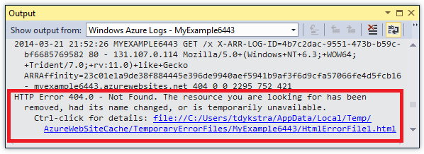  

	Control + 单击该链接可在浏览器中看到排好格式的日志输出。

	  

## 下载文件系统日志

任何可在“输出”窗口中监视的日志都可作为 *.zip* 文件进行下载。

1. 在“输出”窗口中单击“下载流式传输日志”。

	  

	“文件资源管理器”打开，其中显示 *Downloads* 文件夹中已下载文件处于选定状态。

	  

2. 提取该 *.zip* 文件，将会看到以下文件夹结构：

	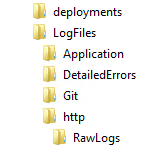  

	* 应用程序跟踪日志位于 *LogFiles\\Application* 文件夹的 *.txt* 文件中。
	* Web 服务器位于 *LogFiles\\http\\RawLogs* 文件夹的 *.log* 文件中。可以使用诸如 [Log Parser](http://www.microsoft.com/download/details.aspx?displaylang=en&id=24659) 之类的工具查看并处理这些文件。
	* 详细的错误消息日志位于 *LogFiles\\DetailedErrors* 文件夹的 *.html* 文件中。

	（*deployments* 文件夹内是由源代码管理发布创建的文件；其中没有任何有关 Visual Studio 发布的内容。*Git* 文件夹内是与源代码管理发布以及日志文件流式传输服务相关的跟踪。）

## 查看存储日志

也可将应用程序跟踪日志发送至 Azure 存储帐户，可通过 Visual Studio 进行查看。若要如此，需要创建一个存储帐户，在经典管理门户中启用存储日志，然后在“应用服务”窗口的“日志”选项卡中对其进行查看。

可以将日志发送到以下所有目的地或其中之一：

* 文件系统。
* 存储帐户表。
* 存储帐户 Blob。

可以为每个目的地指定不同的严重级别。

表易于在线查看日志详细信息并且其支持流式传输；可在表中查询日志并在新日志创建的同时进行查看。Blob 易于下载文件中的日志并使用 HDInsight 对其进行分析，因为 HDInsight 知晓如何与 Blob 存储协同运作。有关详细信息，请参阅[数据存储选项（使用 Azure 生成实际的云应用）](http://www.asp.net/aspnet/overview/developing-apps-with-windows-azure/building-real-world-cloud-apps-with-windows-azure/data-storage-options)中的 **Hadoop 和 MapReduce**。

目前，将文件系统日志设置为“详细”；从设置信息级日志到存储帐户表，以下将分别介绍。信息级意味着所有通过调用 `Trace.TraceInformation`、`Trace.TraceWarning` 以及 `Trace.TraceError` 创建的日志都将显示，但调用 `Trace.WriteLine` 创建的日志不包括在内。

与文件系统相比，存储帐户可为日志提供更大的存储空间以及更长的保留期。将应用程序跟踪日志发送到存储的另一个优势是，可以从每个日志获得一些无法从文件系统日志获得的其他信息。

5. 在 Azure 节点下右键单击“存储”，然后单击“创建存储帐户”。

	  

3. 在“创建存储帐户”对话框中，输入存储帐户的名称。

	该名称必须唯一（其他 Azure 存储帐户不能使用该名称）。如果输入的名称已被使用，可以进行更改。

	用于访问存储帐户的 URL 为 *{名称}*.core.chinacloudapi.cn。

5. 将“区域或地缘组”设置为离你最近的区域。

	此设置指定将托管存储帐户的 Azure 数据中心。对于本教程，所做的选择不会带来明显的差异；但是，对于生产 Web 应用，希望 Web 服务器和存储帐户处于同一区域，以最大程度减少延迟和数据传出费用。Web 应用（稍后创建）应在与访问 Web 应用的浏览器尽可能靠近的区域中运行，以最大程度地减少延迟。

6. 将“复制”下拉列表设置为“本地冗余”。

	为存储帐户启用地域复制时，会将存储内容复制到辅助数据中心，这样就能够在主要位置发生重大灾难时将故障转移到该位置。地域复制可能会产生额外的成本。对于测试和开发帐户，你通常不希望因为地域复制而付款。有关详细信息，请参阅[创建、管理或删除存储帐户](/documentation/articles/storage-create-storage-account/)。

5. 单击“创建”。

	  

1. 在 Visual Studio 的“应用服务”窗口中，单击“日志”选项卡，然后单击“在管理门户中配置日志记录”。

    <!-- todo:screenshot of new portal if the VS page link goes to new portal -->
	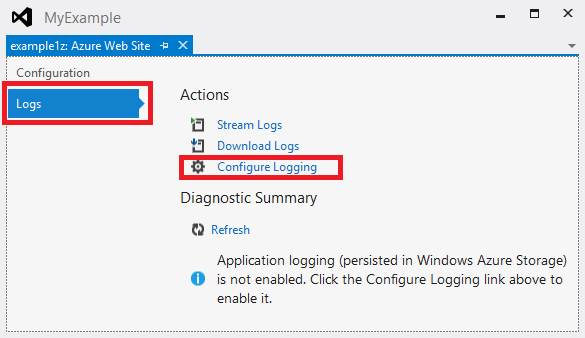  

	这将在经典管理门户中为 Web 应用打开“配置”页面。

2. 在经典管理门户的“配置”选项卡中，向下滚动至应用程序诊断部分，然后将“应用程序日志记录(表存储)”更改为“打开”。

3. 将“日志记录级别”更改为“信息”。

4. 单击“管理表存储”。

	  

	在“针对应用程序诊断管理表存储”框中可选择存储帐户（如果有多个此类帐户）。可以创建一个新表或使用现有的表。

	  

6. 在“对应用程序诊断管理表存储”框中，单击复选标记关闭该对话框。

6. 在经典管理门户的“配置”选项卡中，单击“保存”。

7. 在显示应用程序 Web 应用的浏览器窗口，依次单击“主页”、“关于”以及“联系人”。

	浏览这些网页而生成的日志记录信息将写入存储帐户。

8. 在 Visual Studio 中的“应用服务”窗口的“日志”选项卡上，单击“诊断摘要”下的“刷新”。

	

	“诊断摘要”部分默认显示过去 15 分钟的日志。可以更改此时间以查看更多日志。

	（如果收到“表未找到”错误，请验证是否在启用“应用程序日志记录(存储)”，并随后单击“保存”之后已浏览至执行跟踪的页面。）

	  

	请注意，在此视图中，可以看到每个日志的“进程 ID”和“线程 ID”，这在文件系统日志中是无法看到。通过直接查看 Azure 存储表可看到额外字段。

8. 单击“查看所有应用程序日志”。

	跟踪日志表将显示在 Azure 存储表查看器中。
   
	（如果收到“序列未包含任何元素”错误，请打开“服务器资源管理器”，展开 Azure 节点下你的存储帐户节点，然后右键单击“表”并单击“刷新”。）

	  

	该视图将显示任何其他视图都没提供的额外字段。该视图还支持使用特殊的 Query Builder UI 构建查询以筛选日志。

7. 要查看单个行的详细信息，请双击其中一行。

	  

## 查看失败请求跟踪日志

在出现诸如 URL 重写或身份验证问题之类的情况下，需要详细了解 IIS 如何处理 HTTP 请求时可求助于失败请求跟踪日志。

Azure Web Apps 使用 IIS 7.0 及更高版本中提供的相同失败请求跟踪功能。IIS 设置经过配置可记录指定错误，但无法访问该设置。启用失败请求跟踪后，所有错误都将纳入捕获范围内。

使用 Visual Studio 可启用失败请求跟踪，但却无法在 Visual Studio 中对其进行查看。这些日志是 XML 文件。这些流式传输日志服务只监视认为在纯文本模式下可读的文件：*.txt*、*.html* 和 *.log* 文件。

可以通过 FTP 直接在浏览器中查看失败请求跟踪日志，或使用 FTP 工具将其下载到本地计算机后进行本地查看。在本节中，将直接在浏览器中查看这些日志。

1. 在从“服务器资源管理器”打开的“应用服务”窗口的“配置”选项卡中，将“失败请求跟踪”的状态更改为“开启”，然后单击“保存”。

	

4. 在显示该 Web 应用的浏览器窗口的地址栏中，向 URL 添加一个额外字符，单击 Enter 将引发 404 错误。

	这将导致创建失败请求跟踪日志，以下步骤将介绍如何查看或下载该日志。

2. 在 Visual Studio 中，在“应用服务”窗口的“配置”选项卡中，单击“在管理门户中打开”。

3. 在 [Azure 经典管理门户](https://manage.windowsazure.cn)中你的 Web 应用的“仪表板”页面，“速览”下，单击“重置部署凭据”，然后输入新的用户名和密码。

	**登录时，必须使用以 Web 应用名称为前缀的完整用户名。例如，如果输入“myid”作为用户名，而站点为“myexample”，请使用“myexample\\myid”登录。

5. 在新的浏览器窗口中，转到显示在 Web 应用的“Web 应用”边栏选项卡中“FTP 主机名”或“FTPS 主机名”下面的 URL。

6. 使用之前创建的 FTP 凭据（包括作为用户名前缀的 Web 应用名称）登录。

	浏览器将显示该 Web 应用的根文件夹。

6. 打开 *LogFiles* 文件夹。

	  

7. 打开名为 W3SVC 加数值的文件夹。

	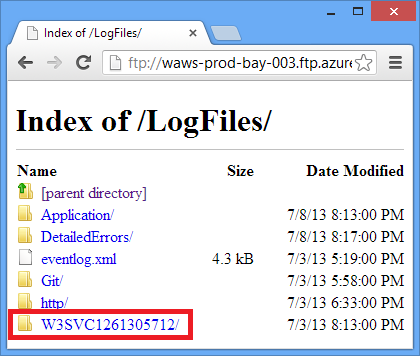

	该文件夹包含启用失败请求跟踪之后记录在案的任何错误的 XML 文件，以及一个可供浏览器格式化 XML 的 XSL 文件。

	  

8. 单击希望查看跟踪信息的失败请求的 XML 文件。

	下图显示了示例错误的部分跟踪信息。

	  

## 后续步骤

以上部分介绍了如何通过 Visual Studio 轻松查看由 Azure Web 应用创建的日志。以下部分提供了相关主题中其他资源的链接：

* Azure Web 应用故障排除
* 在 Visual Studio 中进行调试
* 在 Azure 中进行远程调试
* 在 ASP.NET 应用程序中进行跟踪
* 分析 Web 服务器日志
* 分析失败请求跟踪日志
* 调试云服务

### Azure Web 应用故障排除

有关对 Azure 应用服务中的 Web 应用进行故障排除的详细信息，请参阅以下资源：

* [如何监视 Web 应用](/documentation/articles/web-sites-monitor/)
* [使用 Visual Studio 2013 在 Azure Web 应用中调查内存泄漏](http://blogs.msdn.com/b/visualstudioalm/archive/2013/12/20/investigating-memory-leaks-in-azure-web-sites-with-visual-studio-2013.aspx)。有关用于分析托管内存问题的 Visual Studio 功能的 Microsoft ALM 博客文章。
* [应该了解的 Azure Web 应用联机工具](https://azure.microsoft.com/zh-cn/blog/2014/03/28/windows-azure-websites-online-tools-you-should-know-about-2/)。Amit Apple 发表的博客文章。

若要针对特定故障排除问题寻求帮助，可在以下论坛之一开启话题讨论：

* [ASP.NET 站点上的 Azure 论坛](http://forums.asp.net/1247.aspx/1?Azure+and+ASP+NET)。
* [MSDN 上的 Azure 论坛](http://social.msdn.microsoft.com/Forums/zh-cn/home?forum=windowsazurezhchs)。
* [CSDN](http://azure.csdn.net/)。

### 在 Visual Studio 中进行调试 

有关如何在 Visual Studio 中使用调试模式，请参阅[在 Visual Studio 中进行调试](http://msdn.microsoft.com/zh-cn/library/vstudio/sc65sadd.aspx) MSDN 主题和[使用 Visual Studio 2010 进行调试的提示](http://weblogs.asp.net/scottgu/archive/2010/08/18/debugging-tips-with-visual-studio-2010.aspx)。

### 在 Azure 中进行远程调试

有关 Azure Web 应用和 Web 作业远程调试的详细信息，请参阅以下资源：

* [远程调试 Azure 应用服务 Web 应用简介](https://azure.microsoft.com/blog/2014/05/06/introduction-to-remote-debugging-on-azure-web-sites/)。
* [Azure 应用服务 Web 应用远程调试简介第 2 部分 - 远程调试洞析](https://azure.microsoft.com/blog/2014/05/07/introduction-to-remote-debugging-azure-web-sites-part-2-inside-remote-debugging/)
* [Azure 应用服务 Web 应用远程调试简介第 3 部分 - 多实例环境和 GIT](https://azure.microsoft.com/blog/2014/05/08/introduction-to-remote-debugging-on-azure-web-sites-part-3-multi-instance-environment-and-git/)

如果 Web 应用使用 Azure Web API 或移动服务后端且需要进行调试，请参阅[在 Visual Studio 中调试 .NET 后端](http://blogs.msdn.com/b/azuremobile/archive/2014/03/14/debugging-net-backend-in-visual-studio.aspx)。

### 在 ASP.NET 应用程序中进行跟踪

Internet 上对于 ASP.NET 跟踪没有全面且最新的介绍。最佳做法是以针对 Web 窗体编写的老旧介绍性材料为主（因为 MVC 彼时并不存在），以专注于特定问题的新兴博客文章为辅。以下资源或许可以助你一臂之力：

* [监视和遥测（使用 Azure 生成实际的云应用）](http://www.asp.net/aspnet/overview/developing-apps-with-windows-azure/building-real-world-cloud-apps-with-windows-azure/monitoring-and-telemetry)。  电子书籍的章节就在 Azure 云应用程序中进行跟踪给出了建议。
* [ASP.NET 跟踪](http://msdn.microsoft.com/zh-cn/library/ms972204.aspx) 内容老旧，但不失为这一主题的优秀入门级资源。
* [跟踪侦听器](http://msdn.microsoft.com/zh-cn/library/4y5y10s7.aspx) 有关跟踪侦听器的信息，但未提及 [WebPageTraceListener](http://msdn.microsoft.com/zh-cn/library/system.web.webpagetracelistener.aspx)。
* [演练：集成 ASP.NET 跟踪与 System.Diagnostics 跟踪](http://msdn.microsoft.com/zh-cn/library/b0ectfxd.aspx) 此工具已不时兴，但包括一些介绍性文章未涵盖的额外信息。
* [在 ASP.NET MVC Razor 视图中进行跟踪](http://blogs.msdn.com/b/webdev/archive/2013/07/16/tracing-in-asp-net-mvc-razor-views.aspx) 除了在 Razor 视图中进行跟踪，文章还介绍了如何创建错误筛选器以便在 MVC 应用程序中记录所有未经处理的异常。有关如何在 Web 窗体应用程序中记录所有未经处理的异常，请参阅 MSDN 上的[错误处理程序的完整示例](http://msdn.microsoft.com/zh-cn/library/bb397417.aspx)中的 Global.asax 示例。在 MVC 或 Web 窗体中，如果希望记录特定异常但想让默认框架对其进行处理，可捕获并重新引发异常，如下例所示：

        try
        {
           // Your code that might cause an exception to be thrown.
        }
        catch (Exception ex)
        {
            Trace.TraceError("Exception: " + ex.ToString());
            throw;
        } 

* [从 Azure 命令行流式传输诊断跟踪日志记录（加上 Glimpse！）](http://www.hanselman.com/blog/StreamingDiagnosticsTraceLoggingFromTheAzureCommandLinePlusGlimpse.aspx)  如何使用命令行实现本教程中通过 Visual Studio 完成的任务。[Glimpse](http://www.hanselman.com/blog/IfYoureNotUsingGlimpseWithASPNETForDebuggingAndProfilingYoureMissingOut.aspx) 是一个用于调试 ASP.NET 应用程序的工具。

对于错误日志记录，若不想编写自己的跟踪代码，可以使用开源日志记录框架，如 [ELMAH](http://nuget.org/packages/elmah/)。有关详细信息，请参阅 [Scott Hanselman 有关 ELMAH 的博客文章](http://www.hanselman.com/blog/NuGetPackageOfTheWeek7ELMAHErrorLoggingModulesAndHandlersWithSQLServerCompact.aspx)。

此外，请注意，如果希望从 Azure 获得流式传输日志，则不必使用 ASP.NET 或 System.Diagnostics 跟踪。Azure Web 应用流式传输日志服务会将其在 *LogFiles* 文件中找到的所有 *.txt*、*.html* 或 *.log* 文件进行流式传输。因此，你可以创建自己的日志记录系统以写入 Web 应用的文件系统，你的文件将自动进行流式传输和下载。你所要做的就是编写在 *d:\\home\\logfiles* 文件夹中创建文件的应用程序代码。

### 分析 Web 服务器日志

有关分析 Web 服务器日志的详细信息，请参阅以下资源：

* [LogParser](http://www.microsoft.com/download/details.aspx?id=24659) 用于查看 Web 服务器日志（*.log* 文件）中的数据的工具。
* [使用 LogParser 解决 IIS 性能问题或应用程序错误](http://www.iis.net/learn/troubleshoot/performance-issues/troubleshooting-iis-performance-issues-or-application-errors-using-logparser) 可用于分析 Web 服务器日志的 Log Parser 工具介绍。
* [Robert McMurray 有关 LogParser 使用的博客文章](http://blogs.msdn.com/b/robert_mcmurray/archive/tags/logparser/) 
* [IIS 7.0、IIS 7.5 以及 IIS 8.0 中的 HTTP 状态代码](http://support.microsoft.com/kb/943891)

### 分析失败请求跟踪日志

Microsoft TechNet 网站包含的[使用失败请求跟踪](http://www.iis.net/learn/troubleshoot/using-failed-request-tracing)部分对于了解如何使用这些日志非常有用。然而，该文档主要着重于在 IIS 中配置失败请求跟踪，并不适用于 Azure Web 应用。

[GetStarted]: /documentation/articles/app-service-web-get-started-dotnet/
[GetStartedWJ]: /documentation/articles/websites-dotnet-webjobs-sdk/
 

<!---HONumber=Mooncake_Quality_Review_1118_2016-->