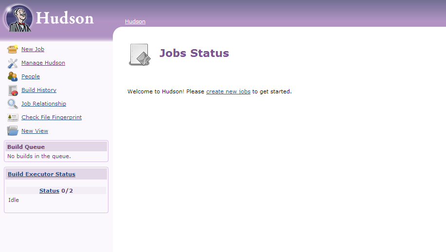

<properties 
	pageTitle="将自定义 Java Web 应用上载到 Azure" 
	description="本教程介绍了如何将自定义 Java Web 应用上载到 Azure Web 应用。" 
	services="app-service\web" 
	documentationCenter="java" 
	authors="rmcmurray" 
	manager="wpickett" 
	editor="jimbe"/>

<tags 
	ms.service="app-service-web"
	ms.date="05/04/2016" 
	wacn.date="06/29/2016"/>

# 将自定义 Java Web 应用上载到 Azure

本主题介绍了如何将自定义 Java Web 应用上载到 Azure。包括适用于 Java Web 应用的信息以及特定应用程序的示例。

请注意，Azure 提供了一种使用 Azure 经典管理门户配置 UI 创建 Java Web 应用的方法，如 [Azure Web 应用和 Java 入门](/documentation/articles/web-sites-java-get-started/)中所述。此教程适用于无需使用 Azure 配置 UI 的方案。

## 配置指南

下面描述了 Azure 上的自定义 Java Web 应用所需的设置。

- Java 进程使用的 HTTP 端口是动态分配的。该进程必须使用环境变量 `HTTP_PLATFORM_PORT` 的端口。
- 除单个 HTTP 侦听程序以外的所有其他侦听端口都应禁用。在 Tomcat 中，这些端口包括 Shutdown、HTTPS 和 AJP 端口。
- 容器仅应针对 IPv4 流量进行配置。
- 需要在配置中设置应用程序的 **startup** 命令。
- 需要目录具有写入权限的应用程序应位于 Azure Web 应用的内容目录中，即 **D:\\home**。环境变量 `HOME` 引用 D:\\home。  

您可以在 web.config 文件中根据需要设置环境变量。

## web.config httpPlatform 配置

以下信息介绍了 web.config 中 **httpPlatform** 的格式。
                                 
**arguments**（默认值=""）。**processPath** 设置中指定的可执行文件或脚本的参数。

示例（所示示例包含 **processPath**）：

    processPath="%HOME%\site\wwwroot\bin\tomcat\bin\catalina.bat"
    arguments="start"
    
    processPath="%JAVA_HOME\bin\java.exe"
    arguments="-Djava.net.preferIPv4Stack=true -Djetty.port=%HTTP\_PLATFORM_PORT% -Djetty.base=";%HOME%\site\wwwroot\bin\jetty-distribution-9.1.0.v20131115"; -jar ";%HOME%\site\wwwroot\bin\jetty-distribution-9.1.0.v20131115\start.jar";"

**processPath** - 启动侦听 HTTP 请求的进程的可执行文件或脚本的路径。

示例:

    processPath="%JAVA_HOME%\bin\java.exe"

    processPath="%HOME%\site\wwwroot\bin\tomcat\bin\startup.bat"

    processPath="%HOME%\site\wwwroot\bin\tomcat\bin\catalina.bat"
                                                                                       
**rapidFailsPerMinute**（默认值=10） 允许 **processPath** 中指定的进程每分钟崩溃的次数。如果超出了此限制，则每分钟达到此限制后的剩余时间 **HttpPlatformHandler** 将停止启动进程。
                                    
**requestTimeout**（默认值="00:02:00"） **HttpPlatformHandler** 等待侦听 `%HTTP_PLATFORM_PORT%` 的进程响应的持续时间。

**startupRetryCount**（默认值=10） **HttpPlatformHandler** 尝试启动 **processPath** 中指定的进程的次数。有关详细信息，请参阅 **startupTimeLimit**。

**startupTimeLimit**（默认值=10 秒） **HttpPlatformHandler** 等待可执行文件/脚本启动侦听端口的进程的持续时间。如果超出了此时间限制，**HttpPlatformHandler** 将终止进程，然后尝试重新启动 **startupRetryCount** 次。
                                                                                      
**stdoutLogEnabled**（默认值="true"） 如果为 true，**processPath** 设置中指定地进程的 **stdout** 和 **stderr** 将重定向到 **stdoutLogFile** 中指定地文件（请参阅 **stdoutLogFile** 部分）。
                                    
**stdoutLogFile**（默认值="d:\\home\\LogFiles\\httpPlatformStdout.log"） 记录 **processPath** 中指定的进程的 **stdout** 和 **stderr** 的绝对文件路径。
                                    
> [AZURE.NOTE]`%HTTP_PLATFORM_PORT%` 是一个特殊的占位符，需要指定为 **arguments** 的一部分或 **httpPlatform** **environmentVariables** 列表的一部分。其将会被替换为 **HttpPlatformHandler** 内部生成的端口，以便 **processPath** 指定的进程可以侦听此端口。

## 部署

可以通过基于 Internet Information Services (IIS) 的 Web 应用所用的方法轻松地部署基于 Java 的 Web 应用。FTP 和 Git 都是支持的部署机制，和 Web 应用集成的 SCM 功能一样。WebDeploy 可充当协议，但由于 Java 不是在 Visual Studio 中开发的，因此 WebDeploy 不适用于 Java Web 应用部署使用案例。

## 应用程序配置示例

对于以下应用程序，提供了 web.config 文件和应用程序配置作为示例，用以说明如何在 Azure Web 应用上启用 Java 应用程序。

### Tomcat
尽管 Azure Web 应用提供了两个 Tomcat 变体，但仍可以上载客户特定的实例。使用不同的 JVM 安装 Tomcat 的示例如下。

	<?xml version="1.0" encoding="UTF-8"?>
	<configuration>
	  <system.webServer>
	    <handlers>
	      <add name="httpPlatformHandler" path="*" verb="*" modules="httpPlatformHandler" resourceType="Unspecified" />
	    </handlers>
	    <httpPlatform processPath="%HOME%\site\wwwroot\bin\tomcat\bin\startup.bat" 
	        arguments="">
	      <environmentVariables>
	        <environmentVariable name="CATALINA_OPTS" value="-Dport.http=%HTTP_PLATFORM_PORT%" />
	        <environmentVariable name="CATALINA_HOME" value="%HOME%\site\wwwroot\bin\tomcat" />
	        <environmentVariable name="JRE_HOME" value="%HOME%\site\wwwroot\bin\java" /> <!-- optional, if not specified, this will default to %programfiles%\Java -->
	        <environmentVariable name="JAVA_OPTS" value="-Djava.net.preferIPv4Stack=true" />
	      </environmentVariables>
	    </httpPlatform>
	  </system.webServer>
	</configuration>

对于 Tomcat，需要更改少量配置。需要编辑 Server.xml 并进行如下设置：

-	Shutdown 端口 = -1
-	HTTP 连接器端口 = ${port.http}
-	HTTP 连接器地址 = "127.0.0.1"
-	注释掉 HTTPS 和 AJP 连接器
-	也可以在 catalina.properties 文件中设置 IPv4 设置，并在其中添加 `java.net.preferIPv4Stack=true`。
    
Azure Web 应用上不支持 Direct3d 调用。若要禁用这些调用，添加以下 Java 选项使你的应用程序进行以下调用：`-Dsun.java2d.d3d=false`

### Jetty

和 Tomcat 一样，客户可以上载其自己的 Jetty 实例。对于运行 Jetty 完整安装，配置应如下所示：

	<?xml version="1.0" encoding="UTF-8"?>
	<configuration>
	  <system.webServer>
	    <handlers>
	      <add name="httppPlatformHandler" path="*" verb="*" modules="httpPlatformHandler" resourceType="Unspecified" />
	    </handlers>
	    <httpPlatform processPath="%JAVA_HOME%\bin\java.exe" 
	         arguments="-Djava.net.preferIPv4Stack=true -Djetty.port=%HTTP_PLATFORM_PORT% -Djetty.base=";%HOME%\site\wwwroot\bin\jetty-distribution-9.1.0.v20131115"; -jar ";%HOME%\site\wwwroot\bin\jetty-distribution-9.1.0.v20131115\start.jar";"
	        startupTimeLimit="20"
		  startupRetryCount="10"
		  stdoutLogEnabled="true">
	    </httpPlatform>
	  </system.webServer>
	</configuration>

应在 start.ini 中更改 Jetty 配置并设置 `java.net.preferIPv4Stack=true`。

### Hudson

我们的测试使用 Hudson 3.1.2 war 和默认 Tomcat 7.0.50 实例，但没有使用 UI 来进行设置。由于 Hudson 为软件构建工具，因此建议将其安装在可在 Web 应用上设置 **AlwaysOn** 标志的专用实例上。

1. 在 Web 应用的站点根目录（即 **d:\\home\\site\\wwwroot**）中创建 **webapps** 目录（如果尚不存在），并将 Hudson.war 放在 **d:\\home\\site\\wwwroot\\webapps** 中。
2. 下载 Apache Maven 3.0.5（与 Hudson 兼容），并将其放在 **d:\\home\\site\\wwwroot** 中。
3. 在 **d:\\home\\site\\wwwroot** 中创建 web.config，并在其中粘贴以下内容：
	
		<?xml version="1.0" encoding="UTF-8"?>
		<configuration>
		  <system.webServer>
		    <handlers>
		      <add name="httppPlatformHandler" path="*" verb="*" 
		modules="httpPlatformHandler" resourceType="Unspecified" />
		    </handlers>
		    <httpPlatform processPath="%AZURE_TOMCAT7_HOME%\bin\startup.bat"
		startupTimeLimit="20"
		startupRetryCount="10">
		<environmentVariables>
		  <environmentVariable name="HUDSON_HOME" 
		value="%HOME%\site\wwwroot\hudson_home" />
		  <environmentVariable name="JAVA_OPTS" 
		value="-Djava.net.preferIPv4Stack=true -Duser.home=%HOME%/site/wwwroot/user_home -Dhudson.DNSMultiCast.disabled=true" />
		</environmentVariables>            
		    </httpPlatform>
		  </system.webServer>
		</configuration>

    此时可以重新启动 Web 应用，使所做的更改生效。连接到 http://yourwebapp/hudson 以启动 Hudson。

4. Hudson 对自身进行配置后，您将看到以下屏幕：

    
    
5. 访问 Hudson 配置页：单击“管理 Hudson”，然后单击“配置系统”。
6. 如下所示配置 JDK：

	

7. 如下所示配置 Maven：

	

8. 保存设置。Hudson 现在即已配置好，并可供使用。

有关 Hudson 的更多信息，请参阅 [http://hudson-ci.org](http://hudson-ci.org)。

### Liferay

Azure Web 应用支持 Liferay。由于 Liferay 可能需要大量内存，因此站点需要在可以提供足够内存的中型或大型专用工作机上运行。Liferay 也需要花数分钟才能启动。鉴于上述原因，建议你将站点设置为“始终打开”。

使用与 Tomcat 捆绑的 Liferay 6.1.2 Community Edition GA3 时，下载 Liferay 后将编辑以下文件：

**Server.xml**

- 将 Shutdown 端口更改为 -1。
- 将 HTTP 连接器更改为 `<Connector port="${port.http}" protocol="HTTP/1.1" connectionTimeout="600000" address="127.0.0.1" URIEncoding="UTF-8" />`
- 注释掉 AJP 连接器。

在 **liferay\\tomcat-7.0.40\\webapps\\ROOT\\WEB-INF\\classes** 文件夹中，创建文件 **portal-ext.properties**。此文件应包含一行如下所示的内容：

    liferay.home=%HOME%/site/wwwroot/liferay

在 tomcat-7.0.40 文件夹所在的目录级别中，创建包含以下内容的文件 **web.config**：

	<?xml version="1.0" encoding="UTF-8"?>
	<configuration>
	  <system.webServer>
	    <handlers>
	<add name="httpPlatformHandler" path="*" verb="*"
	     modules="httpPlatformHandler" resourceType="Unspecified" />
	    </handlers>
	    <httpPlatform processPath="%HOME%\site\wwwroot\tomcat-7.0.40\bin\catalina.bat" 
	                  arguments="run" 
	                  startupTimeLimit="10" 
	                  requestTimeout="00:10:00" 
	                  stdoutLogEnabled="true">
	      <environmentVariables>
	  <environmentVariable name="CATALINA_OPTS" value="-Dport.http=%HTTP_PLATFORM_PORT%" />
	  <environmentVariable name="CATALINA_HOME" value="%HOME%\site\wwwroot\tomcat-7.0.40" />
	        <environmentVariable name="JRE_HOME" value="D:\Program Files\Java\jdk1.7.0_51" /> 
	        <environmentVariable name="JAVA_OPTS" value="-Djava.net.preferIPv4Stack=true" />
	      </environmentVariables>
	    </httpPlatform>
	  </system.webServer>
	</configuration>

在 **httpPlatform** 块中，将 **requestTimeout** 设置为“00:10:00”。此时间可以减少，但随后在引导 Liferay 时您可能会看到超时错误。如果更改此值，也应该修改 tomcat server.xml 中的**connectionTimeout**。

值得注意的是，JRE\_HOME 环境变量将在上述 web.config 中指定为指向 64 位 JDK。默认为 32 位，但由于 Liferay 可能需要大量内存，因此建议使用 64 位 JDK。

做完上述更改后，重新启动运行 Liferay 的 Web 应用，然后打开 http://yourwebapp。可从 Web 应用根目录访问 Liferay 门户。

有关 Liferay 的详细信息，请参阅 [http://www.liferay.com](http://www.liferay.com)。

<!---HONumber=74-->