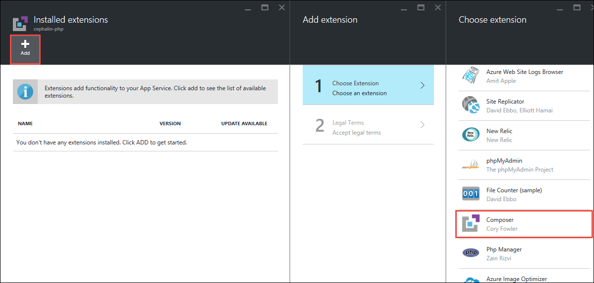
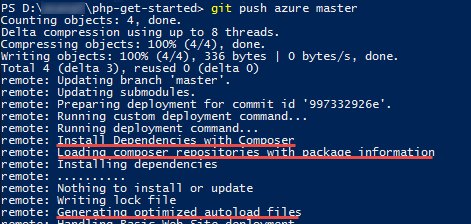

<properties
    pageTitle="在 Azure App Service Web 应用中配置 PHP | Azure"
    description="了解如何在 Azure App Service 中为 Web Apps 配置默认 PHP 安装或添加自定义 PHP 安装。"
    services="app-service"
    documentationcenter="php"
    author="rmcmurray"
    manager="erikre"
    editor="" />  

<tags
    ms.assetid="95c4072b-8570-496b-9c48-ee21a223fb60"
    ms.service="app-service"
    ms.workload="web"
    ms.tgt_pltfrm="na"
    ms.devlang="PHP"
    ms.topic="article"
    ms.date="12/16/2016"
    wacn.date="01/03/2017"
    ms.author="robmcm" />

# 在 Azure App Service Web Apps 中配置 PHP
## 介绍
本指南将演示如何执行以下操作：在 [Azure App Service](/documentation/articles/app-service-changes-existing-services/) 中配置 Web 应用的内置 PHP 运行时，提供自定义 PHP 运行时，以及启用扩展。若要使用应用服务，请注册[试用版]。若要充分利用本指南，你应先在应用服务中创建一个 PHP Web 应用。

[AZURE.INCLUDE [app-service-web-to-api-and-mobile](../../includes/app-service-web-to-api-and-mobile.md)]

## 如何：更改内置 PHP 版本
默认情况下，安装 PHP 5.4 后，创建应用服务 Web 应用时立即可以使用。查看可用发行版、其默认配置以及已启用扩展的最佳方式是部署调用 [phpinfo()] 函数的脚本。

PHP 5.5 和 PHP 5.6 也可用，但它们在默认情况下不启用。若要更新 PHP 版本，请使用下列方法之一：

### Azure 门户预览
1. 在 [Azure 门户预览](https://portal.azure.cn)中浏览到 Web 应用，然后单击“设置”按钮。
   
    ![Web 应用设置][settings-button]  

2. 在“设置”边栏选项卡中选择“应用程序设置”，然后选择新的 PHP 版本。
   
    ![应用程序设置][application-settings]
3. 单击“Web 应用设置”边栏选项卡顶部的“保存”按钮。
   
    ![保存配置设置][save-button]

### Azure PowerShell (Windows)
1. 打开 Azure PowerShell 并登录到你的帐户：
   
        PS C:\> Login-AzureRmAccount -EnvironmentName AzureChinaCloud
2. 设置 Web 应用的 PHP 版本。
   
        PS C:\> Set-AzureWebsite -PhpVersion {5.4 | 5.5 | 5.6} -Name {app-name}
3. 现已设置 PHP 版本。你可以确认这些设置：
   
        PS C:\> Get-AzureWebsite -Name {app-name} | findstr PhpVersion

### Azure 命令行接口（Linux、Mac、Windows）
若要使用 Azure 命令行接口，必须已在计算机上安装 **Node.js**。

1. 打开终端，并登录到你的帐户。
   
        azure login -e AzureChinaCloud
2. 设置 Web 应用的 PHP 版本。
   
        azure site set --php-version {5.4 | 5.5 | 5.6} {app-name}

3. 现已设置 PHP 版本。你可以确认这些设置：
   
        azure site show {app-name}

> [AZURE.NOTE] 
等效于上述设置的[Azure CLI 2.0（预览版）](https://github.com/Azure/azure-cli)命令为：
>
>

[AZURE.INCLUDE [azure-cli-2-azurechinacloud-environment-parameter](../../includes/azure-cli-2-azurechinacloud-environment-parameter.md)]

    az login
    az appservice web config update --php-version {5.5 | 5.6 | 7.0} -g {resource-group-name} -n {app-name}
    az appservice web config show -g {resource-group-name} -n {app-name}

## 如何：更改内置 PHP 配置
对于任何内置 PHP 运行时，你都可以通过执行以下步骤更改任何配置选项。（有关 php.ini 指令的信息，请参阅 [php.ini 指令的列表]。）

### 更改 PHP\_INI\_USER、PHP\_INI\_PERDIR、PHP\_INI\_ALL 配置设置
1. 将 [.user.ini] 文件添加到根目录。
2. 使用将在 `php.ini` 文件中使用的语法，将配置设置添加到 `.user.ini` 文件中。例如，如果你希望打开 `display_errors` 设置，并将 `upload_max_filesize` 设置设为 10 分钟，`.user.ini` 文件中将包含以下内容：
   
        ; Example Settings
        display_errors=On
        upload_max_filesize=10M
   
        ; OPTIONAL: Turn this on to write errors to d:\home\LogFiles\php_errors.log
        ; log_errors=On
3. 部署 Web 应用。
4. 重新启动 Web 应用。（必须重新启动，因为 PHP 读取 `.user.ini` 文件的频率受 `user_ini.cache_ttl` 设置的约束，该设置是一个系统级别设置且默认值为 300 秒（5 分钟）。重新启动 Web 应用会强制 PHP 读取 `.user.ini` 文件中的新设置。）

如果不使用 `.user.ini` 文件，则可以使用脚本中的 [ini\_set()] 函数来设置不属于系统级别指令的配置选项。

### 更改 PHP\_INI\_SYSTEM 配置设置
1. 使用密钥 `PHP_INI_SCAN_DIR` 和值 `d:\home\site\ini` 将应用设置添加到 Web 应用
2. 使用 Kudu 控制台 (http://&lt;site-name&gt;.scm.azurewebsite.net) 在 `d:\home\site\ini` 目录中创建 `settings.ini` 文件。
3. 使用将在 php.ini 文件中使用的语法，将配置设置添加到 `settings.ini` 文件中。例如，如果你希望将 `curl.cainfo` 设置指向 `*.crt` 文件并将“wincache.maxfilesize”设置为 512K，则 `settings.ini` 文件将包含以下内容：
   
        ; Example Settings
        curl.cainfo="%ProgramFiles(x86)%\Git\bin\curl-ca-bundle.crt"
        wincache.maxfilesize=512
4. 重新启动 Web 应用以加载更改。

## 如何：在默认 PHP 运行时中启用扩展
如上一节所述，查看默认 PHP 版本、其默认配置和已启用的扩展的最佳方法是部署调用 [phpinfo()] 的脚本。若要启用其他扩展，请执行下列步骤：

### 通过 ini 设置进行配置
1. 将 `ext` 目录添加到 `d:\home\site` 目录。
2. 将 `.dll` 扩展文件置于 `ext` 目录中（例如 `php_mongo.dll` 和 `php_xdebug.dll`）。确保扩展与默认版本的 PHP（撰写本文时为 PHP 5.4）兼容，并且是 VC9 版本且与非线程安全 (nts) 兼容。
3. 使用密钥 `PHP_INI_SCAN_DIR` 和值 `d:\home\site\ini` 将应用设置添加到 Web 应用
4. 在 `d:\home\site\ini` 中创建名为 `extensions.ini` 的 `ini` 文件。
5. 使用将在 php.ini 文件中使用的语法，将配置设置添加到 `extensions.ini` 文件中。例如，如果你想要启用 MongoDB 和 XDebug 扩展，则 `extensions.ini` 文件将包含此文本：
   
        ; Enable Extensions
        extension=d:\home\site\ext\php_mongo.dll
        zend_extension=d:\home\site\ext\php_xdebug.dll
6. 重新启动 Web 应用以加载更改。

### 通过应用设置进行配置
1. 将 `bin` 目录添加到根目录。
2. 将 `.dll` 扩展文件放在 `bin` 目录中（例如 `php_mongo.dll`）。确保扩展与默认版本的 PHP（撰写本文时为 PHP 5.4）兼容，并且是 VC9 版本且与非线程安全 (nts) 兼容。
3. 部署 Web 应用。
4. 在 Azure 门户预览中浏览到 Web 应用，然后单击“设置”按钮。
   
    ![Web 应用设置][settings-button]  

5. 在“设置”边栏选项卡中选择“应用程序设置”，然后滚动到“应用设置”部分。
6. 在“应用设置”部分中，创建 **PHP\_EXTENSIONS** 键。此键的值为网站根目录的相对路径：**bin\\your-ext-file**。
   
    ![启用应用程序设置中的扩展][php-extensions]
7. 单击“Web 应用设置”边栏选项卡顶部的“保存”按钮。
   
    ![保存配置设置][save-button]

通过使用 **PHP\_ZENDEXTENSIONS** 键还可支持 Zend 扩展。若要启用多个扩展，请包括应用设置值的 `.dll` 文件的逗号分隔列表。

## 如何：使用自定义 PHP 运行时
应用服务 Web 应用可以使用提供的 PHP 运行时（而非默认 PHP 运行时）来执行 PHP 脚本。你提供的运行时可由 `php.ini` 文件（也是你提供的）配置。若要在 Web 应用中使用自定义 PHP 运行时，请执行下列步骤。

1. 获取非线程安全、VC9 或 VC11 兼容版本的 PHP for Windows。可在此处找到 PHP for Windows 最新版本：[http://windows.php.net/download/]。可在此处的存档中找到旧版本：[http://windows.php.net/downloads/releases/archives/]。
2. 修改运行时的 `php.ini` 文件。请注意，Web 应用将忽略作为任何仅在系统级别使用的指令的配置设置。（有关仅在系统级别使用的指令的信息，请参阅 [php.ini 指令的列表]。）
3. （可选）将扩展添加到 PHP 运行时并在 `php.ini` 文件中启用这些扩展。
4. 将 `bin` 目录添加到根目录，并将包含 PHP 运行时的目录置于该目录中（例如 `bin\php`）。
5. 部署 Web 应用。
6. 在 Azure 门户预览中浏览到 Web 应用，然后单击“设置”按钮。
   
    ![Web 应用设置][settings-button]  

7. 在“设置”边栏选项卡中选择“应用程序设置”，然后滚动到“处理程序映射”部分。将 `*.php` 添加到扩展字段，并将路径添加到 `php-cgi.exe` 可执行文件。如果将 PHP 运行时放在应用程序根目录下的 `bin` 目录中，则路径为 `D:\home\site\wwwroot\bin\php\php-cgi.exe`。
   
    ![指定处理程序映射中的处理程序][handler-mappings]
8. 单击“Web 应用设置”边栏选项卡顶部的“保存”按钮。
   
    ![保存配置设置][save-button]  

## 如何在 Azure 中启用编辑器自动化
默认情况下，应用服务与 composer.json（如果 PHP 项目中有）不相关。如果使用 [Git 部署](/documentation/articles/app-service-web-php-get-started/)，可以在 `git push` 期间通过启用编辑器扩展启用 composer.json 处理。

> [AZURE.NOTE]
可以[在这里为应用服务中的一流编辑器支持投票](https://feedback.azure.com/forums/169385-web-apps-formerly-websites/suggestions/6477437-first-class-support-for-composer-and-pip)！
> 
> 

1. 在 [Azure 门户预览](https://portal.azure.cn)的 PHP Web 应用的边栏选项卡中，单击“工具”>“扩展”。
   
      

2. 单击“添加”，然后单击“编辑器”。
   
    
3. 单击“确定”接受法律条款。再次单击“确定”以添加该扩展。
   
    **已安装扩展**边栏选项卡将不会显示编辑器扩展。
4. 现在，如上一节所示，执行 `git add`、`git commit` 和 `git push`。现在将看到编辑器正在安装在 composer.json 中定义的依赖项。
   
    

## 后续步骤
有关详细信息，请参阅 [PHP 开发中心](/develop/php/)。

[试用版]: /pricing/1rmb-trial/
[phpinfo()]: http://php.net/manual/en/function.phpinfo.php
[select-php-version]: ./media/web-sites-php-configure/select-php-version.png
[php.ini 指令的列表]: http://www.php.net/manual/en/ini.list.php
[.user.ini]: http://www.php.net/manual/en/configuration.file.per-user.php
[ini\_set()]: http://www.php.net/manual/en/function.ini-set.php
[application-settings]: ./media/web-sites-php-configure/application-settings.png
[settings-button]: ./media/web-sites-php-configure/settings-button.png
[save-button]: ./media/web-sites-php-configure/save-button.png
[php-extensions]: ./media/web-sites-php-configure/php-extensions.png
[handler-mappings]: ./media/web-sites-php-configure/handler-mappings.png
[http://windows.php.net/download/]: http://windows.php.net/download/
[http://windows.php.net/downloads/releases/archives/]: http://windows.php.net/downloads/releases/archives/
[SETPHPVERCLI]: ./media/web-sites-php-configure/ChangePHPVersion-XPlatCLI.png
[GETPHPVERCLI]: ./media/web-sites-php-configure/ShowPHPVersion-XplatCLI.png
[SETPHPVERPS]: ./media/web-sites-php-configure/ChangePHPVersion-PS.png
[GETPHPVERPS]: ./media/web-sites-php-configure/ShowPHPVersion-PS.png

<!---HONumber=Mooncake_1226_2016-->