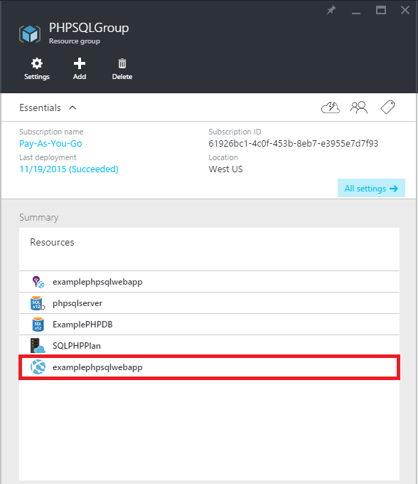

<properties 
	pageTitle="使用 Git 创建 PHP-SQL Web 应用并将其部署到 Azure App Service" 
	description="本教程演示如何创建在 Azure SQL 数据库中存储数据的 PHP Web 应用并使用 Git 部署到 Azure App Service。" 
	services="app-service\web, sql-database" 
	documentationCenter="php" 
	authors="rmcmurray" 
	manager="wpickett" 
	editor=""/>

<tags
	ms.service="app-service-web"
	ms.date="08/11/2016"
	wacn.date="09/26/2016"/>

# 使用 Git 创建 PHP-SQL Web 应用并将其部署到 Azure App Service

本教程演示如何在 [Azure App Service](/documentation/articles/app-service-changes-existing-services/) 中创建连接到 Azure SQL 数据库的 PHP Web 应用以及如何使用 Git 部署该应用。本教程假定你已在计算机上安装 [PHP][install-php]、[SQL Server Express][install-SQLExpress]、[Microsoft Drivers for SQL Server for PHP](http://www.microsoft.com/download/en/details.aspx?id=20098) 和 [Git][install-git]。完成本指南之后，你将拥有一个在 Azure 中运行的 PHP-SQL Web 应用。

> [AZURE.NOTE]
你可以使用 [Microsoft Web 平台安装程序](http://www.microsoft.com/web/downloads/platform.aspx)安装和配置 PHP、SQL Server Express 和 Microsoft Drivers for SQL Server for PHP。

你将学习以下内容：

* 如何使用 [Azure 门户预览](https://manage.windowsazure.cn/)创建 Azure Web 应用和 SQL 数据库。由于在应用服务 Web 应用中已默认启用 PHP，因此运行 PHP 代码没有任何特殊要求。
* 如何使用 Git 将应用程序发布和重新发布到 Azure。
 
通过按照本教程中的说明进行操作，您将在 PHP 中构建简单的注册 Web 应用程序。将在 Azure 网站中托管应用程序。以下是已完成应用程序的屏幕快照：

[AZURE.INCLUDE [create-account-and-websites-note](../../includes/create-account-and-websites-note.md)]

##创建 Azure Web 应用并设置 Git 发布

按照以下步骤创建 Azure Web 应用和 SQL 数据库：

1. 登录到 [Azure 门户预览](https://portal.azure.cn/)。

2. 单击仪表板左上方的“新建”图标打开 Azure 应用商店，接着单击应用商店旁的“全选”，然后选择“Web + 移动”。
	
3. 在应用商店中，选择“Web + 移动”。

4. 单击“Web 应用”图标。

5. 阅读完 Web 应用的说明后，选择“创建”。

6. 单击每个部分（“资源组”、“Web 应用”、和“订阅”），然后为必填字段输入或选择值：
	
	- 输入选择的 URL 名称
	- 选择离您最近的区域

6. 登录到 [Azure 经典管理门户](https://manage.windowsazure.cn)，创建一个 SQL 数据库，然后再“仪表板”为你的 Web 应用找到 SQL 的连接字符串。

7. 完成定义 Web 应用后，单击“创建”。

	Web 应用创建完成后，“通知”按钮将闪烁绿色的“成功”字样，资源组边栏选项卡会打开，以显示该组中的 Web 应用和 SQL 数据库。

1. 登录到 [Azure 经典管理门户](https://manage.windowsazure.cn)。在“Web 应用”页上，选择要为其安装连续部署的 Web 应用，然后选择“仪表板”选项卡。

1. 在“速览”部分中，单击“重置部署凭据”设置菜单项，提供用于将文件发布到应用的用户名和密码。

3. 选择“从源控件设置部署”。在“设置部署”对话框中，选择“本地 Git 存储库”选项，然后单击“确定”。随后将创建在 Azure 中运行的、与应用关联的 Git 存储库。每次将代码提交到 Git 存储库的 *master* 分支时，代码就会发布到实时运行的 API 应用实例。

1. 回到 [Azure 门户预览](https://portal.azure.cn)。单击资源组边栏选项卡中 Web 应用的图标，以打开 Web 应用的边栏选项卡。

	

6. 在“设置”中，单击“属性”以查看稍后要用于部署 PHP 应用所需的 Git 远程 URL。

##获取 SQL 数据库连接信息

若要连接到链接到 Web 应用的 SQL 数据库实例，需要在创建数据库时指定的连接信息。若要获取 SQL 数据库连接信息，请按照以下步骤操作：

1. 回到资源组的边栏选项卡，单击 SQL 数据库的图标。

2. 在 SQL 数据库的边栏选项卡中，单击“设置”>“属性”，然后单击“显示数据库连接字符串”。

	
	
3. 从结果对话框的“PHP”部分，记下 `Server`、`SQL Database` 和 `User Name` 的值。稍后将 PHP Web 应用发布到 Azure App Service 时，将使用这些值。

##本地构建和测试应用程序

注册应用程序是一个简单的 PHP 应用程序，它使您能够通过提供您的姓名和电子邮件地址来注册事件。有关以前的注册者的信息将显示在表中。注册信息将存储在 SQL 数据库实例中。应用程序由两个文件组成（复制/粘贴以下可用代码）：

* **index.php**：将显示注册形式及包含注册者信息的表。
* **createtable.php**：为应用程序创建 SQL 数据库表。该文件只能被使用一次。

若要本地运行应用程序，请执行下列步骤。请注意，这些步骤假定已在本地计算机上设置了 PHP 和 SQL Server Express，并且已启用了 [SQL Server 的 PDO 扩展][pdo-sqlsrv]。

1. 创建一个名为 `registration` 的 SQL Server 数据库。你可以通过 `sqlcmd` 命令提示符使用以下命令执行此操作：

		>sqlcmd -S localhost\sqlexpress -U <local user name> -P <local password>
		1> create database registration
		2> GO	

2. 在应用程序根目录中，创建两个文件 - 一个名为 `createtable.php`，另一个名为 `index.php`。

3. 在文本编辑器或 IDE 中打开 `createtable.php` 文件并添加以下代码。此代码将用于在 `registration` 数据库中创建 `registration_tbl` 表。

		<?php
		// DB connection info
		$host = "localhost\sqlexpress";
		$user = "user name";
		$pwd = "password";
		$db = "registration";
		try{
			$conn = new PDO( "sqlsrv:Server= $host ; Database = $db ", $user, $pwd);
			$conn->setAttribute( PDO::ATTR_ERRMODE, PDO::ERRMODE_EXCEPTION );
			$sql = "CREATE TABLE registration_tbl(
			id INT NOT NULL IDENTITY(1,1) 
			PRIMARY KEY(id),
			name VARCHAR(30),
			email VARCHAR(30),
			date DATE)";
			$conn->query($sql);
		}
		catch(Exception $e){
			die(print_r($e));
		}
		echo "<h3>Table created.</h3>";
		?>

	请注意，你需要使用本地 SQL Server 用户名和密码更新 <code>$user</code> 和 <code>$pwd</code> 的值。

4. 在应用程序根目录的终端中，键入以下命令：

		php -S localhost:8000

4. 打开 Web 浏览器并浏览到 **http://localhost:8000/createtable.php**。这将在数据库中创建 `registration_tbl` 表。

5. 在文本编辑器或 IDE 中打开 **index.php** 文件，并为页面添加基本 HTML 和 CSS 代码（将在后续步骤中添加 PHP 代码）。

		<html>
		<head>
		<Title>Registration Form</Title>
		
		</head>
		<body>
		<h1>Register here!</h1>
		
Fill in your name and email address, then click <strong>Submit</strong> to register.

		<form method="post" action="index.php" enctype="multipart/form-data" >
		      Name  <input type="text" name="name" id="name"/> 
		      Email <input type="text" name="email" id="email"/> 
		      <input type="submit" name="submit" value="Submit" />
		</form>
		<?php

		?>
		</body>
		</html>

6. 在 PHP 标记中，添加用于连接到数据库的 PHP 代码。

		// DB connection info
		$host = "localhost\sqlexpress";
		$user = "user name";
		$pwd = "password";
		$db = "registration";
		// Connect to database.
		try {
			$conn = new PDO( "sqlsrv:Server= $host ; Database = $db ", $user, $pwd);
			$conn->setAttribute( PDO::ATTR_ERRMODE, PDO::ERRMODE_EXCEPTION );
		}
		catch(Exception $e){
			die(var_dump($e));
		}

    同样，需要使用本地 MySQL 用户名和密码更新 <code>$user</code> 和 <code>$pwd</code> 的值。

7. 在数据库连接代码后面添加用于将注册信息插入数据库的代码。

		if(!empty($_POST)) {
		try {
			$name = $_POST['name'];
			$email = $_POST['email'];
			$date = date("Y-m-d");
			// Insert data
			$sql_insert = "INSERT INTO registration_tbl (name, email, date) 
						   VALUES (?,?,?)";
			$stmt = $conn->prepare($sql_insert);
			$stmt->bindValue(1, $name);
			$stmt->bindValue(2, $email);
			$stmt->bindValue(3, $date);
			$stmt->execute();
		}
		catch(Exception $e) {
			die(var_dump($e));
		}
		echo "<h3>Your're registered!</h3>";
		}

8. 最后，在上述代码后面添加从数据库中检索数据的代码。

		$sql_select = "SELECT * FROM registration_tbl";
		$stmt = $conn->query($sql_select);
		$registrants = $stmt->fetchAll(); 
		if(count($registrants) > 0) {
			echo "<h2>People who are registered:</h2>";
			echo "<table>";
			echo "<tr><th>Name</th>";
			echo "<th>Email</th>";
			echo "<th>Date</th></tr>";
			foreach($registrants as $registrant) {
				echo "<tr><td>".$registrant['name']."</td>";
				echo "<td>".$registrant['email']."</td>";
				echo "<td>".$registrant['date']."</td></tr>";
		    }
		 	echo "</table>";
		} else {
			echo "<h3>No one is currently registered.</h3>";
		}

现在，你可以浏览到 **http://localhost:8000/index.php** 以测试应用程序。

##发布应用程序

在本地测试了应用程序之后，可以使用 Git 将其发布到应用服务 Web 应用。但是，你首先需要更新应用程序中的数据库连接信息。使用之前获取的数据库连接信息（在“获取 SQL 数据库连接信息”部分中），使用适当的值在 `createdatabase.php` 和 `index.php` 文件中更新以下信息：

	// DB connection info
	$host = "tcp:<value of Server>";
	$user = "<value of User Name>";
	$pwd = "<your password>";
	$db = "<value of SQL Database>";

> [AZURE.NOTE]
在 <code>$host</code> 中，Server 的值的前面必须带有 <code>tcp:</code>。

现在，您已准备好设置 Git 发布并发布应用程序。

> [AZURE.NOTE]
这些步骤与上面**创建 Azure Web 应用并设置 Git 发布**部分的结尾标明的步骤相同。

1. 打开 GitBash（或终端，如果 Git 在 `PATH` 中），将目录更改为应用程序的根目录（**registration** 目录），然后运行以下命令：

		git init
		git add .
		git commit -m "initial commit"
		git remote add azure [URL for remote repository]
		git push azure master

	系统将提示你输入之前创建的密码。

2. 浏览到 **http://[web app name].chinacloudsites.cn/createtable.php** 以创建应用程序的 SQL 数据库表。
3. 浏览到 **http://[web app name].chinacloudsites.cn/index.php** 以开始使用应用程序。

发布应用程序之后，你可以开始对其进行更改并使用 Git 发布所做的更改。

##发布对应用程序所做的更改

若要发布对应用程序所做的更改，请执行下列步骤：

1. 本地对应用程序进行更改。
2. 打开 GitBash（或终端，如果 Git 在 `PATH` 中），将目录更改为应用程序的根目录，并运行以下命令：

		git add .
		git commit -m "comment describing changes"
		git push azure master

	系统将提示你输入之前创建的密码。

3. 浏览到 **http://[web app name].chinacloudsites.cn/index.php** 以查看所做的更改。

## 发生的更改
* 有关从网站更改为 App Service 的指南，请参阅 [Azure App Service 及其对现有 Azure 服务的影响](/documentation/articles/app-service-changes-existing-services/)

[install-php]: http://www.php.net/manual/en/install.php
[install-SQLExpress]: http://www.microsoft.com/download/details.aspx?id=29062
[install-Drivers]: http://www.microsoft.com/download/details.aspx?id=20098
[install-git]: http://git-scm.com/
[pdo-sqlsrv]: http://php.net/pdo_sqlsrv
 

<!---HONumber=Mooncake_0919_2016-->