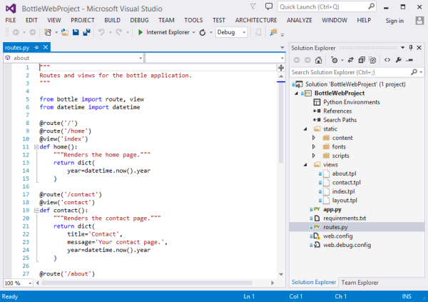
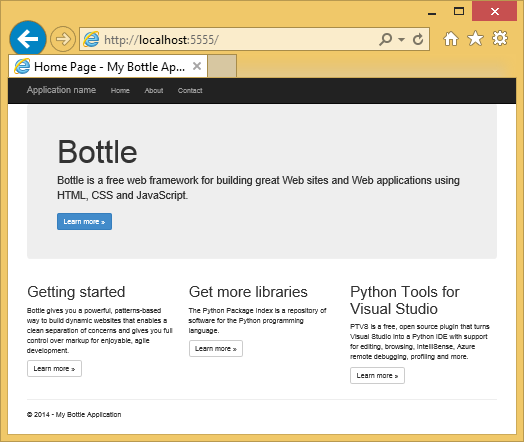
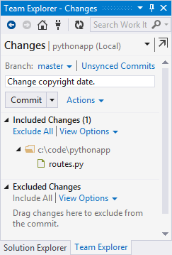
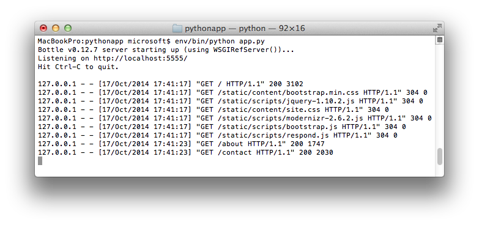

<properties 
	pageTitle="在 Azure 中使用 Bottle 创建 Python Web 应用" 
	description="本教程介绍如何在 Azure Web 应用中运行 Python Web 应用。" 
	services="app-service\web" 
	documentationCenter="python" 
	tags="python"
	authors="huguesv" 
	manager="wpickett" 
	editor=""/>

<tags
	ms.service="app-service-web"
	ms.date="02/19/2016"
	wacn.date="04/26/2016"/>

# 在 Azure 中使用 Bottle 创建 Web 应用

本教程介绍如何开始在 Azure Web 应用中运行 Python。 Web 应用提供有限的免费托管和快速部署功能，并且你可以使用 Python！ 随着您的应用增长，可以切换到付费托管，并且还可以与所有其他 Azure 服务集成。

你将使用 Bottle Web 框架创建 Web 应用（请参阅本教程针对 [Django](/documentation/articles/web-sites-python-create-deploy-django-app/) 和 [Flask](/documentation/articles/web-sites-python-create-deploy-flask-app/) 的备选版本）。你将从 Azure 创建 Web 应用，设置 Git 部署并在本地克隆存储库。然后在本地运行 Web 应用，对其进行更改并将其提交和推送到 [Azure Web 应用](/documentation/services/web-sites/)。本教程演示如何从 Windows 或 Mac/Linux 执行此操作。

[AZURE.INCLUDE [create-account-and-websites-note](../includes/create-account-and-websites-note.md)]

## 先决条件

- Windows、 Mac 或 Linux
- Python 2.7 或 3.4
- setuptools, pip, virtualenv（仅限 Python 2.7）
- Git
- [Python Tools 2.2 for Visual Studio][] (PTVS) - 注意：这是可选的

**注意**：Python 项目目前不支持 TFS 发布。

### Windows

如果您还没有 Python 2.7 或 3.4 安装（32 位），我们建议使用 Web 平台安装程序来安装 [Azure SDK for Python 2.7] 或 [Azure SDK for Python 3.4]。这将安装 32 位版本的 Python、setuptools、pip、virtualenv 等（32 位 Python 是在 Azure 主机计算机上安装的）。或者，您可以从 [python.org] 获取 Python。

对于 Git，我们建议 [Git for Windows] 或 [GitHub for Windows]。如果您使用 Visual Studio，可以使用集成的 Git 支持。

我们还建议你安装 [Python Tools 2.2 for Visual Studio]。这是可选的，但是如果您有 [Visual Studio]（包括免费 Visual Studio Community 2013 或 Visual Studio Express 2013 for Web），则这将为您提供很好的 Python IDE。

### Mac/Linux

您应安装了 Python 和 Git ，但请确保您具有 Python 2.7 或 3.4。

## 在 Azure 经典管理门户中创建 Web 应用

创建你的应用的第一步是通过 [Azure 经典管理门户](https://manage.windowsazure.cn)创建 Web 应用。

1. 登录到 [Azure 经典管理门户]。
1. 在页面底部，依次单击“新建”、“计算”、“ Web 应用”和“快速创建”。提供 Web 应用的“URL”，并选择 Web 应用的“区域”。最后，单击“创建 Web 应用”。

    

6. 按照[在 Azure Web 应用中使用 GIT 进行连续部署](/documentation/articles/web-sites-publish-source-control/)的说明为新创建的 Web 应用配置 Git 发布。
 
## 应用程序概述

### Git 存储库内容

下面是您会在初始 Git 存储库找到的文件的概览，我们将在下一节中予以克隆。

    \routes.py
    \static\content\
    \static\fonts\
    \static\scripts\
    \views\about.tpl
    \views\contact.tpl
    \views\index.tpl
    \views\layout.tpl

应用程序的的主要来源。包含具有母版布局的 3 页（索引、关于、联系人）。静态内容和脚本包括启动、 jquery、 modernizr 和响应。

    \app.py

本地开发服务器支持。使用此选项以在本地运行应用程序。

    \BottleWebProject.pyproj
    \BottleWebProject.sln

用于 [Python Tools for Visual Studio] 的项目文件。

    \ptvs_virtualenv_proxy.py

虚拟环境的 IIS 代理和 PTVS 远程调试支持。

    \requirements.txt

此应用程序所需的外部软件包。部署脚本将对在此文件中列出的包进行 pip 安装。
 
    \web.2.7.config
    \web.3.4.config

IIS 配置文件。部署脚本将使用适当的 web.x.y.config，并将其复制为 web.config。

### 可选文件 - 自定义部署

[AZURE.INCLUDE [web-sites-python-customizing-deployment](../includes/web-sites-python-customizing-deployment.md)]

### 可选文件 - Python 运行时

[AZURE.INCLUDE [web-sites-python-customizing-runtime](../includes/web-sites-python-customizing-runtime.md)]

### 服务器上的其他文件

某些文件存在于服务器上，但不会添加到 git 存储库。这些是由部署脚本创建的。

    \web.config

IIS 配置文件。每次部署中从 web.x.y.config 创建

    \env\

Python 虚拟环境。如果在 Web 应用上尚不存在兼容的虚拟环境，请在部署期间创建。在 requirements.txt 中列出的软件包是 pip 安装的，但如果已安装软件包，pip 将跳过安装。

后续 3 节描述如何在 3 个不同的环境下继续进行 Web 应用开发：

- Windows，具有 Python Tools for Visual Studio
- Windows，具有命令行
- Mac/Linux，具有命令行

## Web 应用开发 - Windows - Python Tools for Visual Studio

### 克隆存储库

首先，使用 Azure 经典管理门户上提供的 URL 来克隆存储库。有关详细信息，请参阅[在 Azure Web 应用中使用 GIT 进行连续部署](/documentation/articles/web-sites-publish-source-control/)。

打开包含在存储库根中的解决方案文件 (.sln) 。

### 创建虚拟环境

现在，我们将创建本地开发的虚拟环境。右键单击 **Python 环境**，选择**添加虚拟环境...**。

- 请确保环境的名称是 `env`。

- 选择基解释器。请确保使用为你的 Web 应用选择的相同版本 Python（在 runtime.txt 或 Azure 经典管理门户的站点中）。

- 请确保选中此选项以下载并安装软件包。

单击“创建”。这会创建虚拟环境，并安装 requirements.txt 中列出的依赖项。

### 使用开发服务器运行

按 F5 开始调试，您的 web 浏览器会自动打开到本地运行的页面。

您可以在源中设置断点，使用监视窗口等。请参阅 [Python Tools for Visual Studio 文档]以了解有关各种功能的更多信息。

### 进行更改

现在您可以通过更改应用程序源和/或模板进行试验。

您测试您的更改后，将其提交到 Git 存储库：

### 安装多个软件包

您的应用程序可能具有除 Python 和 Bottle 以外的依赖关系。

您可以使用 pip 安装其他软件包。要安装包，请右键单击虚拟环境，然后选择**安装 Python 软件包**。

例如，要安装 Azure SDK for Python（使您可以访问 Azure 存储、服务总线和其他 Azure 服务），请输入 `azure`：

在虚拟环境上右键单击并选择**生成 requirements.txt** 以更新 requirements.txt。

然后，将 requirements.txt 的更改落实到 Git 存储库。

### 部署到 Azure

要触发部署操作，请单击**同步**或**推送**。同步执行推送和拉取。

首次部署将需要一些时间，因为它将创建虚拟环境、 安装包等。

Visual Studio 不会显示部署的进度。

浏览到 Azure URL 要查看您的更改。

## Web 应用开发 - Windows - 命令行

### 克隆存储库

首先，使用在 Azure 经典管理门户中提供的 URL 来克隆存储库，并将 Azure 存储库添加为远程。有关详细信息，请参阅[在 Azure Web 应用中使用 GIT 进行连续部署](/documentation/articles/web-sites-publish-source-control/)。

    git clone <repo-url>
    cd <repo-folder>
    git remote add azure <repo-url> 

### 创建虚拟环境

我们将为开发目的创建新的虚拟环境 （不要将其添加到存储库）。Python 中的虚拟环境是可重定位，因此使用该应用程序的每个开发人员将在本地创建自己的环境。

请确保使用为你的 Web 应用选择的相同版本 Python（在 runtime.txt 或 Azure 经典管理门户的站点中）

对于 Python 2.7：

    c:\python27\python.exe -m virtualenv env

对于 Python 3.4：

    c:\python34\python.exe -m venv env

安装应用程序所需的任何外部软件包。可以使用该存储库的根处 requirements.txt 文件在虚拟环境中安装软件包：

    env\scripts\pip install -r requirements.txt

### 使用开发服务器运行

您可以使用以下命令在开发服务器下启用应用程序：

    env\scripts\python app.py

控制台将显示服务器侦听的 URL 和端口：

然后，将 web 浏览器打开到该 URL。

### 进行更改

现在您可以通过更改应用程序源和/或模板进行试验。

您测试您的更改后，将其提交到 Git 存储库：

    git add <modified-file>
    git commit -m "<commit-comment>"

### 安装多个软件包

您的应用程序可能具有除 Python 和 Bottle 以外的依赖关系。

您可以使用 pip 安装其他软件包。例如，要安装 Azure SDK for Python（使您可以访问 Azure 存储、 服务总线和其他 Azure 服务），请输入：

    env\scripts\pip install azure

请确保更新 requirements.txt：

    env\scripts\pip freeze > requirements.txt

落实更改：

    git add requirements.txt
    git commit -m "Added azure package"

### 部署到 Azure

要触发部署，请将更改推送到 Azure：

    git push azure master

您将看到部署脚本的输出，包括虚拟环境创建，安装软件包，创建 web.config。

浏览到 Azure URL 要查看您的更改。

## Web 应用开发 - Mac/Linux - 命令行

### 克隆存储库

首先，使用在 Azure 经典管理门户中提供的 URL 来克隆存储库，并将 Azure 存储库添加为远程。有关详细信息，请参阅[在 Azure Web 应用中使用 GIT 进行连续部署](/documentation/articles/web-sites-publish-source-control/)。

    git clone <repo-url>
    cd <repo-folder>
    git remote add azure <repo-url> 

### 创建虚拟环境

我们将为开发目的创建新的虚拟环境 （不要将其添加到存储库）。Python 中的虚拟环境是可重定位，因此使用该应用程序的每个开发人员将在本地创建自己的环境。

请确保使用为你的 Web 应用选择的相同版本 Python（在 runtime.txt 或 Azure 经典管理门户的站点中）。

对于 Python 2.7：

    python -m virtualenv env

对于 Python 3.4：

    python -m venv env
或
	pyvenv env

安装应用程序所需的任何外部软件包。可以使用该存储库的根处 requirements.txt 文件在虚拟环境中安装软件包：

    env/bin/pip install -r requirements.txt

### 使用开发服务器运行

您可以使用以下命令在开发服务器下启用应用程序：

    env/bin/python app.py

控制台将显示服务器侦听的 URL 和端口：

然后，将 web 浏览器打开到该 URL。

### 进行更改

现在您可以通过更改应用程序源和/或模板进行试验。

您测试您的更改后，将其提交到 Git 存储库：

    git add <modified-file>
    git commit -m "<commit-comment>"

### 安装多个软件包

您的应用程序可能具有除 Python 和 Bottle 以外的依赖关系。

您可以使用 pip 安装其他软件包。例如，要安装 Azure SDK for Python（使您可以访问 Azure 存储、 服务总线和其他 Azure 服务），请输入：

    env/bin/pip install azure

请确保更新 requirements.txt：

    env/bin/pip freeze > requirements.txt

落实更改：

    git add requirements.txt
    git commit -m "Added azure package"

### 部署到 Azure

要触发部署，请将更改推送到 Azure：

    git push azure master

您将看到部署脚本的输出，包括虚拟环境创建，安装软件包，创建 web.config。

浏览到 Azure URL 要查看您的更改。

## 故障排除 - 软件包安装

[AZURE.INCLUDE [web-sites-python-troubleshooting-package-installation](../includes/web-sites-python-troubleshooting-package-installation.md)]

## 故障排除 - 虚拟环境

[AZURE.INCLUDE [web-sites-python-troubleshooting-virtual-environment](../includes/web-sites-python-troubleshooting-virtual-environment.md)]

## 后续步骤

请遵循下面链接以了解有关 Bottle 和 Python Tools for Visual Studio 的更多信息：
 
- [Bottle 文档]
- [Python Tools for Visual Studio 文档]

有关使用 Azure 表存储和 MongoDB 的信息：

- [具有 Python Tools for Visual Studio 的 Azure 上的 Bottle 和 MongoDB]
- [具有 Python Tools for Visual Studio 的 Azure 上的 Bottle 和 Azure 表存储]

<!--Link references-->
[具有 Python Tools for Visual Studio 的 Azure 上的 Bottle 和 MongoDB]: /documentation/articles/web-sites-python-ptvs-bottle-table-storage/
[具有 Python Tools for Visual Studio 的 Azure 上的 Bottle 和 Azure 表存储]: /documentation/articles/web-sites-python-ptvs-bottle-table-storage/

<!--External Link references-->
[Azure SDK for Python 2.7]: http://go.microsoft.com/fwlink/?linkid=254281
[Azure SDK for Python 3.4]: http://go.microsoft.com/fwlink/?linkid=516990
[python.org]: http://www.python.org/
[Git for Windows]: http://msysgit.github.io/
[GitHub for Windows]: https://windows.github.com/
[Python Tools for Visual Studio]: https://www.visualstudio.com/zh-cn/features/python-vs
[Python Tools 2.2 for Visual Studio]: http://go.microsoft.com/fwlink/?LinkID=624025
[Visual Studio]: http://www.visualstudio.com/
[Python Tools for Visual Studio 文档]: http://aka.ms/ptvsdocs
[Bottle 文档]: http://bottlepy.org/docs/dev/index.html
 

<!---HONumber=Mooncake_0118_2016-->