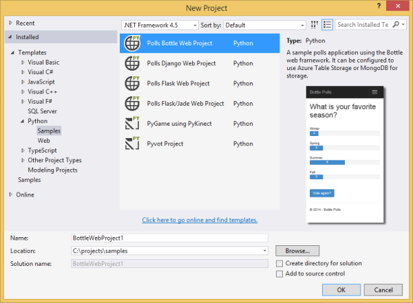
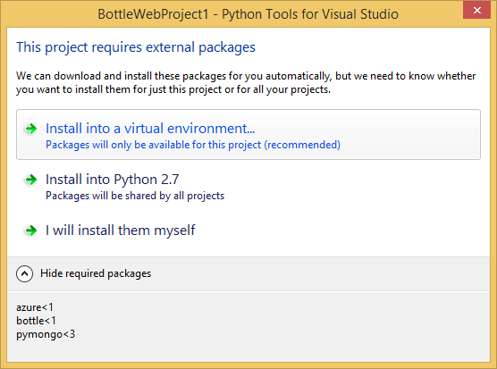

<properties 
	pageTitle="具有 Python Tools 2.2 for Visual Studio 的 Azure 上的 Bottle 和 Azure 表存储" 
	description="了解如何使用 Python Tools for Visual Studio 来创建 Bottle 应用程序，该应用程序在 Azure 表存储中存储数据并且可以部署到 Azure App Service Web Apps。" 
	services="app-service\web" 
	documentationCenter="python" 
	authors="huguesv" 
	manager="wpickett" 
	editor=""/>

<tags 
	ms.service="app-service-web" 
	ms.workload="web" 
	ms.tgt_pltfrm="na" 
	ms.devlang="python" 
	ms.topic="article" 
	ms.date="07/07/2016" 
	wacn.date="09/26/2016"
	ms.author="huvalo"/>  

# 具有 Python Tools 2.2 for Visual Studio 的 Azure 上的 Bottle 和 Azure 表存储 

在本教程中，我们将使用 [Python Tools for Visual Studio] 通过一个 PTVS 样本模板创建简单的轮询 Web 应用。

轮询 Web 应用定义其存储库的抽象，因此您可以轻松地在不同类型存储库（内存中、Azure 表存储、MongoDB）之间进行切换。

我们将了解如何创建 Azure 存储帐户、如何将 Web 应用配置为使用 Azure 表存储，以及如何将 Web 应用发布到 [Azure App Service Web Apps](/documentation/articles/app-service-changes-existing-services/) 中。

请访问 [Python 开发人员中心]，查看更多有关使用 PTVS 以及 Bottle、Flask 和 Django Web 框架、MongoDB、Azure 表存储、MySQL、SQL 数据库服务开发 Azure App Service Web Apps 的文章。虽然本文将着重介绍 App Service，但步骤与 [Azure 云服务]的开发步骤类似。

## 先决条件

 - Visual Studio 2015
 - [Python Tools 2.2 for Visual Studio]
 - [Python Tools 2.2 for Visual Studio 示例 VSIX]
 - [Azure SDK Tools for VS 2015]
 - [Python 2.7（32 位）]或 [Python 3.4（32 位）]

[AZURE.INCLUDE [create-account-and-websites-note](../../includes/create-account-and-websites-note.md)]

## 创建项目

在此部分中，我们将使用样本模板创建 Visual Studio 项目。我们将创建虚拟环境并安装所需软件包。然后，我们将使用默认内存中存储库在本地运行应用程序。

1.  在 Visual Studio 中，依次选择“文件”和“新建项目”。

1.  可以从“Python”>“示例”下面获取 “[Python Tools 2.2 for Visual Studio 示例 VSIX]” 中的项目模板。选择**轮询 Bottle Web 项目**，然后单击“确定”以创建项目。

  	  

1.  系统将提示您安装外部软件包。选择**安装到虚拟环境**。

  	  

1.  选择“Python 2.7”或“Python 3.4”作为基础解释器。

  	  

1.  按 `F5` 确认应用程序能否正常运行。默认情况下，该应用程序使用内存中存储库，这并不需要任何配置。停止 web 服务器时，所有数据都会丢失。

1.  单击“创建样本轮询”，然后单击一个轮询进行投票。

  	  

## 创建 Azure 存储帐户

要使用存储操作，你需要一个 Azure 存储帐户。可通过以下步骤创建存储帐户。

1.  登录到 [Azure 门户预览](https://portal.azure.cn/)。

1. 单击门户左下角的“新建”图标，然后单击“数据 + 存储”>“存储帐户”。单击“创建”按钮，然后为存储帐户指定一个唯一名称，并为其新建一个[资源组](/documentation/articles/resource-group-overview/)。应选择经典部署模式，否则将无法管理 Visual Studio 中的存储帐户。

  	

	创建存储帐户后，**通知**按钮将呈绿色闪烁**成功**，且存储帐户的边栏选项卡处于打开状态以显示属于您创建的新资源组。

1. 在存储帐户的边栏选项卡中单击“访问密钥”部分。记下帐户名和 key1。

  	

	我们将需要使用此信息在下一部分中配置您的项目。

## 配置项目

在此部分中，我们将配置应用程序以使用我们刚刚创建的存储帐户。然后我们将在本地运行应用程序。

1.  在 Visual Studio 中，右键单击 Solution Explorer 中的项目节点，然后选择**属性**。单击“调试”选项卡。

  	

1.  在**调试服务器命令**、**环境**中设置应用程序所需的环境变量的值。

        REPOSITORY_NAME=azuretablestorage
        STORAGE_NAME=<storage account name>
        STORAGE_KEY=<primary access key>

    当您**开始调试**时，这便会设置环境变量。如果您**启动但不调试**希望设置变量，还在**运行服务器命令**下设置相同值。

    或者，可以使用 Windows 控制面板来定义环境变量。如果您想要避免将凭证存储在源代码中/项目文件中，这是更好的选择。请注意，您将需要重新启动 Visual Studio 以使新环境值可用于应用程序。

1.  实施 Azure 表存储库的代码位于 **models/azuretablestorage.py** 中。请参阅[文档]以了解如何从 Python 使用表服务的更多信息。

1.  使用 `F5` 运行应用程序。使用“创建样本轮询”创建的轮询以及通过投票提交的数据会在 Azure 表存储中进行序列化。

	> [AZURE.NOTE] 在 Visual Studio 中，Python 2.7 虚拟环境可能会导致异常中断。按 `F5` 继续加载该 Web 项目。

1.  转到“关于”页面，验证应用程序是否在使用 **Azure 表存储库**。

  	  

## 了解 Azure 表存储

使用 Visual Studio 中的云资源管理器可以轻松查看和编辑存储表。本部分中，我们将使用 Server Explorer 查看轮询应用程序表的内容。

> [AZURE.NOTE] 这要求安装 Azure 工具，这些工具作为[用于 .NET 的 Azure SDK] 的一部分提供。

1.  打开“云资源管理器”。依次展开“Azure”、你的存储帐户、“表”。

  	  

1.  双击“轮询”或“选择”表，在文档窗口中查看表的内容，以及添加/删除/编辑实体。

  	

## 将 Web 应用发布到 Azure App Service

借助 Azure.NET SDK，您可以轻松地将 Web 应用部署到 Azure App Service 中。

1.  在“解决方案资源管理器”中，右键单击项目节点，然后选择“发布”。

  	  

1.  单击“导入”，然后选择已下载的“发布配置文件”。

	如果你尚未创建 Web 应用，可以登录到 [Azure 经典管理门户](https://manage.windowsazure.cn/)创建一个，然后转到“仪表板”页，在“速览”下下载“发布配置文件”。

1.  接受其他所有默认值，然后单击**发布**。

1.  此时，您的 Web 浏览器会自动打开已发布的 Web 应用。如果您转到“关于”页面，则会看到它使用的是**内存**存储库，而不是 **Azure 表存储库**。

    这是因为未在 Azure App Service 的 Web 应用实例上设置环境变量，因此它使用的是 **settings.py** 中指定的默认值。

## 配置 Web 应用实例

在此部分中，我们将配置 Web 应用实例的环境变量。

1.  在 [Azure 门户预览]中，单击“浏览”>“应用程序服务”和 Web 应用名称，打开 Web 应用的边栏选项卡。

1.  在 Web 应用的边栏选项卡中，依次单击“所有设置”和“应用程序设置”。

1.  向下滚动到“应用设置”部分并设置 **REPOSITORY\_NAME**、**STORAGE\_NAME** 和 **STORAGE\_KEY** 的值（如上面**配置项目**部分中所述）。

  	

1.  单击“保存”。收到更改已应用的通知后，单击 Web 应用主边栏选项卡中的“浏览”。

1.  您应该会看到 Web 应用使用 **Azure 表存储库**按预期方式运行。

    祝贺你！

  	  

## 后续步骤

请按照下面的链接以了解有关 Python Tools for Visual Studio、 Bottle 和 Azure 表存储的更多信息。

- [Python Tools for Visual Studio 文档]
  - [Web 项目]
  - [云服务项目]
  - [在 Azure 中进行远程调试]
- [Bottle 文档]
- [Azure 存储空间]
- [Azure SDK for Python]
- [如何从 Python 使用表存储服务]

## 发生的更改
* 有关从网站更改为 App Service 的指南，请参阅 [Azure App Service 及其对现有 Azure 服务的影响](/documentation/articles/app-service-changes-existing-services/)

<!--Link references-->
[Python 开发人员中心]: /develop/python/
[Azure 云服务]: /documentation/articles/cloud-services-python-ptvs/
[文档]: /documentation/articles/storage-python-how-to-use-table-storage/
[如何从 Python 使用表存储服务]: /documentation/articles/storage-python-how-to-use-table-storage/

<!--External Link references-->

[Azure 门户预览]: https://portal.azure.cn
[用于 .NET 的 Azure SDK]: /downloads/
[Python Tools for Visual Studio]: http://aka.ms/ptvs
[Python Tools 2.2 for Visual Studio]: http://go.microsoft.com/fwlink/?LinkId=624025
[Python Tools 2.2 for Visual Studio 示例 VSIX]: http://go.microsoft.com/fwlink/?LinkId=624025
[Azure SDK Tools for VS 2015]: http://go.microsoft.com/fwlink/?LinkId=518003
[Python 2.7（32 位）]: http://go.microsoft.com/fwlink/?LinkId=517190
[Python 3.4（32 位）]: http://go.microsoft.com/fwlink/?LinkId=517191
[Python Tools for Visual Studio 文档]: http://aka.ms/ptvsdocs
[Bottle 文档]: http://bottlepy.org/docs/dev/index.html
[在 Azure 中进行远程调试]: http://go.microsoft.com/fwlink/?LinkId=624026
[Web 项目]: http://go.microsoft.com/fwlink/?LinkId=624027
[云服务项目]: http://go.microsoft.com/fwlink/?LinkId=624028
[Azure 存储空间]: /documentation/services/storage/
[Azure SDK for Python]: https://github.com/Azure/azure-sdk-for-python
 

<!---HONumber=Mooncake_0919_2016-->