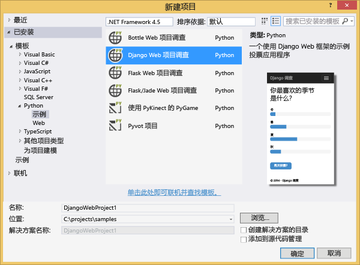
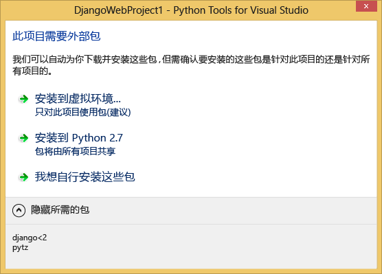
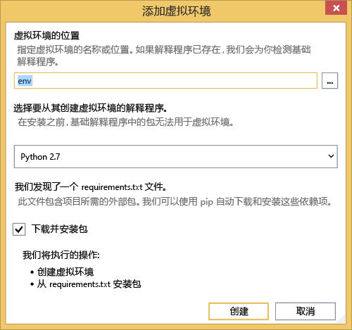
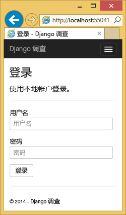
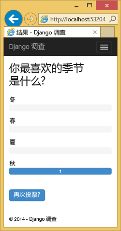
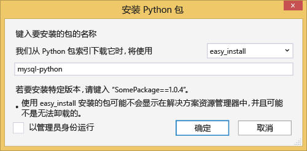
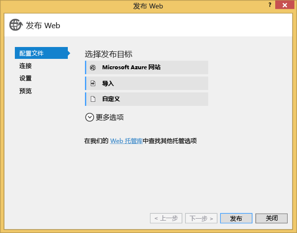
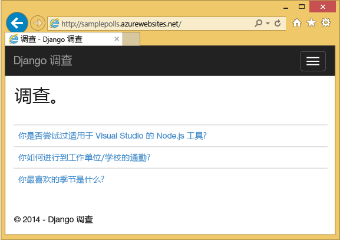

<properties
    pageTitle="Azure 上具有 Python Tools 2.2 for Visual Studio 的 Django 和 MySQL"
    description="了解如何使用 Python Tools for Visual Studio 来创建在 MySQL 数据库实例中存储数据的 Django Web 应用，以及将应用部署到 Azure App Service Web Apps 中。"
    services="app-service\web"
    documentationcenter="python"
    author="huguesv"
    manager="wpickett"
    editor="" />  

<tags
    ms.assetid="c60a50b5-8b5e-4818-a442-16362273dabb"
    ms.service="app-service-web"
    ms.workload="web"
    ms.tgt_pltfrm="na"
    ms.devlang="python"
    ms.topic="get-started-article"
    ms.date="07/07/2016"
    wacn.date="12/05/2016"
    ms.author="huvalo" />

# Azure 上具有 Python Tools 2.2 for Visual Studio 的 Django 和 MySQL
[AZURE.INCLUDE [选项卡](../../includes/app-service-web-get-started-nav-tabs.md)]

本教程介绍使用 [Python Tools for Visual Studio](https://www.visualstudio.com/vs/python) 通过一个 PTVS 样本模板创建简单的轮询 Web 应用。介绍如何使用在 Azure 上托管的 MySQL 服务、如何将 Web 应用配置为使用 MySQL，以及如何将 Web 应用发布到 [Azure 应用服务 Web 应用](/documentation/articles/app-service-changes-existing-services/)中。

请访问 [Python 开发人员中心]，查看更多有关使用 PTVS 以及 Bottle、Flask 和 Django Web 框架、Azure 表存储、MySQL、SQL 数据库服务开发 Azure 应用服务 Web 应用的文章。虽然本文将着重介绍 App Service，但步骤与 [Azure 云服务]的开发步骤类似。

## 先决条件
* Visual Studio 2015
* [Python 2.7（32 位）]或 [Python 3.4（32 位）]
* [Python Tools 2.2 for Visual Studio]
* [Python Tools 2.2 for Visual Studio 示例 VSIX]
* [Azure SDK Tools for VS 2015]
* Django 1.9 或更高版本

[AZURE.INCLUDE [create-account-and-websites-note](../../includes/create-account-and-websites-note.md)]

## 创建项目
本节介绍使用样本模板创建 Visual Studio 项目。你将创建虚拟环境并安装所需软件包。你将创建一个使用 sqlite 的本地数据库。然后你将在本地运行应用程序。

1. 在 Visual Studio 中，依次选择“文件”和“新建项目”。
2. 可以从“Python”>“示例”下面获取“[Python Tools 2.2 for Visual Studio 示例 VSIX]”中的项目模板。选择“轮询 Django Web 项目”，然后单击“确定”创建项目。
   
    
3. 系统将提示你安装外部软件包。选择**安装到虚拟环境**。
   
      

4. 选择“Python 2.7”或“Python 3.4”作为基础解释器。
   
      

5. 在“解决方案资源管理器”中，右键单击项目节点，选择“Python”，然后选择“Django 迁移”。然后选择“Django 创建超级用户”。
6. 这将打开 Django 管理控制台，并在项目文件夹中创建一个 sqlite 数据库。按照提示操作以创建一个用户。
7. 按 `F5` 确认应用程序能否正常运行。
8. 单击顶部导航栏中的“登录”。
   
      

9. 输入你同步数据库时创建的用户的凭证。
   
      

10. 单击“创建样本轮询”。
    
       

11. 单击轮询并进行投票。
    
       

## 创建 MySQL 数据库
对于数据库，你将在 Azure 上创建 ClearDB MySQL 托管数据库。

作为替代方法，可以在 Azure 上创建自己的虚拟机，然后亲自安装和管理 MySQL。

你可通过以下步骤创建数据库。

1. 登录到 [Azure 经典管理门户]。
1.  在导航窗格的底部。
1.  依次单击“数据服务”、“Azure 上的 MySQL 数据库”和“快速创建”。
1.  使用名称、版本等进行填充，然后单击“创建”。

## 配置项目
在此部分中，你会将 Web 应用配置为使用刚才创建的 MySQL 数据库。你还将安装配合使用 MySQL 数据库和 Django 所需的其他 Python 包。然后，你将在本地运行 Web 应用。

1. 在 Visual Studio 中，打开“项目名称” 文件夹中的 **settings.py**。暂时将连接字符串粘贴在编辑器中。连接字符串是按以下格式：
   
        Database=<NAME>;Data Source=<HOST>;User Id=<USER>;Password=<PASSWORD>
   
    将默认数据库**引擎**更改为使用 MySQL，然后在“连接字符串”中设置“名称”、“用户”、“密码”和“主机”的值。
   
        DATABASES = {
            'default': {
                'ENGINE': 'django.db.backends.mysql',
                'NAME': '<Database>',
                'USER': '<User Id>',
                'PASSWORD': '<Password>',
                'HOST': '<Data Source>',
                'PORT': '',
            }
        }
2. 在“解决方案资源管理器”的“Python 环境”下，右键单击虚拟环境，然后选择“安装 Python 包”。
3. 使用 **pip** 安装包 `mysqlclient`。
   
      

4. 在“解决方案资源管理器”中，右键单击项目节点，选择“Python”，然后选择“Django 迁移”。然后选择“Django 创建超级用户”。
   
    这将创建你在上一节中创建的 MySQL 数据库的表。按照提示创建用户，该用户不一定要与本文第一节中创建的 sqlite 数据库中的用户相同。
5. 使用 `F5` 运行应用程序。使用“创建样本轮询”创建的轮询以及通过投票提交的数据会在 MySQL 数据库中进行序列化。

## 将 Web 应用发布到 Azure App Service
借助 Azure.NET SDK，您可以轻松地将 Web 应用部署到 Azure App Service 中。

1. 在“解决方案资源管理器”中，右键单击项目节点，然后选择“发布”。
   
      

2. 单击“Azure 应用服务”。
3. 单击“新建”，新建一个 Web 应用。
4. 填写以下字段，然后单击“创建”：
   
   * **Web 应用名称**
   * **App Service 计划**
   * **资源组**
   * **区域**
   * 保持“数据库服务器”的“无数据库”设置不变
5. 接受其他所有默认值，然后单击**发布**。
6. 此时，你的 Web 浏览器会自动打开已发布的 Web 应用。Web 应用将使用在 Azure 上托管的 **MySQL** 数据库按预期方式运行。
   
      

   
    祝贺你！ 你已成功将基于 MySQL 的 Web 应用发布到 Azure。

## 后续步骤
请按照下面的链接以了解有关 Python Tools for Visual Studio、Django 和 MySQL 的更多信息。

* [Python Tools for Visual Studio 文档]
  * [Web 项目]
  * [云服务项目]
  * [在 Azure 中进行远程调试]
* [Django 文档]
* [MySQL]

有关详细信息，请参阅 [Python 开发人员中心](/develop/python/)。

<!--Link references-->

[Python 开发人员中心]: /develop/python/
[Azure 云服务]: /documentation/articles/cloud-services-python-ptvs/

<!--External Link references-->

[Azure 经典管理门户]: https://manage.windowsazure.cn
[Python Tools for Visual Studio]: https://www.visualstudio.com/vs/python/
[Python Tools 2.2 for Visual Studio]: http://go.microsoft.com/fwlink/?LinkID=624025
[]: http://go.microsoft.com/fwlink/?LinkID=624025
[Python Tools 2.2 for Visual Studio 示例 VSIX]: http://go.microsoft.com/fwlink/?LinkID=624025
[Azure SDK Tools for VS 2015]: http://go.microsoft.com/fwlink/?LinkId=518003
[Python 2.7（32 位）]: http://go.microsoft.com/fwlink/?LinkId=517190
[Python 3.4（32 位）]: http://go.microsoft.com/fwlink/?LinkId=517191
[Python Tools for Visual Studio 文档]: http://aka.ms/ptvsdocs
[在 Azure 中进行远程调试]: http://go.microsoft.com/fwlink/?LinkId=624026
[Web 项目]: http://go.microsoft.com/fwlink/?LinkId=624027
[云服务项目]: http://go.microsoft.com/fwlink/?LinkId=624028
[Django 文档]: https://www.djangoproject.com/
[MySQL]: http://www.mysql.com/
[video]: http://youtu.be/oKCApIrS0Lo

<!---HONumber=Mooncake_1128_2016-->