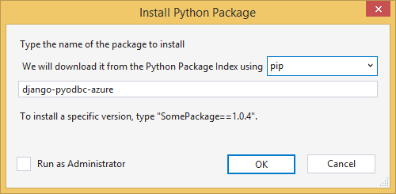

<properties 
	pageTitle="具有 Python Tools 2.1 for Visual Studio 的 Azure 上的 Django 和 SQL 数据库" 
	description="了解如何使用 Python Tools for Visual Studio 来创建在 SQL 数据库实例中存储数据的 Django Web 应用，以及将应用部署到 Azure 中。" 
	services="app-service\web" 
	tags="python"
	documentationCenter="python" 
	authors="huguesv" 
	manager="wpickett" 
	editor=""/>

<tags 
	ms.service="app-service-web"
	ms.date="02/25/2016"
	wacn.date="05/24/2016"/>

# 具有 Python Tools 2.2 for Visual Studio 的 Azure 上的 Django 和 SQL 数据库 

在本教程中，我们将使用 [Python Tools for Visual Studio] 通过一个 PTVS 样本模板创建简单的轮询 Web 应用。您还可以观看本教程的[视频](https://www.youtube.com/watch?v=ZwcoGcIeHF4)。

我们将了解如何使用在 Azure 上托管的 SQL 数据库、如何将 Web 应用配置为使用 SQL 数据库，以及如何将 Web 应用发布到 [Azure Web 应用](/documentation/services/web-sites/)中。

请参阅 [Python 开发人员中心]以获取更多文章，这些文章介绍了如何通过 PTVS（使用 Bottle、Flask 和 Django Web 框架）、MongoDB、Azure 表存储、MySQL 和 SQL 数据库服务来开发 Azure Web 应用。虽然本文将着重介绍 Azure Web 应用，但 [Azure 云服务]的开发步骤也是类似的。

##先决条件

 - Visual Studio 2013 或 2015
 - [Python Tools 2.2 for Visual Studio]
 - [Python Tools 2.2 for Visual Studio 示例 VSIX]
 - [Azure SDK Tools for VS 2013] 或 [Azure SDK Tools for VS 2015]
 - [Python 2.7（32 位）]
 - Django 1.6 或者更早

[AZURE.INCLUDE [create-account-and-websites-note](../includes/create-account-and-websites-note.md)]

## 创建项目

在此部分中，我们将使用样本模板创建 Visual Studio 项目。我们将创建虚拟环境并安装所需软件包。我们将创建一个使用 sqlite 的本地数据库。然后，我们将在本地运行 Web 应用。

1.  在 Visual Studio 中，依次选择“文件”和“新建项目”。

1.  您可以在“Python”>“样本”下获得 PTVS 样本 VSIX 中的项目模板。选择“轮询 Django Web 项目”，然后单击“确定”创建项目。

  	

1.  系统将提示您安装外部软件包。选择**安装到虚拟环境**。

  	

1.  选择“Python 2.7”作为基础解释器。

  	

1.  右键单击项目节点，然后依次选择“Python”和“Django 同步数据库”。

  	

1.  这将打开 Django 管理控制台。按照提示操作以创建一个用户。

    这将在项目文件夹中创建一个 sqlite 数据库。

  	

1.  按 <kbd>F5</kbd> 确认应用程序能否正常运行。

1.  单击顶部导航栏中的“登录”。

  	

1.  输入您同步数据库时创建的用户的凭证。

  	

1.  单击“创建样本轮询”。

  	

1.  单击轮询并进行投票。

  	

## 创建 SQL 数据库

对于数据库，我们将创建 Azure SQL 数据库。

您可通过以下步骤创建数据库。

1.  登录 [Azure 经典管理门户]。

1.  在导航窗格的底部，依次单击“新建”、“数据服务”和“SQL 数据库”。

  	<!--  -->

1.  通过新建资源组来配置新的 SQL 数据库，并为其选择相应的位置。

  	<!--  -->

1.  创建 SQL 数据库后，单击数据库边栏选项卡中的“在 Visual Studio 中打开”。
2.  单击“配置防火墙”。
3.  在“防火墙设置”边栏选项卡中，添加“起始 IP”和“结束 IP”已设置为您开发计算机的公共 IP 地址的防火墙规则。单击“保存”。

	这将允许从您的开发计算机连接到数据库服务器。

4.  返回数据库边栏选项卡，然后依次单击“属性”和“显示数据库连接字符串”。

2.  使用复制按钮将 **ADO.NET** 的值复制到剪贴板上。

## 配置项目

在此部分中，我们将把 Web 应用配置为使用我们刚刚创建的 SQL 数据库。我们还将安装结合使用 SQL 数据库和 Django 所需的其他 Python 包。然后，我们将在本地运行 Web 应用。

1.  在 Visual Studio 中，打开“项目名称” 文件夹中的 **settings.py**。暂时将连接字符串粘贴在编辑器中。连接字符串是按以下格式：

        Server=<ServerName>,<ServerPort>;Database=<DatabaseName>;User ID=<UserName>;Password={your_password_here};Encrypt=True;TrustServerCertificate=False;Connection Timeout=30;

编辑 `DATABASES` 的定义，使用上面的值。

        DATABASES = {
            'default': {
                'ENGINE': 'sql_server.pyodbc',
                'NAME': '<DatabaseName>',
                'USER': '<UserName>',
                'PASSWORD': '{your_password_here}',
                'HOST': '<ServerName>',
                'PORT': '<ServerPort>',
                'OPTIONS': {
                    'driver': 'SQL Server Native Client 11.0',
                    'MARS_Connection': 'True',
                }
            }
        }

1.  在“解决方案资源管理器”的“Python 环境”下，右键单击虚拟环境，然后选择“安装 Python 包”。

1.  使用 **easy_install** 安装包 `pyodbc`。

  	

1.  使用 **pip** 安装包 `django-pyodbc-azure`。

  	

1.  右键单击项目节点，然后依次选择“Python”和“Django 同步数据库”。

    这将创建我们在上一节中创建的 SQL 数据库的表。按照提示操作以创建用户，其并不一定要匹配第一节中创建的 sqlite 数据库中的用户。

  	

1.  使用 `F5` 运行应用程序。使用“创建样本轮询”创建的轮询以及通过投票提交的数据会在 SQL 数据库中进行序列化。

## 将 Web 应用发布到 Azure Web 应用

借助 Azure.NET SDK，你可以轻松地将 Web 应用部署到 Azure 中。

1.  在“解决方案资源管理器”中，右键单击项目节点，然后选择“发布”。

  	<!--  -->

1.  单击“导入”，选择已下载的“发布配置文件”。

	如果还没有创建 Web 应用，可以登录 [Azure 经典管理门户](https://manage.windowsazure.cn/)创建一个，然后再“仪表板”的“速览”下，下载“发布配置文件”。

1.  接受其他所有默认值，然后单击**发布**。

1.  此时，您的 Web 浏览器会自动打开已发布的 Web 应用。您应该会看到 Web 应用使用在 Azure 上托管的 **SQL** 数据库按预期方式运行。

    祝贺你！

  	

## 后续步骤

请按照下面的链接以了解有关 Python Tools for Visual Studio、Django 和 SQL 数据库的更多信息。

- [Python Tools for Visual Studio 文档]
  - [Web 项目]
  - [云服务项目]
  - [在 Azure 上进行远程调试]
- [Django 文档]
- [SQL 数据库]

<!--Link references-->
[Python 开发人员中心]: /develop/python/
[Azure 云服务]: /documentation/articles/cloud-services-python-ptvs/
<!--External Link references-->
[Azure 经典管理门户]: https://manage.windowsazure.cn
[Python Tools for Visual Studio]: http://aka.ms/ptvs
[Python Tools 2.2 for Visual Studio]: http://go.microsoft.com/fwlink/?LinkID=624025
[Python Tools 2.2 for Visual Studio 示例 VSIX]: http://go.microsoft.com/fwlink/?LinkID=624025
[Azure SDK Tools for VS 2013]: http://go.microsoft.com/fwlink/?LinkId=323510
[Azure SDK Tools for VS 2015]: http://go.microsoft.com/fwlink/?LinkId=518003
[Python 2.7（32 位）]: http://go.microsoft.com/fwlink/?LinkId=517190
[Python Tools for Visual Studio 文档]: http://pytools.codeplex.com/documentation
[在 Azure 上进行远程调试]: http://pytools.codeplex.com/wikipage?title=Features%20Azure%20Remote%20Debugging
[Web 项目]: http://pytools.codeplex.com/wikipage?title=Features%20Web%20Project
[云服务项目]: http://pytools.codeplex.com/wikipage?title=Features%20Cloud%20Project
[Django 文档]: https://www.djangoproject.com/
[SQL 数据库]: /documentation/services/sql-databases
 

<!---HONumber=76-->