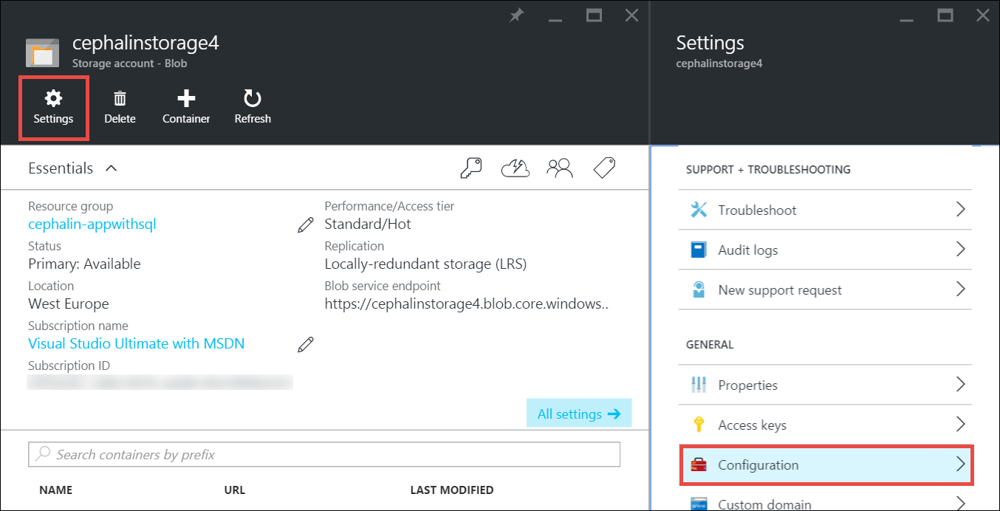

<properties
	pageTitle="向上缩放 Azure 中的应用 | Azure"
	description="了解如何向上缩放 Azure App Service 中的应用以增加容量和功能。"
	services="app-service"
	documentationCenter=""
	authors="cephalin"
	manager="wpickett"
	editor="mollybos"/>

<tags
	ms.service="app-service"
	ms.date="07/05/2016"
	wacn.date="09/26/2016"/>

# 向上缩放 Azure 中的应用 #

本文介绍如何在 Azure App Service 中缩放应用。缩放的工作流有两种：向上缩放和向外缩放；本文介绍向上缩放工作流。

- [向上缩放](https://en.wikipedia.org/wiki/Scalability#Horizontal_and_vertical_scaling)：获取更多 CPU、内存、磁盘空间、专用虚拟机 (VM) 等附加功能、自定义域和证书、过渡槽、自动缩放等。可以通过更改应用所属的应用服务计划的定价层来向上缩放。
- [向外缩放](https://en.wikipedia.org/wiki/Scalability#Horizontal_and_vertical_scaling)：增加运行应用的 VM 实例数。可以根据定价层，最多向外缩放到 20 个实例。有关向外缩放的详细信息，请参阅[手动或自动缩放实例计数](/documentation/articles/insights-how-to-scale/)。你可以在该文中了解如何使用自动缩放，即根据预定义的规则和计划自动缩放实例计数。

缩放设置只需几秒钟即会应用，且影响范围遍及[应用服务计划](/documentation/articles/azure-web-sites-web-hosting-plans-in-depth-overview/)中的所有应用。在此过程中，你不需要更改代码或重新部署应用程序。

有关各个应用服务计划的定价和功能的信息，请参阅[应用服务定价详细信息](/pricing/details/app-service/)。

> [AZURE.NOTE] 从**免费**层切换应用服务计划之前，必须先删除 Azure 订阅的现有[支出限制](/pricing/spending-limits/)。若要查看或更改 Azure App Service 订阅的选项，请参阅 [Azure Subscriptions][azuresubscriptions]（Azure 订阅）。

<a name="scalingsharedorbasic">
## 向上缩放定价层

1. 在浏览器中，打开 [Azure 门户预览][portal]。

2. 在应用的边栏选项卡中，单击“所有设置”，然后单击“向上缩放”。

	![导航到向上缩放 Azure 应用。][ChooseWHP]

4. 选择层，然后单击“选择”。

	操作完成后，“通知”选项卡将闪烁绿色的“成功”字样。

## 缩放相关资源
如果应用依赖于其他服务，如 Azure SQL 数据库或 Azure 存储，则还可以按需向上缩放这些资源。不应将这些资源与应用服务计划一起缩放，而必须单独进行缩放。

1. 在“概要”中，单击“资源组”链接。

	

2. 在“资源组”边栏选项卡的“摘要”部分中，单击要进行缩放的一个资源。以下屏幕截图显示 Azure 存储资源。

	

3. 对于 Azure 存储资源，请单击“设置”>“配置”以向上缩放存储选项。

    
	
	对于 SQL 数据库资源，请登录到 [Azure 经典管理门户](https://manage.windowsazure.cn)，找到你的 SQL 数据库，点击“缩放”。

	还可以点击“异地复制”，为 SQL 数据库实例打开[异地复制](/documentation/articles/sql-database-geo-replication-overview/)。

## 了解开发人员功能
我们根据定价层提供以下面向开发人员的功能：

### 位数 ###

- “基本”、“标准”和“高级”层支持 64 位和 32 位应用程序。
- “免费”和“共享”计划层仅支持 32 位应用程序。

### 调试器支持 ###

- “免费”、“共享”和“基本”模式提供每个应用服务计划 1 个连接的调试器支持。
- “标准”和“高级”模式提供每个应用服务计划 5 个并发连接的调试器支持。

## 了解其他功能

- 有关应用服务计划中所有其他功能（包括定价和所有用户（包括开发人员）感兴趣的功能）的详细信息，请参阅 [应用服务定价详细信息](/pricing/details/app-service/)。

## 后续步骤

- 若要开始使用 Azure，请参阅 [Azure Trial](/pricing/1rmb-trial/)（Azure 试用）。
- 有关定价、支持和 SLA 的信息，请访问以下链接。

	[数据传输定价详细信息](/pricing/details/data-transfer/)

	[Azure 支持计划](/support/plans/)

	[服务级别协议](/support/legal/sla/)

	[SQL 数据库定价详细信息](/pricing/details/sql-database/)

	[Azure 的虚拟机和云服务大小][vmsizes]

	[应用服务定价详细信息](/pricing/details/app-service/)

	[应用服务定价详细信息 - SSL 连接](/pricing/details/app-service/)

- 有关 Azure App Service 最佳实践（包括构建可缩放、有弹性的体系结构）的信息，请参阅 [Best Practices: Azure App Service Web Apps](http://blogs.msdn.com/b/windowsazure/archive/2014/02/10/best-practices-windows-azure-websites-waws.aspx)（最佳实践：Azure App Service Web 应用）。

<!-- LINKS -->
[vmsizes]: /pricing/details/app-service/
[SQLaccountsbilling]: /pricing/details/sql-database/
[azuresubscriptions]: https://manage.windowsazure.cn
[portal]: https://portal.azure.cn/

<!-- IMAGES -->
[ChooseWHP]: ./media/web-sites-scale/scale1ChooseWHP.png
[ChooseBasicInstances]: ./media/web-sites-scale/scale2InstancesBasic.png
[SaveButton]: ./media/web-sites-scale/05SaveButton.png
[BasicComplete]: ./media/web-sites-scale/06BasicComplete.png
[ScaleStandard]: ./media/web-sites-scale/scale3InstancesStandard.png
[Autoscale]: ./media/web-sites-scale/scale4AutoScale.png
[SetTargetMetrics]: ./media/web-sites-scale/scale5AutoScaleTargetMetrics.png
[SetFirstRule]: ./media/web-sites-scale/scale6AutoScaleFirstRule.png
[SetSecondRule]: ./media/web-sites-scale/scale7AutoScaleSecondRule.png
[SetThirdRule]: ./media/web-sites-scale/scale8AutoScaleThirdRule.png
[SetRulesFinal]: ./media/web-sites-scale/scale9AutoScaleFinal.png
[ResourceGroup]: ./media/web-sites-scale/scale10ResourceGroup.png
[ScaleDatabase]: ./media/web-sites-scale/scale11SQLScale.png
[GeoReplication]: ./media/web-sites-scale/scale12SQLGeoReplication.png

<!---HONumber=Mooncake_0919_2016-->