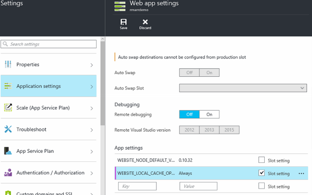

<properties
   pageTitle="Azure 应用服务本地缓存概述 | Azure"
   description="本文介绍如何针对 Azure 应用服务本地缓存功能执行启用、大小调整和状态查询操作。"
   services="app-service"
   documentationCenter="app-service"
   authors="SyntaxC4"
   manager="yochayk"
   editor=""
   tags="optional"
   keywords=""/>

<tags
	ms.service="app-service"
	ms.date="03/04/2016"
	wacn.date=""/>

# Azure 应用服务本地缓存概述

Azure Web 应用内容存储在 Azure 存储中，作为内容共享持续提供。此设计旨在兼容各种应用，具有以下特点：

* 内容跨 Web 应用的多个虚拟机 (VM) 实例共享。
* 内容是持久性的，运行 Web 应用即可对其进行修改。
* 在同一共享内容文件夹下提供日志文件和诊断数据文件。
* 发布新内容会直接更新内容文件夹。可以通过 SCM 网站和运行的 Web 应用即时查看相同的内容（通常情况下，在文件发生更改时，可以通过 ASP.NET 之类的特定技术重新启动 Web 应用，获取最新内容）。

虽然许多 Web 应用使用所有此类功能或其中一项功能，某些 Web 应用只需要高性能的只读内容存储，此类存储可用性高且支持这些 Web 应用的运行。这些应用可以充分利用特定本地缓存的 VM 实例。

Azure 应用服务本地缓存功能允许通过 Web 角色来查看内容。存储内容是在站点启动后异步创建的，而该内容是对存储内容进行写后即丢弃式缓存的结果。当缓存就绪时，将对站点进行切换，使之在已缓存内容的基础上运行。在本地缓存上运行的 Web 应用具有以下优势：

* 不受访问 Azure 存储上的内容时出现的延迟的影响。
* 不受计划内升级/计划外停机以及 Azure 存储出现的任何其他中断事件（发生在提供内容共享服务的服务器上）的影响。
* 因存储共享更改而需要重新启动应用的次数较少。

## 本地缓存如何改变应用服务的行为

* 本地缓存是 Web 应用的 /site 和 /siteextensions 文件夹的副本。它是在 Web 应用启动后在本地 VM 实例上创建的。默认情况下，每个 Web 应用的本地缓存的大小仅限 300 MB，但最高可增至 1 GB。
* 本地缓存是可以读写的。不过，如果 Web 应用移动了虚拟机，或者系统重新启动了 Web 应用，则会抛弃所做的任何修改。如果应用在内容存储中存储了任务关键型数据，则不应使用本地缓存。
* Web 应用可以像目前一样继续写入日志文件和诊断数据。不过，日志文件和数据是以本地方式存储在 VM 上的。然后，这些文件和数据会定期复制到共享内容存储中。复制到共享内容存储时，不得出任何差错 -- VM 实例突然崩溃可能会导致写回信息丢失。
* 对于使用本地缓存的 Web 应用来说，LogFiles 和数据文件夹的文件夹结构会发生变化。存储 LogFiles 和数据文件夹中现在出现了子文件夹，其遵循的命名模式为“唯一标识符”+ 时间戳。每个子文件夹对应于一个 VM 实例，其中的 Web 应用正在运行或已运行。
* 通过任何发布机制发布对 Web 应用的更改时，会将内容发布到共享内容存储中。这是设计使然，因为需要确保已发布内容的持久性。若要刷新 Web 应用的本地缓存，需重新启动该应用。这看起来是不是多余步骤呢？ 若要确保无缝的生命周期，请参阅本文后面提供的信息。
* D:\\Home 将指向本地缓存。D:\\local 将继续指向特定于临时 VM 的存储。
* SCM 站点的默认内容视图将继续是共享内容存储的视图。

## 在应用服务中启用本地缓存

组合使用保留的应用设置即可配置本地缓存。可以通过以下方法配置这些应用设置：

* [Azure 门户](#Configure-Local-Cache-Portal)
* [Azure 资源管理器](#Configure-Local-Cache-ARM)

### 通过 Azure 门户配置本地缓存

使用以下应用设置即可在每个 Web 应用的基础上启用本地缓存：`WEBSITE_LOCAL_CACHE_OPTION` = `Always`

### 使用 Azure Resource Manager 配置本地缓存

    ...

    {
        "apiVersion": "2015-08-01",
        "type": "config",
        "name": "appsettings",
        "dependsOn": [
            "[resourceId('Microsoft.Web/sites/', variables('siteName'))]"
        ],
        "properties": {
            "WEBSITE_LOCAL_CACHE_OPTION": "Always",
            "WEBSITE_LOCAL_CACHE_SIZEINMB": "300"
        }
    }

    ...

## 更改本地缓存中的大小设置

本地缓存大小默认为 **300 MB**，其中包括从内容存储复制过来的 /site 和 /siteextensions 文件夹，以及任何本地创建的日志和数据文件夹。若要增加此限制，请使用应用设置 `WEBSITE_LOCAL_CACHE_SIZEINMB`。最高可将此大小增加到每个 Web 应用 **1 GB** (1000 MB)。

## 使用应用服务本地缓存的最佳实践

建议将本地缓存与[过渡环境](/documentation/articles/web-sites-staged-publishing/)功能结合在一起使用。

* 将_粘性_ 应用设置 `WEBSITE_LOCAL_CACHE_OPTION` 与值 `Always` 添加到“生产”槽。如果使用的是 `WEBSITE_LOCAL_CACHE_SIZEINMB`，也可将其作为粘性设置添加到“生产”槽。
* 创建“过渡”槽，将内容发布到“过渡”槽。如果获得了生产槽的本地缓存优势，则要想通过无缝的“构建-部署-测试”生命周期进行过渡，通常不需要将过渡槽设置为使用本地缓存。
*	针对“过渡”槽来测试站点。
*	准备就绪以后，即可在“过渡”槽和“生产”槽之间发出[交换操作](/documentation/articles/web-sites-staged-publishing/#to-swap-deployment-slots)命令。
*	粘性设置包含名称，会粘到某个槽上。因此，将“过渡”槽交换成“生产”槽以后，该槽会继承本地缓存应用设置。新交换的“生产”槽将在几分钟后以本地缓存为基础运行，并会在交换后进行槽预热的过程中预热。因此，在槽交换完成后，“生产”槽会在本地缓存的基础上运行。

## 常见问题 (FAQ)

### 如何确定本地缓存是否适用于 Web 应用？

如果 Web 应用需要高效且可靠的内容存储，在运行时不使用内容存储来写入关键数据，并且总大小不到 1 GB，则可确定本地缓存适用于 Web 应用。 可以通过站点扩展“Azure Web 应用磁盘使用情况”获取 /site 和 /siteextensions 文件夹的总大小。

### 如何确定站点是否已切换为使用本地缓存？

如果在过渡环境中使用本地缓存功能，则在本地缓存预热之前，交换操作不会完成。若要了解站点是否正在本地缓存的基础上运行，可查看工作进程环境变量 `WEBSITE_LOCALCACHE_READY`。根据[工作进程环境变量](https://github.com/projectkudu/kudu/wiki/Process-Threads-list-and-minidump-gcdump-diagsession#process-environment-variable)页上的说明，访问多个实例上的工作进程环境变量。

### 刚发布的新更改内容似乎并没有在 Web 应用上显示出来，为什么？

如果 Web 应用使用本地缓存，则需重新启动站点才能获取最新更改。不想将更改发布到生产站点？ 请参阅前述最佳实践部分的槽选项。

### 日志在哪里？

使用本地缓存时，日志和数据文件夹看起来稍有不同。但是，子文件夹的结构始终是相同的，区别在于子文件夹嵌套在格式为“唯一 VM 标识符”+ 时间戳的子文件夹下。

### 本地缓存已启用，但 Web 应用仍重新启动。为什么会这样？ 本以为本地缓存可以缓解应用频繁重启的情况。

本地缓存确实可以防止与存储相关的 Web 应用重启情况。但是，在对 VM 进行计划内基础结构升级时，Web 应用仍可能重新启动。启用本地缓存以后，总体说来应用重启的次数应该会少一些。

<!---HONumber=Mooncake_0919_2016-->