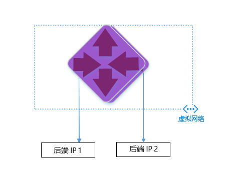

<properties 
   pageTitle="使用 Azure 资源管理器模板创建应用程序网关 | Windows Azure"
   description="本页提供有关使用 Azure 资源管理器模板创建 Azure 应用程序网关的说明"
   documentationCenter="na"
   services="application-gateway"
   authors="joaoma"
   manager="jdial"
   editor="tysonn"/>
<tags 
   ms.service="application-gateway"
   ms.date="11/10/2015"
   wacn.date="01/05/2016"/>

# 使用 ARM 模板创建应用程序网关

应用程序网关是第 7 层负载平衡器。它在不同服务器之间提供故障转移和性能路由 HTTP 请求，而不管它们是在云中还是本地。应用程序网关具有以下应用程序传递功能：HTTP 负载平衡、基于 Cookie 的会话相关性和 SSL 卸载。

> [AZURE.SELECTOR]
- [Azure Classic PowerShell](/documentation/articles/application-gateway-create-gateway)
- [Azure 资源管理器 PowerShell](/documentation/articles/application-gateway-create-gateway-arm)
- [Azure 资源管理器模板](/documentation/articles/application-gateway-create-gateway-arm-template)

 

你将了解如何从 GitHub 下载并修改现有 ARM 模板，以及如何通过 GitHub、PowerShell 和 Azure CLI 部署该模板。

如果你只是直接从 GitHub 部署 ARM 模板，而不进行任何更改，请跳到“从 github 部署模板”。

>[AZURE.IMPORTANT]在使用 Azure 资源之前，请务必了解 Azure 当前使用两种部署模型：资源管理器部署模型和经典部署模型。在使用任何 Azure 资源之前，请确保你了解[部署模型和工具](/documentation/articles/azure-classic-rm)。可以通过单击本文顶部的选项卡来查看不同工具的文档。本文档将说明使用 Azure 资源管理器创建应用程序网关的方式。若要使用经典版本，请转到[使用 PowerShell 创建应用程序网关经典部署](/documentation/articles/application-gateway-create-gateway)。

## 方案

在此方案中，你将创建：

- 包含 2 个实例的应用程序网关；
- 名为 VirtualNetwork1 且包含 10.0.0.0/16 保留 CIDR 块的 Vnet；
- 名为 Appgatewaysubnet 且使用 10.0.0.0/28 作为其 CIDR 块的子网；
- 安装程序 2 先前已针对想要用于为流量进行负载平衡的 Web 服务器设置后端 IP。在此模板示例中，所用的后端 IP 将是 10.0.1.10 和 10.0.1.11

>[AZURE.NOTE]这是适用于此模板的参数。你可以更改规则、侦听程序，以及打开 azuredeploy.json 以自定义模板的 SSL。

## 下载并了解 ARM 模板

可以从 github 下载用于创建 VNet 和两个子网的现有 ARM 模板，进行任何所需的更改，然后重用该模板。为此，请执行以下步骤。

1. 导航到 https://raw.githubusercontent.com/azure/azure-quickstart-templates/master/101-create-application-gateway/。
2. 单击 **azuredeploy.json**，然后单击 **RAW**。
3. 将该文件保存到你计算机上的本地文件夹。
4. 如果你熟悉 ARM 模板，则跳到步骤 7。
5. 打开刚保存的文件，并查看 **parameters** 下第 5 行中的内容。ARM 模板参数提供了在部署过程中可以填充的值的占位符。

	| 参数 | 说明 |
	|---|---|
	| **位置** | 将创建应用程序网关的 Azure 区域 |
	| **VirtualNetwork1** | 新 VNet 的名称 |
	| **addressPrefix** | VNet 的地址空间，采用 CIDR 格式 |
	| **ApplicationGatewaysubnet** | 应用程序网关子网的名称 |
	| **subnetPrefix** | 应用程序网关子网的 CIDR 块 |
	| **skuname** | SKU 实例大小 |
	| **容量** | 实例数 |
	| **backendaddress1** | 第一个 Web 服务器的 IP 地址 |
	| **backendaddress2** | 第二个 Web 服务器的 IP 地址|

>[AZURE.IMPORTANT]在 github 中维护的 ARM 模板可能随着时间的推移发生变化。请确保在使用该模板之前对其进行检查。
	
6. 查看 **resources** 下的内容，并注意以下项：

	- **type**。模板创建的资源的类型。在本例中为 **Microsoft.Network/applicationGateways**，表示应用程序网关。
	- **name**。资源的名称。请注意使用 **[parameters('applicationGatewayName')]**，这意味着在部署过程中将由用户或参数文件作为输入提供该名称。
	- **properties**。资源的属性列表。此模板在应用程序网关创建期间，使用虚拟网络与公共 IP 地址。

7. 导航回 https://raw.githubusercontent.com/azure/azure-quickstart-templates/master/101-create-application-gateway/azuredeploy.json。
8. 单击 **azuredeploy-paremeters.json**，然后单击 **RAW**。
9. 将该文件保存到你计算机上的本地文件夹。
10. 打开刚保存的文件并编辑参数的值。使用以下值来部署本方案中所述的应用程序网关。

		{
		  "$schema": "http://schema.management.azure.com/schemas/2015-01-01/deploymentParameters.json#",
		{
    	"location" : {
        "value" : "China North"
    	},
    	"addressPrefix": {
        "value": "10.0.0.0/16"
    	},
    	"subnetPrefix": {
        "value": "10.0.0.0/24"
    	},
    	"skuName": {
        "value": "Standard_Small"
    	},
    	"capacity": {
        "value": 2
    	},
    	"backendIpAddress1": {
        "value": "10.0.1.10"
    	},
    	"backendIpAddress2": {
        "value": "10.0.1.11"
    	}
		}

11. 保存该文件。你可以使用联机 json 验证工具（例如 [JSlint.com](http://www.jslint.com/)）来测试 Json 模板和参数模板。
 
## 使用 PowerShell 部署 ARM 模板

1. 如果你从未使用过 Azure PowerShell，请参阅[如何安装和配置 Azure PowerShell](/documentation/articles/powershell-install-configure)，并始终按照说明进行操作，以登录到 Azure 并选择你的订阅。
2. 在 Azure PowerShell 提示符下运行 **Switch-AzureMode** cmdlet 以切换到资源管理器模式，如下所示。

		Switch-AzureMode AzureResourceManager
	
预期输出：

		WARNING: The Switch-AzureMode cmdlet is deprecated and will be removed in a future release.

>[AZURE.WARNING]Switch-AzureMode cmdlet 将在不久后弃用。如果弃用，所有资源管理器 cmdlet 都将重命名。
	
3. 如果需要，请使用 `New-AzureResourceGroup` cmdlet 创建新的资源组。在以下示例中，将在美国东部位置创建名为 AppgatewayRG 的新资源组：

		PS C:\> New-AzureResourceGroup -Name AppgatewayRG -Location "East US"
		VERBOSE: 5:38:49 PM - Created resource group 'AppgatewayRG' in location 'eastus'

		ResourceGroupName : AppgatewayRG
		Location          : eastus
		ProvisioningState : Succeeded
		Tags              :
		Permissions       :
	                 Actions  NotActions
	                 =======  ==========
	                  *

		ResourceId        : /subscriptions/################################/resourceGroups/AppgatewayRG

4. 运行 New-AzureResourceGroupDeployment cmdlet 以使用你在前面下载并修改的模板和参数文件部署新 VNet。

		New-AzureResourceGroupDeployment -Name TestAppgatewayDeployment -ResourceGroupName AppgatewayRG `
 		   -TemplateFile C:\ARM\azuredeploy.json -TemplateParameterFile C:\ARM\azuredeploy-parameters.json

该命令行将生成以下输出：

		DeploymentName    : testappgatewaydeployment
		ResourceGroupName : appgatewayRG
		ProvisioningState : Succeeded
		Timestamp         : 9/19/2015 1:49:41 AM
		Mode              : Incremental
		TemplateLink      :
		Parameters        :
                   Name             Type                       Value
                   ===============  =========================  ==========
                   location         String                     East US
                   addressPrefix    String                     10.0.0.0/16
                   subnetPrefix     String                     10.0.0.0/24
                   skuName          String                     Standard_Small
                   capacity         Int                        2
                   backendIpAddress1  String                     10.0.1.10
                   backendIpAddress2  String                     10.0.1.11

		Outputs           :

## 使用 Azure CLI 部署 ARM 模板

若要使用 Azure CLI 部署下载的 ARM 模板，请执行以下步骤。

1. 如果你从未使用过 Azure CLI，请参阅[安装和配置 Azure CLI](/documentation/articles/xplat-cli-install)，并按照说明进行操作，直到选择 Azure 帐户和订阅。
2. 运行 **azure config mode** 命令以切换到资源管理器模式，如下所示。

		azure config mode arm

下面是上述命令的预期输出：

		info:	New mode is arm

3. 如有必要，请运行 **azure group create** 以创建新资源组，如下所示。请注意命令的输出。在输出后显示的列表说明了所用的参数。有关资源组的详细信息，请访问 [Azure 资源管理器概述](/documentation/articles/resource-group-overview)。

		azure group create -n appgatewayRG -l eastus

**-n（或 --name）**。新资源组的名称。在本方案中为 *appgatewayRG*。

**-l（或 --location）**。将在其中创建新资源组的 Azure 区域。在本方案中为 *Eastus*。

4. 运行 **azure group deployment create** cmdlet 以使用你在前面下载并修改的模板和参数文件部署新 VNet。在输出后显示的列表说明了所用的参数。

		azure group deployment create -g appgatewayRG -n TestAppgatewayDeployment -f C:\ARM\azuredeploy.json -e C:\ARM\azuredeploy-parameters.json

下面是上述命令的预期输出：

		azure group deployment create -g appgatewayRG -n TestAppgatewayDeployment -f C:\ARM\azuredeploy.json -e C:\ARM\azuredeploy-parameters.json
		info:    Executing command group deployment create
		+ Initializing template configurations and parameters
		+ Creating a deployment
		info:    Created template deployment "TestAppgatewayDeployment"
		+ Waiting for deployment to complete
		data:    DeploymentName     : TestAppgatewayDeployment
		data:    ResourceGroupName  : appgatewayRG
		data:    ProvisioningState  : Succeeded
		data:    Timestamp          : 2015-09-21T20:50:27.5129912Z
		data:    Mode               : Incremental
		data:    Name               Type    Value
		data:    -----------------  ------  --------------
		data:    location           String  East US
		data:    addressPrefix      String  10.0.0.0/16
		data:    subnetPrefix       String  10.0.0.0/24	
		data:    skuName            String  Standard_Small
		data:    capacity           Int     2
		data:    backendIpAddress1  String  10.0.1.10
		data:    backendIpAddress2  String  10.0.1.11
		info:    group deployment create command OK

**-g（或 --resource-group）**。将在其中创建新 VNet 的资源组的名称。

**-f（或 --template-file）**。ARM 模板文件的路径。

**-e（或 --parameters-file）**。ARM 参数文件的路径。

## 通过使用单击部署来部署 ARM 模板

“单击部署”是另一种使用 ARM 模板的方式。这是将模板与 Azure 门户配合使用的简便方法。

### 步骤 1 
使用[“单击部署应用程序网关”](/documentation/templates/101-application-gateway-public-ip/)链接将重定向到应用程序网关的门户模板页。

### 步骤 2 

单击“部署到 Azure”。

### 步骤 3

在门户上填写部署模板的参数，然后单击“确定”

### 步骤 4

选择“法律条款”，然后单击“购买”

### 步骤 5

在“自定义部署”边栏选项卡上，单击“创建”。

 
## 后续步骤

如果你要配置 SSL 卸载，请参阅[配置应用程序网关以进行 SSL 卸载](/documentation/articles/application-gateway-ssl)。

如果你想要将应用程序网关配置为与 ILB 配合使用，请参阅[创建具有内部负载平衡器 (ILB) 的应用程序网关](/documentation/articles/application-gateway-ilb)。

如需负载平衡选项的其他常规信息，请参阅：

- [Azure 负载平衡器](/documentation/services/load-balancer/)
- [Azure 流量管理器](/documentation/services/traffic-manager/)

<!---HONumber=Mooncake_1221_2015-->
