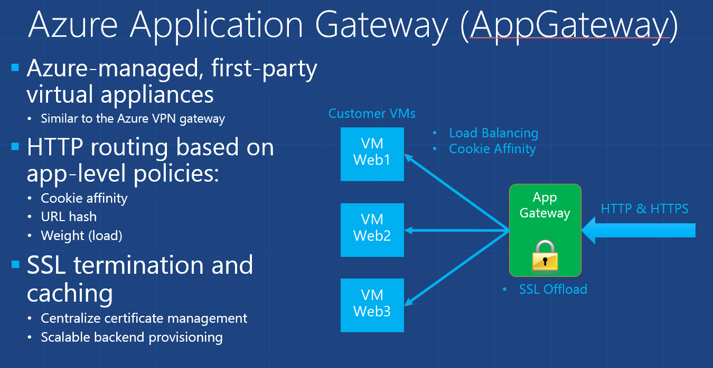

<properties 
   pageTitle="应用程序网关简介 | Windows Azure"
   description="此页提供第 7 层负载平衡的应用程序网关服务概述，包括网关的大小、HTTP 负载平衡、基于 Cookie 的会话相关性和 SSL 卸载。"
   documentationCenter="na"
   services="application-gateway"
   authors="cherylmc"
   manager="jdial"
   editor="tysonn"/>
<tags 
   ms.service="application-gateway" 
   ms.date="06/23/2015"
   wacn.date="07/19/2015"/>

# 应用程序网关技术概述 

Windows Azure 应用程序网关是 Azure 托管的服务，它类似于 Azure VPN 网关。应用程序网关提供基于 IIS/ARR 的 Azure 托管 HTTP 负载平衡解决方案。应用程序网关服务高度可用，并附带计量功能。有关服务级别协议和定价，请参阅 [SLA](/support/legal/sla) 和[定价](/home/features/application-gateway/#price)页。

应用程序网关当前支持以下第 7 层应用程序传送功能：

- HTTP 负载平衡
- 基于 Cookie 的会话相关性
- SSL 卸载

## HTTP 第 7 层负载平衡
Azure 通过软件负载平衡器 (SLB) 提供第 4 层负载平衡。具有负载平衡 VIP（公共或内部）的每个云服务都会隐式进行这种平衡。但是，许多应用程序需要基于第 7 层 (HTTP) 的负载平衡。

HTTP 第 7 层负载平衡适合用于：

- 需要使用来自同一用户/客户端会话的请求来访问相同后端 VM 的应用程序。此类应用程序的示例包括购物车应用程序和 Web 邮件服务器。
- 希望 Web 服务器场不产生 SSL 终端开销的应用程序。
- 要求长时间运行的同一 TCP 连接上多个 HTTP 请求路由/负载平衡到不同后端服务器的应用程序（例如 CDN）。

## 网关大小和实例

应用程序网关目前以 3 种大小提供：小型、中型和大型。小型实例大小适用于开发和测试方案。

最多可为每个订阅创建 10 个应用程序网关，每个应用程序网关最多可有 10 个实例。Azure 托管服务形式的应用程序网关负载平衡允许在 Azure 软件负载平衡器 (SLB) 的后面设置第 7 层负载平衡器。

## 配置和管理

可以使用 REST API 和相应的 PowerShell cmdlet 来创建及管理应用程序网关。

## 后续步骤

创建应用程序网关。请参阅[创建应用程序网关](application-gateway-create-gateway)。

配置 SSL 卸载。请参阅[配置应用程序网关的 SSL 卸载](application-gateway-ssl)。

<!---HONumber=HO63-->