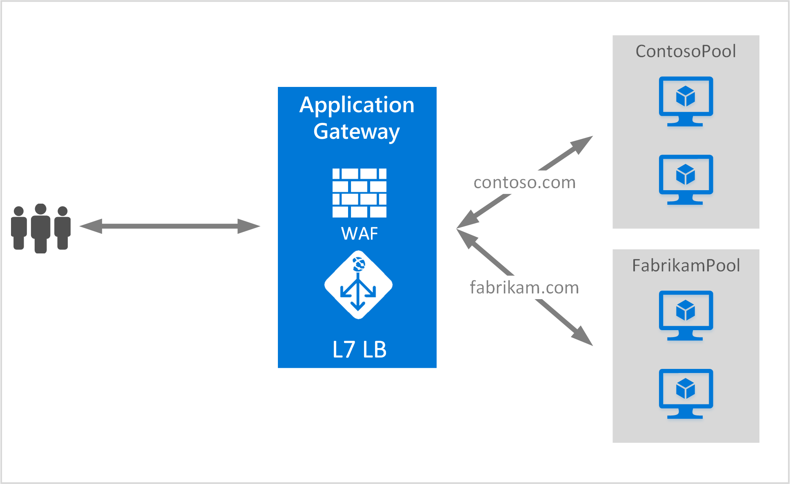

<properties
   pageTitle="创建托管多个站点的应用程序网关 | Azure"
   description="此页说明了如何创建和配置 Azure 应用程序网关，以便在同一网关托管多个 Web 应用程序。"
   documentationCenter="na"
   services="application-gateway"
   authors="amsriva"
   manager="rossort"
   editor="amsriva"/>  

<tags
   ms.service="application-gateway"
   ms.devlang="na"
   ms.topic="article"
   ms.tgt_pltfrm="na"
   ms.workload="infrastructure-services"
   ms.date="10/04/2016"
   wacn.date=""
   ms.author="amsriva"/>

# 创建托管多个 Web 应用程序的应用程序网关

托管多个站点可以让你在同一应用程序网关上部署多个 Web 应用程序。系统会通过传入 HTTP 请求中存在的主机标头来确定接收流量的侦听器。然后，侦听器会根据网关规则定义中的配置将流量定向到适当的后端池。在启用了 SSL 的 Web 应用程序中，应用程序网关将根据服务器名称指示 (SNI) 扩展来选择 Web 流量的适当侦听器。

通常会通过托管多个站点将不同 Web 域的请求负载均衡到不同的后端服务器池。同样还可以将同一根域的多个子域托管到同一应用程序网关。

## 方案

在以下示例中，应用程序网关使用两个后端服务器池来为 contoso.com 和 fabrikam.com 提供流量：contoso 服务器池和 fabrikam 服务器池。可以使用类似的设置来托管 app.contoso.com 和 blog.contoso.com 这样的子域。

  

## 开始之前

1. 使用 Web 平台安装程序安装最新版本的 Azure PowerShell cmdlet。可以从“下载”页的“Windows PowerShell”部分下载并安装最新版本。
2. 为使用应用程序网关而添加到后端池的服务器必须存在，或者在单独子网的虚拟网络中为其创建终结点，或者为其分配公共 IP/VIP。

## 要求

- **后端服务器池：**后端服务器的 IP 地址列表。列出的 IP 地址应属于虚拟网络子网，或者是公共 IP/VIP。也可使用 FQDN。
- **后端服务器池设置：**每个池都有一些设置，例如端口、协议和基于 Cookie 的关联性。这些设置绑定到池，并会应用到池中的所有服务器。
- **前端端口：**此端口是应用程序网关上打开的公共端口。流量将抵达此端口，然后重定向到后端服务器之一。
- **侦听器：**侦听器具有前端端口、协议（Http 或 Https，这些值区分大小写）和 SSL 证书名称（如果要配置 SSL 卸载）。对于启用了多个站点的应用程序网关，还会添加主机名和 SNI 指示器。
- **规则：**规则将会绑定侦听器和后端服务器池，并定义流量抵达特定侦听器时应定向到的后端服务器池。

## 创建应用程序网关

以下是创建应用程序网关所需执行的步骤：

1. 创建 Resource Manager 的资源组。
2. 创建应用程序网关的虚拟网络、子网和公共 IP。
3. 创建应用程序网关配置对象。
4. 创建应用程序网关资源。

## 创建资源管理器的资源组

确保使用最新版本的 Azure PowerShell。[将 Windows PowerShell 与 Resource Manager 配合使用](/documentation/articles/powershell-azure-resource-manager/)中提供详细信息。

### 步骤 1

登录 Azure

	Login-AzureRmAccount

系统会提示使用凭据进行身份验证。

### 步骤 2

检查该帐户的订阅。

	Get-AzureRmSubscription

### 步骤 3

选择要使用的 Azure 订阅。

	Select-AzureRmSubscription -SubscriptionName "Name of subscription"

### 步骤 4

创建资源组（如果要使用现有的资源组，请跳过此步骤）。

    New-AzureRmResourceGroup -Name appgw-RG -location "China North"

或者，可以为应用程序网关的资源组创建标记：

	$resourceGroup = New-AzureRmResourceGroup -Name appgw-RG -Location "China North" -Tags @{Name = "testtag"; Value = "Application Gateway multiple site"}

Azure 资源管理器要求所有资源组指定一个位置。此位置将用作该资源组中的资源的默认位置。请确保用于创建应用程序网关的所有命令都使用相同的资源组。

在上面的示例中，我们创建了名为“appgw-RG”的资源组，位置为“中国北部”。

>[AZURE.NOTE] 如果你需要为应用程序网关配置自定义探测，请参阅 [Create an application gateway with custom probes by using PowerShell](/documentation/articles/application-gateway-create-probe-ps/)（使用 PowerShell 创建带自定义探测的应用程序网关）。有关详细信息，请参阅[自定义探测和运行状况监视](/documentation/articles/application-gateway-probe-overview/)。

## 创建虚拟网络和子网

以下示例演示如何使用 Resource Manager 创建虚拟网络。在此步骤中创建两个子网。第一个子网用于应用程序网关本身。应用程序网关需要自己的子网才能保存其实例。仅可在该子网中部署其他应用程序网关。第二个子网用于保存应用程序后端服务器。

### 步骤 1

将地址范围 10.0.0.0/24 分配给用于保存应用程序网关的 subnet 变量。

	$subnet = New-AzureRmVirtualNetworkSubnetConfig -Name appgatewaysubnet -AddressPrefix 10.0.0.0/24

### 步骤 2

将地址范围 10.0.1.0/24 分配给用于后端池的 subnet2 变量。

	$subnet2 = New-AzureRmVirtualNetworkSubnetConfig -Name backendsubnet -AddressPrefix 10.0.1.0/24

### 步骤 3

使用前缀 10.0.0.0/16 和子网 10.0.0.0/24 及 10.0.1.0/24，在中国北部区域的“appgw-rg”资源组中创建名为“appgwvnet”的虚拟网络。

	$vnet = New-AzureRmVirtualNetwork -Name appgwvnet -ResourceGroupName appgw-RG -Location "China North" -AddressPrefix 10.0.0.0/16 -Subnet $subnet,$subnet2

### 步骤 4

分配子网变量，以完成后面的创建应用程序网关的步骤。

	$appgatewaysubnet = Get-AzureRmVirtualNetworkSubnetConfig -Name appgatewaysubnet -VirtualNetwork $vnet
	$backendsubnet = Get-AzureRmVirtualNetworkSubnetConfig -Name backendsubnet -VirtualNetwork $vnet

## 创建前端配置的公共 IP 地址

在中国北部区域的“appgw-rg”资源组中创建公共 IP 资源“publicIP01”。

	$publicip = New-AzureRmPublicIpAddress -ResourceGroupName appgw-RG -name publicIP01 -location "China North" -AllocationMethod Dynamic

服务启动时，一个 IP 地址会分配到应用程序网关。

## 创建应用程序网关配置

在创建应用程序网关前，必须设置所有配置项。以下步骤将创建应用程序网关资源所需的配置项。

### 步骤 1

创建名为“gatewayIP01”的应用程序网关 IP 配置。应用程序网关启动时，它会从配置的子网获取 IP 地址，再将网络流量路由到后端 IP 池中的 IP 地址。请记住，每个实例需要一个 IP 地址。

	$gipconfig = New-AzureRmApplicationGatewayIPConfiguration -Name gatewayIP01 -Subnet $appgatewaysubnet

### 步骤 2

分别配置名为“pool01”和“pool2”的后端 IP 地址池，其中，“pool1”的 IP 地址为“10.0.1.100, 10.0.1.101,10.0.1.102”；“pool2”的 IP 地址为“10.0.1.103, 10.0.1.104, 10.0.1.105”。

	$pool1 = New-AzureRmApplicationGatewayBackendAddressPool -Name pool01 -BackendIPAddresses 10.0.1.100, 10.0.1.101, 10.0.1.102
	$pool2 = New-AzureRmApplicationGatewayBackendAddressPool -Name pool02 -BackendIPAddresses 10.0.1.103, 10.0.1.104, 10.0.1.105

在本示例中，会有两个后端池根据请求的站点路由网络流量。一个池接收来自站点“contoso.com”的流量，另一个池接收来自站点“fabrikam.com”的流量。必须替换上述 IP 地址，添加自己的应用程序 IP 地址终结点。对于后端实例，也可以使用公共 IP 地址、FQDN 或 VM 的 NIC 来替换内部 IP 地址。在 PowerShell 中使用“-BackendFQDNs”参数来指定 FQDN 而非 IP。

### 步骤 3

为后端池中进行了负载均衡的网络流量配置应用程序网关设置“poolsetting01”和“poolsetting02”。在本示例中，将为后端池配置不同的后端池设置。每个后端池可有自身的后端池设置。

	$poolSetting01 = New-AzureRmApplicationGatewayBackendHttpSettings -Name "besetting01" -Port 80 -Protocol Http -CookieBasedAffinity Disabled -RequestTimeout 120
	$poolSetting02 = New-AzureRmApplicationGatewayBackendHttpSettings -Name "besetting02" -Port 80 -Protocol Http -CookieBasedAffinity Enabled -RequestTimeout 240

### 步骤 4

使用公共 IP 终结点配置前端 IP。

	$fipconfig01 = New-AzureRmApplicationGatewayFrontendIPConfig -Name "frontend1" -PublicIPAddress $publicip

### 步骤 5

配置应用程序网关的前端端口。

	$fp01 = New-AzureRmApplicationGatewayFrontendPort -Name "fep01" -Port 443

### 步骤 6

为此示例中需要提供支持的两个网站配置两个 SSL 证书。一个证书用于 contoso.com 流量，另一个证书用于 fabrikam.com 流量。这些证书应该是证书颁发机构针对网站颁发的证书。支持自签名证书，但不建议将其用于生产流量。

	$cert01 = New-AzureRmApplicationGatewaySslCertificate -Name  contosocert -CertificateFile <file path> -Password <password>
	$cert02 = New-AzureRmApplicationGatewaySslCertificate -Name fabrikamcert -CertificateFile <file path> -Password <password>

### 步骤 7

为此示例中的两个网站配置两个侦听器。此步骤针对用于接收传入流量的公共 IP 地址、端口和主机配置侦听器。需要提供 HostName 参数才能支持多个站点，并应将该参数设置为适当的网站，以便为其接收流量。在多主机方案中，对于需要提供 SSL 支持的网站，应将 RequireServerNameIndication 参数设置为 true。如果需要提供 SSL 支持，则还需指定用于保护该 Web 应用程序流量的 SSL 证书。对于侦听器而言，FrontendIPConfiguration、FrontendPort 和 HostName 的组合必须是唯一的。每个侦听器都可以支持一个证书。

	$listener01 = New-AzureRmApplicationGatewayHttpListener -Name "listener01" -Protocol Https -FrontendIPConfiguration $fipconfig01 -FrontendPort $fp01 -HostName "contoso11.com" -RequireServerNameIndication true  -SslCertificate $cert01
	$listener02 = New-AzureRmApplicationGatewayHttpListener -Name "listener02" -Protocol Https -FrontendIPConfiguration $fipconfig01 -FrontendPort $fp01 -HostName "fabrikam11.com" -RequireServerNameIndication true -SslCertificate $cert02

### 步骤 8

为此示例中的两个 Web 应用程序创建两个规则设置。可以通过规则将侦听器、后端池和 http 设置绑定到一起。此步骤将应用程序网关配置为使用基本的路由规则，每个网站都有一个规则。流向每个网站的流量由所配置的侦听器接收，然后又定向到所配置的后端池，所使用的属性在 BackendHttpSettings 中指定。

	$rule01 = New-AzureRmApplicationGatewayRequestRoutingRule -Name "rule01" -RuleType Basic -HttpListener $listener01 -BackendHttpSettings $poolSetting01 -BackendAddressPool $pool1
	$rule02 = New-AzureRmApplicationGatewayRequestRoutingRule -Name "rule02" -RuleType Basic -HttpListener $listener02 -BackendHttpSettings $poolSetting02 -BackendAddressPool $pool2

### 步骤 9

配置实例数目和应用程序网关的大小。

	$sku = New-AzureRmApplicationGatewaySku -Name "Standard_Medium" -Tier Standard -Capacity 2

## 创建应用程序网关

创建包含前述步骤中所有配置对象的应用程序网关。

	$appgw = New-AzureRmApplicationGateway -Name appgwtest -ResourceGroupName appgw-RG -Location "China North" -BackendAddressPools $pool1,$pool2 -BackendHttpSettingsCollection $poolSetting01, $poolSetting02 -FrontendIpConfigurations $fipconfig01 -GatewayIpConfigurations $gipconfig -FrontendPorts $fp01 -HttpListeners $listener01, $listener02 -RequestRoutingRules $rule01, $rule02 -Sku $sku -SslCertificates $cert01, $cert02

>[AZURE.IMPORTANT] 应用程序网关预配是运行时间较长的操作，可能需要一段时间才能完成。

## 获取应用程序网关 DNS 名称

使用附加到应用程序网关的 PublicIPAddress 元素检索应用程序网关及其关联的 IP/DNS 名称的详细信息。应使用应用程序网关的 DNS 名称来创建 CNAME 记录，使两个 Web 应用程序都指向此 DNS 名称。不建议使用 A 记录，因为重新启动应用程序网关后 VIP 可能会变化。
	
	Get-AzureRmPublicIpAddress -ResourceGroupName appgw-RG -name publicIP01
		
	Name                     : publicIP01
	ResourceGroupName        : appgw-RG
	Location                 : chinaeast
	Id                       : /subscriptions/<subscription_id>/resourceGroups/appgw-RG/providers/Microsoft.Network/publicIPAddresses/publicIP01
	Etag                     : W/"00000d5b-54ed-4907-bae8-99bd5766d0e5"
	ResourceGuid             : 00000000-0000-0000-0000-000000000000
	ProvisioningState        : Succeeded
	Tags                     : 
	PublicIpAllocationMethod : Dynamic
	IpAddress                : xx.xx.xxx.xx
	PublicIpAddressVersion   : IPv4
	IdleTimeoutInMinutes     : 4
	IpConfiguration          : {
	                             "Id": "/subscriptions/<subscription_id>/resourceGroups/appgw-RG/providers/Microsoft.Network/applicationGateways/appgwtest/frontendIP
	                           Configurations/frontend1"
	                           }
	DnsSettings              : {
	                             "Fqdn": "00000000-0000-xxxx-xxxx-xxxxxxxxxxxx.chinacloudapp.cn"
	                           }

## 后续步骤

通过[应用程序网关 - Web 应用程序防火墙](/documentation/articles/application-gateway-webapplicationfirewall-overview/)了解如何保护网站

<!---HONumber=Mooncake_1024_2016-->