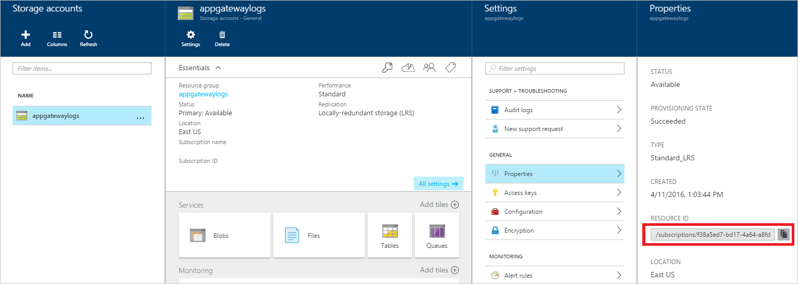
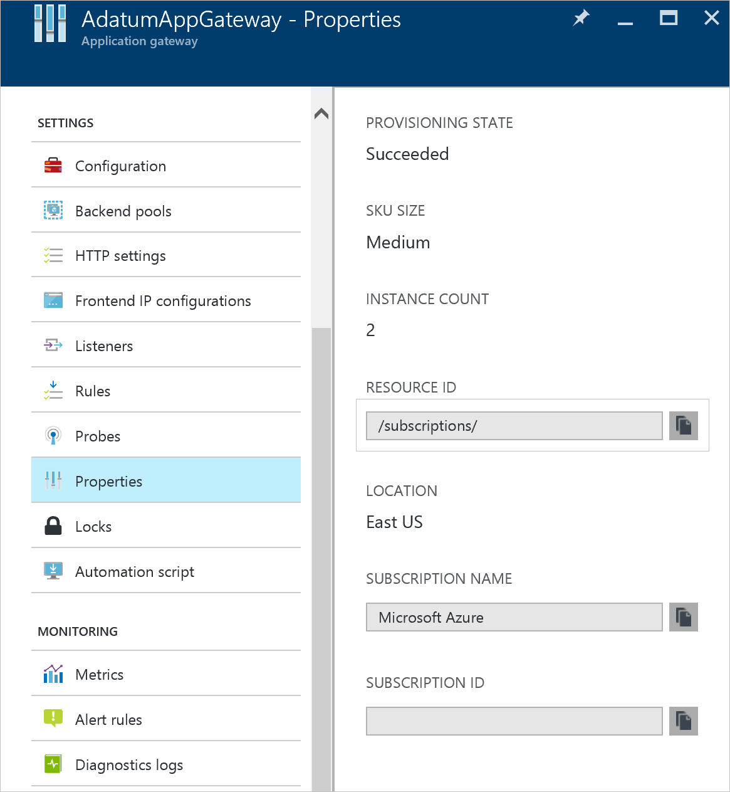

<properties 
   pageTitle="监视应用程序网关的访问和性能日志 | Azure"
   description="了解如何启用和管理应用程序网关的访问和性能日志"
   services="application-gateway"
   documentationCenter="na"
   authors="amitsriva"
   manager="rossort"
   editor="tysonn"
   tags="azure-resource-manager" />

<tags 
   ms.service="application-gateway"
   ms.date="04/11/2016"
   wacn.date="06/30/2016" />

#应用程序网关的诊断日志记录

可以在 Azure 中使用不同类型的日志对应用程序网关进行管理和故障排除。这些日志中有些可以通过门户访问，并且所有日志都可以从 Azure blob 存储中提取并在不同工具（如 Excel 和 PowerBI）中查看。你可以了解有关下面的列表中不同类型日志的详细信息。

- **审核日志：**可以使用 [Azure 审核日志](/documentation/articles/insights-debugging-with-events/)（以前称为操作日志）查看提交到你的 Azure 订阅的所有操作及其状态。审核日志默认启用，并且可以在 Azure 门户预览中查看。
- **访问日志：**你可以使用此日志来查看应用程序网关访问模式并分析重要信息，包括调用方的 IP、请求的 URL、响应延迟、返回问代码、输入和输出字节数。每隔 300 秒会收集一次访问日志。此日志包含每个应用程序网关实例的一条记录。应用程序网关实例可以由“instanceId”属性标识。
- **性能日志：**你可以使用此日志来查看应用程序网关实例的执行情况。此日志会捕获每个实例的性能信息，包括提供的请求总数、吞吐量（以字节为单位）、失败的请求计数、正常和不正常的后端实例计数。每隔 60 秒会收集一次性能日志。

>[AZURE.WARNING] 日志仅适用于在资源管理器部署模型中部署的资源。不能将日志用于经典部署模型中的资源。要更好地了解两种模型，可参考[了解资源管理器部署和典型部署](/documentation/articles/resource-manager-deployment-model/)一文。

##启用日志记录
所有 Resource Manager 资源都会始终自动启用审核日志记录。需启用访问和性能日志记录才能开始收集通过这些日志提供的数据。若要启用日志记录，请按以下步骤操作。

1. 记下存储帐户的资源 ID（日志数据将存储在其中）。其形式如下：/subscriptions/<subscriptionId>/resourceGroups/<resource group name>/providers/Microsoft.Storage/storageAccounts/<storage account name>。订阅中的所有存储帐户均可使用。你可以使用Azure 门户预览来查找此信息。

	
 
2. 记下应用程序网关的资源 ID（将为其启用日志记录）。其形式如下：/subscriptions/<subscriptionId>/resourceGroups/<resource group name>/providers/Microsoft.Network/applicationGateways/<application gateway name>。你可以使用 Azure 门户预览来查找此信息。

	

3. 使用下列 PowerShell cmdlet 启用诊断日志记录。

		Set-AzureRmDiagnosticSetting  -ResourceId /subscriptions/<subscriptionId>/resourceGroups/<resource group name>/providers/Microsoft.Network/applicationGateways/<application gateway name> -StorageAccountId /subscriptions/<subscriptionId>/resourceGroups/<resource group name>/providers/Microsoft.Storage/storageAccounts/<storage account name> -Enabled $true 	

>[AZURE.NOTE] 审核日志不需要单独的存储帐户。使用存储来记录访问和性能需支付服务费用。

## 审核日志
默认情况下由 Azure 生成此日志（以前称为“操作日志”）。日志在 Azure 的事件日志存储区中保留 90 天。通过阅读[查看事件和审核日志](/documentation/articles/insights-debugging-with-events/)一文可了解有关这些日志的详细信息。

## 访问日志
只有你按照上述步骤基于每个应用程序网关启用了该日志，才会生成该日志。数据存储在你启用日志记录时指定的存储帐户中。应用程序网关的每次访问均以 JSON 格式记录下来，如下所示。

	{
		"resourceId": "/SUBSCRIPTIONS/<subscription id>/RESOURCEGROUPS/<resoource group name>/PROVIDERS/MICROSOFT.NETWORK/APPLICATIONGATEWAYS/<application gateway name>",
		"operationName": "ApplicationGatewayAccess",
		"time": "2016-04-11T04:24:37Z",
		"category": "ApplicationGatewayAccessLog",
		"properties": {
			"instanceId":"ApplicationGatewayRole_IN_0",
			"clientIP":"37.186.113.170",
			"clientPort":"12345",
			"httpMethod":"HEAD",
			"requestUri":"/xyz/portal",
			"requestQuery":"",
			"userAgent":"-",
			"httpStatus":"200",
			"httpVersion":"HTTP/1.0",
			"receivedBytes":"27",
			"sentBytes":"202",
			"timeTaken":"359",
			"sslEnabled":"off"
		}
	}

## 性能日志
只有你按照上述步骤基于每个应用程序网关启用了该日志，才会生成该日志。数据存储在你启用日志记录时指定的存储帐户中。将记录以下数据：

	{
		"resourceId": "/SUBSCRIPTIONS/<subscription id>/RESOURCEGROUPS/<resource group name>/PROVIDERS/MICROSOFT.NETWORK/APPLICATIONGATEWAYS/<application gateway name>",
		"operationName": "ApplicationGatewayPerformance",
		"time": "2016-04-09T00:00:00Z",
		"category": "ApplicationGatewayPerformanceLog",
		"properties": 
		{
			"instanceId":"ApplicationGatewayRole_IN_1",
			"healthyHostCount":"4",
			"unHealthyHostCount":"0",
			"requestCount":"185",
			"latency":"0",
			"failedRequestCount":"0",
			"throughput":"119427"
		}
	}

## 查看和分析审核日志
你可以使用任何以下方法查看和分析审核日志数据：

- **Azure Tools：**通过 Azure PowerShell、Azure 命令行界面 (CLI)、Azure REST API 或 Azure 门户预览检索审核日志中的信息。[使用资源管理器审核操作](/documentation/articles/resource-group-audit/)一文中详细介绍了每种方法的分步说明。
- **Power BI：**如果还没有 [Power BI](https://powerbi.microsoft.com/pricing) 帐户，你可以免费试用。使用[适用于 Power BI 的 Azure 审核日志内容包](https://powerbi.microsoft.com/zh-cn/documentation/powerbi-content-pack-azure-audit-logs)，你可以借助预配置的仪表板（可直接使用或进行自定义）分析你的数据。

## 查看和分析计数器和事件日志 
你需要连接到你的存储帐户并检索事件和计数器日志的 JSON 日志项。下载 JSON 文件后，你可以将它们转换为 CSV 并在 Excel、PowerBI 或任何其他数据可视化工具中查看。

>[AZURE.TIP] 如果你熟悉 Visual Studio 和更改 C# 中的常量和变量值的基本概念，则可以使用 Github 提供的[日志转换器工具](https://github.com/Azure-Samples/networking-dotnet-log-converter)。

## 后续步骤

- [使用 Power BI 直观显示你的 Azure 审核日志](http://blogs.msdn.com/b/powerbi/archive/2015/09/30/monitor-azure-audit-logs-with-power-bi.aspx)博客文章。
- [查看和分析 Power BI 中的 Azure 审核日志及更多内容](https://azure.microsoft.com/blog/analyze-azure-audit-logs-in-powerbi-more)博客文章。

<!---HONumber=Mooncake_0516_2016-->