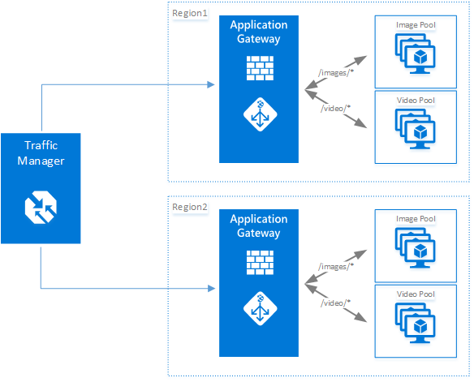

<properties
    pageTitle="Azure 应用程序网关简介 | Azure"
    description="此页提供第 7 层负载均衡的应用程序网关服务概述，包括网关的大小、HTTP 负载均衡、基于 cookie 的会话相关性和 SSL 卸载。"
    documentationcenter="na"
    services="application-gateway"
    author="georgewallace"
    manager="timlt"
    editor="tysonn" />
<tags
    ms.assetid="b37a2473-4f0e-496b-95e7-c0594e96f83e"
    ms.service="application-gateway"
    ms.devlang="na"
    ms.topic="hero-article"
    ms.tgt_pltfrm="na"
    ms.custom="H1Hack27Feb2017"
    ms.workload="infrastructure-services"
    ms.date="04/03/2017"
    wacn.date="05/22/2017"
    ms.author="gwallace"
    ms.translationtype="Human Translation"
    ms.sourcegitcommit="8fd60f0e1095add1bff99de28a0b65a8662ce661"
    ms.openlocfilehash="3cf69cbd35138970dc9cdf09535979f6f1485ee1"
    ms.contentlocale="zh-cn"
    ms.lasthandoff="05/12/2017" />

# 应用程序网关概述

Azure 应用程序网关是一个专用的虚拟设备，以服务形式提供应用程序传送控制器 (ADC)，为应用程序提供各种第 7 层负载均衡功能。 它由多个辅助角色实例组成，确保可伸缩性和高可用性。 它使客户能够将 CPU 密集型 SSL 终端的负载卸载到应用程序网关上，从而优化 Web 场生产率。 它还提供其他第 7 层路由功能，包括传入流量的轮循机制分配、基于 Cookie 的会话相关性、基于 URL 路径的路由，以及在单个应用程序网关后面托管多个网站的能力。 可以将应用程序网关配置为面向 Internet 的网关、仅限内部访问的网关或二者合一的网关。 应用程序网关完全受 Azure 管理，可缩放且高度可用。 它提供丰富的诊断和日志记录功能以改进可管理性。 创建应用程序网关时，将与一个终结点（公共 VIP 或内部 ILB IP）相关联并将其用于流入网络流量。 此 VIP 或 ILB IP 由在传输层 (TCP/UDP) 工作并将所有传入的网络流量负载均衡到应用程序网关辅助角色实例的 Azure 负载均衡器提供。 然后，应用程序网关根据其配置（是虚拟机、云服务还是内部或外部 IP 地址）来路由 HTTP/HTTPS 流量。

应用程序网关 Web 应用程序防火墙 (WAF) SKU 中还随附 WAF，用于保护 Web 应用程序，使其免受常见 Web 漏洞和攻击的影响。 Web 应用程序防火墙根据 [OWASP 核心规则集](https://www.owasp.org/index.php/Category:OWASP_ModSecurity_Core_Rule_Set_Project) 3.0 或 2.2.9 中的规则执行此功能。

## 应用程序网关 SKU 之间的差异

应用程序网关有两个 SKU： 标准 SKU 和 Web 应用程序防火墙 (WAF) SKU。

### 标准

标准 SKU 提供 SSL 终止、基于 Cookie 的会话相关性、轮循负载分发、基于内容的路由，以及托管多个网站和安全增强功能的能力。 应用程序网关提供的安全增强功能包括 SSL 策略管理、端到端 SSL 支持和 SSL 终止。

### Web 应用程序防火墙 (WAF)

WAF SKU 提供标准 SKU 所提供的全部功能，另外还包括 [Web 应用程序防火墙](/documentation/articles/application-gateway-web-application-firewall-overview/)。 它提供攻击检测规则，防止 Web 应用程序受到常见 Web 漏洞和攻击的影响。

## 功能

应用程序网关当前支持具有以下功能的第 7 层应用程序传送：

* **[Web 应用程序防火墙](/documentation/articles/application-gateway-web-application-firewall-overview/)** - Azure 应用程序网关中的 Web 应用程序防火墙 (WAF) 可保护 Web 应用程序，使其免受常见 Web 攻击（例如 SQL 注入、跨站点脚本攻击和会话劫持）的威胁。
* **HTTP 负载均衡** - 应用程序网关提供轮循机制负载均衡。 负载均衡在第 7 层完成，仅用于 HTTP(S) 流量。
* **基于 cookie 的会话相关性** - 想要在同一后端保留用户会话时，此功能十分有用。 借助受网关管理的 cookie，应用程序网关能够将来自用户会话的后续流量转到同一后端进行处理。 在会话状态是为用户会话而本地保存在后端服务器的情况下，此功能十分重要。
* **[安全套接字层 (SSL) 卸载](/documentation/articles/application-gateway-ssl-arm/)** - 此功能让 Web 服务器免于执行解密 HTTPS 流量的高成本任务。 通过在应用程序网关终止 SSL 连接，并将请求转发到未加密的服务器，Web 服务器不用承担解密的负担。  应用程序网关会重新加密响应，然后再将它发回客户端。 在后端与 Azure 中的应用程序网关位于同一安全虚拟网络中的情况下，此功能十分有用。
* **[端到端 SSL](/documentation/articles/application-gateway-backend-ssl/)** - 应用程序网关支持对流量进行端到端加密。 应用程序网关通过在应用程序网关上终止 SSL 连接来完成此任务。 网关随后将路由规则应用于流量、重新加密数据包，并根据定义的路由规则将数据包转发到适当的后端。 来自 Web 服务器的任何响应都会经历相同的过程返回最终用户。
* **[基于 URL 的内容路由](/documentation/articles/application-gateway-url-route-overview/)** - 此功能能够使用不同的后端服务器来处理不同的流量。 可将 Web 服务器上的文件夹流量或 CDN 流量路由到不同的后端，让不提供特定内容的后端减少不必要的负载。
* **[多站点路由](/documentation/articles/application-gateway-multi-site-overview/)** - 应用程序网关允许在单个应用程序网关上合并最多 20 个网站。
* **[WebSocket 支持](/documentation/articles/application-gateway-websocket/)** - 应用程序网关的另一个重要功能是对 WebSocket 的本机支持。
* **[运行状况监视](/documentation/articles/application-gateway-probe-overview/)** - 应用程序网关提供默认的后端资源运行状况监视，以及用于监视更多特定方案的自定义探测。
* **[高级诊断](/documentation/articles/application-gateway-diagnostics/)** - 应用程序网关提供完整的诊断和访问日志。 防火墙日志可用于已启用 WAF 的应用程序网关资源。

## 优点

应用程序网关可用于：

* 需要使用来自同一用户/客户端会话的请求来访问相同后端虚拟机的应用程序。 这些应用程序的示例包括购物车应用程序和 Web 邮件服务器。
* 消除 Web 服务器场的 SSL 终止开销。
* 要求长时间运行的同一 TCP 连接上多个 HTTP 请求路由到或负载均衡到不同后端服务器的应用程序（例如内容交付网络）。
* 支持 WebSocket 流量的应用程序
* 保护 Web 应用程序，使其免受常见 Web 攻击的威胁，例如 SQL 注入、跨站点脚本攻击和会话劫持。

Azure 托管服务形式的应用程序网关负载均衡允许在 Azure 软件负载均衡器的后面预配第 7 层负载均衡器。 流量管理器可用于完成下图中所示的方案，其中流量管理器为流向不同区域中的多个应用程序网关资源的流量提供重定向和可用性，而应用程序网关则提供跨区域第 7 层负载均衡。 此方案的示例可以在[在 Azure 云中使用负载均衡服务](/documentation/articles/traffic-manager-load-balancing-azure/)中找到

[AZURE.INCLUDE [load-balancer-compare-tm-ag-lb-include.md](../../includes/load-balancer-compare-tm-ag-lb-include.md)]

## 网关大小和实例

应用程序网关目前有三种大小：**小型**、**中型**和**大型**。 小型实例大小适用于开发和测试方案。

最多可为每个订阅创建 50 个应用程序网关，每个应用程序网关最多可有 10 个实例。 每个应用程序网关可以包含 20 个 http 侦听器。 有关应用程序网关限制的完整列表，请参阅[应用程序网关服务限制](/documentation/articles/azure-subscription-service-limits/#application-gateway-limits)。

下表显示了已启用 SSL 卸载的每个应用程序网关实例的平均性能吞吐量：

| 后端页面响应 | 小型 | 中型 | 大型 |
| --- | --- | --- | --- |
| 6K |7.5 Mbps |13 Mbps |50 Mbps |
| 100K |35 Mbps |100 Mbps |200 Mbps |

> [AZURE.NOTE]
> 这些值是应用程序网关吞吐量的大约值。 实际吞吐量取决于平均页面大小、后端实例的位置、提供页面所需的处理时间等各种环境详细信息。 如需确切的性能数字，则应运行自己的测试。 提供的这些值仅适用于容量规划指南。

## 运行状况监视

Azure 应用程序网关会通过基本或自定义运行状况探测，自动监视后端实例的运行状况。 使用运行状况探测可确保只有正常的主机才会响应流量。 有关详细信息，请参阅[应用程序网关运行状况监视概述](/documentation/articles/application-gateway-probe-overview/)。

## 配置和管理

对于其终结点，应用程序网关在配置时可以拥有公共 IP、专用 IP 或同时拥有两者。 应用程序网关在其自己的子网中的虚拟网络内进行配置。 为应用程序网关创建或使用的子网不能包含任何其他类型的资源，子网中唯一允许使用的资源是其他应用程序网关。 若要保护后端资源，可以将后端服务器放在与应用程序网关位于同一虚拟网络中的其他子网内。 后端应用程序不需要这个附加的子网，只要应用程序网关可以连接到 IP 地址，应用程序网关就能够为后端服务器提供 ADC 功能。 

可以使用 REST API、PowerShell cmdlet、Azure CLI 或 [Azure 门户预览](https://portal.azure.cn/)来创建和管理应用程序网关。 有关应用程序网关的其他问题，请查看[应用程序网关常见问题](/documentation/articles/application-gateway-faq/)中所列的常见问题列表。

## 定价

定价基于每小时网关实例费和数据处理费。 WAF SKU 的每小时网关定价不同于标准 SKU 费用，具体请参阅[应用程序网关定价详细信息](/pricing/details/application-gateway/)。 数据处理费保持不变。

## 后续步骤

了解应用程序网关后，可以[创建应用程序网关](/documentation/articles/application-gateway-create-gateway-portal/)，也可以[创建应用程序网关 SSL 卸载](/documentation/articles/application-gateway-ssl-arm/)，以便对 HTTPS 连接进行负载均衡。

若要详细了解如何使用基于 URL 的内容路由创建应用程序网关，请访问[使用基于 URL 的路由创建应用程序网关](/documentation/articles/application-gateway-create-url-route-arm-ps/)。

<!--Update_Description: adding WAF-->